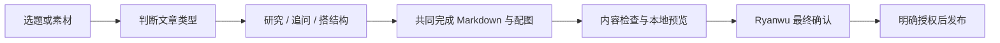
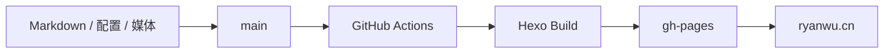

<div align="center">
  <a href="https://ryanwu.cn">
    
  </a>

  <p><strong>把技术实践、AI 思考与真实生活，写成可以长期回看的个人记录。</strong></p>

  <p>
    <a href="https://ryanwu.cn"></a>
    <a href="https://github.com/Ryan-wu-web/ryanwu_blog/actions/workflows/pages.yml"></a>
    
    
    
    <a href="https://github.com/Ryan-wu-web/ryanwu_blog/commits/main"></a>
  </p>

  <p>
    <a href="https://ryanwu.cn"><strong>进入博客</strong></a>
    ·
    <a href="./docs/content-guide.md">维护指南</a>
    ·
    <a href="https://github.com/Ryan-wu-web/ryanwu_blog/issues">问题反馈</a>
  </p>
</div>

---

##  关于这个博客

**Ryanwu 的 AI / 技术 / 生活博客。**

这里不是单一岗位的作品集，而是一份持续生长的个人数字档案：记录技术实现、AI 与产品实践、项目和职业复盘，也保存生活中的具体时刻与阶段思考。

<table>
  <tr>
    <td width="33%" valign="top">
      <strong>AI</strong><br><br>
      大模型、Agent、AI 产品实践，以及对行业变化有依据的个人判断。
    </td>
    <td width="33%" valign="top">
      <strong>技术</strong><br><br>
      前后端、移动端、工程实践、项目复盘与可以被复现的问题解决过程。
    </td>
    <td width="33%" valign="top">
      <strong>生活</strong><br><br>
      职业变化、销售管理、阅读旅行、日常体验与不必被包装成方法论的记录。
    </td>
  </tr>
</table>

> 写作标准：**真诚、克制、具体、有判断。** 技术内容重准确，生活内容重真实，不编造经历，也不批量制造没有个人信息增量的文章。

##  内容入口

| 内容 | 说明 | 访问 |
| --- | --- | --- |
| 技术文章 | AI、开发、产品、工程与技术项目 | [浏览 `tech`](https://ryanwu.cn/categories/tech/) |
| 生活记录 | 生活、职业、销售、管理与个人随笔 | [浏览 `life`](https://ryanwu.cn/categories/life/) |
| 归档与搜索 | 按时间回看，或快速定位已有内容 | [文章归档](https://ryanwu.cn/archives/) · [站内搜索](https://ryanwu.cn/search/) |
| 关于 Ryanwu | 经历、技能与联系方式 | [关于我](https://ryanwu.cn/about/) |

##  Ryanwu × AI 协作写作

写文章不要求 Ryanwu 先独立完成初稿。一个选题，或者一组零散素材，就可以开始共同创作。



- **选题模式**：给出一个主题、问题或大致观点；
- **素材模式**：提供语音转写、截图、链接、笔记、经历片段或 Markdown 初稿；
- **技术深度文章**：先核实外部引用（只读一手来源），再搭结构、写正文、配图表与封面；
- **生活日志**：使用更轻的整理方式，不强制添加 SEO、数据、图表或积极结尾。

完整字段、媒体和发布规范见 [`docs/content-guide.md`](./docs/content-guide.md)。

##  设计与体验

<table>
  <tr>
    <td width="50%" valign="top">
      <strong>深色铜棕视觉</strong><br><br>
      以暖黑、铜棕、低饱和文字和轻微材质纹理建立克制、沉静的阅读氛围。
    </td>
    <td width="50%" valign="top">
      <strong>内容优先</strong><br><br>
      优先优化文章排版、图片、代码、表格与媒体体验，而不是堆叠高风险装饰组件。
    </td>
  </tr>
  <tr>
    <td width="50%" valign="top">
      <strong>Butterfly 可升级</strong><br><br>
      定制集中在配置和 `source/` 扩展层，不直接修改主题核心，降低后续升级成本。
    </td>
    <td width="50%" valign="top">
      <strong>自动化发布</strong><br><br>
      推送 `main` 后由 GitHub Actions 构建 Hexo，并将静态页面部署到 `gh-pages`。
    </td>
  </tr>
</table>

##  本地运行

### 环境

- Node.js 20 或兼容版本
- npm
- Git
- Python 3（使用内容与发布工具时）

### 快速开始

```bash
git clone https://github.com/Ryan-wu-web/ryanwu_blog.git
cd ryanwu_blog
npm ci
npm run preview
```

访问 `http://localhost:4000` 查看本地站点；结束预览时按 `Ctrl+C`。

##  写作与维护命令

| 命令 | 用途 |
| --- | --- |
| `npm run post:new` | 创建 Markdown 文章与独立媒体目录 |
| `npm run content:check` | 检查 Front Matter、图片与音视频引用 |
| `npm run preview` | 清理缓存并启动本地预览 |
| `npm run prepublish:check` | 严格检查新增文章并执行生产构建 |
| `python tools/publish.py --dry-run` | 查看发布前状态，不修改 Git |
| `python tools/publish.py` | 人工确认后提交并推送 `main` |

> `python tools/publish.py` 只在明确确认发布后使用。Markdown 是唯一内容源，生成后的 `public/` 不作为手工编辑入口。

<details>
<summary><strong>查看项目结构</strong></summary>

```text
ryanwu_blog/
├─ .github/
│  ├─ assets/readme/        # README 视觉资源
│  └─ workflows/            # GitHub Pages 自动部署
├─ docs/
│  ├─ templates/            # 深度文章、工作复盘和生活日志模板
│  └─ content-guide.md      # 完整内容维护指南
├─ source/
│  ├─ _posts/               # Markdown 文章
│  ├─ images/posts/         # 每篇文章的独立媒体目录
│  ├─ about/                # 关于页面
│  └─ css/                  # 升级安全的视觉扩展
├─ tools/                   # 创建、检查与发布工具
├─ BRAND.md                 # 博客定位与内容边界
├─ VOICE.md                 # 默认写作声音
├─ _config.yml              # Hexo 配置
├─ _config.butterfly.yml    # Butterfly 配置
└─ package.json             # 脚本与依赖
```

</details>

##  发布架构



| 层级 | 职责 |
| --- | --- |
| `main` | 保存文章源文件、媒体、配置、工具和文档 |
| GitHub Actions | 使用 Node.js 20 安装依赖并构建 `public/` |
| `gh-pages` | 保存并托管最终生成的静态页面 |
| `ryanwu.cn` | 对外访问域名 |

工作流定义见 [`.github/workflows/pages.yml`](./.github/workflows/pages.yml)。

---

<div align="center">
  <p><strong>Built, written and maintained by <a href="https://github.com/Ryan-wu-web">Ryanwu</a>.</strong></p>
  <sub>README 图标来自 <a href="https://github.com/tabler/tabler-icons">Tabler Icons</a>，依据 MIT License 使用；许可证副本见 <a href="./.github/assets/readme/TABLER_ICONS_LICENSE.txt">此处</a>。</sub>
</div>
