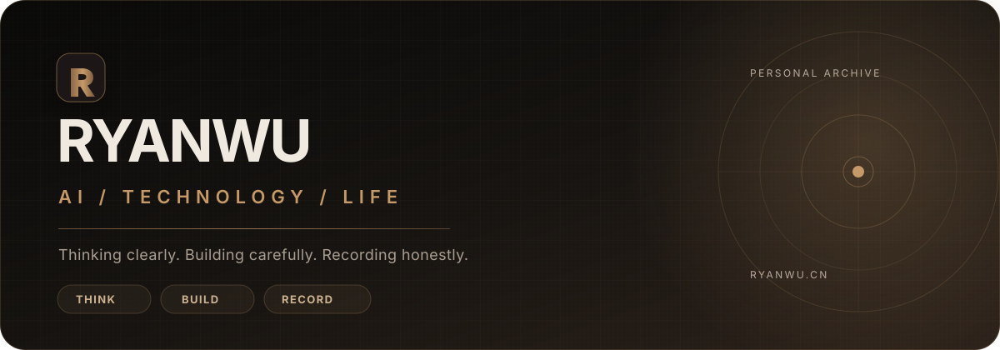
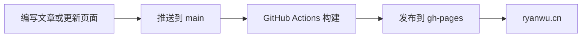

# Ryan's Blog

<p align="center">
  <a href="https://ryanwu.cn">
    
  </a>
</p>

<p align="center">
  <strong>热爱技术，也热爱生活。</strong><br>
  记录全栈开发、移动端、AI 应用实践与日常思考。
</p>

<p align="center">
  <a href="https://ryanwu.cn"></a>
  <a href="https://github.com/Ryan-wu-web/ryanwu_blog/actions/workflows/pages.yml"></a>
  
  
  
  <a href="https://github.com/Ryan-wu-web/ryanwu_blog/commits/main"></a>
</p>

<p align="center">
  <a href="https://ryanwu.cn"><strong>在线访问</strong></a>
  ·
  <a href="./docs/content-guide.md">内容维护指南</a>
  ·
  <a href="https://github.com/Ryan-wu-web/ryanwu_blog/issues">问题反馈</a>
</p>

---

##  博客一览

<a href="https://ryanwu.cn">
  
</a>

<p align="center"><sub>点击图片进入 <a href="https://ryanwu.cn">ryanwu.cn</a></sub></p>

这是我的个人数字花园：一部分用于沉淀技术实践，一部分用于记录项目、成长与生活。网站由 Hexo 生成，使用 Butterfly 主题，并通过 GitHub Actions 自动发布到 GitHub Pages。

##  特色体验

<table>
  <tr>
    <td width="50%">
      
      <strong>深色 / 浅色主题</strong><br>
      跟随阅读场景自由切换，兼顾白天与夜间体验。
    </td>
    <td width="50%">
      
      <strong>沉浸式页面视觉</strong><br>
      首页、归档、标签、项目等页面使用独立氛围背景。
    </td>
  </tr>
  <tr>
    <td width="50%">
      
      <strong>站内内容检索</strong><br>
      快速定位文章、分类与标签，减少内容查找成本。
    </td>
    <td width="50%">
      
      <strong>Twikoo 评论</strong><br>
      为文章提供轻量、直接的交流与反馈入口。
    </td>
  </tr>
  <tr>
    <td width="50%">
      
      <strong>友好的代码阅读</strong><br>
      支持代码高亮、复制按钮与文章目录导航。
    </td>
    <td width="50%">
      
      <strong>自动化发布</strong><br>
      推送 main 分支后自动构建并部署至 GitHub Pages。
    </td>
  </tr>
</table>

##  内容地图

| 板块 | 内容 | 入口 |
| --- | --- | --- |
| 技术笔记 | 前端、后端、移动端、AI 与工程实践 | [浏览技术文章](https://ryanwu.cn/categories/tech/) |
| 生活随笔 | 日常记录、体验与思考 | [浏览生活文章](https://ryanwu.cn/categories/life/) |
| 项目展示 | 个人项目、实践经历与技术亮点 | [查看项目](https://ryanwu.cn/projects/) |
| 关于我 | 个人介绍、技能与联系方式 | [认识 Ryan](https://ryanwu.cn/about/) |

##  本地运行

### 环境要求

- Node.js 20 或兼容版本
- npm
- Git

### 快速开始

```bash
# 1. 克隆仓库
git clone https://github.com/Ryan-wu-web/ryanwu_blog.git
cd ryanwu_blog

# 2. 安装依赖
npm ci

# 3. 启动本地预览
npm run server
```

打开 `http://localhost:4000` 查看博客。

```bash
# 清理生成文件
npm run clean

# 生成静态站点
npm run build
```

##  内容维护

仓库内置了一组 Python 工具，用于减少重复操作：

| 命令 | 用途 |
| --- | --- |
| `python tools/new-post.py` | 交互式创建新文章 |
| `python tools/new-project.py` | 添加项目展示内容 |
| `python tools/edit-project.py` | 修改或删除已有项目 |
| `python tools/publish.py` | 检查改动并引导提交、发布 |

完整的文章 Front Matter、图片目录、标签规则和发布流程见 [`docs/content-guide.md`](./docs/content-guide.md)。

<details>
<summary><strong>查看项目结构</strong></summary>

```text
ryanwu_blog/
├─ .github/workflows/       # GitHub Pages 自动部署
├─ docs/                    # 内容与维护文档
├─ source/
│  ├─ _posts/               # 博客文章
│  ├─ about/                # 关于页面
│  ├─ projects/             # 项目页面
│  ├─ categories/           # 分类页面
│  ├─ tags/                 # 标签页面
│  ├─ images/               # 文章图片
│  └─ js/                   # 页面增强脚本
├─ tools/                   # 内容维护工具
├─ _config.yml              # Hexo 配置
├─ _config.butterfly.yml    # Butterfly 主题配置
└─ package.json             # 脚本与依赖
```

</details>

##  发布流程



工作流定义位于 [`.github/workflows/pages.yml`](./.github/workflows/pages.yml)，使用 Node.js 20 构建 `public/`，随后发布至 `gh-pages` 分支。

---

<p align="center">
  Built with ❤️ by <a href="https://github.com/Ryan-wu-web">Ryan</a>
  <br>
  <sub>README 图标来自 <a href="https://github.com/tabler/tabler-icons">Tabler Icons</a>，依据 MIT License 使用；许可证副本见 <a href="./.github/assets/readme/TABLER_ICONS_LICENSE.txt">此处</a>。</sub>
</p>