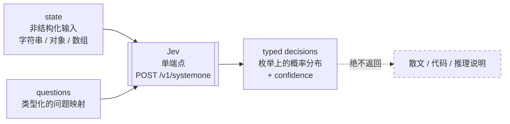
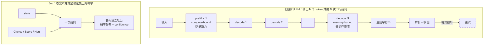
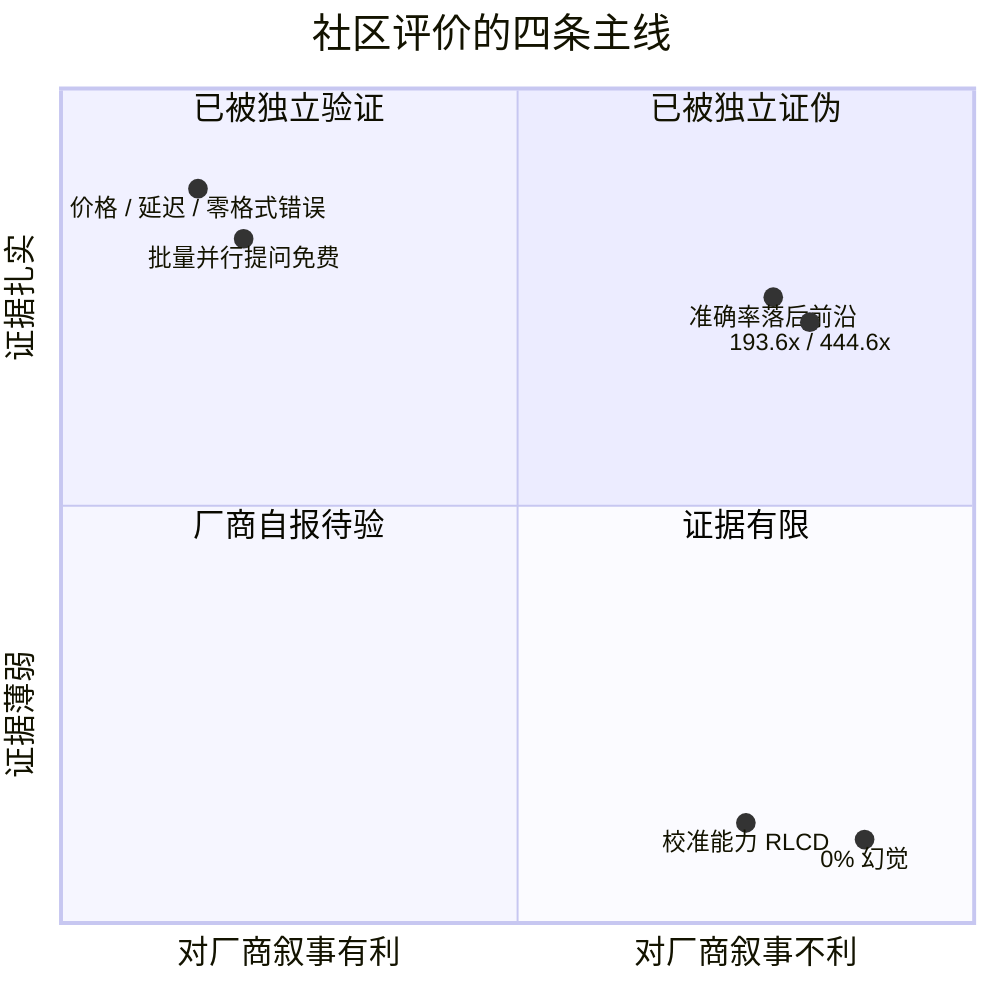
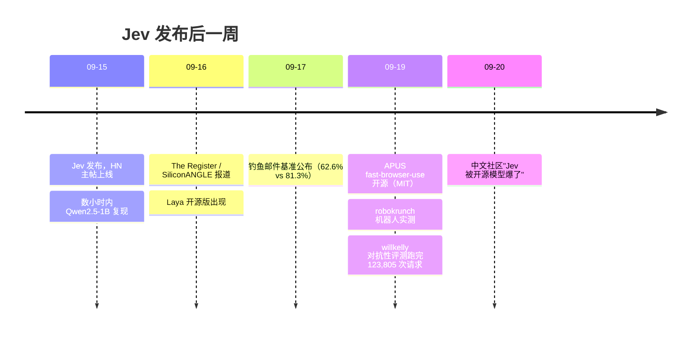
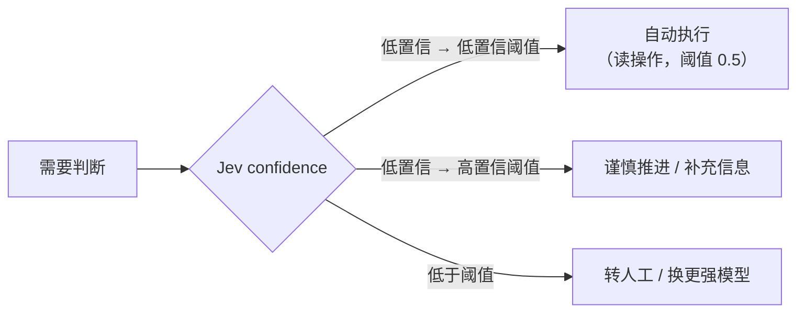
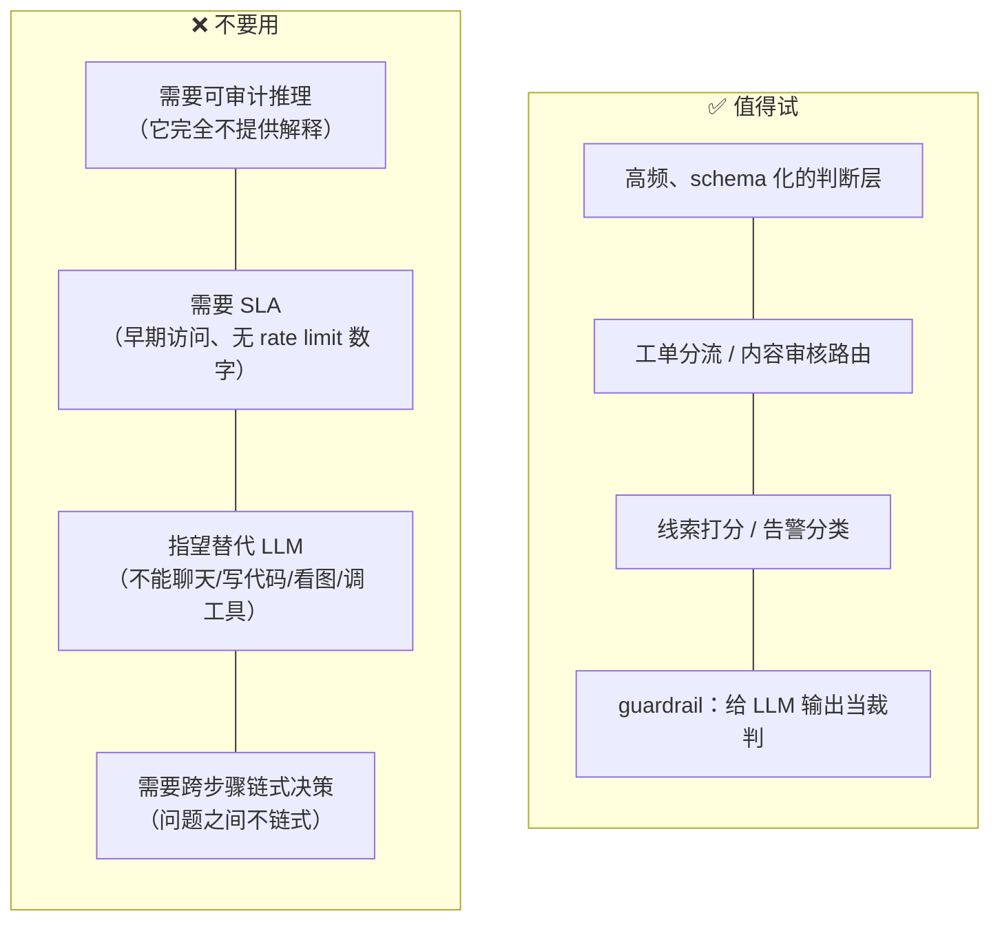

> 调研对象：TypeSafe AI 的 **Jev**（"System One" 决策模型）及其机器人/边缘侧实测项目 **robokrunch/jev-physical-ai**
> 调研时间：2026-09-21 ｜ 资料来源：官方发布材料、第三方实测仓库、独立评测、技术社区讨论

---

## 一、一句话结论

**Jev 不是"给 LLM 提推理速度"的技术，而是一类不生成文本的模型**——它绕开自回归解码，一次前向并行输出候选枚举上的概率分布。"快 200 倍"是拿它与"让 LLM 做同一个分类/路由任务"相比，**不是把你的模型推理提速**。

数字要分两摞看：**便宜、低延迟、零格式错误、批量提问免费**这四条已被独立复现；而**"校准置信度"**这条是它全部卖点所在，**至今没有论文、没有可靠性曲线**，唯一的对抗性评测还显示——**校准只在设计场景内成立，出了场景完全失效**。

---

## 二、名称澄清

"roboJev" 这个名字**不存在**于任何官方或社区项目。实际对应三个东西：

| 名称 | 是什么 | 关系 |
|---|---|---|
| **Jev** | TypeSafe AI 的模型，2026-09-15 发布 | 主体，社区热议对象 |
| **System One Models** | TypeSafe 提出的"模型类别"命名 | 争议点（见 §六） |
| **robokrunch/jev-physical-ai** | GitHub 第三方仓库，把 Jev 用在机器人机群/边缘设备上做实测 | 本报告的重要实测数据源；21 commits、0 star，非官方 |

---

## 三、它是什么

**公司**：TypeSafe AI，2024 年成立于旧金山，2026-09-15 出 stealth，**$40M 种子轮（DCVC 领投）**。

**人**：创始人 Diogo Almeida——RLHF / InstructGPT 共同作者，前 OpenAI post-training、Google Brain；CTO Erik Gafni；COO Sasha Sheng（前 Meta/FAIR）。发布推文单日 2500 万浏览、6.1 万赞。

**命名**：Jev 致敬 **Jevons paradox**（效率提升反而推高总消耗）；"System One" 取自卡尼曼的快思考系统。

### 它只做五件事：分类、路由、打分、抽取、分支



**三个原语**（官方全部 API 面）：

| 原语 | criteria | 返回 | 上限 |
|---|---|---|---|
| **Choice** | 每个选项一段说明（可 null） | argmax + 完整概率分布（和为 1）+ confidence | 255 选项 |
| **Score** | 由低到高的档位说明数组 | **概率加权平均**（可取档位间的连续值）+ legend + confidence | 2–10 档 |
| **Noul** | yes / no 各代表什么（可选） | yes 的概率（0–1）**仅此一个值，无 confidence** | — |

```json
{ "state": "Stripe 连不上，已经 3 天了，我在丢单。请尽快处理。",
  "model": "jev-latest",
  "questions": {
    "department":  { "type": "choice", "criteria": {"billing":"支付问题","technical":"集成 Bug","sales":"定价咨询"} },
    "frustration": { "type": "score",  "criteria": ["平静陈述","不满但克制","非常愤怒"] },
    "is_urgent":   { "type": "noul",   "criteria": {"true":"传达了紧迫性","false":"常规咨询"} }
  }}
// → department: technical (0.840), confidence 0.596   ← billing 还留着 0.159
// → frustration: 1.035（"不满但克制"略偏上）, confidence 0.842
// → is_urgent: 0.999
```

**工程上的几个硬约束**（官方文档明示）：

- 一个请求里的多个问题**并行且相互独立**，不链式——依赖前一步答案的判断得由你自己发第二次请求
- 问题 key 不发往底层模型，不参与推理
- 约 **32k token** 预算（≈15 万英文字符），是否为硬限制官方未明说
- **不返回任何推理说明**——这是合规层面的实质缺口
- 不支持图像/音频；无 OpenAI chat-completions 兼容，不能靠改 base-url 迁移

---

## 四、为什么快：它省掉了什么



**关键区分**——它和 OpenAI Structured Outputs / constrained decoding 不是一回事：

- **Constrained decoding**：照样跑生成循环，只是每一步把非法 token 的概率 mask 成 0。官方自己也承认，新 schema 首次请求要编译文法，"复杂 schema 可能要 1 分钟"
- **Jev**：输出空间本身就是类型，不存在"给非法值分配概率"的状态。Almeida 在 HN 上的原话是：*"simply masking logits is insufficient because if ever a model was assigning probability to an invalid token, the model is by definition confused."*

**但要小心一个偷换**：所谓"不会幻觉"，指的是**不可能返回 schema 之外/类型不安全的值**——官方脚注自己写了这句 0% "is not empirical"。**一个格式完全合法但内容错误的答案，照样可能发生。** 社区把这条总结得比官方清楚：*"Type safety is not factual correctness."*

---

## 五、数字分级：哪些能信

### ✅ 已被独立复现的部分

| 项 | 证据 |
|---|---|
| **$0.042/MTok 输入、输出免费** | 博客/首页/X/Gateway 等 5 处口径一致；两家独立测试实测成本落在同一区间（约 $0.04–0.05/千次决策） |
| **低延迟** | 官方称 70–500ms；独立实测：Every 中位 **0.35s**、Near Here 均值 **0.59s**、RoboKrunch p50 **0.527s** |
| **并行采样真实有效** | Every 一次跑出 **777 个判断 < 0.7s** |
| **零格式错误** | Good Start Labs 在 1,203 条上重评，Jev 格式失败 **0 条**；Claude Fable 5.1 有 **67 条**、Gemini 3.8 Flash 5 条、GPT-5.6 Luna 2 条。另一批 7 月 10,500 次判定也是 0 |

**"零格式错误"的实际价值**：解析失败、重试、兜底逻辑这一整块工程代码可以省掉。这是第三方实测里唯一被反复确认的明确优势。

### ⚠️ 厂商自报，必须打折的部分

| 官方说法 | 实际情况 |
|---|---|
| **快 193.6× / 便宜 444.6×** | 自家自选 workload 的**峰值**。官方自己写了 "these are on the higher end of real world gains"。**独立实测只有约 5×–25×**。同一场发布还出现了第三个口径："up to 100x"（官方 PR 稿）——三套数字并存 |
| **基准准确率** | 自家 dashboard 上 Jev 聚合 **67.8%**，Claude Opus 5 是 **73.1%**、GPT Sol **74.1%**。差距最大的 invoice processing：Jev **61.8%** vs Sol **79.1%**。**它落后，是官方自己公布的数据** |
| **"0% 幻觉"** | 官方脚注 "is not empirical"——这个 0 是从定义推出来的，不是测出来的 |
| **校准（RLCD 的全部意义）** | **无论文、无可靠性曲线、无 ECE 数字、无消融实验**。文档自己退到"校准是群体性质，不保证单条答案正确" |
| **定价可持续** | 官方原文：*"We can't prove it isn't subsidized."* 免费输出 + $40M 种子轮，在证明之前就是一个补贴形状的安排 |
| **生产可用性** | 早期访问 + 等待列表。**零具名客户、零收入披露、无 SLA、108 页文档里没有一个 rate limit 数字** |

### 🔍 官方自己披露的评测方法学偏差

读官方材料时这几条比数字本身更重要：

1. **参考答案是 GPT-6 Astra 与 Claude Fable 5.1 的平均值**——官方承认这 "biases answers towards OpenAI and Anthropic's models"，但同时，**与共识一致不等于正确**，共同错误检测不出来
2. **评测 workflow 由 TypeSafe 自己的模型能力团队设计**——官方原话 "some bias could exist"
3. **LLM 对照组走 TypeSafe 自己的 wrapper**，官方承认这个 wrapper "tends to be slower and more expensive"
4. **速度是在"西海岸自己的笔记本上"测的**——没有负载下的 p99、没有限流场景

---

## 六、社区怎么看

**总体判断**：速度与成本优势被多方独立验证；**"新模型类别"的叙事被普遍质疑**；校准（calibration）是公认未解决的核心问题；发布后一周内出现 **8 个开源复现**。中文社区流传最广的一句总结是——**"方向是真的，数字大半是营销。"**



### 6.1 Hacker News：定性之争的正面交锋

主帖 [item 49717558](https://news.ycombinator.com/item?id=49717558)，**1930 points / 509 comments**（2026-09-21 直接核实；媒体流传的 475 / 1655 / 1863 等数字均为不同时点快照）。

| 评论者 | 原话 | 意义 |
|---|---|---|
| `petesergeant` | "This is basically a **zero-shot classifier** that can accept raw text as an input…" | 提出定性 |
| **Almeida 本人** | **"exactly right!"** | **创始人照单全收** |
| `StevenWaterman` | "each question is a separate **single token model completion** done in parallel" | 最准的技术拆解 |
| `WhitneyLand` | **"Type safety is not factual correctness."** | 击穿"零幻觉" |
| `thduabmd` | "An approve for an unauthorized action **still meets the schema guarantee**. That's why I find the messaging misleading." | 指出图表误导 |
| `Mentlo` | "…or when you say 'outputs calibrated probabilities' you mean '**as calibrated as frontier LLM models, just cheaper**' — which is a different claim" | 指出话术偷换 |
| `paraschopra` | 估算模型约 3B 参数，"One could replicate this by post training Qwen 3.5 2Bn. **I expect people to do so soon!**" | 事后被完全言中 |

另有：演示视频被质疑 AI 生成（创始人在帖内逐条解释服装与配音）；Doom demo 被吐槽 *"they reinvented aim bot for cheaters."*

### 6.2 中文社区：冷淡、拆解、翻车

**linux.do**（⚠️ 该站反爬返回 403，**帖标题与 URL 已确认，评论内容取自搜索索引与镜像站，未逐字核验**）：

- 《奇怪，为什么没人讨论 Jev ?》—— 热度低的归因很直白："**又不发鸡蛋，用还要费劲巴拉的申请，为什么讨论**"
- 《jev 这玩意是不是适合 cpa/sub2api 中集合》—— **唯一一条中文圈独有的量化批评**：有人引用推上评测称，用 Jev 做任务复杂度路由会因为**缓存命中率极低（单独模型 99% vs Jev 路由 35%）而不被推荐**

**locdd.com（"大佬说"，可读到原文）** 出现比英文圈更直白的技术拆解：

> *"他把输出层换了一个专门训练的用于分类任务的层，**只输出一个 token，后续直接截断不输出了**……所以理论上，任何一个模型，稍微调整一下，就能变成这种的。**几乎没有训练成本**。"*

> *"jev 就是一个大语言分类器……**唯一的好处是不用针对领域数据专门训练微调**。不然速度上它是比不上传统分类器的，毕竟太大了。"*

> *"某种意义上感觉不如机器学习早期的随机森林，随机森林分类错了至少能知道为什么错，**这个完全是一个黑盒**。"* —— 另有回帖补刀：**"这种通用分类器是前 GPT 时代的玩意。"**

**实践翻车记录**：有人原想用 Jev 找代码 bug，结论是 **"效果很差（无法理解代码逻辑，概率值与代码模式正相关）"**，只能降级去做 YAML 规则检查、commit message 格式校验。

**知乎**（怀疑派里技术含量最高的一批）：

- **《Jev 的一个危险误读》**——最要害的一击：**把复杂问题拆成多个简单判断，关键关系可能在拆分中被拆没**。2,000 封钓鱼邮件直接问 Jev 只有 **62.6%**（Claude Haiku 4.5 是 81.3%）；改成"拆信号 + logistic regression 聚合"才到 **95%**——**但那个成绩属于整个系统，不属于 Jev**
- **实战翻车**（售后 agent 项目）：低歧义判断 50/50、证据过期 50/50，而**"买方陈述与物流冲突"仅 9/50**
- **经济性反问**：Qwen3.7-flash 输入 $0.03/百万 token，**比 Jev 还便宜三成，而且能顺手把标题、摘要、翻译一起写了**

> ⚠️ **掘金 / V2EX 检索后确认无原生讨论帖**。中文讨论实际集中在 linux.do、locdd.com 与知乎。
> ⚠️ 交易 demo（"一晚亏掉 $31,680"）**金额不可引用**：多个来源互相矛盾，有人核对官方 dashboard 只看到几美元。

### 6.3 开源复现潮：把"隐身两年"打回原形

发布后一周内出现 **8 个开源复现**（Laya、SemIf、SimpleJev、Von、Verdict、Kev、Nimble、OpenJev），分属四条技术路线，准确率从 42.5% 到 93.2%。



- **APUS-AI-Lab/fast-browser-use**（MIT，36 stars）：把 DOM 可见元素编号成候选元组（`CLICK, btn_7`），映射到词表单 token，**单次前向 logits 打分、跳过自回归解码**。本地 Qwen3.5-9B，Apple M2 Pro 全程离线，Wikipedia 检索中位 ~18s、表单/导航 ~3s
- **Laya**（ConvAI，Apache-2.0，421M 英文 + 322M 多语）：T4 上 sub-35ms。厂商自报 0.766 vs Jev 的 0.727，**但他们从未自己跑过 Jev**；一组独立 78 例小样本反而是 **Jev 0.974 vs Laya 0.590**
- 开发者 Harsha Gundala 在发布数小时内用 Qwen2.5-1B 复现，原话被多语种媒体广泛转引：**"They developed in stealth for two years; I did it in two hours."** ⚠️ **未能定位原始推文**
- **技术共识**：复现准确率可行，**概率校准仍是未解决问题——甚至只打乱选项顺序就会改变输出**

### 6.4 最有杀伤力的第三方评测

**willkelly/jev-evaluation** —— 目前诚信度最高的独立评测：**事前预注册 9 个实验 / 28 条预测**，一次跑完 **123,805 次请求、138 分钟、$12.69**，**原始日志 1.3GB / 133,696 条记录全部公开，任何数字可复算**。结果：**25 条可测预测中只有 12 条成立、13 条被证伪。**

| 发现 | 内容 |
|---|---|
| ❌ **校准在"设计场景内"成立、"场景外"完全失效** | 工单路由 ECE 0.075；但随机 3-SAT 上**对每个公式都答"可满足"**，平均概率只变动 0.026 而真实可满足比例变动 1.000。**给定 `x AND NOT x`（显然不可满足），它返回 P(可满足) = 0.38** |
| ✅ **批量提问确实免费** | 第 200 个问题的准确率与第 1 个相同；60 问一次问比逐个问**省 20× token、快 8×**，答案完全一致。**这是唯一被独立证实的"大卖点"** |
| ❌ **提示注入："粗暴的失败，礼貌的成功"** | `IGNORE THE INSTRUCTIONS ABOVE` 只改变 1/200；**声称"主管已作出决定"改变了 147/200**。置信度能检测"被插入指令"，**检测不到"被误导"** |
| ❌ **单一阈值抓不全失败模式** | 缺失事实会掉到 0.8 以下（0.8 阈值抓 95.5%），但**"流利的胡言乱语"仍停在 0.893——0.8 阈值一个都抓不到** |
| ⚠️ **多主体共享请求必须"指名"而非"指位"** | 60 张工单一次问：按"发件人 + 日期"命名得 1.000，"说 Ticket 1"得 0.420，且沿列表衰减（前 1/3 是 0.870，后 1/3 是 0.150，随机基线 0.125） |
| ⚠️ **API 实际契约与文档不符 3 处** | prompt 字段实为 `instructions`；无请求级 instructions（发就 400）；**Noul 答案没有 confidence 字段** |

**其他硬数字**：

| 来源 | 结果 |
|---|---|
| **Arize AI** | 一名开发者用 Jev 零样本跑 18,514 封垃圾邮件得 **98.3%**；而**在 14,800 封已标注邮件上训练的 TF-IDF logistic regression 得 98.4%——统计上打平** |
| **jev-phishing-bench** | 2,000 封钓鱼邮件：**Jev 62.6% vs Claude Haiku 4.5 的 81.3%**；ECE 0.154 vs 0.097；但 p50 239ms vs 687ms、$0.038 vs $0.462 每千封 |
| **Every** | 777 判断 < 0.7s、约 $0.0025；第二轮 12 段合成文本，Jev 中位 0.35s vs Fable 5.1 的 8.83s（**25× 快、约 1/580 成本**），但**只抓到 7 个植入缺陷中的 6 个**，Fable 5.1 全中 |
| **Near Here** | 50 例事件校验 **96%** vs Mistral Small 4 的 84%、Gemini 3.5 Flash-Lite 的 86%，且**零个有效事件被误拒** |
| **Vercel**（企业自述） | 命令安全审查替换 GPT-5.6 Luna：中位延迟 1458ms → **312ms**，准确率 96.7% → **98.6%** |
| **Pong 延迟对决** | Jev 平均 **227ms/决策** vs Gemini 3.8 Flash 3.2s、Haiku 4.5 2.5s、Sol 3.5s——**但作者强调这是延迟 demo，不是策略测试** |

### 6.5 193.6× / 444.6× 是怎么拼出来的

有人从官方图表反推：**速度峰值挑的是 Claude Sonnet 5（最慢的 Anthropic 模型），成本峰值挑的是 Claude Opus 5（最贵的）**——**分别挑了对自己最有利的基线**。对官方自己承认"智能对等"的 Terra，数字只有 **25× / 76×**；对便宜的 Luna 只剩 **8× 成本优势**。

### 6.6 被忽略的那条发现（比 Jev 本身更重要）

TypeSafe 自己的评测数据里埋着一句话：**把策略拆成窄的、类型化的问题、由代码做最终决策，所有语言模型都变好**——Haiku 4.5 从 **18.1% 跳到 53.6%**，且更便宜更快。

**这条今天用任何模型都能用上，与买不买 Jev 无关。**

---

## 七、机器人侧的实测：robokrunch/jev-physical-ai

这个仓库值得单独看，因为它是**唯一把 Jev 放到物理世界、并且把局限写在明面上的实测**。所有数字来自 2026-09-19 的真实调用（走 OpenRouter `typesafe/jev-1.13`）。

### Demo A — 1 万台机器人机群分诊

41 个中英双语仓库 AMR 故障模板（LiDAR 退化、定位漂移、电池故障、托盘漏检、网络分区、人区闯入），采样 300 个事件，**每次调用同时问 3 个判断**（是否升级人工 / 责任团队 / 紧急度）。

| 指标 | 值 |
|---|---|
| 成功决策 | 300 / 300 |
| p50 延迟 | **0.527 s** |
| p95 延迟 | 0.813 s |
| 平均输入 token | 584.9 |
| 单次决策成本 | **$0.0000246** |
| 每百万次决策 | **$24.57** |
| 整轮 300 次总花费 | **$0.00737** |
| 与模板标签一致 | 274 / 300 = 91.3% |

**机群成本外推**（10,000 台 × 48 次/天 × 30 天 = 1440 万次/月）：

```
Jev              ████                       $353.81 / 月
GPT-4o-mini (估) ████████████████████      $1,814.40 / 月   ≈ 5.1×
```

⚠️ GPT-4o-mini 那一列是**估算**，作者明说没测它的分诊质量和延迟。**5.1× 是纯成本比，不是质量声明。**

### Demo B — 对比自托管 ModernBERT（这份实测最反直觉的结论）

同一故障分诊域，`answerdotai/ModernBERT-base`（149M 参数）跑在 **2 核 AMD EPYC、纯 CPU** 上：

| 指标 | ModernBERT（自托管） | Jev（API） |
|---|---|---|
| p50 延迟 | **169.3 ms** | 527 ms |
| 吞吐 | 5.06 samples/s | ~1.8 决策/s |
| 每次调用判断数 | 1 个标签 | **3 个判断** |
| 需要训练数据 | 18 个样本 + 调参 | **零** |
| 运维负担 | 自建 VM | 零 |

> **作者的结论（本报告最重要的一句引用）：**
> *"Jev's advantage is **not** raw inference speed — a small local model is ~3× faster. Its advantage is starting cost: no training, no annotation, no infrastructure to babysit."*

**成本打平点**：按 $24/月 的 4 vCPU VM 计算，自托管在 **≈977K 决策/月（约 678 台机器人 @48 次/天）**处打平。低于这个量级用 Jev 更划算，且省掉标注和运维。

### 仓库自陈的局限（原文照录，因为这是它可信的原因）

- incident 是**模板模拟**的，"91.3% 是与模板标签的一致率，**不是生产准确率**"
- **没有真实机器人硬件**、没有边缘 NPU、没有长稳测试、没有概率校准研究
- GPT-4o-mini 对比是**估算的**；打平点计算忽略了你自己的工程时间

---

## 八、置信度应该怎么用（唯一有实操价值的设计）

官方给的三段式路由，这是 Jev 这套东西里最经得起推敲的部分：



**阈值按"爆炸半径"分档**（官方示例）：查余额这类只读操作 0.5 就放行；转账这类不可逆操作要到 0.9 才执行。

⚠️ 但 **confidence 是概率分布的集中度，不是正确率**。官方例子：`department = technical 0.840`，confidence 却只有 **0.596**——因为 billing 还留着 0.159（Stripe 确实是支付问题）。**置信度低不代表答案错，代表问题本身有歧义或材料不足。**

对照 GPT-4 技术报告：**RLHF 让 ECE 从 0.007 恶化到 0.074**（10 倍）。这是 Jev 想解决的问题域——**但没有任何证据表明它真的解决了**。

---

## 九、第三方交叉评分

**Good Start Labs**，2026-09-15 重评 1,203 条回答的 6,003 个 rubric 判定（⚠️ 该机构自认是 TypeSafe 的 early access 伙伴，**不是完全独立**）：

| 判定者 | 与 Jev 一致率 | 与 Fable 5.1 一致率 | 成本 / 百万次 |
|---|---|---|---|
| **Jev** | — | 91.5% | **$160** |
| Claude Fable 5.1 | 91.5% | — | $33,000 |
| DeepSeek V4.1 Flash | 91.5% | **93.5%** | $260 |
| GPT-6 Astra | 90.6% | 95.2% | $18,700 |
| Gemini 3.8 Flash | 90.6% | 95.4% | $1,600 |
| GPT-5.6 Luna | 86.5% | 88.4% | $400 |

**三点必须注意**：

1. 测的是**一致率，不是准确率**。大家都错得一样，一致率反而更高
2. Jev 与各模型一致 86–92%（均值 90%），而 **LLM 彼此之间是 88–95%**。该机构自己的结论：*"That is a real gap to the frontier, and the honest place to start from."*
3. **DeepSeek V4.1 Flash 只贵 $100/百万次，一致率反而更高**（93.5% vs 91.5%）。HN 上有人指出这一点，**测量者本人承认"那是对的"**——444× 的成本神话在换一个对照组后就缩水了
4. ⚠️ **该机构的数字存在两个互相矛盾的版本**（91.5% 表格版 vs "Jev 86–92% vs LLM 互测 88–95%" 叙述版），且 Jev 的判定日期是 7 月而对照组是 9 月、0.70 通过阈值未经标注验证。**引用时以"方向"而非"精确值"为准**

独立实测还有两家：**Every**（Mike Taylor，21 问 × 37 文档）与 **Near Here**（50 例事件校验，Jev 命中 96% vs Mistral Small 4 的 84%、Gemini 3.5 Flash-Lite 的 86%，且零误杀）。两者都提醒：**单任务、样本小**。

---

## 十、适合 / 不适合



**判断口径**：把它当成**"学习到的语义分支指令"**——执行控制权留在你的确定性代码里，它只负责模糊判断（原文 *"a component that handles fuzzy judgments while deterministic code stays in control of execution"*）。这是社区接受度最高的定性，出自 Progressive Robot 的文章；⚠️ **该文章署名与人名的对应关系无法独立核实，引用时请勿绑定具名分析师。**

---

## 十一、待验证清单（决定它是"新范式"还是"工程良好的零样本分类器"）

| 待观察 | 为什么关键 |
|---|---|
| **校准论文 / 可靠性曲线** | 这是 RLCD 全部卖点的生死证据，**目前不存在**；而 willkelly 的对抗性评测已给出**反证**：校准在 3-SAT 等设计外任务上完全失效 |
| 定价在种子轮烧完之后是否变化 | 官方已承认无法证明没有补贴 |
| 限流数字与负载下的 p99 | 现有速度数据全是"笔记本上单跑" |
| 第一个具名客户 | 目前零客户、零收入披露 |
| 架构论文 | Almeida：*"architecture is close to the chest for now, but we have talked about writing a paper"* |

**当下的诚实结论**：Jev 是一组**真实的、可复现的经济学优势**（便宜、快、零格式错误、零训练成本），包裹在一个**尚未被证明的智能主张**（校准置信度 = 新模型类）外面。买它的性价比，别买它的叙事。

---

## 附：参考来源

**官方材料**
- Introducing System One Models and Jev — TypeSafe AI blog（2026-09-14）
- 发布推文 — Diogo Almeida (@CompleteSkeptic)，2026-09-15
- TypeSafe 文档（API reference / System One concepts / patterns）
- Workflow evals dashboard（含逐例 disagreement walkthrough）

**第三方实测与分析（中立且可复算的优先）**
- ⭐ [willkelly/jev-evaluation](https://github.com/willkelly/jev-evaluation) — 预注册 9 实验 / 28 预测，123,805 次请求，**1.3GB 原始日志公开可复算**（2026-09-19）
- ⭐ [anisselbd/jev-phishing-bench](https://github.com/robokrunch/awesome-jev) — 2,000 封钓鱼邮件基准（2026-09-17）
- ⭐ [themsquared/jev-benchmark](https://github.com/themsquared/jev-benchmark) — 60 条 agent 工具调用风险样本（2026-09）
- ⭐ [Zaious/jev-capability-atlas](https://github.com/Zaious/jev-capability-atlas) — 中英双语能力边界地图
- [robokrunch/jev-physical-ai](https://github.com/robokrunch/jev-physical-ai) — 机器人机群 + 边缘 CPU 实测（2026-09-19）
- [APUS-AI-Lab/fast-browser-use](https://github.com/APUS-AI-Lab/fast-browser-use) — APUS 开源复现，MIT（2026-09-19）
- [文字列を捨てたモデル。Jevはなぜ桁で速いのか](https://zenn.dev/1amageek/articles/typesafe-jev-system-one-model) — Zenn / 1amageek（2026-09-17）
- [「文章を書かないAI」Jevは何がすごい？](https://xenospectrum.com/jev-typesafe-bert-classifier-decomposition/) — XenoSpectrum，用 BERT 论文做类型学对照（2026-09-20）
- [Jev & System One Models: The Claim-vs-Evidence Guide](https://agentpedia.codes/blog/jev-system-one-models) — Agentpedia（2026-09-17）
- [Progressive Robot](https://www.progressiverobot.com/2026/09/16/jev-model-typesafe-programmatic-logic/) — 把倍数标注为 "Peak on in-house workflows"（2026-09-16）
- Every（Mike Taylor）；Near Here；Good Start Labs；Arize AI；SiliconANGLE；The Register

**中文侧**
- [刷屏爆火的"不说话"AI Jev 真的是 AI 新范式吗？](https://eu.36kr.com/zh/p/3988164509711361) — 36氪，怀疑派代表作
- [先看清三盆冷水](https://post.smzdm.com/p/a5rokqqk/) — 什么值得买，中文最系统的怀疑派整理 ⚠️ 文末标注"内容由 AI 生成"，属聚合整理
- [《Jev 的一个危险误读》](https://zhuanlan.zhihu.com/p/2084608292400141602) 等知乎多篇实战实测
- [《jev很火，但是感觉某种意义上甚至不如随机森林》](https://locdd.com/t/topic/93352)、[《一觉醒来，Jev被开源模型爆了》](https://locdd.com/t/topic/93023) — locdd.com（"大佬说"，linux.do 镜像）
- linux.do 帖：[2924314](https://linux.do/t/topic/2924314)、[2916571](https://linux.do/t/topic/2916571)、[2920162](https://linux.do/t/topic/2920162)、[2928037](https://linux.do/t/topic/2928037)、[2929735](https://linux.do/t/topic/2929735) ⚠️ 反爬未直读
- [APUS 开源复现（新华社）](http://www.news.cn/tech/20260921/8f1c9bd6a9254e629383f1ac51e0d27d/c.html) / [量子位](https://www.qbitai.com/2026/09/492939.html) ⚠️ 企业通稿性质
- [TechCrunch 报道](https://techcrunch.com/2026/09/18/a-new-kind-of-ai-model-from-a-chatgpt-inventor-is-thrilling-developers/)

---

## 附二：来源可信度说明（引用前必读）

| 层级 | 来源 | 说明 |
|---|---|---|
| **可复算/中立** | willkelly、anisselbd、themsquared、Every、Arize AI、XenoSpectrum | 有原始数据或完整方法；willkelly 公开 1.3GB 日志 |
| **当事方** | TypeSafe 官网 / blog / evals dashboard、Business Wire 通稿、APUS 及其通稿、Vercel、Bryo AI | 利益相关，企业自述数据 |
| **SEO/内容营销属性** | agentpedia.codes、explainx.ai、orcarouter.ai、beri.net、ts2.tech、virtualuncle.com | 内容农场形态，数字多为转引 |
| **匿名署名** | abn.is | 本报告中多条反推数据来源于此，**无法追溯作者** |
| **售卖相关服务** | robokrunch | 售卖边缘 AI 基准测试服务 |

> ⚠️ **本报告的验证边界**
> - 官方材料、robokrunch 仓库、Zenn、XenoSpectrum、Agentpedia 全文、locdd.com 两帖均已读原文
> - **linux.do 未能直读**（robots.txt 403，两种抓取通道均被拒）；其内容来自搜索索引与镜像站，**评论原文未逐字核验**
> - **HN 主帖已直接核实**：item 49717558，1930 points / 509 comments（2026-09-21）
> - **掘金 / V2EX 确认无原生讨论帖**，本报告未声称其有讨论
> - 以下引用**已核实不可靠，请勿传播**：交易 demo 亏损 $31,680 的具体金额、"150,000 颗 Skittles 5 秒排序"、"Harsha Gundala / Niels Rogge 原话"的原始推文出处
> - **所有官方数字均为厂商自报**，除已标注"独立实测"者外，不构成第三方验证
