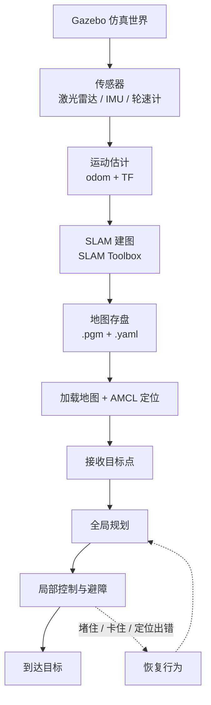
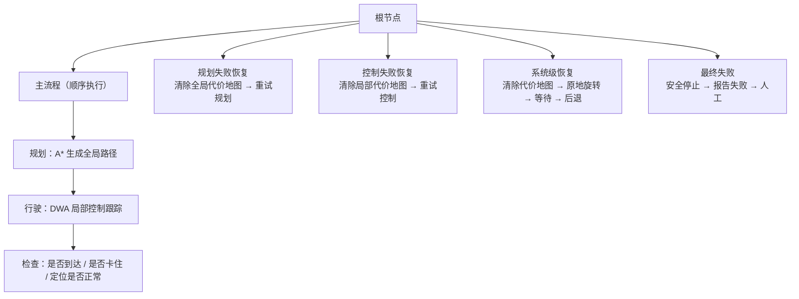
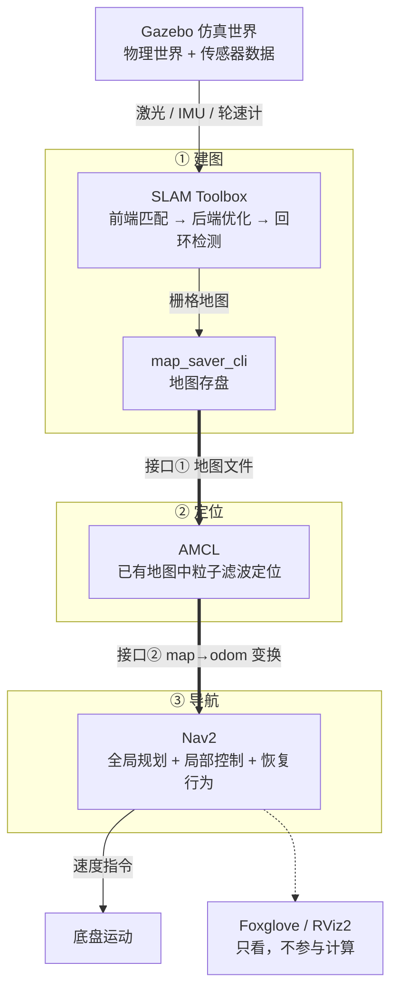

> 本文是一次移动机器人调研的整理。标着「**实测**」的数字，来自我在 Gazebo + ROS 2 上跑通的四个演示，截图也都是自己截的；其余内容来自公开资料整理。两者的边界我会尽量标清楚。

## 机器人自主移动，其实只在回答三个问题

**这是什么地方、我在哪、怎么走过去。**

前两个是建图和定位，第三个是导航。它们不是三个能各自独立的模块，而是一条首尾相接的链路：传感器给出原始观测，运动估计把这些观测折算成"我动了多少"，SLAM 在建图的同时把自己定在地图里，地图存盘之后再加载回来做定位，最后导航器收下目标点，规划出一条路线，再把它拆成一条条速度指令发给底盘。

整条链路上真正容易出问题的，几乎都是两个原因：**该对的没对齐，该信的没信对**。时间戳没对齐，观测就会去修正一段并不存在的运动；回环没检测到，地图首尾就合不上；初始位姿给错，粒子就会收敛到一个同样自洽但是错误的位置。下面按这条链路走一遍。

---

## 一、传感器与运动估计

### 机器人靠什么感知环境

| 传感器 | 原理 | 优点 | 局限 |
| --- | --- | --- | --- |
| IMU | 测三轴加速度和角速度，积分得到速度、位移和姿态变化 | 高频、短时准，不受光照和纹理影响 | 零偏和噪声会积分漂移，时间一长位置误差就很大 |
| 轮速计 | 靠车轮转数推算走了多远、转了多少角度 | 直接、便宜，短时里程比较稳 | 打滑、空转、地面不平或轮胎半径变化时就不准 |
| 激光雷达 | 发射激光测距，得到周围环境的三维点云 | 精度高、能直接测距，适合建图和定位 | 受雨雾烟尘影响；对透明、反光、吸光物体和长走廊等退化场景不友好 |
| 相机 | 拍图像，提取纹理、颜色和特征 | 信息丰富，能识别纹理、语义和回环 | 受光照、动态物体和纹理缺失影响；单目还有尺度不确定的问题 |

**实测**：这次用的 TurtleBot3 Burger 只装了 IMU + 轮速计 + 2D 激光雷达，**没有相机**。所以建图和定位完全依赖激光，后面不少问题的根源都在这里——比如长走廊和空旷区域缺少特征，就是这个传感器组合的天然短板。

### 机器人怎么判断自己移动了多远

主要靠 **IMU 和轮速计融合**。轮速计给出轮子转了多少，推算出大致的前进距离和转向；IMU 给出角速度和加速度，积分得到短时的姿态变化和位移。两者互补，覆盖了彼此的盲区。

但这一套**偏预测、少观测**——只有推算、没有外部修正。所以还需要激光点云、相机这类**观测**参与进来，用"看到的世界"反复修正"算出来的运动"。

### 为什么走得越久，位置偏得越多

- **IMU 零偏和噪声积分漂移**：速度误差随时间**线性**增长，位置误差随时间**平方**增长，这是长距离漂移的主因。
- **轮速计打滑或空转**：轮子转数和实际位移对不上，误差直接累加。
- **时间戳不同步或外参标定不准**：融合时把错误的运动当成真实运动，漂移会更快。

> **时间戳对齐是这里最容易被忽略的一环。** IMU 频率极高、激光点云频率较低，融合时必须明确"结果对应哪个时间戳"。一旦观测和预测的时间戳对不齐，估计就会出问题。

---

## 二、建图：SLAM 怎么一边定位一边建图

### 位姿图优化：先估计，再互相校准

SLAM 的核心动作可以拆成五步：

1. 每个**节点**是一时刻的传感器信息，包含**位姿预测**（位置、姿态）和**激光点云观测**；
2. 对点云做**特征提取**，得到角点、线、面等环境特征——这些特征比位姿预测更准，可以当作可靠的观测信息；
3. 不同节点的环境特征会有重叠，通过**特征匹配**得到节点之间的**相对位姿约束**（包含方向、大小等多个维度）；
4. 多个节点 + 多条约束边组成一幅图，用**图优化**按所有边的共同约束，统一校正每个节点的位姿；
5. 再用**优化后的位姿拼接点云**，得到更准的环境特征。

位姿越准地图越准，地图越准位姿也能越准，如此迭代。**用点云的特征提取与匹配约束位姿，用优化后的位姿反过来拼出地图，两者互相成就。**

### 前端、后端、回环：三件事，三个范围

| 环节 | 范围 | 做什么 | 特点 |
| --- | --- | --- | --- |
| **前端匹配** | 局部 | 相邻节点之间做点云特征提取与匹配，通过**局部图优化**初步估计位姿；再按角度、位移的变化幅度提取**关键帧** | 实时，但误差会持续累积 |
| **后端优化** | 全局 | 以关键帧为节点做**图优化**，在全局角度统一调整所有关键帧位姿；跨时间范围长、计算量更大，需要对关键帧做过滤、滑窗 | 全局一致，计算量大 |
| **回环检测** | 当前 vs 历史 | 先对历史关键帧做特征描述，新关键帧用描述子过滤掉大部分历史帧，再与候选帧做特征匹配，建立当前帧与历史帧之间的边；并用点云重叠等环境特征提高置信度 | 补上长距离约束，使地图闭合 |

三者的关系是：**前端负责"局部、实时、但会漂"的位姿估计；后端在全局上统一约束；回环检测补上当前帧与历史帧之间的长距离约束。**

### 为什么绕一圈回到原点，地图就能被修正

关键在于**后端优化和回环检测用的约束不是同一批**。

后端优化用的是**现有的关键帧和边**，而边一般只在相邻关键帧之间产生——第一帧和最新帧之间几乎没有联系，哪怕两者的位姿、环境特征都很接近。它**没有利用点云重叠来提高置信度**，所以一旦缺了回环约束，地图反而会出现重叠等问题。

回环检测补的正是这条缺失的联系：它在当前帧和历史帧之间建立边，把整条轨迹的**首尾拉在一起**，累计漂移被分摊修正，地图实现闭合。

### 地图为什么会重叠、倾斜、断裂、变形

| 现象 | 原因 | 对策 |
| --- | --- | --- |
| **重叠** | 回环没检测到、回环边没加上，同一区域建了两层 | 加强回环检测，确认后加回环边，触发全局优化 |
| **倾斜** | IMU 俯仰/横滚漂移导致重力方向不准，或激光-IMU 外参标定不准 | 标定 IMU 零偏和外参，做好时间戳同步，加入重力约束 |
| **断裂** | 跟踪丢失、重定位失败、传感器中断，前后关键帧图不连通 | 重定位、退化检测、多传感器融合，保证图连通 |
| **变形** | 错误回环把不相干节点连起来，或全局约束不足 | 回环多候选验证、鲁棒核函数、合理设置信息矩阵、加绝对约束 |

一句话记法：**重叠靠回环，倾斜靠标定，断裂靠重定位和连通，变形靠正确回环和鲁棒全局优化。**

**实测**：按 0.15 m/s 慢速走完全程并闭环，建图覆盖 **72.9%**（112×103 格），墙线连续、无变形、无重影。**慢速 + 闭环**是避开上面四类问题的两个有效手段——速度慢，相邻帧的特征重叠就多，前端匹配不容易错；闭环则把最后那点累计漂移一次性摊掉。

---

## 三、地图建好之后：建图和有图定位差在哪

### 未知量从两个减到一个

| | SLAM（建图） | 定位 | 导航 |
| --- | --- | --- | --- |
| 输入 | 激光 + 里程计 | 激光 + **已有地图** | 目标点 + 位姿 + 地图 |
| 输出 | 地图**和**位姿（同时） | 位姿 | 速度指令 |
| 未知量 | 地图 + 位姿（2 个） | 只有位姿（1 个） | — |
| ROS 2 组件 | SLAM Toolbox | AMCL | Nav2 |

**建图**时机器人既不知道自己在哪，也不知道环境长什么样，得**同时估计位姿和建地图**。**有图定位**时地图已经建好了，机器人只需要在这个已知地图里找到自己的位姿——未知量从两个减到一个，实现更简单。

据此还能得到一条**降级兜底链**：**局部定位 → 全局定位 → 重新建图**。局部定位最快，不行就退回全局定位，再不行只能重来。

### 地图里到底存了什么

存的是**栅格地图**：每个格子是**自由、障碍或未知**三种状态之一，另外还有**分辨率**和**原点**信息。

**实测**：这次的地图 112×104 格、0.05 m/格（约 5.6 m × 5.2 m），原点 `(-0.929, -2.131)`；格值分布是**空闲 54.6% / 障碍 5.9% / 未知 39.5%**。

那个「未知 39.5%」值得单独说一句：**它不是错误，而是"激光没扫到过的地方"，和"确认没有障碍"是两回事。** 后面导航里很多"明明看着能过却过不去"的问题，都跟这个区别有关。

还有一点容易混：**栅格地图 ≠ 代价地图**。落盘保存的只有栅格地图；代价地图不保存，它是导航时在栅格地图上实时叠加出来的，只存在于运行时。

### AMCL 具体是怎么找到我的

1. 初始随机撒一堆粒子，每个粒子有确定的位姿信息，认为是自己可能的位姿；
2. 通过激光点云观测，可以得到环境特征相对自己的位置；
3. 将环境特征相对位置叠加到每个粒子上，可以得到环境特征的**确切位置**；
4. 和已知地图进行比较，置信度高的区域保留、置信度低的过滤；
5. 下次迭代缩小区域，在置信度高的区域撒粒子；
6. 机器人移动，粒子的位置估计也跟着移动，进一步变换位置、缩小区域匹配；
7. 当置信度大于某阈值，认为定位成功。

全局模式粒子撒满地图，局部模式粒子集中在初始位置附近。

**实测**：给对初始位姿后，AMCL 稳态定位误差 **0.138 m**。

### 为什么通常要人工给一个大致初始位置

**初始位置本质上是一个坐标 + 一个协方差，协方差可以理解成搜索半径。**

- 给错初始坐标，但初始位置范围**覆盖**真实位置：仍是局部 AMCL，能收敛；
- 给对初始坐标：更容易收敛；
- 给错初始坐标，且初始范围**不覆盖**真实位置：粒子可能收敛到错误位置，或干脆收敛不了。

**实测**：这个坑我踩到了第三种。起点落在规划器的范围之外，规划器直接报 `Start Coordinates was outside bounds` 拒绝任务。**排查方法**：在 RViz 里同时打开 `/amcl_pose` 和激光点云，看激光点是否贴合地图中的墙线——不贴合，就是定位错了。

如果机器人运行中被搬到别的地方，能不能重新找到自己？能，靠已有地图和 AMCL。给定大致初始位置就走局部定位，否则走全局定位。问题在于：**如果 AMCL 还停在局部模式，粒子集中在旧位置附近，就可能找不到。** 所以被搬动后要**触发全局重定位**，或者人工给一个新的大致位置。

### 桌椅、货架变了，旧地图还能用吗

- **小变化**：大部分环境没变，激光能和旧地图对上，粒子权重仍然较高，可以定位；
- **大变化**：太多特征对不上，粒子权重普遍很低，可能无法定位，需要重建地图；
- **移动障碍物**：可以利用相邻帧点云比对，变化明显的点认为是**动态障碍**，过滤掉，不让它影响定位。

所以小物体增加、临时障碍通常不影响旧地图使用。

---

## 四、导航：从目标点到速度指令

### 栅格地图和代价地图

- **栅格地图**：把环境切成小格子，每格标成自由、障碍或未知——"格子化的环境地图"。
- **代价地图**：在栅格地图基础上，给每个格子填一个代价值，表示走这里的**风险大小**；障碍物本身致命，周围一圈高代价，越远越低。

激光每个周期扫一遍：新打中的格子标成障碍，局部代价地图实时更新；障碍走了则靠**射线清除**——激光从传感器到障碍物之间穿过的格子说明是空的，会被清成自由空间。

### 全局规划：A\* 为什么看起来总是"先贴上去再绕开"

全局规划就是在代价地图上，从起点到终点找一条**总代价最小**的路线。

**A\* 算法**把栅格当成图，障碍格不连通；用 `f = g + h` 给每个格子打分，`g` 是已走代价，`h` 是到终点的估计代价；每次选 `f` 最小的格子扩展。由于 `h` 只看直线距离、不考虑障碍，A\* 会一路朝目标方向扩展，直到被挡住才绕开障碍——表现出来就是**先靠近障碍物、再绕着障碍物走**。

*图中细线是全局规划出的路径，绿色箭头群是 AMCL 粒子，红色箭头是当前位姿，左下绿色箭头是目标点，背景由紫到白是代价地图。*

### 为什么机器人不是一个点，却能用质点来表示

**因为代价地图里做了膨胀。**

机器人不是质点，有体积。障碍向外膨胀一圈，半径至少等于机器人半径加安全裕度，防止机器人中心贴墙时身体撞上。

**实测**：这次机器人半径 0.3 m、安全裕度 0.1 m，膨胀半径就是 0.4 m，所有障碍向外扩 0.4 m——这时就可以用**质点**表示机器人，安全通过。

*深色圆斑是柱子障碍，周围一圈由紫→红→白逐渐变浅的就是膨胀层——离障碍越近代价越高。图中几块白斑是激光还没扫到的未知区域。*

膨胀层也解释了那个经典困惑：**为什么地图上看着能过，机器人却认为不能过。** 因为膨胀的安全裕度把本来能过的窄缝填补掉了。当然也可能是定位漂移、代价地图更新不及时，或者动态障碍临时挡住。

### 局部控制：DWA 怎么选出这一拍的速度

1. 在当前速度和加速度限制内，按分辨率采样多组 `(v, ω)`——速度和角速度在范围内瞬时变化；
2. 保持每组 `(v, ω)` 在时间间隔 `t` 内不变，这段位移就是一小段直线（或圆弧），把整体时间 `T` 内的 `T / t` 段连起来，就是这一组的**预测轨迹**；
3. 对每条轨迹打分：朝向目标、障碍距离、速度、是否贴合全局路径——理想轨迹是方向朝着目标、离障碍远、速度快、贴合全局路径；
4. 选总分最高的那组 `(v, ω)` 直接发给底盘执行，每个控制周期 `t` 重算一次，**滚动执行**。

这套做法有两个我不太容易从公式里看出来的特点：

1. **动态规避障碍物**：观测范围由时间 `T` 的预测轨迹确定，等于把视野拉长了，能提前感知障碍物；每个周期 `t` 都会变换位姿、重算观测范围，行动变化迅速；打分时"离障碍远"这一项又进一步保证规避。
2. **贴近目标时自然减速**：接近目标时速度项占比很小、方向项占比大，速度快反而导致方向偏差大，于是自然会降速；也可以设置贴近目标一定范围内速度上限。当机器人速度很低、方向误差很小、距离很小时，就认为**到达目标**。

### 为什么有时左右摇摆、原地旋转、卡在墙角

- **左右摇摆**：左右两边障碍交替出现，或评分权重不合理，导致两条轨迹分数差不多，系统来回选。→ 调大避障权重；加迟滞（除非明显更优，否则不切换方向）；降低控制频率或增大速度平滑。
- **原地旋转**：前方被堵，所有前进轨迹都会撞，只能原地转；或定位丢失触发重定位旋转；或恢复行为被触发。→ 临时堵就转完重新规划；定位丢了就触发全局重定位；恢复行为就等它执行完。
- **卡在墙角**：膨胀层把窄缝堵死，或陷入局部极小值，或定位漂移导致控制方向错误。→ 适当减小膨胀半径（但不能小于机器人半径）；加恢复行为；改善定位精度；让全局规划器重新规划绕开墙角。

### 一段演示

前面几节拆开讲的是规划、膨胀和局部控制。下面这段是在 Foxglove 里录的运行记录——机器人在已经建好的地图中移动：

<video controls preload="metadata" src="https://github.com/Ryan-wu-web/ryanwu_blog/releases/download/blog-asset-nav-demo/nav-demo.mp4"></video>

*Gazebo + ROS 2 仿真中的一次运行（Foxglove 视图）。视频托管在 GitHub Releases，没有进仓库历史。*

---

## 五、出问题之后：恢复行为和行为树

正常情况就是 A\* 规划 + DWA 跟踪；**只有出问题时才进入恢复流程**。

**行为树**把这些步骤按优先级组织成一棵树：根节点往下，先走主流程；主流程哪一步失败，就转到对应的恢复分支；全部失败才安全停止。好处是**"正常怎么走"和"出错怎么办"分开写**，主流程保持简单，异常处理挂在旁边的分支上。

各情况的触发条件和原因：

- **规划失败**：清除全局代价地图，重试全局规划——可能是传感器噪声或临时障碍导致的；
- **控制失败**：清除局部代价地图，重试局部控制——可能是局部地图里有幽灵障碍；
- **定位出错**：重新做全局/局部 AMCL 定位，旋转扫描环境，重新匹配地图定位；
- **恢复不了**：按顺序轮流执行清除代价地图、原地旋转、等待、后退；
- **全部失效**：安全停止，报告失败，等待人工干预。

**实测**：把障碍直接压在目标点上后，触发了完整的恢复链路——清除代价地图 → 原地旋转 → 等待 → 后退，循环重试，**169 秒后返回 `TaskResult.FAILED`，全程没有硬撞上去。**

*另一次成功导航的实测输出：`SUCCEEDED`、Nav2 错误码 0、实际行程 15.47 m（直线 14.91 m，相当于绕行 104%）、到点误差 0.123 m（判定容差 0.15 m）。*

---

## 六、把 ROS 2 的组件串起来

前面讲了那么多环节，落到 ROS 2 上其实就是三个组件，靠**两条接口**接起来：

**串联的钥匙就是那两条接口**：SLAM Toolbox 建完图存成**地图文件**，AMCL 加载它、持续输出 **`map→odom` 变换**，Nav2 靠这个变换知道"我在哪"，再去做规划和控制。节点之间都通过 **DDS** 通信；真机上把 Gazebo 换成真实底盘和传感器即可。

---

## 七、常见问题速查

| 现象 | 可能原因 | 排查思路 |
| --- | --- | --- |
| **地图重叠或变形**（同一区域两层、墙变弯） | 回环没检测到或回环边错误；IMU 漂移、外参标定不准、时间戳不同步 | 检查回环检测是否生效；检查 IMU 零偏和外参；检查时间同步 |
| **无法正确定位**（粒子发散、地图对不上） | 初始位置错误；地图变化太大；激光特征少（长走廊、空旷区）；动态障碍多 | 给大致初始位置或触发全局重定位；检查激光与地图匹配；清除动态障碍 |
| **目标点可达却规划不出路线** | 膨胀层太大把窄缝堵死；代价地图有幽灵障碍；未知区域被当障碍 | 检查膨胀半径；清除代价地图；检查起终点是否可通行 |
| **障碍物前左右摇摆** | 左右障碍交替出现；评分权重不合理；控制频率低；定位抖动 | 调大避障权重；加迟滞；平滑速度；提高定位稳定性 |
| **障碍移开后仍不走** | 代价地图没清除幽灵障碍；射线清除太慢或太保守；更新频率低 | 手动或自动清除代价地图；检查射线清除逻辑；提高局部代价地图更新频率 |
| **被搬动后找不到自己** | AMCL 还停留在局部模式，粒子集中在旧位置附近 | 触发全局重定位，粒子撒满地图；或人工给一个新的大致初始位置 |

---

## 最后留下的结论

这次调研里，**能称得上我自己实测的是这几组数字**：建图覆盖 72.9%、AMCL 稳态定位误差 0.138 m、临时放障碍后重规划绕行成功、目标被堵死时 169 秒后安全失败，以及上图那一次到点误差 0.123 m。其余关于前端/后端/回环、A\*、DWA、行为树的部分，都是公开资料整理加上自己的理解，不是我的实验结论。

如果要我用一句话概括整条链路，大概是：**机器人自主导航里绝大多数"玄学"，最后都能落到两个可检查的点上——时间戳有没有对齐，观测有没有被真正用上。**

时间戳对齐，决定了每一条观测是不是作用在了它真正对应的那段运动上；观测有没有被用上，决定了这套系统是在"推算"还是在"估计"。漂移、回环合不上、定位收敛到错误位置、地图重叠，往回追都能追到这两条。

不过这些数字都出自仿真：没有打滑、没有传感器噪声、没有光照和动态行人。尤其是 0.138 m 这个定位误差，换到真实底盘上大概率不是这个数——这也是我看这份结果时最不敢直接外推的一项。
