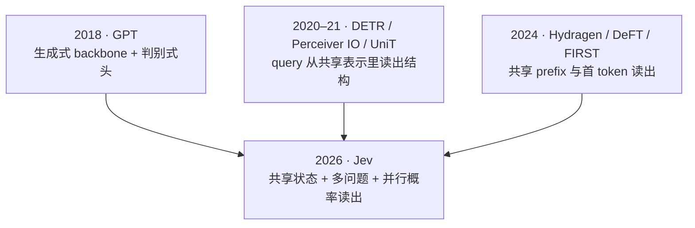
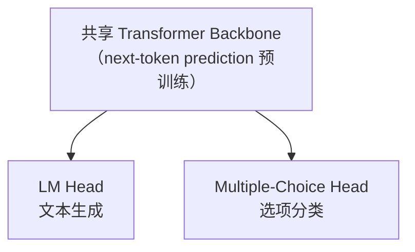
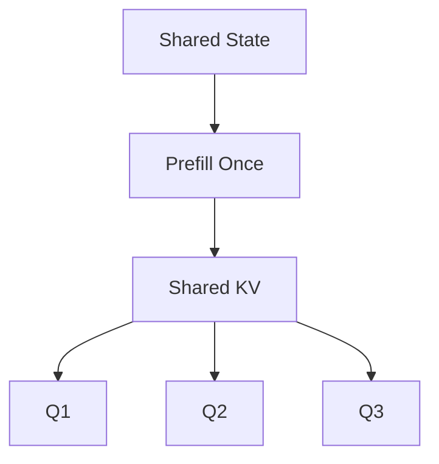

> 这篇梳理一条技术线索的来路。文中引用的论文与官方材料我都核对了一手来源；Jev 部分的证据分级按原作者的分类保留，哪些是官方说的、哪些是黑盒测出来的、哪些是推断，我在文中分开写。

## 先说结论

Jev 在 2026 年 9 月发布时，很多人把它当成一个新物种。但**它核心的那个问题，已经被问了八年**：

> 对于本质上只是一个闭集选择的判断，为什么要先生成一串文本，再把这串文本解析回一个类别？

把时间拉开看，这条线索由三股力量在不同的地方各自长出来，最后才汇到同一个地方：



这三条线分别是：

1. **生成能力和判别能力不必属于两个模型**——GPT 时代就已经成立；
2. **输出不必由自回归 token 构成**——可以由 query 定义语义，从共享表示里直接读；
3. **同一个状态被重复 prefill 是纯浪费**——共享 prefix 的计算图在工程上早就可行。

Jev 的位置，是这三条线的交点，加上一个别人没做过的事：**把"多个问题并行读同一份状态"做成了产品形态**。

---

## 一、2018：GPT 的双头模型——生成和判别一开始就不矛盾

GPT 的第一篇论文（Radford et al., 2018，*Improving Language Understanding by Generative Pre-Training*）讲的是预训练范式，但里面藏着一个后来被反复使用的结构：



也就是说，**一个通过 next-token prediction 学到的生成式 backbone，可以直接被拿去做分类、问答、文本蕴含这些判别任务**。这在当时不是重点，但它建立了一个先例：

> 生成能力和直接分类能力，不必属于两个完全独立的模型。

工程上这个结构后来有很直观的实现，就是 Hugging Face 的 `OpenAIGPTDoubleHeadsModel` 和 `GPT2DoubleHeadsModel`——同一个 backbone 上挂 LM Head 和 Multiple-Choice Head。

**但它还不是 Jev，差在两处：**

- 判别头是**固定的**：K 个类别在训练时就定死，换一套选项就要重训；
- 判别头读的是**固定的位置**（通常是最后一层某个 token 的 hidden state），问题本身不是一个可以变化的输入。

要跨过这两步，需要从别的领域借一个思路。

---

## 二、2020–2021：让 query 从共享表示里"读出"结构

### DETR：一组 query 并行读同一份视觉状态

DETR（Carion et al., 2020）最有价值的不是检测精度，而是它换掉了输出的生成方式。传统检测器要产生一个目标集合，往往依赖后处理（NMS、anchor 匹配）；DETR 用一组 learned queries 直接**并行**读取共享编码器输出的视觉状态：

```text
Image Features → Shared Encoder → Object Queries → Cross Attention → 并行输出多个目标
```

它不是 `object1 → object2 → object3 → ...` 这样一个个生成，而是让一组 query 同时去读同一份表示。把这个结构搬到机器人上，几乎是逐字对应：

```text
Robot State → Shared Backbone → Decision Queries → phase / safety / success / replan
```

### Perceiver IO：输出语义由 query 定义

Perceiver IO（Jaegle et al., 2021）把这个想法推得更一般：

```text
任意输入 → Latent Representation → Output Queries → 不同结构化输出
```

它给出的观点是我觉得这一节里最重要的：

> **输出不一定要通过自回归语言 token 形成；可以由 query 定义输出的语义，再从共享 latent 里直接读取结果。**

对照关系很清楚：

```text
Perceiver IO:  output query      → latent        → structured output
Jev-like:      question/options  → shared state  → probability distribution
```

### UniT：一个模型支撑多个任务

UniT（Hu & Singh, ICCV 2021）用共享模型处理视觉、语言、多模态任务，再通过 task-specific heads 输出不同结果。它的意义在于证明**一个统一模型可以同时支撑多个任务，不必每个任务复制一套 backbone**。

这三篇放在一起，指向同一个转变：**"输出"这件事，从"生成一串符号"变成了"用 query 从表示里读"**。GPT 那一步解决了"能不能共用 backbone"，这一步解决了"输出怎么定义"。

---

## 三、2024：同一个状态被重复 prefill，是纯浪费

如果多个问题都基于同一份环境状态：

```text
State + Q1
State + Q2
State + Q3
...
```

最浪费的地方不是计算本身，而是**同一个 State 被反复做 Prefill**。而这些问题本来是可以共享的：



### Hydragen：把 prefix attention 和 suffix attention 拆开

Hydragen（Juravsky et al., 2024）研究的就是"共享长 Prefix + 大量不同 Suffix"这个场景。做法是把 attention 拆成两部分分别算，再做分母重标定合并——因为同一个 batch 里 prefix 的 K/V 完全相同，可以把跨序列的 query 合并成一次矩阵乘，把大量 matrix-vector 变成 matrix-matrix。

论文报告的是：**在 CodeLlama-13b 上，端到端吞吐相比 competitive baselines 最高提升 32 倍**。

这个数字要连条件一起引用，否则会误导：它是 **up to**（上限值，不是稳定值），对比对象是**已经优化过的基线**，而且**加速比随 batch size 和共享 prefix 长度增长**——换句话说，状态越长、并行的问题越多，收益才越大。同一篇论文里另一个更能说明问题的数字是：prefix 从 1K 拉到 16K 时，Hydragen 的吞吐下降不到 15%，而基线下降超过 90%。

### DeFT：树状推理的 KV Cache IO

DeFT（Yao et al., 2024，ICLR 2025）针对的是同一种计算图的另一种形态：

```text
             Shared Prefix
            /      |               branch1 branch2 branch3
```

它用 KV-Guided Grouping 让共享 prefix 的 KV 只加载一次，再用 Flattened Tree KV Splitting 把树形 KV 均分以平衡负载，论文报告减少了 73–99% 的 KV cache IO。（提醒一句：这篇的 v1 和 v4 标题与加速数字都改过，引用时最好标版本。）

### 这两篇的正确理解

它们**不是 Jev 的实现证据**。正确的定位是：

> 它们证明了"一个共享 Prefix + 多个独立 Branch"这种计算图，在现代 LLM serving 上是完全可行的工程结构。

这对机器人的意义很直接。机器人的 State 可能很长——任务、历史、场景、机器人状态、知识——但同一个时刻往往需要同时判断好几件事：

```text
safe?  success?  phase?  need_replan?  next_skill?
```

**共享 State 的 Prefill 与 KV，让每个问题只增加自己的 suffix**，这几乎是一个必然的运行时设计，而不是什么精巧的技巧。

---

## 四、2024：如果只需要排序，就别生成排序序列

FIRST（Reddy et al., 2024）是一篇很容易被忽略、但哲学上和 Jev 最像的工作。

传统的 LLM reranker 是这么做的：让它输出排好序的候选列表，它就生成一串标识符——

```text
[3, 1, 4, 2, ...]
```

FIRST 换了个做法：**用第一个生成标识符的 output logits 直接解码出候选的排序**，同时在训练里加一个 learning-to-rank loss 来侧重高相关段落。论文报告推理加速约 50%。

为什么值得单独说：它问的问题和 Jev 一模一样。

> **如果最终需要的是排序或决策，就尽量直接读取 logits，而不是先生成一个字符串来表示这个排序。**

区别只在于 FIRST 处理的是排序，Jev 处理的是带置信度的分类决策；底层是同一个判断——**字符串是给人看的，模型内部不需要经过它。**

---

## 五、2026：三条线在 Jev 汇合

TypeSafe 在 2026 年 9 月 15 日发布 Jev 时，把上面三件事同时推到了一个产品形态上。这里要特别小心区分证据层级——**哪些是官方说的、哪些是外面测出来的、哪些是推断**，混在一起写就不诚实了。

### 官方明确公开的

翻官方博客和文档，下面这些是 TypeSafe 自己写下来的：

| 项 | 官方表述 |
| --- | --- |
| 输入 | unstructured data, **with an emphasis on structured program state**（两个词官方都用了） |
| 输出 | **typed probabilistic decisions**；"type-safe structured values"，且"所有答案都带校准概率与置信度" |
| 采样 | **Parallel** —— 官方原话是 "outputs all probabilities **in parallel** instead of autoregressively generating by token" |
| 训练 | **RLCD**（Reinforcement Learning for Calibrated Decisions） |
| 速度 | 端到端响应时间 **70 ms – 500 ms** |
| 演示形态 | Doom demo 用的是 "**structured state as a data structure with text, not on images (yet…)**"；文档站另写明当前只接受文本输入，不支持图像、音频、视频 |

### 黑盒测出来的

2026 年 9 月 17 日，Archer Hume 发了一篇 *Jev's Architecture Unmasked*，对 jev-1.13.0 做了约一万次 API 调用的黑盒探测。这篇文章的价值不只是结论，而是**它自己就把证据分了三级**——官方已发布 / 实验观测到 / 由此推断，并且反复标注哪些结论"不是测量"。

其中属于**观测**的部分，有几条相当具体：

- **Token 记账严格可加**（268 / 276 / 318），这和一个共享前缀加若干独立后缀的结构吻合；
- **把一个标记从 state 移到兄弟问题里，它的概率从 0.90–0.92 掉到 0.00** —— 说明问题之间确实是隔离的；
- **延迟随 state 长度和问题数增长，但在约 100 个问题以内几乎不变**；
- **选项之间会互相影响**：加一个无关的第五选项，会让原有选项的 log-odds 从 +0.38 降到 +0.11（10 个随机分块全部下降，均值 −0.28）。这一条直接排除了"每个选项独立打分再 softmax"这种最简结构；
- 单问题上限约 32,768 token、整个请求约 65,536，选项上限 **255**；
- MMLU 上的 10-bin **ECE = 0.0313**。

他给这组证据的总结是一句话，也正是第二节里 Perceiver IO 那个结构的机器人版本：

> **Share the state, isolate the questions.**（共享状态，隔离问题）

### 作者推断的（别当官方事实）

同一篇文章里还有另一批内容，作者明确标为推断，引用时最容易出错：

- **它仍然是 causal decoder** —— 这是**作者的假设**。原文说实验"无法区分 causal decoder 和 bidirectional encoder"，他只是认为 causal 更合理；
- **prefix KV + question branches** —— 归在观测支持里，但作者自己也说"记账本身并不能确定计算图"，Hydragen / DeFT 只是 prior art，**不是 TypeSafe 用了它们的证据**；
- **sparse MoE** —— 作者原话是"**最不确定的部分**"、"**这是推断，不是测量**"；
- **读出方式是 fixed-slot head 还是 pointer-style scorer** —— 他说**两者都符合现有证据**，"两个结果都不具决定性"；
- **确切的 attention mask** —— 明确说**无法从外部获得**。

这个分级本身值得学。一篇黑盒反推文章能把"我测到了什么"和"我猜是什么"分得这么清楚，比结论本身更有参考价值。

---

## 六、另一条线：机器人动作也在做同一件事

机器人这边有一条独立演化的线，问的是同一个问题的机械版：**连续控制为什么要用语言式的逐 token 解码？**

```text
RT-2 / OpenVLA    →   ACT（一次预测一段）  →   FAST（压缩动作 token）
                  →   π0（flow matching 动作专家）  →   OpenVLA-OFT（并行连续解码）
```

- **RT-2**（2023）把动作当成一种语言，直接用 VLM 自回归生成；
- **ACT**（RSS 2023）提出 action chunking：一次预测未来一段动作 `π(a_t:t+k | s_t)`，而不是一步一个；
- **π0** 是转折点——保留预训练 VLM，但给动作单独接一个连续动作专家，用 flow matching 出整段动作。基础是 3B 的 PaliGemma（加上约 300M 的动作专家，总计 3.3B），官方称最高可支持 50 Hz 的控制；
- **FAST** 走的是折中路线：不取消自回归，而是先用 DCT 把动作序列压到频域再 token 化，减少要生成的 token 数；
- **OpenVLA-OFT** 干脆换成并行连续动作解码，报告动作生成吞吐提升约 26×。

这条线的细节我在[上一篇《一个 Backbone，三种输出》](/2026/09/22/2026-09-22-vla-architecture-2026/)里写过，这里不重复。放在这篇的语境里，它说明的是：

> **"保留 backbone 的语义能力，但换掉慢的输出机制"——这个动作在语言侧和动作侧是同时发生的。**

顺带说一个很能说明问题的证据：Physical Intelligence 的 *Knowledge Insulating VLA* 报告说，**naively 给 VLM 接上连续 diffusion / flow 动作专家，会同时损害训练速度和知识迁移**——也就是说，共享 backbone 不是"多挂一个头"那么简单，接法本身会决定 backbone 的知识还在不在。这与 EffVLA 的发现（把 backbone 末层复制到 head 做初始化是最大杠杆）指向同一件事：**共享的关键是让 head 和 backbone 待在同一个表征空间里。**

---

## 七、三条线的交点

把三个领域分别解决的问题和各自留下的缺口排在一起，Jev 的位置就清楚了：

| 线索 | 起点 | 代表工作 | 解决了什么 | 留下了什么 |
| --- | --- | --- | --- | --- |
| 共享 Backbone | 2018 | GPT 双头模型 | 生成与判别可以共用一套权重 | 分类头是固定的，换选项要重训 |
| Query 读出 | 2020–21 | DETR / Perceiver IO / UniT | 输出语义由 query 定义，不必是 token 序列 | 没有"多个问题并行读同一状态"的运行时 |
| 共享 Prefix | 2024 | Hydragen / DeFT | 共享前缀 + 多分支在 serving 上可行 | 缺一个把它和数据形态绑定的产品 |
| 首 token 读出 | 2024 | FIRST | 排序可以直接读 logits | 只处理排序，没有校准概率 |
| **汇聚** | 2026 | **Jev** | 以上几条 + **多问题并行 + 校准概率** | 内部实现仍不透明，校准证据有限 |

注意最后一行左边那四项，没有一项是 Jev 发明的。**Jev 真正新的地方只有一处：把"多个问题并行读同一份状态、输出校准概率"做成了一个完整的产品形态。** 剩下的部分是这八年里别人在别的领域分别铺好的路。

---

## 最后留下的结论

**第一，这条线索的内核不是"少生成几个 token"，而是"表示已经形成之后，不该再把它翻译回符号"。** Token 是给人看的。一个已经算出了答案的模型，为了把答案说出来而生成几十个 token，再由调用方解析回去——这中间的每一步都是纯粹的损耗。GPT 的双头模型、DETR 的 query、FIRST 的首 token 读出，各自从不同角度碰到了这面墙。

**第二，三个领域摸到同一面墙，但谁都没跨过去。** 语言那边解决了权重共享，视觉那边解决了输出定义，系统工程那边解决了计算图——每一块都是必要的，但都不是充分的。真正缺的那块，是**让多个问题同时读同一份状态**这件事，在语言侧和机器人侧都没有对应的产品。

**第三，Jev 的位置要说准。** 它没有发明上面的任何一项；它做的是把这几条线接在一起，并加上一个明确的产品承诺——输出是带校准置信度的概率分布。但这个承诺目前仍然是**官方声明加黑盒观测**，不是可复现的可靠性曲线。这和我在[《Jev 调研》](/2026/09/21/2026-09-21-jev-pian-yi-he-kuai-shi-zhen-de/)里写过的结论一致：**买它的经济学优势，别买它的叙事。**

**这篇的几个局限**：

- Jev 那一节的黑盒观测**全部来自单篇第三方分析**（Archer Hume，2026-09-17），且是单账号、非受控负载条件下做的，延迟数字取自响应头而非硬件基准；
- 我对那些观测的转述已经尽量收紧，但**观测能支持的是行为特征，不是计算图**——作者自己也这么说；
- Hydragen 的 32× 是 `up to` 且附条件的数字，脱离条件引用会失真；
- **"三条线索汇合"这个框架是我的重构**，不是任何一篇论文的说法。三篇论文之间没有引用关系，是我把它们放在一起看的。

---

## 附：参考资料

**共享 Backbone 与判别头**
- Radford et al., *Improving Language Understanding by Generative Pre-Training*, 2018 — https://cdn.openai.com/research-covers/language-unsupervised/language_understanding_paper.pdf
- Hugging Face `OpenAIGPTDoubleHeadsModel` — https://huggingface.co/docs/transformers/model_doc/openai-gpt
- Hugging Face `GPT2DoubleHeadsModel` — https://huggingface.co/docs/transformers/model_doc/gpt2

**Query-based 结构化读出**
- Carion et al., *DETR: End-to-End Object Detection with Transformers*, 2020 — https://arxiv.org/abs/2005.12872
- Jaegle et al., *Perceiver IO: A General Architecture for Structured Inputs & Outputs*, 2021 — https://arxiv.org/abs/2107.14795
- Hu & Singh, *UniT: Multimodal Multitask Learning With a Unified Transformer*, ICCV 2021 — https://openaccess.thecvf.com/content/ICCV2021/html/Hu_UniT_Multimodal_Multitask_Learning_With_a_Unified_Transformer_ICCV_2021_paper.html

**共享 Prefix / 树状推理**
- Juravsky et al., *Hydragen: High-Throughput LLM Inference with Shared Prefixes*, 2024 — https://arxiv.org/abs/2402.05099
- Yao et al., *DeFT: Decoding with Flash Tree-Attention for Efficient Tree-structured LLM Inference*, ICLR 2025 — https://arxiv.org/abs/2404.00242

**首 token 读出**
- Reddy et al., *FIRST: Faster Improved Listwise Reranking with Single Token Decoding*, 2024 — https://arxiv.org/abs/2406.15657

**Jev**
- TypeSafe AI, *Introducing System One Models & Jev*, 2026-09-15 — https://typesafe.ai/blog/introducing-system-one-models-and-jev
- TypeSafe 文档（System One 概念）— https://docs.typesafe.ai/concepts/system-one
- Archer Hume, *Jev's Architecture Unmasked*, 2026-09-17 — https://archerhume.com/posts/jevs-architecture-unmasked/

**机器人动作线**
- Brohan et al., *RT-2*, 2023 — https://arxiv.org/abs/2307.15818
- Zhao et al., *Learning Fine-Grained Bimanual Manipulation with Low-Cost Hardware* (ACT), RSS 2023 — https://arxiv.org/abs/2304.13705
- Kim et al., *OpenVLA*, 2024 — https://arxiv.org/abs/2406.09246
- Black et al., *π0: A Vision-Language-Action Flow Model for General Robot Control*, RSS 2025 — https://arxiv.org/abs/2410.24164
- Pertsch et al., *FAST: Efficient Action Tokenization for VLA Models*, 2025 — https://arxiv.org/abs/2501.09747
- Kim, Finn, Liang, *Fine-Tuning VLA Models: Optimizing Speed and Success* (OpenVLA-OFT), RSS 2025 — https://arxiv.org/abs/2502.19645
- Driess et al., *Knowledge Insulating Vision-Language-Action Models*, Physical Intelligence — https://www.physicalintelligence.company/download/pi05_KI.pdf ｜ https://arxiv.org/abs/2505.23705

> 本文涉及的论文与官方材料均核对了一手来源（arXiv 摘要页、会议官方页、官方博客与文档站、官方 PDF）。Jev 一节按原分析文章自己的三级证据体系分写：**官方明确公开的**、**黑盒实验观测到的**、**作者推断的**，请勿把第三类当作官方事实。其中 Hydragen 的 32× 为 `up to` 且附条件，引用时请保留限定。
