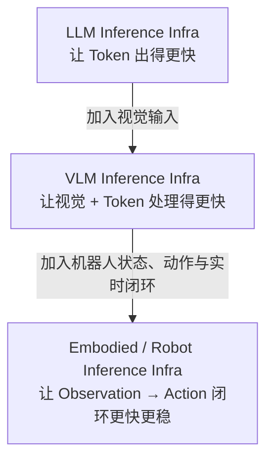
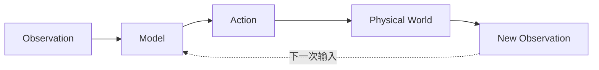
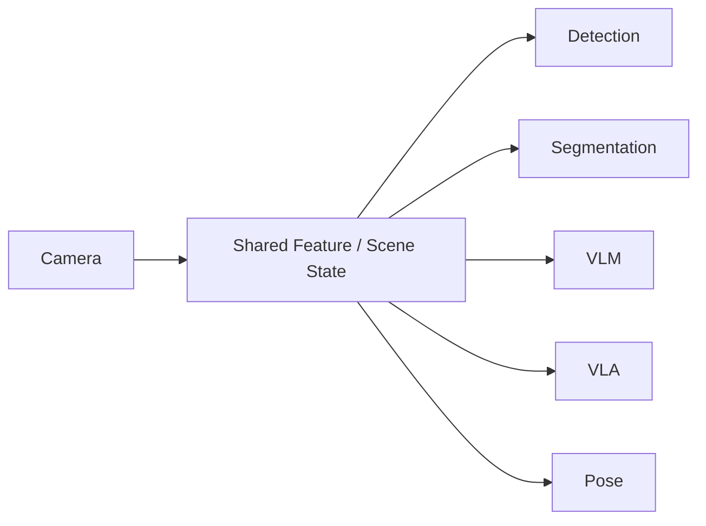
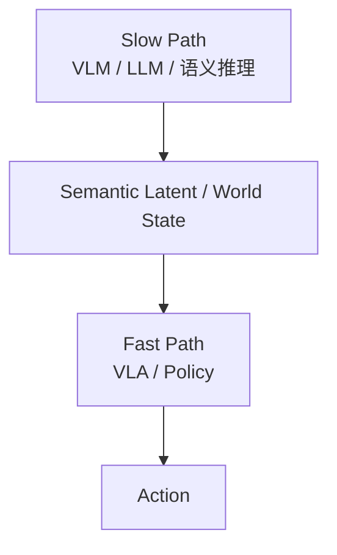
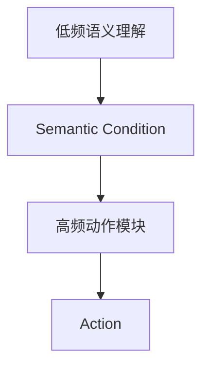
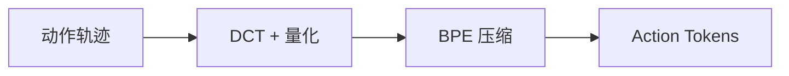

> 这是一份调研整理。文中涉及的外部工作我都尽量标了出处；属于我自己的判断部分，我会说明它是判断而不是结论。

## 一个被用错的指标

大模型推理基础设施这几年解决的问题很集中：模型怎么常驻显存、Prefill 和 Decode 怎么加速、KV Cache 怎么复用、怎么量化、怎么并行、怎么把 Token/s 和吞吐做上去。这套东西的目标可以用一句话概括——**让 Token 出得更快**。

但机器人要的不是 Token。

一台机器人从一个观测到产生一个能执行的动作，中间不需要一段自然语言。它需要的是关节增量、末端位姿或者一个动作块。所以当我把 LLM Infra 的那套指标直接搬到机器人上时，会立刻发现对不上：**Token/s 高，不代表机器人反应快；吞吐大，不代表闭环稳。**

真正该看的指标是另一个：

```text
Observation → First Valid Action 的延迟
```

而且不只是它的均值。对机器人来说，**分位延迟和抖动往往比平均值更要命**——平均值好看、偶尔卡一次，闭环就已经破了。

这篇想梳理的就是：机器人推理基础设施和 LLM/VLM 推理基础设施，到底差在哪；目前有哪些被验证过的技术路线；以及哪些东西其实不用自己重造。

---

## 一、三种 Infra，其实是三个不同的对象

把 LLM Infra、VLM Infra 和机器人 Infra 放在一起看，它们更像逐层扩展的关系，而不是三套平行的东西：



### LLM Infra：核心是让 Token 更快生成

这一层关心的是 TTFT、TPOT、Token/s、Prefill、Decode、KV Cache、Prefix Cache、Continuous Batching、Speculative Decoding、张量并行与流水并行、INT8/INT4/FP8 量化、CUDA Graph、Kernel Fusion，以及多用户吞吐。对应的框架是 vLLM、SGLang、TensorRT-LLM。它的本质，就是**高效执行 Transformer 的 Prefill + Decode**。

### VLM Infra：多了一条视觉链路

VLM 的推理链路长了一截：

```text
Camera / Image / Video
    ↓
Decode / Resize / Crop
    ↓
Vision Encoder
    ↓
Visual Tokens
    ↓
Projector
    ↓
LLM Prefill → Decode
```

除了继承 LLM Infra 的全部问题，它还要额外处理图像预处理、Vision Encoder 加速、高分辨率切块、Visual Token 数量控制、视频关键帧采样、多图动态 batching、Vision Encoder 与 LLM 的异构调度、视觉特征缓存、帧间冗余消除。

最能说明问题的是**缓存对象的变化**。LLM Infra 里最重要的缓存基本只有一样：

```text
KV Cache
```

到了 VLM Infra，变成了一排：

```text
Frame Cache
Visual Feature Cache
Visual Token Cache
Video Cache
KV Cache
```

### Robot Infra：目标从 Token Latency 换成 Action Latency

机器人系统最终关心的只有一件事：**Observation → Action 的闭环延迟。**

它的输入比 VLM 更杂——RGB、Depth、机器人状态、关节状态、力/力矩、任务上下文、历史；输出也不是文本，而是动作、轨迹、技能、动作块或者控制器目标。

所以机器人 Infra 的核心指标不该再是 Token/s，而应该是这一组：

```text
Observation-to-Action Latency
First Valid Action Latency
Control Frequency
P50 / P95 / P99 Latency
Latency Jitter
Action Staleness
Task Success Rate under Latency Constraints
```

---

## 二、真正的分水岭：它是个闭环

传统模型服务是开环的：

```text
Request → Model → Response
```

机器人不是：



这个环让机器人 Infra 和普通模型服务彻底分道扬镳，具体差在四点上：

1. **输出会立刻改变物理环境。** 模型输出不是一个可以被丢弃的字符串，它会变成真实的位移和力。
2. **下一次输入依赖上一次动作。** 输入不是独立同分布的请求，而是自己上一步造成的结果。
3. **推理延迟会直接改变控制效果。** 同一条控制律，晚 200 ms 执行，效果可能完全不同。
4. **模型输出存在"过期"问题。** 算出来的动作，可能在执行的那一刻就已经不适用了。

第三点可以用一组数字说明差别有多大：

```text
LLM： 500 ms → 1000 ms
     通常只是回答变慢

Robot：50 ms → 500 ms
     可能直接使闭环控制失效
```

所以在 LLM 那边是"性能优化"的事情，到机器人这边变成"能不能用"的问题。机器人系统因此更关心确定性延迟、低抖动、deadline、数据新鲜度、状态对齐和快速恢复——这些词在 LLM Infra 的语境里几乎不会出现。

---

## 三、几条已经有人走通的技术路线

下面这几条方向都不是设想，每一条背后都已经有具体工作在推进，其中一部分已经进了产品或者开源仓库。值得注意的是：**它们分别解决的是不同环节的问题，目前还没有人把它们拼成一个统一的运行时**——这件事我放到最后说。

### 视觉缓存与共享感知

机器人系统里有一类重复计算，看着不起眼，但累积起来很贵：

```text
Camera
 ├→ YOLO → Vision Encoder
 ├→ SAM  → Vision Encoder
 ├→ VLM  → Vision Encoder
 ├→ VLA  → Vision Encoder
 └→ Pose → Vision Encoder
```

同一张 RGB 图像被多个模型反复读取、反复提取特征。理想形态应该反过来，让感知结果成为共享的一层：



进一步可以形成 Frame Cache、Depth Cache、Feature Cache、Object Cache、Segmentation Cache、Scene Cache 这一整排。

**这条路线上已经有人验证过其中一段。** VLA-Cache（NeurIPS 2025）利用的是机器人操作中相邻帧视觉输入变化很小这一特性：它在 patch 级筛选出"几乎没变"的静态 visual token，直接复用它们上一帧的 KV 表示；同时用语言解码器的 text-to-vision 交叉注意力挑出任务相关的 token（比如夹爪和目标物体附近）强制重算，并按各层的注意力集中度自适应调整复用比例。

有个细节值得单独说：**它省掉的是语言解码器对这些 token 的重复前向计算，而不是视觉编码器的计算**——论文把加速瓶颈明确定位在 language decoder。这反过来印证了前面那件事：机器人推理里真正贵的，往往不是"看图"，而是"看图之后那一长串解码"。它是 training-free、plug-and-play 的，论文报告 CUDA 延迟最高 1.7× 加速、控制频率提升 15%，成功率基本无损。

但要区分清楚：**目前成熟的工作大多集中在"同一个 VLA 内部、相邻两帧之间"的缓存**。更有价值但还没完全成熟的是**跨模型共享视觉中间表示**——让 Detector、Segmenter、VLM、VLA、Pose 复用同一份特征。

工程上，我倾向于第一阶段不要强行上"一个视觉 Backbone 统一所有模型"，那会牵动所有模型的训练和精度。更现实的做法是先做一层 **Shared Observation / Feature Cache**，让不同模型按需复用原始帧、畸变校正帧、深度、特征、检测框、跟踪、掩码、场景状态，用不用、用哪一层，由各模型自己决定。

### 快慢双路径：不同时间尺度的模型协同

让一个大模型以同一频率处理所有问题，是很多机器人系统一开始会犯的错。

语义理解和高频动作生成对频率的要求差了两个数量级。合理的结构是把它们分层：



**Figure 的 Helix 是目前这方面最有代表性的产业方案。** 它采用双系统：System 2 是一个机载的、经过互联网预训练的 VLM，跑在 **7–9 Hz**，负责场景理解和语言理解；System 1 是快速反应的视觉运动策略，把 System 2 产出的潜在语义表示翻译成精确的连续动作，跑在 **200 Hz**。System 2 把全部语义信息蒸馏进**单个连续潜在向量**交给 System 1。

关键点不只是模型分层，而是**两条路径可以异步运行**：System 2 作为异步后台进程持续更新 latent，System 1 作为独立的实时进程维持那个 200 Hz 的控制环。Figure 是把两者分在两个嵌入式 GPU 上做模型并行来部署的。

细节里还有一条对整个行业都很有启发的做法：**Figure 在训练时故意给 System 1 和 System 2 的输入加了时间偏移**，让两个系统在训练阶段就习惯彼此之间的推理延迟差。这等于承认了一件事——**推理延迟是架构的一部分，不能留到部署时再补**。

2026 年 1 月发布的 **Helix 02** 把层级又往下延了一层，形成三个时间尺度：System 2 做慢速语义推理，System 1 以 **200 Hz** 输出全身关节目标，**System 0 以 1 kHz** 负责平衡、接触和全身协调。System 0 是一个约 10M 参数的网络，输入全身关节状态与基座运动，输出 1 kHz 的关节级执行器指令；官方说它替代了 109,504 行手写 C++，训练用了 1000 小时以上的人体运动数据，在 20 万以上的并行仿真环境里做 sim-to-real 强化学习。

需要提一句：**Helix 02 的 System 2 频率，Figure 官方没有公布**。网上流传的某些具体数字查不到一手依据，引用时得注意——7–9 Hz 是初代 Helix 的数字，不能直接套到 Helix 02 上。

**NVIDIA GR00T N1** 走的是同一条双系统思路，但结构不同：System 2 是一个视觉语言模型，负责理解环境和语言指令；System 1 是一个 **diffusion transformer**，用 flow matching 实时生成连贯的动作。NVIDIA 在 2025 年 3 月把论文、代码和权重都公开了。

把这三者放在一起，能看出一个挺明确的趋势：

```text
Reasoning Frequency  ≠  Policy Frequency  ≠  Control Frequency
```

也就是**语义理解与高频动作生成解耦，正在成为通用机器人模型的架构共识**。这个判断我觉得比较稳——三家不同背景的团队（人形机器人公司、芯片公司、学术团队）独立收敛到了相似的结构。

### 语义与动作解耦

快慢双路径往下推一层，就会得到一个问题：**语义理解真的需要每个控制周期重算吗？**

答案显然是否定的。场景里有没有杯子、任务是不是"把抽屉关上"，这类判断在一秒之内通常不会改变，而动作却需要以几十到上千赫兹的频率更新。于是结构变成：



这带来一个在 LLM Infra 里不存在的新缓存对象：**Semantic Cache**。它缓存的是"当前对场景和任务的理解"，而不是任何一层张量。往这个方向继续想，机器人的缓存体系最终可能长成这样：

```text
Frame Cache
Visual Feature Cache
Semantic Cache
World State Cache
Action Cache
KV Cache
```

注意最后那个 KV Cache 的位置——它依然重要，但它从"唯一主角"变成了其中一层。

同一件事从生成侧看也很清楚：越来越多的 VLA 工作开始避免"视觉 → 大语言模型 → 长解码 → 动作"这条路径，转而走"视觉 + 语言 → 紧凑交互 → 动作头 → 动作块"。**本质上是同一句话：把慢速语义理解和实时动作生成解耦。**

### 异步流水线：把等待藏起来

同步的机器人推理是这样的：

```text
Observation → Inference → Wait → Action → Execute → Next Observation
```

中间的 Wait 是纯浪费——机器人在等模型，而不是在动。更合理的做法是让推理和执行重叠：**机器人执行上一段动作的同时，后台已经在推理下一段。**

```text
Inference 1  ████████
                     Inference 2  ████████
                                          Inference 3  ████████

Robot:               Execute Chunk 1  ███████████
                                                    Execute Chunk 2  ███████████
```

LeRobot 已经给出了比较明确的工程形态：**Policy Server / Robot Client** 分离，机器人的客户端把观测发给策略服务端，服务端预测出一个动作块放进 Action Queue，机器人从队列里取动作执行。这样机器人不需要每个控制周期都等一次完整的模型推理。这是目前最适合直接工程复用的一类方案。

但异步会引入一个新的、更难的问题：**时间错位（Temporal Misalignment）**。

```text
t0: 模型读取 Observation_t0
        ↓ 推理耗时
t1: 模型输出 Action
```

问题在于 t0 到 t1 之间，机器人并没有停下来。所以：

```text
模型以为的状态：State_t0
动作真正执行时：State_t1
```

模型是拿一个"已经过去的观测"在算"现在该做什么"。这个错位在低频、慢速场景下可以忽略，但在高速或接触密集的任务里会直接体现为控制误差。

VLASH（MIT HAN Lab 等，2025 年底的预印本）把这个问题显式拿出来研究。它的做法相当克制：**不改架构，只改推理时的输入**——用上一段动作块把机器人的本体状态确定性地"前滚"到未来的执行时刻，让策略以执行时刻的状态为条件，而视觉观测仍然是那份共享的旧观测。再配合一个训练期的状态/动作偏移增广。论文 v2 报告反应延迟最多降低 11.8×。

这里有个容易说错的地方：它的"未来状态"是**用已知动作确定性推出来的，不是训练一个模型去预测未来**。所以更准确的说法是"状态前滚"，而不是"未来状态预测"。

**我觉得这类研究的价值不在某个具体方法，而在于它的提问方式变了**——它问的不再是"模型结构怎么改"，而是"这个动作在它真正执行的那一刻还对不对"。这是系统问题，不是模型问题。

### 让动作少生成：Action Chunk 与动作表示

同步推理还有一个更简单的优化：**一次多算几步。**

```text
一次推理 → [a1, a2, a3, ... aN] → Action Queue → 连续执行
```

相比一次推理只出一个动作，动作块的好处很直接：**摊销推理延迟、减少机器人等待、动作更连续，而且天然适合异步。**

OpenVLA-OFT（Stanford，RSS 2025）是个很好的例子。它**不是新架构**，而是在 OpenVLA 上的一套微调配方，四件套：并行解码（把因果注意力掩码换成双向注意力，一次前向并行输出整段动作）、动作块、连续动作表示（用独立 MLP 直接回归连续动作，替代 256 分箱 + softmax），以及 L1 回归目标。论文报告在 LIBERO 上平均成功率从 76.5% 提到 97.1%，动作生成吞吐提升 26×。

它的存在说明一件事：机器人推理 Infra 的核心对象不能只有 Model Server，**还必须包括 Action Buffer / Action Queue**——后者在 LLM 服务里根本不存在。

再往上一层，还有一个更根本的思路：**机器人应该尽量少生成。**

```text
不理想：
"根据当前观察，我认为应该首先缓慢接近柜门，
 然后调整末端执行器方向……"

更合理：
{ "action": "open_cabinet", "speed": 0.2, "force_limit": 12 }
```

再进一步，连 JSON 都可以不要，直接输出连续动作。因为机器人最终需要的只是：

```text
RGB + State → Policy → [Δx, Δy, Δz, Δrx, Δry, Δrz, gripper]
```

**少生成自然语言，通常比单纯提高 Token/s 更有效**——你省掉的是整个解码过程，而不只是让解码快一点。

沿这个方向再走一步，就碰到动作的表示本身。FAST（Physical Intelligence，2025 年 1 月）的做法是不再逐时间步、逐维度地离散化动作——论文指出那样一个动作块很容易产生几百个 token，既难训练又推理慢——而是先把动作块做离散余弦变换（DCT）转到频域、量化系数，再用 BPE 把展平后的系数序列压缩成稠密的离散 token：



需要生成的 Action Token 少了，推理延迟自然下来。**这意味着机器人 Infra 的优化空间不只是"执行引擎"，还可以向上延伸到动作表示与动作 tokenization 这一层**——这是纯 LLM Infra 完全没有的维度。

顺便说一个引用时容易犯的错：**FAST 的压缩比没有统一数字**。论文实测从 3.6×（105 → 29 个 token）到 13.2×（700 → 53 个）不等，动作维度和频率越高，压缩越明显。看到"压缩约 10 倍"这类说法，多半是把区间单点化了。

---

## 四、工程底座：哪些东西不用自己重造

机器人 Infra 不是所有东西都要从零写。NVIDIA 在这一层已经提供了不少可以直接复用的能力。

### 数据搬运：NITROS 与它的替代者

传统的 ROS 视觉链路经常是这样：

```text
Camera → CPU Memory → ROS Message → Serialize → GPU Copy
       → Model → CPU Copy → Next Node
```

大量时间花在 CPU/GPU 拷贝、序列化和格式转换上——这些开销和模型本身无关，但确确实实压在端到端延迟里。Isaac ROS 里的 **NITROS**（NVIDIA Isaac Transport for ROS）就是冲这个来的：它借助 ROS 2 的类型适配（type adaptation）与类型协商（type negotiation）机制消除内存拷贝和序列化，让数据尽量留在 GPU 上。把它看成机器人 Infra 里的**张量传输层**比较准确。它有个前提：相关节点必须在**同一个进程**内，跨进程就退化了。

**但这里有一条重要的现状更新——NITROS 正在被弃用。**

Isaac ROS 的官方迁移文档写得很清楚：NITROS（包括 CUDA with NITROS 和 PyNITROS）将被移除，取而代之的是 **ROS 2 的 `rosidl::Buffer` 配合 CUDA buffer backend**，也就是把这套能力从厂商中间件上移到 ROS 2 原生机制里。对应的仓库已经在 2026 年 9 月标记为 deprecated，NITROS 概念页也只保留在旧版本文档里。

这件事本身挺有信息量：**"GPU 零拷贝"正在从厂商专有中间件，变成机器人中间件的原生部分。** 如果现在做选型，我会直接看 `rosidl::Buffer` 这条线，而不是往 NITROS 上投入。

（顺带说一句：中文材料里常见的那张"NITROS 把链路变成 GPU Memory → GPU Tensor → GPU Operator"的图，**在 NVIDIA 官方文档里找不到对应表述**，属于第三方概括。官方描述的是类型适配/协商加上 GPU memory buffer 共享。引用时注意区分。）

### 执行图：Holoscan

Holoscan 更接近一个**实时流式 AI 运行时**。它把计算组织成执行图：

```text
Sensor → Operator → Operator
                      ├→ 分支 A
                      ├→ 分支 B
                      └→ 分支 C
```

然后由 scheduler 决定节点的执行顺序。几个值得记的具体点：

- **官方术语不是 "Branch" 而是 Dynamic Flow Control**，它覆盖条件分支、循环和动态路由，不只是静态分叉；
- 调度器有三种——Greedy、MultiThread、Event-Based。**MultiThreadScheduler 已被标为 legacy，官方推荐 Event-Based Scheduler**；
- CPU pinning 和 Linux 实时调度（`SCHED_FIFO` / `SCHED_RR`）都是官方支持项，CUDA stream 有独立章节；
- Holoscan 早期面向医疗设备，**从 4.0 起明确转向 physical AI**，加入了人形与工业机器人、汽车场景，还补了 EtherCAT 支持（对接关节控制器和电机驱动）和 Pose Tree（传感器—连杆—工具—世界坐标变换）。

对一个需要多级时间尺度、还要和电机驱动打交道的机器人系统来说，这些新增能力比它原来的医疗定位更有参考价值。

### 多模型服务：Triton（现名 Dynamo-Triton）

一台边缘 GPU 上可能同时要跑 YOLO、SAM、DINO、VLM、VLA、LLM、抓取策略、导航策略。Triton 提供的能力正好覆盖这一层：模型实例（`instance_group`）、动态批处理（Dynamic Batcher）、模型集成（Ensemble + ensemble scheduler）、限流（Rate Limiter）、优先级，以及多模型资源管理。通用的部分没必要自研。

**唯一需要更新的是名字**：Triton Inference Server 从 2025 年 3 月起归入 NVIDIA Dynamo 平台，现在官方叫 **NVIDIA Dynamo-Triton**。NVIDIA 明确说 Dynamo 不是 Triton 的替代品，两个名字目前并存，文档站页面标题也还是旧名——查资料时不要以为是两个不同的东西。

**但有一个关键错位需要说清楚。** Triton 的优化目标是：

```text
Throughput / Batch / Resource Utilization
```

而机器人真正关心的是：

```text
Deadline / Frequency / Jitter / Data Freshness / Action Staleness
```

这是两种不同的调度哲学。前者愿意为了吞吐把单个请求往后排；后者不能——**一个迟到的动作不是"慢"，而是"错"**。所以在 Triton / TensorRT 之上，仍然存在一层属于机器人自己的调度空间，这是目前通用推理栈没有覆盖的部分。

### 底座：TensorRT 与 CUDA，以及一个容易踩的坑

再往下就是 TensorRT 和 CUDA。TensorRT 依然是 NVIDIA 边缘低延迟推理的主路径，支持 FP32/FP16/BF16/FP8/INT8/FP4/INT4、动态 shape，以及面向 transformer / LLM 的优化。官方也给了完整的机器人侧参考：Isaac ROS 的 DNN Inference 包里有 `TensorRT node`（官方称性能最佳）和一个 `Triton node`（模型不被 TensorRT 支持时兜底），模型准备走 `trtexec --onnx=... --saveEngine=... --fp16` 转成 engine plan。

**但如果你打算在 Jetson 上做，有个坑必须先知道。** TensorRT 11.x 的官方文档明确写着：**不支持 JetPack，Jetson 上的部署必须停留在对应 JetPack 版本支持的 TensorRT 10.x**。同时 **DLA（深度学习加速器）从 11.x 起不再支持**，最后一次支持是 10.7。

这条对机器人选型影响不小——机器人的推理几乎总在 Jetson 这类边缘设备上，而"最新版 TensorRT"目前恰恰是 Jetson 用不了的那个版本。

---

## 五、异构调度：一层还没人做完的东西

假设一块 5090 或者 Jetson 上同时要跑这些：

```text
DINOv3 / SAM / YOLO / Qwen-VL / VLA / LLM / 抓取策略 / 导航策略
```

Infra 要回答的问题就变成了一串：

```text
谁常驻显存？     谁可以卸载？
谁需要 20 Hz？   谁只需要 1 Hz？
谁可以被延迟？   谁的 deadline 最严格？
谁可以复用同一视觉结果？  谁可以抢占谁？
```

这些问题的答案不是配置项，而是**调度器的元数据**。机器人调度需要的核心字段大概是这样：

```text
frequency          deadline          priority
GPU memory         estimated runtime  preemption
staleness tolerance  dependency      cache dependency
```

换成一张表会更直观：

| 模块 | 目标频率 | Deadline | 优先级 |
| --- | ---: | ---: | ---: |
| Controller | 1000 Hz | 1 ms | 极高 |
| Fast Policy | 50–200 Hz | 5–20 ms | 高 |
| Detection | 10–30 Hz | 30–100 ms | 中 |
| VLM | 1–5 Hz | 200–1000 ms | 低 |
| Logger | Best Effort | 无强约束 | 最低 |

把这张表和 vLLM / Triton 的调度目标放在一起看，差别就出来了：**它们的 scheduler 优化的是吞吐利用率，而这张表要的是每一行都不错过自己的 deadline。** 前者可以在负载高时把请求排队，后者不能——Controller 那一行错过 1 ms，机器人可能已经在撞东西了。

这也是我认为**目前最可能形成真正壁垒的一层**：通用的推理栈不会为机器人做这件事，而做机器人的人又大多不做调度。

---

## 六、该用什么指标衡量

如果只能留一个指标，是这个：

```text
Observation → First Valid Action Latency
```

但它必须和下面这几组一起看，否则很容易自欺。

**推理延迟的分位**——P50 / P95 / P99 / worst-case。只报平均值在机器人场景里没有意义。

**实时性**——控制频率、策略频率、deadline miss rate、延迟抖动（jitter）。

**数据新鲜度**——这一组是 LLM Infra 里完全没有的：

```text
Observation Age
Feature Age
Semantic State Age
Action Staleness
```

它回答的是"我用来做决策的那份信息，现在是几秒前的？"

**GPU 效率**——利用率、显存占用、模型常驻情况、内存拷贝量、kernel 空转时间。

**最后，也是最容易被跳过的一步**：延迟降下来之后，回去看任务成功率还在不在。因为延迟和成功率在很多设计里是此消彼长的——比如为了快而减少重算、复用更旧的缓存，精度就会掉。

所以这件事的目标不该写成"跑得最快"：

> **在任务成功率基本不下降的前提下，把 Observation → Action 的闭环延迟压到最低。**

前半个条件是约束，不是补充说明。

---

## 七、现在处在什么位置

用三句话概括这三层 Infra 的话：

> **LLM Infra：让 Token 出得更快。**

> **VLM Infra：让视觉 + Token 处理得更快。**

> **Robot Infra：让 Observation → Action 的整个闭环更快、更稳定、更确定。**

如果只是把 vLLM、TensorRT、KV Cache、量化、投机解码这些组合起来，那做的仍然只是 **LLM / VLM 推理优化**——它是必要条件，但构不成机器人 Infra 本身的差异。

真正能拉开差距的，是这几件事的组合：

```text
Shared Observation / Perception
        +
Fast / Slow Path
        +
Async Inference
        +
Action Chunk
        +
Semantic / State Cache
        +
Deadline-aware Scheduling
        +
Action Latency Optimization
```

目前的状态是：**这些组件各自都已经被验证过了**——视觉缓存有 VLA-Cache，快慢分层有 Helix 和 GR00T N1，异步动作块有 LeRobot 和 OpenVLA-OFT，动作表示有 FAST，传输和执行图有 NITROS / Holoscan 这一层。但**还没有出现一个像 vLLM 那样统一且成熟的 Embodied Inference Runtime**，把它们装进同一个运行时里。

这也是我觉得这个方向目前最值得投入的原因：**单点都有人做过了，缺的是把它们编排成一个以 deadline 而非吞吐为目标的东西。**

再往远看一层，可能长出来的是机器人自己的**感知总线（Perception Bus）**：RGB、深度、特征、检测、跟踪、掩码、位姿、语义状态都挂在一条总线上，任何模型都能复用已经算好的感知结果，而不是每个模型都从原始图像重新来一遍。目标不是强迫所有模型共用一个 backbone——那会牵动所有模型的训练——而是**让复用成为默认选项**。

---

## 一句话收尾

机器人推理基础设施的价值，不在于把某个模型的推理速度再提 10%，而在于**让一堆异构模型、技能和状态，能以可预测的低延迟进入机器人的闭环**。

这件事目前还没有标准答案，也没有成熟的开源实现。对做机器人系统的人来说，这既是风险，也是空间。

---

## 附：本文引用的工作

**视觉缓存与推理加速**
- VLA-Cache: Efficient Vision-Language-Action Manipulation via Adaptive Token Caching — NeurIPS 2025，arXiv:2502.02175 — https://arxiv.org/abs/2502.02175
- OpenVLA-OFT: Fine-Tuning Vision-Language-Action Models: Optimizing Speed and Success — RSS 2025，arXiv:2502.19645 — https://arxiv.org/abs/2502.19645
- FAST: Efficient Action Tokenization for Vision-Language-Action Models — Physical Intelligence，arXiv:2501.09747 — https://www.pi.website/research/fast
- VLASH: Real-Time VLAs via Future-State-Aware Asynchronous Inference — arXiv:2512.01031（预印本）— https://arxiv.org/abs/2512.01031

**快慢双系统架构**
- Figure Helix: A Vision-Language-Action Model for Generalist Humanoid Control — https://www.figure.ai/news/helix
- Figure Helix 02: Full-Body Autonomy — https://www.figure.ai/news/helix-02
- NVIDIA GR00T N1: An Open Foundation Model for Generalist Humanoid Robots — arXiv:2503.14734 — https://arxiv.org/abs/2503.14734

**异步推理与运行时**
- LeRobot（Hugging Face）异步推理：Policy Server / Robot Client 结构 — https://github.com/huggingface/lerobot

**工程底座**
- Isaac ROS 与 NITROS 迁移说明（NITROS 已弃用，转向 `rosidl::Buffer`）— https://nvidia-isaac-ros.github.io/concepts/rosidl_buffer/nitros_migration.html
- NVIDIA Holoscan SDK — https://docs.nvidia.com/holoscan/sdk-user-guide/index.html
- NVIDIA Dynamo-Triton（原 Triton Inference Server）— https://developer.nvidia.com/dynamo-triton
- NVIDIA TensorRT（注意 11.x 不支持 JetPack）— https://docs.nvidia.com/deeplearning/tensorrt/latest/index.html
- Isaac ROS DNN Inference（`TensorRT node` / `Triton node`）— https://nvidia-isaac-ros.github.io/repositories_and_packages/isaac_ros_dnn_inference/index.html

> 本文涉及的外部工作均已核对一手来源（论文、官方博客、官方文档）。文中标注为"我认为 / 我倾向于"的部分是判断，不是被验证的结论；引用的具体数字以对应论文版本为准，部分工作（如 VLASH）仍在预印本阶段、指标在版本间有过修订。
