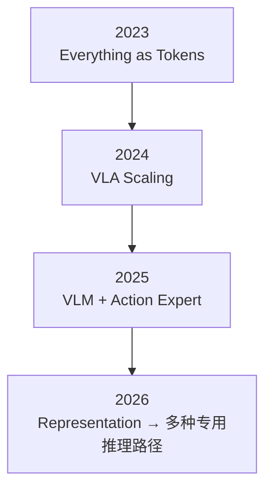
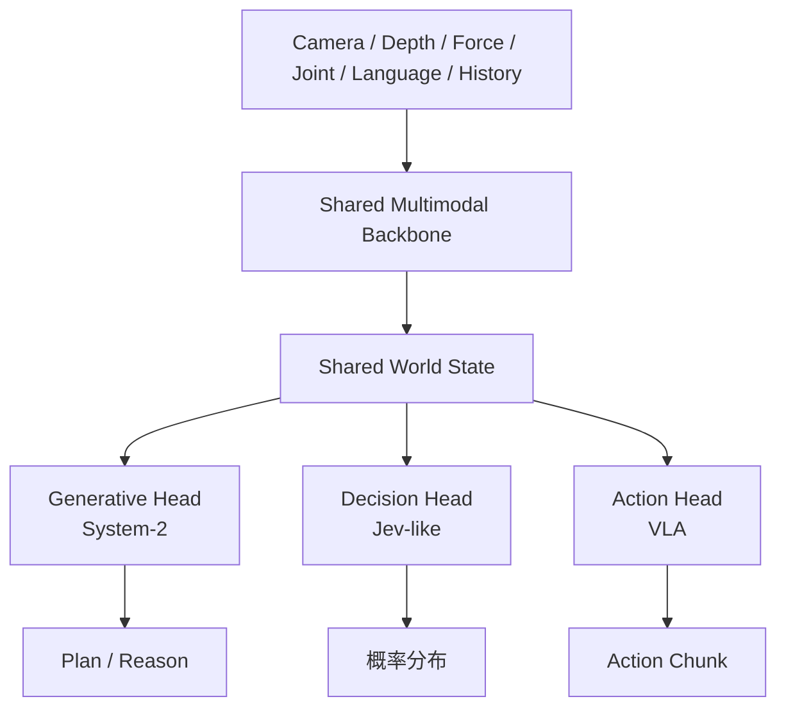
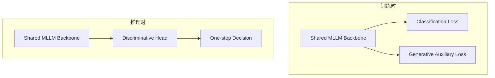
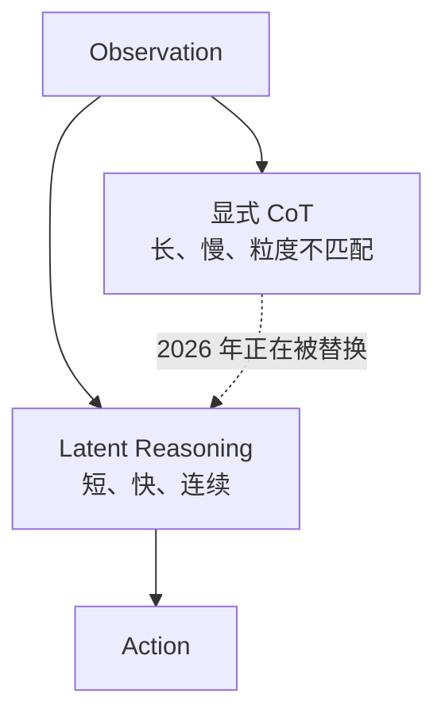
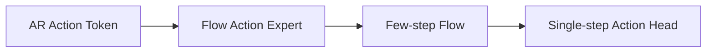
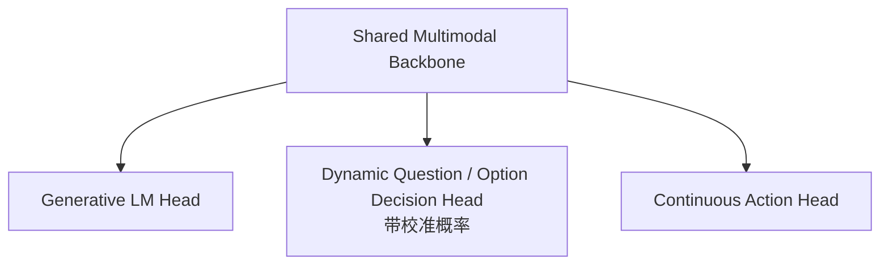

> 这是一份文献梳理。文中 13 篇工作我都核对了一手来源（论文、会议页、项目页、代码仓库）；属于我自己的判断部分，我会写成判断，不混进论文结论里。

## 先说结论

2026 年 VLA 领域最有意思的变化，已经不是"机器人要不要用大模型"，而是另一个更窄、也更工程的问题：

> **一个多模态 Backbone 在形成足够强的世界表征之后，输出阶段还需要经过昂贵的生成过程吗？**

这个问题在 2026 年被三篇不同方向的工作从三个角度分别问了一遍——决策、推理、动作：

- **决策**：闭集选择任务，为什么要生成 `"open"` + `" door"` 两个 token，而不是直接从隐状态读出类别？（GAD）
- **推理**：模型需要 reasoning，是否等于必须把 reasoning 逐 token 说出来？（LaRA-VLA、Fast-ThinkAct）
- **动作**：Action Head 已经能用 flow matching 一次出整段动作了，为什么还要迭代 10 步？（IMLE-VLA）

三条线指向同一个直觉：**表征已经形成了，就不该再把它翻译回离散符号，再重新解码一遍。**

但 2026 年同时出现了两个明确的反方向，而且都不是弱论证：

- **G0.5** 主张把 reasoning 和 action 重新统一回**一个自回归流、一套权重、一个目标**；
- **DEM** 干脆质疑：低层 policy 每个控制周期都跑一个几十亿参数的 VLM，这件事本身是不是错的。

所以现在的局面不是"共享 Backbone 赢了"，而是**统一与解耦正在正面对抗，而且双方都有 2026 年的实验证据**。下面按问题推进，而不是按日期。

---

## 问题是怎么变的

把 2023 到 2026 拉成一条线，能看清重心是怎么挪的：



2023–2024 的思路是"什么都变成 token，然后自回归解码"。2025 年 π0 一类工作开始把动作交给一个独立的 action expert，用 diffusion / flow matching 生成——这已经是一次"输出机制分家"。

到 2026 年，分家从"动作"扩展到"决策"和"推理"，于是变成三条并行的输出路径：



这三条路线的频率需求差了两个数量级——这也是它们必须分开的直接原因。下一节开始逐条看 2026 年的证据。

---

## 路线一：Decision 不该当成文本生成

最容易看清的一条线。任务本身就是一个闭集选择——"这段视频里的人在做什么"，候选是 `cut onion / wash dish / open door` 之类。

传统做法是让 MLLM 生成文字：

```text
hidden representation
    ↓
生成 "open"
    ↓
生成 " door"
```

但既然答案是闭集，为什么不直接从隐状态读出来？

**GAD**（ICLR 2026）正是问这个问题的。它给 MLLM 加一个可学习的 `[CLS]` token 做判别式分类头，**训练时**并联一个辅助生成头提供互补上下文做正则，**推理时只跑判别分支**：



论文在最大的 COIN benchmark 上报告了约 **3×** 的推理加速，同时还有约 **2.5%** 的准确率增益。也就是说，判别式路线不只是更快——在闭集任务上它本身也更好。论文把原因归到两点：避开了自回归解码，也避开了标签的子词重叠问题（生成式分类器容易被"open"和"opener"这类共享子词的标签干扰）。

**CARE-X**（MLHC 2026，微软研究院印度）虽然不是机器人论文，但架构证据可能更硬。它在医学影像上做了同一件事：SigLIP2 视觉编码器 + Phi-4-mini-instruct 3.8B 骨架，在共享的语言 backbone 上**并联两个二分类头和一个 bounding-box grounding 头**，与语言建模目标联合训练，另外用任务特定的临床奖励做 RL 对齐。需要说明一下：分类头输出的是**可阈值化的概率分数**（论文按 0.5 / 0.6 的阈值报告），不是某些二手材料里写的"直接输出 P(Yes)/P(No)"。

它的价值在于证明了一件对机器人同样成立的事：**生成式头和结构化判别头可以共用同一个现代 VLM backbone，而且结构化监督会反过来强化共享表征**——不是各训各的。

我在之前那篇写 Jev 的文章里讨论过"别生成文本、直接给概率分布"这件事。放到 2026 年的文献里看，GAD 和 CARE-X 说明它不是一个孤立的工程技巧，而是**闭集决策任务上正在被学术验证的输出机制选择**。

---

## 路线二：Reasoning 不一定非要语言化

第二条线走得更远一点：不是讨论输出格式，而是质疑"推理"这个动作本身必须发生在一个个 token 上。

显式 CoT 的问题是双重的：token 很长、自回归慢；而且**文本推理的粒度和连续控制对不上**——"move toward the cup" 是任务级的，机器人控制却是 t0、t1、t2 连续高频的。

**LaRA-VLA**（ICML 2026）用三阶段课程解决：先用显式文本和视觉 CoT 监督，再逐步用可学习的 latent 替换掉离散的 CoT token，最后用 flow-matching 的 DiT 动作专家把 latent 推理转成连续动作。结果是**推理时不再生成显式 CoT**，论文报告相对显式 CoT 方案延迟最高降低约 **90%**。

**Fast-ThinkAct**（CVPR 2026，NVIDIA）思路一致但多留了一手：把长文本 CoT 蒸馏成 **6 个连续 latent token**（外加 5 个并行 spatial token 预测 waypoint），然后训练一个 verbalizer 把这些 latent 解码回自然语言。这个设计叫 **Verbalizable Latent Planning**——latent 平时是 latent，但需要解释时可以映射回可读的表示。延迟最高减少 **89.3%**。

**Continuous Reasoning for VLA** 关心的是另一个更细的问题：**这个 latent 到底该长什么样，才能被多个下游模块读取？** 它的答案是"shared Gaussian latent interface"，并且用一个自验证目标来训练——EMA teacher 必须能消费 student 的 reasoning 才能预测出目标动作。换句话说，**latent 不是私有隐状态，而是要在不同模型实例之间可共享、可验证**。论文报告在 TX-G2 上比 π0 类基线平均子任务成功率 **+40.4%**，HSR 上 +26.3%。（这篇目前还是预印本，没有会议。）



这三篇合起来说明一句话：**"模型需要 reasoning"不等于"模型必须把 reasoning 逐 token 说出来"。** 前者是能力问题，后者是实现选择——而 2026 年的证据倾向于认为，对高频控制来说这是一个不太好的实现选择。

---

## 路线三：Action 不该过度依赖迭代生成

动作这条线的演化最清楚，可以排成一串：



2023–2024 是自回归动作 token；2025 年 π0 一类工作改成 flow matching 的 action expert；2026 年则开始问：**都已经不用逐 token 生成了，为什么还要迭代 10 步？**

**MindVLA-U1** 是"共享表征、多出口"最直接的一份证据。它用**单一 unified VLM 主干**，在一次前向里同时产出 AR 语言 token（可选）和 flow-matching 的连续动作轨迹，两者读的是同一份共享表征。另外两个设计也值得记：一是**流式架构**——不是攒一批帧再整体编码，而是逐帧进 backbone 加学习式 memory 通道，避免重复的时序计算；二是用 Mixture-of-Transformers 的稠密/稀疏结构承载 fast/slow 两条路径。论文报告在 WOD-E2E 上 8.20 RFS，略高于人类驾驶的 8.13。（预印本，无会议。）

**VLAFlow** 换了个角度，把"共享 Backbone 到底该接受什么训练信号"当成核心问题。它先固定一套 π0-style 架构——共享 VLM backbone 经 **KV-cache sharing** 接 flow-matching action expert——然后只改监督信号，跑四种范式对比。它明确用到了 KV-cache 共享，这一点和"状态只 prefill 一次、多个输出头复用"是同一个工程诉求。（理想汽车 + 北邮 + 港中深。）

**IMLE-VLA**（IROS 2026）是这条线上最新的一个点。它用 conditional IMLE 把 π0.5 的迭代式 flow matching 换成**单步条件生成器**——既保留多模态动作覆盖、避免朴素回归头的模式塌缩，又彻底去掉多步采样。结果是推理频率从 **15 Hz 提到 55 Hz**（约 3.67×），动作吞吐最高提升约 **11×**，同时 LIBERO 40 个任务平均成功率 98.0%。

**EffVLA** 则回答"Action Head 到底需要多复杂"。它固定 SigLIP2 + Qwen2.5 和训练流程，系统性扫描 action head 的架构、规模、初始化、损失和推理步数，并把每个配置和实测的端上延迟配对。最重要的发现之一是：**把语言 backbone 的最后几层 transformer 直接复制过来作为 action head 的初始化，是它测到的最大杠杆，而且不增加推理延迟**。LIBERO-Plus 上相对随机初始化约 +7.1 分（79.8% vs 72.7%）。

这里有个措辞要小心：论文说的是这个结论"在 L1 家族内、所有测试的模块规模上一致成立"，不能外推成"任何 head 都一样"。但方向很清楚：

> **Action Head 的关键也许不是"更复杂"，而是"和 Backbone 在同一个表征空间里"。**

随机初始化的 head 需要先自己搞明白"backbone 的表示到底是什么意思"，而 backbone-aligned 的 head 一上来就在同一空间工作。

顺带说一个容易被忽略的方向：**StarVLA-α**（ECCV 2026）反着来——不是加模块，而是系统性地删。它用一个极简基线（Qwen3-VL-4B 主干 + 一个小的残差 MLP 并行回归连续动作块），去掉机器人预训练和 benchmark 专用工程，验证"2025 年以后 VLA 体系里哪些复杂度是真的必要"。它的 camera-ready 版本直接改名成了 *Less is More*，这个标题本身就说明了结论。它同时提供了一个 Lego-like 的代码库，方便替换 backbone、action head、训练目标和本体——如果要做架构对照实验，这类基础设施比单篇论文更有用。

---

## 路线四：统一和解耦正在正面对抗

前面三条线都在讨论"输出怎么做"，第四条线问的是更底层的问题：**到底该共享多少。**

**统一派**里最强的一篇是 **G0.5**（Galaxea Team）——注意全名是 "Galaxea G0.5"，它的前代 G0 是双系统架构，G0.5 反而是把双系统拆掉的单流模型。它的论证很直接：π0 类架构让 VLM 只是 context encoder，真正的动作决策被 action expert 拿走了。所以 G0.5 反过来——**reasoning 和 action 共用同一个自回归流、同一套权重、同一个目标**：

```text
Vision → Single Transformer Decoder
           ↓
    reasoning token → grounding token → action token → reasoning token → action token → ...
```

**VLAct** 从表征侧支持统一派，但角度不同。它关心的是"backbone 到底有没有学到适合物理动作的表征"，做法是在固定机器人数据预算下做**以表征为中心的继续预训练**：冻结视觉编码器和 LLM 下半层以保住 VLM 先验，让多个连续动作头共享同一隐表征来共同监督，同时用部分统一的跨本体动作布局统一动作语义。

值得注意的一个细节：VLAct 论文自己警告说，**单头预训练出来的表征并不是在 head-agnostic 意义上更 action-aware，反而会把特征几何塌缩到那个头的方向**。这其实是对"共享"这件事的一个很强约束——共享要求的是表征对多个头都可用，而不是对某一个头最优。

**解耦派**目前最有力的证据是 **DEM**（耶鲁 + 北大 + Digients）。它直接质疑主流 VLA 的前提：为什么低层机器人 policy 的每一个控制周期，都必须跑一个几十亿参数的 VLM？它的答案是拆开——微调过的 DINOv3 视觉编码器 + 冻结的 NeoBERT 语言编码器 + 一个单次前向就出整段动作的 MeanFlow 头，三者只在 action head 的 cross-attention 里汇合。

数据上它并不吃亏：RoboCasa 18 个任务上 55.6%，与 GR00T N1.7 的 56.9% 和 π0.5 的 54.6% 在同一水平；吞吐是对方的 **8–17×**，单次推理能耗低 **6–15×**（实测约 2.07 J/次）。

所以现在的局面是：**统一派有架构论证和表征证据，解耦派有吞吐和能耗的硬数字，而且两边在成功率上并没有拉开差距。** 这个问题我认为远没有结束——它取决于你更看重泛化，还是更看重单位算力能跑多少次控制循环。

---

## 三种架构范式

把 13 篇工作压成三种范式，差异就清楚了：

| 范式 | 代表 | 结构 | 优点 | 问题 |
| --- | --- | --- | --- | --- |
| **One Autoregressive Stream** | G0.5 | 单个 Transformer，reasoning token 与 action token 交替 | reasoning/action 原生统一；预训练 VLM 权重直接参与动作；prompt 能直接影响动作生成 | 自回归延迟；动作 token 化；高频控制能力受限；reasoning 与 action 互相阻塞 |
| **Shared Backbone + Specialized Heads** | MindVLA-U1、CARE-X、VLAFlow、EffVLA、VLAct | 共享 backbone，分多个输出头 | 每个任务用最合适的输出机制；决策可单步；动作可连续；LM 保留开放世界能力 | 多任务干扰；head 与 backbone 对齐困难；"共享表征"是否真的统一；调度更复杂 |
| **Decoupled Fast Runtime** | DEM | 专用视觉/语言编码器 + 轻量动作头 | 高速；低能耗；模块易单独优化 | 是否损失开放世界的语义迁移；长尾和新任务怎么办；是否需要另配一个慢速 agent |

---

## 13 篇论文对照表

| 工作 | 时间 | Backbone 思路 | Reasoning | Decision | Action | 关键点 |
| --- | --- | --- | --- | --- | --- | --- |
| LaRA-VLA | 2026-02 | Unified VLA | Latent | — | Action | 推理时不再生成显式 CoT，延迟降约 90%（ICML 2026） |
| GAD | 2026-03 | MLLM Shared | 生成式辅助 | 判别式头 | — | 闭集动作理解不应靠文本生成；COIN 上约 3× 加速（ICLR 2026） |
| StarVLA-α | 2026-04 | Modular VLA | — | — | VLA | 极简基线：Qwen3-VL-4B + 残差 MLP，去掉多余复杂度（ECCV 2026，camera-ready 改名 Less is More） |
| MindVLA-U1 | 2026-05 | Shared VLM | AR Language | — | Flow Trajectory | 一次前向同时出语言 token 与动作轨迹；流式架构（预印本） |
| Continuous Reasoning | 2026-05 | VLA | Gaussian latent | — | Chunk | 共享且可验证的 latent interface（预印本） |
| Fast-ThinkAct | CVPR 2026 | VLA | Latent Planning | — | Action | 6 个 latent token 替代长 CoT，可 verbalize；延迟减 89.3% |
| VLAFlow | 2026-07 | Shared VLM | Language co-train | — | Flow Expert | 固定 π0-style，只改训练信号做控制变量；显式 KV-cache 共享 |
| G0.5 | 2026-08 | One Transformer | AR | 隐式 | AR action tokens | 单流、单权重、单目标（Galaxea） |
| CARE-X | MLHC 2026 | Shared VLM | AR generation | 分类头 + grounding 头 | — | 生成头与结构化头共用 backbone，且结构化监督反哺表征 |
| VLAct | 2026-08 | Action-aware VLM | semantic | — | 多头共享表征 | 以表征为中心的继续预训练 |
| IMLE-VLA | 2026-09 | VLM + Head | — | — | Single-step | 砍掉迭代采样；15 Hz → 55 Hz（IROS 2026） |
| EffVLA | 2026-09 | Shared VLA | — | — | Aligned Action Head | 复制 backbone 末层做 head 初始化 = 最大杠杆且零延迟代价 |
| DEM | 2026-09 | Decoupled | — | — | MeanFlow | 反方：不必大一统；吞吐 8–17×、能耗 1/6–1/15 |

---

## 目前还缺什么

把 2026 年这些工作摊开看，我注意到一个**还没被填上的位置**。

到今天为止，我没有找到一个有代表性的机器人工作，同时完整做到了这四件事：



而且要同时支持：共享 prefix / KV、并行决策问题、动态决策 schema、fast/slow 运行时、动作打断、置信度升级。

每一项单看都不新：共享 backbone 有 VLAFlow 和 MindVLA-U1；生成头与结构化头共存有 CARE-X；连续动作头有 IMLE-VLA 和 EffVLA。**缺的是把它们装进同一个运行时，并且让"决策"这一路真正支持动态选项而不是固定类别。**

固定类别和动态选项的差别，比看起来大：

```text
固定分类器：
  [approach, align, contact, rotate, retreat]  ← 训练时就定死了

动态选项：
  Question: 当前处于哪个阶段？
  Options:  （运行时给出的文本选项）
  → [0.03, 0.78, 0.11, 0.05, 0.03]
```

前者是一个分类器，后者才更接近"用共享状态回答任意结构化问题"。这个差别也决定了它能不能和语言侧共享同一个 backbone——固定类别不需要语言理解，动态选项需要。

---

## 最后留下的结论

把 2026 年这条线串起来看，我的判断是：

**第一，研究重心确实挪了。** 从"VLA 能不能工作"挪到了"表征形成之后，用什么机制把它读出来"。三条路线——决策走判别式、推理走 latent、动作走单步——方向一致，而且各自都有 2026 年的实验证据，不是孤例。

**第二，但"共享"这件事还没有定论。** 统一派和解耦派在成功率上并没有拉开差距，解耦派在吞吐和能耗上有明显优势。我倾向于认为答案不是二选一：**慢速的语义 backbone 低频更新、快速的头高频读取缓存状态**，可能比"要么全共享、要么全拆开"更接近实际——但这只是我的判断，目前还没有一篇论文把这条中间路线完整做出来并给出对照实验。

**第三，注意"共享"的前提条件。** VLAct 那条警告值得记住：单头预训练会把特征几何塌缩到那个头的方向。所以"共享表征"不是把 backbone 打开给多个头用就行，而是要保证表征对多个头都可用。EffVLA 的发现也可以从这个角度理解——复制末层做初始化之所以有效，本质上是让 head 一开始就待在同一表征空间里。

**局限**：这篇梳理只覆盖了 2026 年能核验到的一批工作，而且其中 MindVLA-U1、Continuous Reasoning 等仍是预印本；不同论文的延迟和吞吐数字来自不同硬件平台，**跨论文的倍数不能直接比较**。我引用的数字都来自论文自己的报告，没有独立复现。

---

## 附：本文涉及的工作

**决策：判别式 vs 生成式**
- GAD: On Discriminative vs. Generative classifiers: Rethinking MLLMs for Action Understanding — ICLR 2026 — https://arxiv.org/abs/2603.02546 ｜ https://github.com/pangzhan27/GAD
- CARE-X: Towards Clinically Useful Radiology VLMs with Auxiliary Supervision, Reward-Aligned Learning, and Tool-Augmented Measurement — MLHC 2026, PMLR 340:1537–1580 — https://proceedings.mlr.press/v340/porya26a.html

**推理：从显式 CoT 到 latent**
- LaRA-VLA: Latent Reasoning VLA — ICML 2026 — https://arxiv.org/abs/2602.01166
- Fast-ThinkAct: Efficient Vision-Language-Action Reasoning via Verbalizable Latent Planning — CVPR 2026, pp. 5070–5081 — https://openaccess.thecvf.com/content/CVPR2026/html/Huang_Fast-ThinkAct_Efficient_Vision-Language-Action_Reasoning_via_Verbalizable_Latent_Planning_CVPR_2026_paper.html
- Continuous Reasoning for Vision-Language-Action — https://arxiv.org/abs/2606.00229

**共享 Backbone 与表征**
- MindVLA-U1: VLA Beats VA with Unified Streaming Architecture for Autonomous Driving — https://arxiv.org/abs/2605.12624
- VLAFlow: A Unified Training Framework for VLA Models via Co-training and Future Latent Alignment — https://arxiv.org/abs/2607.01586 ｜ https://github.com/MindVLA-Team/VLAFlow
- VLAct: Beyond Data Scaling: Representation-Centric Continued Pre-training for VLA Models — https://arxiv.org/abs/2608.27550 ｜ https://starvla.github.io/VLAct/
- StarVLA-α: Reducing Complexity in Vision-Language-Action Systems — ECCV 2026 — https://arxiv.org/abs/2604.11757
- StarVLA: A Lego-like Codebase for Vision-Language-Action Model Developing — https://arxiv.org/abs/2604.05014 ｜ https://github.com/starVLA/starVLA

**动作头效率**
- IMLE-VLA: Fast Single-Step Action Generation for Vision-Language-Action Policies — IROS 2026 — https://arxiv.org/abs/2609.10915
- EffVLA: What Makes an Efficient VLA? Navigating Action-Head Design, Scaling, and Latency — https://arxiv.org/abs/2609.13984

**反方向与新范式**
- G0.5: One Autoregressive Stream for Robot Reasoning and Action — https://arxiv.org/abs/2608.11739
- DEM: Decoupling Vision, Language, and Action for Efficient Multi-Task Robot Policies — https://arxiv.org/abs/2609.18374

> 本文涉及的 13 篇工作均已核对一手来源（arXiv 摘要页与全文、会议官方页面、项目页、代码仓库）。其中 MindVLA-U1、Continuous Reasoning、EffVLA、IMLE-VLA 等在本文写作时或为预印本、或未声称会议，已在文中标注。所有延迟、吞吐、成功率数字均来自论文自报，未做独立复现；不同论文的测量平台不同，跨论文比较数值需谨慎。
