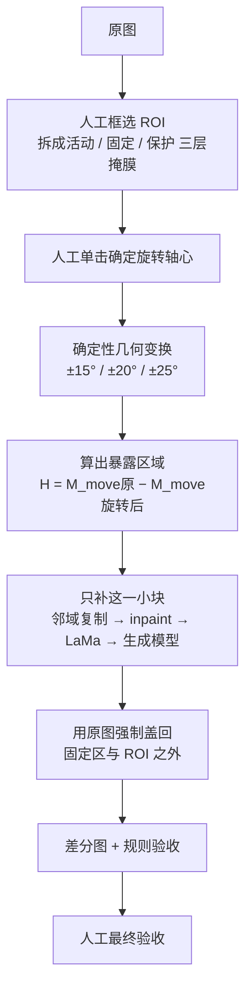

> 这是一次工具调研的整理。文中的环境判断、显存估计和单图耗时，凡是没有实机跑过的我都标成评估；哪些是实测、哪些是查资料得出的，我会分开写。

## 先说结论

做工业巡检的缺陷图时，我一开始的想法很直接：图生图模型既然能改风格、换背景、修人像，那把一颗拧紧的螺栓改成松开的状态，应该也不难。

试下来不行。**问题不在于模型不够强，而在于我把任务的性质搞错了。**

一颗松动的螺栓，本质不是一个"看起来该有的样子"，而是一次**刚体绕轴旋转**：只有中间的活动螺母绕螺栓轴心转过一个角度，上下两段红色防松线保持原位，于是出现两个错位断点。这是一条精确的几何关系。

通用图像编辑模型擅长的是**像素层面的合理性**——它能让画面看起来自然，但它不保证一个刚体只转不平移，也不保证螺栓根部跟着不动。

所以最后收敛到的方案是一句分工：

> **由确定性几何编辑制造机械缺陷结构，生成式 AI 只负责补洞、接缝和纹理修复。**

生成模型不决定结构。它只填几何变换之后留下的那个洞。

---

## 模型具体错在哪

把失败的样本摊开看，错误集中在几类上，而且很有规律：

- **把旋转做成了平移。** 螺母在画面里挪了位置，但自身朝向没变。
- **只改了线，没改结构。** 中间那段红线角度变了，螺母本身却没跟着转——线和螺母脱钩了。
- **三段线仍然平行。** 上下两段没动是对的，但中间段只是整体平移，没有体现出绕轴。
- **一个整体一起转。** 螺母、螺栓根部、固定座同时动了，而实际上只有螺母该动。
- **只有一个断点。** 上下各有一个固定段，所以旋转后应该出现**两个**错位断点，不是一条线错开一次。
- **角度太小看不出来。** 小于 10° 的改动在缩略图上几乎不可见，验收时无法确认这是一处缺陷。
- **改了不该改的地方。** 相邻螺栓、文字标识、光照色温一起变了。
- **视觉自然但机械错误。** 这是最麻烦的一类：单看图片挑不出毛病，但它描述的是一个物理上不可能发生的状态。

最后一条是关键。**图像编辑模型的优化目标是"看起来对"，而这里要的是"物理上成立"。** 这两个目标在简单场景下重合，在机械结构上分道扬镳。

---

## 三类缺陷，三种难度

### 螺栓松动：核心是绕轴，不是变样

正常状态下，工人在螺栓拧紧后画一条红色防松线，这条线通常跨越三段：

```text
上段：上方固定结构
中段：中间的活动螺母
下段：下方固定结构
```

拧紧时三段在视觉上接近连续。松动之后，**只有中间那一段会随螺母做刚性旋转**，上下两段纹丝不动，于是接缝处裂成两个错位断点。期望的视觉关系大致是这样：

```text
原始：  ————————
松动：  ——  ／  ——
```

注意中间那段是**倾斜**的，不是整体平移。这一点是区分"真旋转"和"假旋转"的分水岭。

围绕这个定义，验收时可以逐条卡：

| 检查项 | 通过条件 |
| --- | --- |
| 活动部件 | 只有中间活动螺母旋转 |
| 固定结构 | 上下固定结构完全不动 |
| 中间红线 | 与活动螺母同步旋转 |
| 上下红线 | 位置和方向不变 |
| 断点 | 出现两个清晰错位断点 |
| 运动逻辑 | 体现绕轴旋转，不是平行平移 |
| 角度 | 至少 10°，优先验证 15° / 20° / 25° |
| ROI 之外 | 像素差异为 0 |

### 螺栓缺失：本质是"移除 + 恢复背景"

这一类和上面那种是两种性质的任务。它不是"把螺栓涂掉"，而是**恢复被螺栓遮挡住的真实背景**——原来安装孔或螺纹孔在哪、螺栓压紧留下的接触印是什么形状、孔周围有没有锈迹和灰尘、光线从哪来。

所以它天然适合"精确遮罩 + 局部修复模型"：任务本质是目标移除，不是结构编辑。这类任务上，inpaint 类模型是有用的，因为要恢复的确实是纹理。

主要风险也很明确：把安装孔完全填平、凭空生成一颗新螺栓、破坏相邻的红线、把背景修得过于干净（工业现场没那么干净）、或者改变原图的光照色温。

### 方孔锁未锁紧：同一类问题的另一个形态

活动锁舌或旋钮没有停在完全锁止的位置，需要绕真实机械轴心旋转或打开，同时固定底座保持不动。如果因为旋转导致遮挡关系变化，还要补回原本被遮挡的背景。

判断口径和螺栓松动一致：**结构平的时候优先用几何变换，只有在遮挡关系复杂、确实需要猜背景时才动用生成模型。**

---

## 工具对比

把候选方案按这个任务的验收条件打散评分。分数只针对"金属结构 + 少量像素宽的红线"这种画质，不代表通用图像编辑能力排名。

| 方案 | ROI 外保持 | 轴心/角度控制 | 两断点物理正确性 | 补洞融合 | 显存友好 | 批处理 |
| --- | ---: | ---: | ---: | ---: | ---: | ---: |
| 自制几何编辑器 | **5** | **5** | **5** | 3 | **5** | **5** |
| Krita / GIMP 传统编辑 | **5** | **5** | **5** | 4 | **5** | 1–2 |
| Photoshop 传统工具 | **5** | **5** | **5** | **5** | **5** | 3 |
| LaMa 局部修复 | **5** | 1 | 1 | 4 | **5** | **5** |
| Krita AI Diffusion | 3 | 1 | 2 | **5** | 3 | 2 |
| GPT Image Playground | 2 | 1 | 1 | 4 | — | 2 |
| FLUX.2 [klein] 4B | 3 | 2 | 2 | 4 | 2 | 3 |
| Qwen-Image-2.1 | 3 | 2 | 2 | **5** | 1 | 3 |

两处说明：LaMa 那一格的 5 是**有前提的**——只把它修复出来的局部回贴原图，而不是直接采用整张模型输出；GPT Image Playground 不占本地推理显存，但图片要发到你配置的 API 服务，隐私取决于服务方策略。

看完这张表其实结论已经很明显：**"轴心/角度控制"和"两断点物理正确性"这两列，只有确定性编辑工具拿得到高分。** 这两项恰好是这类缺陷的定义所在。

### 几个选型时必须自己核一遍的点

这些是我在查资料时发现的坑，都不在"模型效果好不好"的层面：

**许可证不是一个整体。** LaMa 的**代码**是 Apache-2.0，很明确；但**模型权重上游没有任何许可声明**——README 里找不到。网上流传的那个 apache-2.0 标签来自第三方上传的镜像仓库，属于上传者自行声明，不等于原作者授权。这类"代码开源、权重没说法"的情况在图像模型里很常见，**商用前必须单独确认权重**。

**官方数字可能自相矛盾。** FLUX.2 [klein] 4B 的官方资料里，GitHub README 写"约 8GB 显存可跑"，而 Hugging Face 模型卡和官方文档都写"约 13GB"。同一个厂商两套口径，差了 5GB。流传的 8.4GB 那个数字其实来自 ComfyUI 的文档，不是模型方。**按最大的那个口径做容量规划**，别按最乐观的承诺交付。

**有些模型根本不公布显存要求。** Qwen-Image-2.1 的官方仓库和模型卡里没有任何显存数字，只建议开 CPU offload。能查到的是第三方推理框架的实测峰值（几十 GB 量级）。**"没公布"不等于"低"**。

**刚发布的项目别急着进核心流程。** Qwen-Image-2.1 发布到现在只有几天，公开验证时间太短。

**归档项目不要做长期依赖。** IOPaint 的原仓库已经在 2025 年 8 月 13 日归档、转为只读。它有社区维护的分支，但那个分支目前只有两位数 star、只有预发布版本、还没发布到包索引——**可以观察，不适合现在就装进生产链路**。

**许可类型决定用途。** Qwen-Image-2.1 用的是 Qwen Research License，条款里明确写了仅限非商业用途，商用需要单独授权。FLUX.2 的小参数版本是 Apache-2.0（可商用），但同系列更大的版本走的是非商业许可——**同一个系列里，不同尺寸的许可证可能不一样**。

**依赖网络和额度的功能不适合做关键路径。** Photoshop 的生成式功能需要联网、Adobe 账号和生成额度，额度还不跨月结转。它的传统工具（变换旋转、Clone、Heal、Content-Aware Fill）本身已经够做机械结构编辑，不需要挂在生成式服务上。

**Krita 那个 AI 插件要区分后端。** 它有在线服务、本地托管服务和自建 ComfyUI 三种接法。"需要自备模型权重"只对自建那种成立；本地托管模式会自动下载推荐模型。具体选哪种，决定了你要不要自己管权重和许可证。

---

## 把工作拆成六步

确定"几何做结构、AI 补洞"这个分工之后，整条链路是这样：



具体每一步都有个容易偷懒的地方。

### 一、分层掩膜，不是一个大 ROI

不要只画一个"这里要改"的蒙版，要分成四层：

- `M_move`：活动螺母、它的可见侧面、中间那段红线；
- `M_fixed_top`：上方固定结构 + 上段红线；
- `M_fixed_bottom`：下方根部、固定座 + 下段红线；
- `M_protect`：相邻螺栓、文字标识、任何绝不允许改动的区域。

**只有 `M_move` 允许旋转。**

拆成四层的意义在于：后面所有"确保这块不动"的操作，都变成了对具体蒙版做**像素级强制覆盖**，而不是指望模型听话。

### 二、轴心必须人工点一次

这是整个流程里最不该省的一步。

**不能用掩膜包围框的中心代替轴心。** 真实的轴心要从这些线索里判断：螺母的外轮廓、螺栓杆的方向、可见的螺纹或中心孔、上下固定结构的相对位置、以及透视关系。

每张原图人工单击一次。分割模型最多用来出个初始掩膜，**不能替代轴心判断**——轴心错了，角度再准也是错的。

### 三、一次给六个角度候选

同一颗螺母，顺时针 15° / 20° / 25°，逆时针 15° / 20° / 25°，一次生成六张并排看。

这比只做一个角度稳：既避免"角度太小肉眼看不出来"，也方便从六个里挑物理上最合理的那一个。角度是离散候选而不是连续调参，批量生产时也更容易一致。

### 四、只补被旋转暴露出来的那一小块

旋转之后的待修复区域，可以近似算成一次集合差：

```text
H_exposed = M_move_original − M_move_rotated
```

只修 `H_exposed` 和它外面一点点缓冲区，其余一律不碰。补洞方法按"**由确定到生成**"排序：

1. Clone / 邻域复制；
2. OpenCV `inpaint`；
3. Smart Patch / Heal 一类修复笔刷；
4. 前面都不行，才上 LaMa 或局部生成模型。

**顺序不能倒。** 生成模型是最后一层兜底，不是第一选择。绝大多数暴露区其实只是窄窄一条接缝，邻域复制就够了。

### 五、用原图强制盖回固定区

最终合成用这个式子：

```text
final = 原图的 ROI 之外  +  验收通过的 ROI 之内
```

然后用**原图**覆盖掉 `M_fixed_top`、`M_fixed_bottom` 和 `M_protect`。

这一步看着笨，但它解决了一个根本问题：**模型是否遵守提示词是不确定的，而像素覆盖是确定的。** 与其在提示词里反复写"不要修改其他区域"，不如先用生成模型拿到一块合格局部，再把它贴回原图——AI 改了什么根本不重要，因为我只取我允许的那一块。

---

## 自动验收可以卡哪些规则

做到批量之后，人工逐张看会变成瓶颈。有几条规则是可以自动检查的，而且都不依赖主观判断：

| 规则 | 判定 |
| --- | --- |
| 输出尺寸 | 与原图完全一致 |
| ROI 之外 | 差异像素比例为 0 |
| 固定区域 | 差异像素比例为 0 |
| 旋转角误差 | 目标不超过 2° |
| 螺栓松动 | 存在两个错位断点 |
| 红线 | 中间段与活动螺母同步旋转 |
| 相邻结构 | 文字、标识、相邻螺栓逐像素不变 |
| 多余部件 | 没有新增 |
| 接缝质量 | 无明显空洞、锯齿或重复纹理 |

前两条和最后两条最有用：**"ROI 之外像素差异为 0"这一条能挡掉绝大多数越界问题**，而它只需要两张图做差分，不需要人来判断。

---

## 边界：哪些是实测，哪些是评估

这部分我想单独说清楚，因为调研报告里最容易出问题的地方就是把"查资料得出的判断"写成"实测结论"。

**实机核验过的**：本机的 GPU 与显存、PyTorch 与 CUDA 环境、Pillow 与 NumPy 可用、OpenCV 与 Gradio 未安装、待处理图片的实际困难程度（目标小、区域昏暗、对比度低、金属反光、红线只有少量像素宽）。

**只根据官方资料评估、尚未实机测试的**：几款传统图像软件的批次工作流、Krita 的 AI 插件、LaMa、FLUX 与 Qwen 的两个图像编辑模型。

所以报告里的**单图处理时间和部分显存需求属于规划估算，不是本机实测结果**。这类数字在正式采用前都应该自己跑一遍——尤其是显存，官方给出的口径本身就可能有两套。

还有一条不是技术问题的边界：**私有工业图片不能随意上传外部服务。** 这一点必须在选型阶段就确认好，而不是等流程跑通之后才想起来。

---

## 最后留下的结论

**第一，先分清任务性质，再选工具。** 螺栓缺失是"移除 + 恢复背景"，属于纹理问题，inpaint 类模型能帮上忙；螺栓松动是"刚体绕轴旋转"，属于几何问题，生成模型帮不上忙。把这两类混在一起选工具，一定会选错。

**第二，对机械结构，确定性方法比生成模型可靠得多。** 轴心、方向、角度、两个断点的位置——这些都是可以精确指定、也可以精确验证的量。既然能精确指定，就没有理由让一个概率模型去猜。

**第三，AI 的位置在流程末端，而且职责很窄。** 它只在几何变换已经产生正确结构之后，去补那块被暴露出来的窄小区域。这个位置上它是好用的；往上游走一步就开始出错。

**第四，验收要靠像素差，不要靠肉眼。** "ROI 之外差异为 0"这种规则既能自动跑，又比人眼可靠——因为它检验的正好是这类任务最核心的约束：**只改该改的那一个点位。**

**这篇文章的局限**：文中对非实测工具的判断来自官方文档，实际效果和资源占用需要自己验证；三类缺陷的验收标准是针对"金属结构 + 少数像素宽的红线"这种具体画质定的，换到其他工业场景需要重新定阈值。
