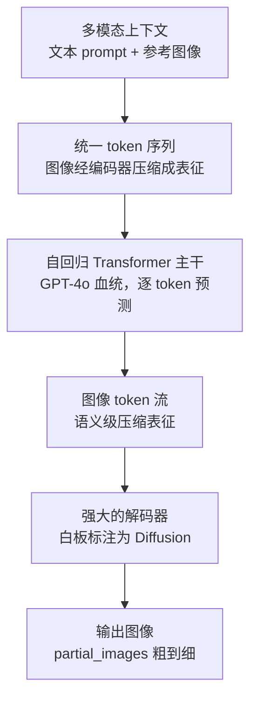

> OpenAI 没有为 GPT Image 发过论文，网络结构、参数量、训练细节一概未公开。这篇梳理把公开证据拼成一张架构图，证据分三级：**官方确认**（有原文出处）、**强证据推断**（官方线索 + 团队背景 + 行为证据）、**社区推测**（仅第三方分析）。哪些是事实、哪些是拼图，我在行文中分开写。引用的官方表述我都逐字核对过原文，论文都核对过 arXiv 页面。

## 先说结论

GPT Image 系列不是 DALL·E 3 那种「独立扩散模型加 prompt 扩写」的结构，也不是 Chameleon 那种纯离散 token 自回归，而是官方白板里那句：**compose autoregressive prior with a powerful decoder——自回归先验，配上一个强大的解码器**。自回归主干负责语义、布局、知识和指令，解码器负责把压缩表征还原成高保真像素。

得出这个判断不需要任何内部爆料。官方博文里的一张白板、系统卡的两句话、API 的定价公式，三条独立的线都指向同一个形状。

拼出架构也不是为了考据。它的招牌能力——长文字渲染、多轮编辑一致性——和它的两个标志性短板——延迟高、逐像素控制弱——都是这条架构路线的直接推论。看懂了结构，用的时候就知道哪些需求该交给它，哪些不该。

## 证据都在哪

### 最硬的一块证据，是一张白板

4o image generation 发布博文（2025 年 3 月 25 日）的第一张展示图，是一张「白板照片」：一位穿着 OpenAI T 恤的人站在玻璃白板前写字，窗外是海湾大桥。有个容易被忽略的细节：这张图本身就是模型生成的——官方用它演示自己的文字渲染能力。但白板上的内容是官方自己写进去的，等于借模型的嘴，念了一遍自己的架构笔记。白板文字被官方逐字写进了图片描述，转录下来是：

> Transfer between Modalities: Suppose we directly model p(text, pixels, sound) with one big autoregressive transformer.
>
> Pros: image generation augmented with vast world knowledge; next-level text rendering; native in-context learning; unified post-training stack.
>
> Cons: varying bit-rate across modalities; compute not adaptive.
>
> Fixes: model compressed representations; compose autoregressive prior with a powerful decoder.

白板右下角还画着一行流程：**tokens → [transformer] → [diffusion] → pixels**。

这段话是完整的取舍论证。如果让一个巨大的自回归 Transformer 直接建模 p(text, pixels, sound)，能拿到四个好处：图像生成被世界知识增强、顶级的文字渲染、原生上下文学习、统一的训练后流程。代价也有两个：各模态的「比特率」差异巨大（一张图的信息量约等于几千个文本 token），逐像素自回归既浪费算力也不自适应。解法两条：对**压缩表征**建模，而不是原始像素；用**自回归先验搭配一个强大的解码器**。解码器在图里被标注为 diffusion。

### 系统卡的两句话

第一句来自 GPT-4o 系统卡附录（2025 年 3 月 25 日）：4o image generation "**is embedded natively, deep in the architecture of our omnimodal GPT-4o model**"，并且 "can take images as inputs and transform them"。

第二句更早，来自 GPT-4o 系统卡（2024 年 8 月 8 日）开篇：GPT-4o "is **an autoregressive omni model**, which accepts as input any combination of text, audio, image, and video"。

两句拼起来：图像生成不是一个外挂的画图模块，而是主模型统一序列建模能力的一部分。这与 DALL·E 1–3 时代「独立文生图模型 + prompt 扩写拼接」的结构是根本不同的两代东西。

### 定价公式与流式行为

还有两条 API 层面的可观察证据，和白板互相印证。

其一，**图像按 token 计费**。gpt-image-1 的定价：文本输入 $5/M tokens、图像输入 $10/M tokens、图像输出 $40/M tokens；官方换算 1024×1024 图像 low/medium/high 三档平均每张约 $0.02、$0.07、$0.19。质量档位本质上是「允许模型花多少图像输出 token」的预算。「图像质量 = token 预算」这种特性，只有把图像当离散 token 序列来生成时才会自然出现——扩散模型 API 从来不这么计费。

其二，**流式输出是粗到细的渐进帧**。API 的 `partial_images` 参数（0–3 张）返回同一张图从模糊轮廓到逐步锐化的中间帧。这和自回归逐 token 解码的「逐步显影」一致，而扩散模型常见的交互形态是整张图从噪声里一次性去噪。

### 名单也和架构对得上

发布博文列出的 Image Generation 团队由 Gabriel Goh 负责——他同时也是 DALL·E 1 论文（Zero-Shot Text-to-Image Generation，arXiv:2102.12092）的作者之一。名单里还有 score-based 扩散理论代表人物 Yang Song（Score-Based Generative Modeling through SDEs 一作，arXiv:2011.13456）、DALL·E 系列老班底（Aditya Ramesh、Alex Nichol、Casey Chu、Cheng Lu），以及 Jianfeng Wang、Charlie Nash、Li Jing 等多模态与图像生成方向的研究者。名单构成与白板提示高度自洽——AR 主干、图像压缩表征、扩散解码器，每个环节都有对应背景的人。这一条属于**强证据推断**，不是官方声明。

## 拼出来的架构

把四组证据叠在一起，社区目前共识性的重建是这样的：

每个环节的证据强度并不一样，这一点比架构本身更重要——它决定了哪些说法能写进文章，哪些只能留在猜测里：

| 环节 | 状态 | 依据 |
| --- | --- | --- |
| 统一自回归主干（文本、图像同一序列） | 官方确认 | 系统卡 "autoregressive omni model" + 附录 "embedded natively" |
| 图像先压缩成 token 表征 | 官方确认 | 白板 "model compressed representations"，计费与流式行为佐证 |
| 存在独立的强解码器 | 官方确认 | 白板 "compose autoregressive prior with a powerful decoder" |
| 解码器是扩散模型 | 强证据推断 | 白板流程图标注 Diffusion + Yang Song 的背景 + 粗到细流式 |
| 图像 token 是离散 VQ 还是连续表征加扩散头 | 未知 | 两种都有先例，白板信息量不足以裁决 |
| 与 GPT-4o 主干共享权重、同一套训练后流程 | 官方确认方向 | "unified post-training stack"，共享程度未披露 |
| 参数量、训练算力、数据明细 | 未公开 | 系统卡只给出数据类别 |

### 为什么是这种混合架构

把三条技术路线摆在一起看，白板上的取舍就更清楚了：

| 路线 | 代表 | 强项 | 短板 |
| --- | --- | --- | --- |
| 纯扩散 | DALL·E 3、SD、FLUX | 图像质量好，算力友好 | 文字渲染弱、指令遵循弱，世界知识要靠 prompt 扩写从外部拼接 |
| 纯离散自回归 | Chameleon、Emu3 | 天然统一、支持交错多模态与上下文学习 | 保真度受 tokenizer 上限压制，大分辨率下序列长、速度慢 |
| 自回归先验 + 扩散解码 | GPT Image | AR 主干只在语义级压缩表征上规划，序列短、装得下世界知识与指令 | 延迟高、逐像素精确控制弱 |

一句话概括：**AR 负责「想清楚画什么」，解码器负责「画得像」。**

这个归类不只有社区认同。MMMG 评测（arXiv:2505.17613）在横向对比 24 个多模态生成模型时，把 GPT Image 归入 modality-unified autoregressive models（ARMs），结论是 "modality-unified autoregressive models (ARMs) surpass diffusion models in image generation, with GPT Image achieving the best accuracy of 78.3%"。78.3% 是 MMMG 自己的评测口径，跨基准的分数不能直接换算，但「第三方研究把 GPT Image 当作 modality-unified ARM 来对待」这个归类本身，与官方定位是一致的。

它的公开谱系也说得通：Transfusion（arXiv:2408.11039）在单个 Transformer 里混训「文本自回归 + 图像扩散」；Chameleon（arXiv:2405.09818）和 Emu3（arXiv:2409.18869）证明了纯离散 token 统一建模可行；VAR（arXiv:2404.02905）用尺度递进做了另一种「粗到细」的自回归。GPT Image 与它们的具体异同官方没有披露，但「统一序列建模 + 强解码器」这条线，在 2024 年的公开研究里已经全部出现过了。GPT Image 像是把这几块拼图合在了一个产品级的系统里。

## 架构解释了它的能力和代价

这条架构线走到今天，版本演进的关键节点是：2025 年 3 月 4o 图像生成上线（首周超过 1.3 亿用户生成 7 亿张图，官方 API 博文原话），4 月开放 gpt-image-1 API；2025 年 12 月 1.5 提速约 4 倍、API 便宜约 20%，并修复了前代被评测指出的暖色偏置；2026 年 4 月 GPT Image 2 引入 thinking capabilities；2026 年 9 月 8 日的 2.5 分成两个变体——**Flare 是官方定位的「大多数应用的默认选择」，速度优先，延迟比 2.0 降低最多 50%**；**Sunburst 面向对编辑控制要求更紧的高端工作流，质量更高，生成也更慢**。

有了「AR 想清楚、解码器画出来」这个框架，它的能力和短板都不再是散落的特性，而是同一条因果链：

**文字渲染极强**，因为文字对自回归模型就是 token，它「画」字的方式和「写」字完全同构。这是白板 Pros 里的 next-level text rendering，也是 TechCrunch 评价 2.0「出乎意料地擅长生成文字」的原因。短板同样在架构里：官方在 1.5 公告里仍承认中文、阿拉伯语、希伯来文渲染与多人脸场景是弱点——这些恰好是 token 序列里最难规划的部分。

**世界知识注入**，因为 AR 主干在图文联合分布上预训练。官方原话：模型 "trained on the joint distribution of online images and text, learning not just how images relate to language, but how they relate to each other"。「按真实钢琴键排布画一架钢琴」这类知识敏感生成，来自这里。

**多轮编辑天然成立**，因为上下文里既有之前生成的图 token、也有文字指令，迭代改图就是继续往序列里追加条件。

**代价**也在架构里：逐 token 自回归天生比一次性去噪慢——4o 时代单张最长可达一分钟（官方博文原话 "often up to one minute"），后面每个版本都在往解码速度上堆优化；而「整图由解码器重新渲染」直接决定了它做不到逐像素精确控制，这一点下一节展开。

还有一条从架构里长出来的代价，官方自己在 2.5 系统卡里写了：**写实度提高本身加剧深度伪造风险**。原文的措辞是，相比 2.0，2.5 带来的写实度提升「could, absent safeguards, allow more convincing deepfakes」。溯源体系也跟着升级：输出带 C2PA 内容凭证（OpenAI 已加入 C2PA Conformance Program），并叠加 Google DeepMind 的 SynthID 隐形水印——覆盖 ChatGPT、Codex 和 API。官方同时承认「没有单一方案能解决溯源问题」。能力与风险同步上升，这条曲线在可预见的版本里还会继续。

2026 年 4 月 GPT Image 2 加入的 thinking capabilities 是这条线上最不透明的一环：官方确认「生成前有推理」，但推的是什么、在哪一层推，没有披露。第三方分析普遍按「渲染前先研究、规划、推理图像结构」理解（kingy.ai 引 VentureBeat 的说法），这属于社区推测，我的文章也只能写到这里。

## 为什么改图做不到像素级保真

这是我最关心的一部分——上一篇文章《生成模型画不对一颗松动的螺栓》里，我处理的正是工业缺陷图的数据清洗场景，当时踩过的坑现在能在架构层面解释了。

传统扩散模型的图生图是「把输入图加噪到某个强度，再从那里开始去噪」，控制力与保真度是滑动条上的折中。GPT Image 的改图走的是另一条路：**参考图先被编码成 token，和文字 prompt 一起进入同一个自回归序列**，模型在「读过」参考图的条件下去规划新图的 token。

这个机制带来语义级编辑能力——「把衣服换成红色」「按草图的布局画海报」「把三张图里的角色放进同一场景」，不需要 ControlNet 那样的外挂，mask 也不是必需品。但副作用同样来自机制：**输出图是从 AR 主干整体重新规划、再由解码器重新渲染的。哪怕只改一个字，整张图的像素都会被重写**，背景纹理、光影、噪点全部重新合成。逐位保留原图，在架构上就不成立。

官方文档对此毫不讳言，prompting guide 里写着（我逐字核对过）：

> If a region must remain pixel-identical, composite the approved edit into the original image instead of relying on prompting alone.

若某区域必须逐像素不变，应该把通过审核的局部编辑结果**合成回原图**，而不是指望 prompt。mask（inpaint）的作用是告诉模型语义上的编辑范围，不是扩散时代「mask 外像素原封不动」的保护罩。

版本演进也在回应这个问题：gpt-image-2 起，官方明确要求调用时省略 `input_fidelity` 参数，图像输入一律按高保真处理；2.5 博文把「precision editing——只改你要求的，其余细节保持原样」列为重点改进。但「保持细节」和「逐位相同」是两回事，架构没变，这条边界就不会消失。

把保真预期分成三层会更实用。**语义层**（「这里改成红色」「去掉这个人」）：架构的舒适区，指令式编辑基本可靠。**风格层**（「保持同一张脸」「维持原有光影基调」）：高保真输入让它大体能做到，但肤色、纹理的轻微漂移仍会出现，需要多次采样挑选。**像素层**（背景纹理、噪点、水印位置一个字节都不能动）：架构上不成立，不要在这层消耗 prompt——走外部合成。

所以在数据清洗这类对原图敏感的任务里，我的做法是：改图交给 GPT Image，改完用 OpenCV/Pillow 把编辑区域合成回原图；批量任务用低质量档先筛选，精选再上高档——质量档位就是 token 预算，直接反应在账单上。

## 还没证实的问题

把这篇拼图的边界也写清楚，给以后读二手资料的自己当对照清单：

1. **图像 tokenizer 的具体设计**——离散 VQ 还是连续表征加扩散头，压缩率多少，没有任何官方披露；
2. **解码器的结构与步数**——它决定了「粗到细」到底发生在 AR 阶段还是解码阶段；
3. **与 GPT-4o / GPT-5 主干的权重共享程度**——官方只说同栈同血统；
4. **参数量与训练算力**——未公开；
5. **thinking 的实现机制**——官方确认存在，推什么、怎么推未知；
6. **Flare 与 Sunburst 的关系**——官方只说一个是速度优先的小模型、一个是质量优先的 base model，有没有蒸馏关系没说。

对任何声称「GPT Image 内部就是这样」的资料——包括本文第 3 节那张流程图——建议都拿这份清单对一遍。

## 最后留下的结论

OpenAI 用三年时间把图像生成从「外挂的扩散模型」搬进了「自回归主干 + 强解码器」的架构里，并且几乎只在一张 AI 生成的白板图里公开说过这件事。证据链是完整的：白板给结构，系统卡给定位，定价和流式给行为佐证，团队名单给背景，第三方评测给归类。

看懂这条架构，比记住任何一版新特性都有用——**能力和代价都是从结构里长出来的**：想要世界知识、文字渲染、多轮一致性，就要接受逐 token 规划的延迟和整图重渲染的副作用；想要逐像素保真，就要在架构之外自己补合成这一步。选工具的时候，先想清楚你的需求落在哪一侧。

## 参考资料

**官方**

1. [Introducing 4o Image Generation](https://openai.com/index/introducing-4o-image-generation/)（2025-03-25，含架构白板与团队名单）
2. [Addendum to GPT-4o System Card: 4o image generation](https://openai.com/index/gpt-4o-image-generation-system-card-addendum/)（2025-03-25）
3. [GPT-4o System Card](https://cdn.openai.com/gpt-4o-system-card.pdf)（2024-08-08）
4. [Introducing our latest image generation model in the API](https://openai.com/index/image-generation-api/)（2025-04-23，gpt-image-1 定价与首周数据）
5. [The new ChatGPT Images is here](https://openai.com/index/the-new-chatgpt-images-is-here/)（2025-12-16，1.5）
6. [Introducing ChatGPT Images 2.5](https://openai.com/index/introducing-chatgpt-images-2-5/)（2026-09-08）
7. [ChatGPT Images 2.5 System Card](https://deploymentsafety.openai.com/chatgpt-images-2-5)（2026-09，安全评测与溯源）
8. [GPT Image 2.5 prompting guide](https://developers.openai.com/api/docs/guides/image-prompting)（模型定位、质量档位、编辑指引）
9. [Image generation guide](https://developers.openai.com/api/docs/guides/image-generation)（partial_images 流式参数）
10. [Transparent backgrounds in preview for GPT-Image-2 in the API](https://community.openai.com/t/transparent-backgrounds-are-now-available-in-preview-for-gpt-image-2-in-the-api/1391541)（2026-08-20）

**媒体与社区**

11. [Wikipedia: GPT Image](https://en.wikipedia.org/wiki/GPT_Image)（版本时间线汇总，含 Heise/TechCrunch 引文）
12. [TechCrunch: ChatGPT's new Images 2.0 model is surprisingly good at generating text](https://techcrunch.com/2026/04/21/chatgpts-new-images-2-0-model-is-surprisingly-good-at-generating-text)（2026-04-21）
13. [kingy.ai: The Reasoning Era Has Come for Image Generation](https://kingy.ai/news/the-reasoning-era-has-come-for-image-generation-inside-openais-chatgpt-images-2-0)（2.0 思考模式第三方分析）

**论文**

14. [MMMG: a Comprehensive and Reliable Evaluation Suite for Multitask Multimodal Generation (arXiv:2505.17613)](https://arxiv.org/abs/2505.17613)
15. [Transfusion: Predict the Next Token and Diffuse Images with One Multi-Modal Model (arXiv:2408.11039)](https://arxiv.org/abs/2408.11039)
16. [Chameleon: Mixed-Modal Early-Fusion Foundation Models (arXiv:2405.09818)](https://arxiv.org/abs/2405.09818)
17. [Emu3: Next-Token Prediction is All You Need (arXiv:2409.18869)](https://arxiv.org/abs/2409.18869)
18. [Janus-Pro: Unified Multimodal Understanding and Generation with Data and Model Scaling (arXiv:2501.17811)](https://arxiv.org/abs/2501.17811)
19. [Visual Autoregressive Modeling: Scalable Image Generation via Next-Scale Prediction (arXiv:2404.02905)](https://arxiv.org/abs/2404.02905)
20. [Zero-Shot Text-to-Image Generation (arXiv:2102.12092)](https://arxiv.org/abs/2102.12092) ｜ [Score-Based Generative Modeling through Stochastic Differential Equations (arXiv:2011.13456)](https://arxiv.org/abs/2011.13456)
