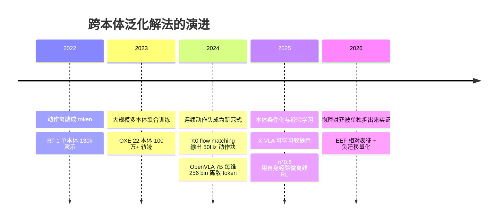

> 这是一份文献梳理。文中引用的论文、编号和数字我都逐条核对过一手来源（arXiv 页面与全文、官方博客、GitHub 仓库）；属于我自己的推断会写成判断，不混进论文结论里。**本体（embodiment）**在本文指具体机型的组合——自由度、控制频率、末端执行器、传感器布局——不是泛指「机器人」这个词。

## 先说结论

**跨本体泛化的根本障碍是动作空间异构，而不是模型不够大或数据不够多。** 同一条「把杯子拿起来」的指令，在 7 自由度 Franka 上是 7 维关节角，在双臂 ALOHA 上是 14 维，在灵巧手上还要加上手部自由度；控制频率从个位数 Hz 到 50Hz 不等，坐标系有世界系、末端系、关节系三种写法。

解法到现在经历了四代：**离散动作 token → 连续 flow/diffusion 动作头 → 本体条件化 → 统一物理对齐动作空间**。每往前走一步，「能训」的问题解决得更彻底，但「训得好」的问题始终没有被自动解决。

最硬的一份实证来自《Rethinking Visual-Language-Action Model Scaling》（arXiv:2602.09722）：作者把「物理对齐、数据配比、正则化」三项放在同一套消融里比，结论是**统一的末端执行器相对（EEF-relative）表征最关键；异构数据朴素混合会带来负迁移；而正则化手段基本无效**。

负迁移这个发现值得单独记住。人们直觉上相信「数据越多越好」，但这份工作测出来的曲线是反的：在 OXE 上预训练后冻结 VLM，LIBERO 平均成功率 77.3%；再依次加入真实 EEF 数据、仿真 EEF 数据之后，掉到 73.8%、72.1%。**加数据反而变差。**

但这不是「异构混合必然有害」的结论——OXE/RT-X 那篇测到的是正迁移，π0.5 的异构任务共训也是它泛化能力的来源。两者不矛盾，只是**迁移的方向不对称**（这是我的推断，不是文献结论，后面展开）。

## 问题是怎么出现的

把一个在 A 机器人上学到的策略搬到 B 机器人上，中间隔着四层不一致。

**动作维度与控制模式**。7-DoF 单臂、双臂、灵巧手、全身人形，动作向量的长度和语义都不同。更麻烦的是控制模式：关节空间（joint space）直接给每个关节角，任务空间（task space）给末端位姿——两者之间靠逆运动学换算，而这个换算依赖标定质量。

**控制频率**。OpenVLA 这类自回归策略输出的是逐步 token，量级在个位数 Hz；π0 用 flow matching 输出动作块（action chunk），论文里写到「up to 50 Hz」，用于叠衣服这类灵巧任务。频率差一个数量级，动作的时间粒度就不是一回事。

**观测与标定**。相机位姿、手眼标定、本体感知（proprioception）的维度在各机型之间都不一致。同一条演示数据，在不同机型上的物理含义并不相同。

**数据分布**。不同实验室的采集方式不同——遥操作、示教器、便携设备——语义与风格差异大，即使动作空间对齐了，分布也未必对齐。

这四层里，前三层是物理层面的，最后一层是数据层面的。早期工作大多在解决第四层（堆数据），而 2026 年的共识转向了前三层：**先把动作的物理语义对齐，再谈规模。**

## 四代解法

**第一代：把动作也变成语言。** RT-1 开启的做法是把连续动作按维度归一化后离散成词表 token，动作预测退化成「下一个 token 预测」，与语言模型完全同构。OpenVLA 把这套做到了 7B 规模——每维 256 个 bin、归一化到 [-1,1]、用 1%/99% 分位数做边界抗离群值——用 970k 条 OXE 演示训练，在 29 项任务上以 7 倍更少的参数超过 55B 的 RT-2-X 16.5 个百分点。FAST 则换了个压缩思路：对动作**序列**做离散余弦变换再造 BPE，把动作块压成高频 token，训练效率提升约 5 倍、推理最快 15 倍。

这条路线的优点是统一——词表天然吞掉异构。代价是量化损失与逐 token 自回归的速度上限。

**第二代：把连续控制交还给动作专家。** π0 的做法是 VLM 主干（PaliGemma 初始化）负责语义与感知，另设一个轻量动作专家用 flow matching 生成连续动作块，论文明确写到这让模型「能在最高 50 Hz 的频率下控制机器人」。RDT-1B 用 1B 扩散 Transformer 做双臂，GR00T N1 用 DiT 扩散动作头——同一时期的不同实现。

好处是高频、高带宽、高精度。新问题也随之出现：动作头通常带本体专属参数，跨本体时怎么共享或切换。

**第三代：把异构性写成显式条件。** CrossFormer 给每个本体配专属 tokenizer 加 embedding mask，单策略吞 20 种本体；GR00T N1 用标准化动作空间配合按本体配置的动作头；X-VLA 用一组可学习的软提示（soft prompt）代表不同本体，参数开销极小；Gemini Robotics 1.5 更激进，直接让多个本体共享一个运动空间（Motion Transfer）。

这一代解决的是「一个模型能不能容纳多种本体」——能训了。但**能训不等于训得好**，配比不当照样负迁移。

**第四代：把物理对齐拆出来单独研究。** 这是 2602.09722 的贡献。它构造了统一动作空间 A_uni = 末端位姿 ⊕ 关节 ⊕ 夹爪 ⊕ 灵巧手 ⊕ 辅助维度，配本体专属嵌入与维度掩码，然后逐个测试坐标系表征的影响。结论是 EEF 相对表征最稳，世界坐标系表征在 LIBERO 上预训练反而带来负迁移。

绕过这四代之外，还有一条独立路线值得一提：**潜在动作空间**。UniVLA 从无动作标签的视频里自监督学习「任务中心潜在动作」，策略在潜空间预测后再解码到具体本体。它把对齐对象从「原始动作」换成「任务意图」，是打通互联网视频数据的候选路径。

## 三家代表模型的处理方式

| 维度 | OpenVLA | π0 | GR00T N1 |
| --- | --- | --- | --- |
| 动作表示 | 离散 token：7-DoF 每维 256 bin，分位数边界归一化 | 连续：VLM 主干 + flow matching 动作专家 | 连续：Eagle-2 VLM + DiT 扩散动作头 |
| 输出特性 | 逐步 token，自回归 | 动作块，论文称最高 50 Hz | 高频动作块，双系统快慢解耦 |
| 多本体混训 | 直接混 970k 条 OXE 演示，词表天然统一 | 共享动作空间 + per-robot 归一化统计 | 标准化动作空间 + 数据金字塔（网络视频→仿真→真机） |
| 新本体迁移 | LoRA 微调，消费级 GPU 可跑 | post-train 小规模高质量数据微调 | 官方提供跨本体微调流程 |
| 跨本体思路 | 「动作也是语言」，用词表吞掉异构 | 「物理对齐」，归一化 + 连续头保留高频控制 | 「架构解耦」，慢思考共享、快控制分本体 |

一句话概括：**OpenVLA 把异构性藏在离散词表里，π0 交给归一化统计与动作专家，GR00T 写成显式的条件与数据分层。**

## 反直觉的实证：加数据反而更差

2602.09722 最有价值的部分不是结论，而是它把三条常见直觉都做成了可复现的消融。

### 发现一：换一个坐标系，结果就从正迁移变成负迁移

同一模型、同一数据，只改动作坐标系：

- **世界坐标系表征**在 LIBERO 上预训练是负迁移：世界相对 -0.9%、世界增量 -0.5%；
- **EEF 相对表征**是正迁移：EEF 相对 +2.6%、EEF 增量 +2.4%。

论文给的解释是，世界坐标能利用「相机外参固定 + 工作空间有界」这类单环境规律，因此容易过拟合到单一本体的特性上；EEF 坐标则要求模型学「相对于手的运动」，这个语义跨本体是共享的。在 RoboCasa 基准上，EEF 相对表征把 50-shot 成功率从 45.1% 提到 50.0%。

### 发现二：数据不是越多越好

作者设计了一个累进配方，逐级加入数据源，每一级相对于上一级的增量是负的：

| 配方 | 内容 | LIBERO（冻结 VLM） | RoboCasa 50-shot |
| --- | --- | --- | --- |
| 从零训 | — | 66.9% | 45.1% |
| D1 | 仅 OXE | **77.3%**（比从零训 +10.4pp） | **54.7%**（+9.6pp） |
| D2 | D1 + 真实 EEF 数据 | 73.8%（-3.5pp） | 48.8%（-5.9pp） |
| D3 | D2 + 仿真 EEF 数据 | 72.1%（-1.7pp） | 49.6%（+0.8pp） |
| D4 | D3 + 关节空间数据（分组损失） | 75.1%（+3.0pp，仍未超过 D1） | 50.0%（+0.4pp） |

RoboCasa 上的差距在长时程任务上更明显：D1 在「门 / 抽屉」类任务上 72.3%，D2 掉到 60.5%，**差 11.8 个百分点**。

论文的归因是：朴素混合（naive pooling）时，数据量大、梯度噪声小的域会主导参数更新，低频但重要的本体被稀释；同时不同域的 EEF 语义、夹爪开合编码、观测风格并不一致。

值得留意的是，这份配方的最终有效帧数是 182.49M，来自 658.52M 原始帧的平衡采样——其中**关节空间数据被压到 5.94M 的最低配比**，与「EEF 表征优先」的结论自洽。

### 发现三：正则化不是解药

几个直觉上应该有用的手段，实测都不稳定：视觉 dropout 关掉反而更好（85.6% vs 84.5%）；重度本体感知遮蔽有害；多阶段微调不如直接端到端微调（85.8%）。

这篇工作还顺带提出了一套真机评测协议：**分组双盲采样**（Grouped Blind Ensemble），把「执行操作的人」和「判断结果的人」分开，降低实验者偏差。

## 同一件事的两种答案

把 2602.09722 的负迁移和 OXE/RT-X 的正迁移放在一起看，会得到一个表面上矛盾的结论。我的推断是：**迁移方向是不对称的**。

「用大数据帮助小数据、用多本体帮助单本体」容易产生正迁移——这正是 RT-X 时代观测到的现象。但「往一个已经充分混合的配方里继续塞未对齐的新域」容易产生负迁移，因为主干已经在旧配比上收敛，新域带来的梯度冲突超过了信息增益。此外，RT-X 时代的模型规模小、基线弱，负迁移的空间本就有限；2602.09722 用的是更强的 VLM 主干，对配比更敏感。

这个解释是**我的推断**，我没有找到直接裁决它的文献。但它和另外两条证据是一致的：2602.09722 自己也显示混合并非只有害——D4 的分组损失能找回 3.0 个百分点；而 π0.5 的异构任务共训是它开放世界泛化能力的核心来源。**异构本身是资源还是负担，取决于对齐方式与配比。**

## 产业界在押什么

学术界的路线分歧，在产业侧表现为不同的商业选择。有三个观察。

**开源与闭源的分界，大致对应「卖模型」还是「卖整机」。** Physical Intelligence 把 π0、π0-FAST、π0.5 的权重全部通过 openpi 开放，官方支持单张 RTX 4090 做 LoRA 微调——它的定位是基础模型供应商，开放是获客手段。Figure 走反方向：Helix 完全闭源，官方把它描述为输出人形上半身高频连续控制的机载双系统模型，系统 2 用 7B VLM 做慢速推理。它卖的是整机。

**平台方押注生态。** NVIDIA 的 GR00T N1 开源权重与代码，配套的是「网络视频 → 仿真 → 真机遥操作」的数据金字塔——它的收益不在模型本身，而在训练与仿真工具链的消耗。Google 的 Gemini Robotics 1.5 走另一条路：闭源，但把「跨本体共享运动空间」做成了产品能力，配合 ER 1.5 把具身推理 API 化。

**中国团队集中在开源侧。** 智元的 AgiBot World 用 100 台以上同构机器人采到 100 万+ 真机轨迹并开源，银河通用的 GraspVLA 用十亿帧合成抓取数据直接 sim-to-real，清华的 RDT 线（RDT-1B → X-VLA → RDT2）全线开源。这三家的共同点是都用数据或代码的开放度换生态位置。

还有一个时序上的变化值得留意：π*0.6 引入的 RECAP 用三类经验信号——演示、纠正性遥操作、自主执行——做强化学习，把竞争焦点从「预训练数据有多少」推向「部署后能学到多少」。如果这个方向成立，跨本体泛化的主战场会从预训练阶段的配方优化，迁移到部署阶段的本体适配——对数据壁垒的要求会低一些，对算法设计的要求会高一些。

## 评测缺口

跨本体研究最实际的问题是：**没有一个公认的方法能测出「同一个策略在 K 个本体上的性能落差」。**

仿真侧的事实标准是 LIBERO 和 RoboCasa——2602.09722 的全部消融都在这两个基准上做。但它们**本体固定**，测的是「模型学得好不好」，不是「换本体掉多少」。真机侧走得更远一些：RoboArena 用「跨实验室分布式双盲成对比较」代替统一环境，是目前最接近公平跨本体评测的尝试，但参与门槛高、难以复现。

数据侧的对照物是 RoboMIND（4 种本体、107k 轨迹、479 任务）这类多本体规范基准。而「迁移落差矩阵」本身——同一策略在多个本体上的性能落差表格——目前没有标准化实现。这既是评测的空白，也是个人研究者门槛最低的切入点。

## 取舍与局限

**EEF 相对表征是不是终答案？** 在 7-DoF 单臂与双臂场景下它是当前最稳的默认值，但它有两个前提：本体要有可靠的逆运动学，以及标定质量足够好。灵巧手和全身人形的高自由度控制很难只靠末端位姿表达，最终仍要回到关节空间；低成本机械臂标定较差时，EEF 估计的噪声会显著上升。论文没有明确给出这条结论的外推边界。

**三条动作表示路线缺少同预算对比。** FAST 论证了离散可以很高效，π 系主线仍用 flow，UniVLA 主张潜空间才是跨本体正解。三方没有做过「同数据、同算力、同协议」的对照实验，所以现在的选择很大程度上是各家工程约束的产物，而不是被实验裁决过的优劣。

**没有跨本体的联合 scaling law。** 语言模型有 Chinchilla，机器人只有碎片证据：操作模仿学习的数据缩放只覆盖单任务维度，UMI 数据缩放只探到「零样本简单任务」为止，配比侧只有消融没有定律。**本体数 × 数据量 × 模型规模**的三维关系至今空缺。

## 最后留下的结论

跨本体泛化过去两年最大的进展，不是某个模型变强了，而是**问题被拆清楚了**：动作空间的物理对齐是第一位的，数据规模是第二位的，正则化基本不解决问题。2602.09722 用一组干净的消融把这三者的优先级排了序，这比它给出的任何一个具体数字都更有用。

如果要我做一件具体的事，我会选去补那个「迁移落差矩阵」——在仿真里构造 K 个本体（改自由度、控制频率、夹爪类型），测同一族开源模型的落差并公开结果。它需要的算力不大，但补的是一个全领域都在绕开的洞。

## 参考资料

**核心实证**

1. [Rethinking Visual-Language-Action Model Scaling: Alignment, Mixture, and Regularization](https://arxiv.org/abs/2602.09722)（arXiv:2602.09722，2026）｜项目页：[research.beingbeyond.com/rethink_vla](https://research.beingbeyond.com/rethink_vla)

**开放挑战与综述**

2. [10 Open Challenges Steering the Future of Vision-Language-Action Models](https://arxiv.org/abs/2511.05936)（arXiv:2511.05936，2025）

**数据集与联合训练**

3. [Open X-Embodiment: Robotic Learning Datasets and RT-X Models](https://arxiv.org/abs/2310.08864)（arXiv:2310.08864，2023）
4. [DROID: A Large-Scale In-The-Wild Robot Manipulation Dataset](https://arxiv.org/abs/2403.12945)（arXiv:2403.12945，2024）
5. [RoboMIND: Benchmark on Multi-embodiment Intelligence Normative Data](https://arxiv.org/abs/2412.13877)（arXiv:2412.13877，2024）
6. [AgiBot World Colosseo / GO-1](https://arxiv.org/abs/2503.06669)（arXiv:2503.06669，2025）
7. [Universal Manipulation Interface (UMI)](https://arxiv.org/abs/2402.10329)（arXiv:2402.10329，2024）

**代表模型**

8. [RT-1: Robotics Transformer for Real-World Control at Scale](https://arxiv.org/abs/2212.06817)（arXiv:2212.06817，2022）
9. [RT-2: Vision-Language-Action Models Transfer Web Knowledge to Robotic Control](https://arxiv.org/abs/2307.15818)（arXiv:2307.15818，2023）
10. [OpenVLA: An Open-Source Vision-Language-Action Model](https://arxiv.org/abs/2406.09246)（arXiv:2406.09246，2024）
11. [π0: A Vision-Language-Action Flow Model for General Robot Control](https://arxiv.org/abs/2410.24164)（arXiv:2410.24164，2024）
12. [FAST: Efficient Action Tokenization for Vision-Language-Action Models](https://arxiv.org/abs/2501.09747)（arXiv:2501.09747，2025）
13. [π0.5: a Vision-Language-Action Model with Open-World Generalization](https://arxiv.org/abs/2504.16054)（arXiv:2504.16054，2025）
14. [GR00T N1: An Open Foundation Model for Generalist Humanoid Robots](https://arxiv.org/abs/2503.14734)（arXiv:2503.14734，2025）
15. [RDT-1B: a Diffusion Foundation Model for Bimanual Manipulation](https://arxiv.org/abs/2410.07864)（arXiv:2410.07864，2024）
16. [RDT2: Exploring the Scaling Limit of UMI Data Towards Zero-Shot Cross-Embodiment Generalization](https://arxiv.org/abs/2602.03310)（arXiv:2602.03310，2026）
17. [X-VLA: Soft-Prompted Transformer as Scalable Cross-Embodiment Vision-Language-Action Model](https://arxiv.org/abs/2510.10274)（arXiv:2510.10274，2025）
18. [UniVLA: Learning to Act Anywhere with Task-centric Latent Actions](https://arxiv.org/abs/2505.06111)（arXiv:2505.06111，2025）
19. [GraspVLA: a Grasping Foundation Model Pre-trained on Billion-scale Synthetic Action Data](https://arxiv.org/abs/2505.03233)（arXiv:2505.03233，2025）
20. [Scaling Cross-Embodied Learning: One Policy for Manipulation, Navigation, Locomotion and Aviation](https://arxiv.org/abs/2408.11812)（arXiv:2408.11812，2024）
21. [SmolVLA: A Vision-Language-Action Model for Affordable and Efficient Robotic Manipulation](https://arxiv.org/abs/2506.01844)（arXiv:2506.01844，2025）
22. [GR-3 Technical Report](https://arxiv.org/abs/2507.15493)（arXiv:2507.15493，2025）
23. [GR00T N1.5 / Isaac GR00T 开发者博客](https://developer.nvidia.com)（NVIDIA，2025）
24. [openpi 开源库](https://github.com/Physical-Intelligence/openpi)（Physical Intelligence，2025）
25. [Helix: A Vision-Language-Action Model for Generalist Humanoid Control](https://www.figure.ai/news/helix)（Figure，2025）

**数据缩放与筛选**

26. [Data Scaling Laws in Imitation Learning for Robotic Manipulation](https://arxiv.org/abs/2410.18647)（arXiv:2410.18647，2024）
27. [Robot Data Curation with Mutual Information Estimators](https://arxiv.org/abs/2502.08623)（arXiv:2502.08623，2025）

**评测基准**

28. [LIBERO: Benchmarking Knowledge Transfer for Lifelong Robot Learning](https://arxiv.org/abs/2306.03310)（arXiv:2306.03310，2023）
29. [CALVIN: A Benchmark for Language-Conditioned Policy Learning](https://arxiv.org/abs/2112.03227)（arXiv:2112.03227，2021）
30. [RoboCasa: Large-Scale Simulation of Everyday Tasks for Generalist Robots](https://arxiv.org/abs/2406.02523)（arXiv:2406.02523，2024）
31. [Evaluating Real-World Robot Manipulation Policies in Simulation](https://arxiv.org/abs/2405.05941)（arXiv:2405.05941，2024）
32. [RoboArena: Distributed Real-World Evaluation of Generalist Robot Policies](https://arxiv.org/abs/2506.18123)（arXiv:2506.18123，2025）
