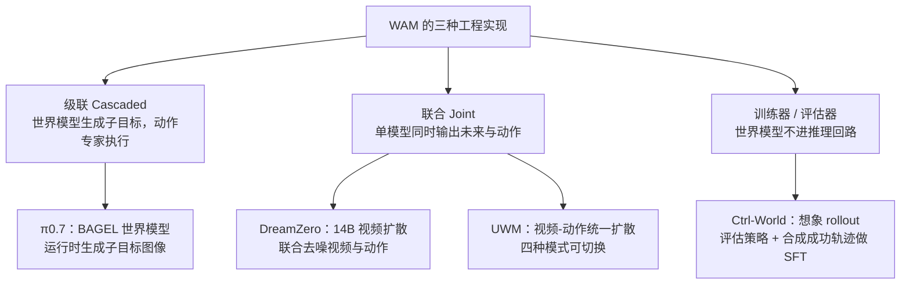
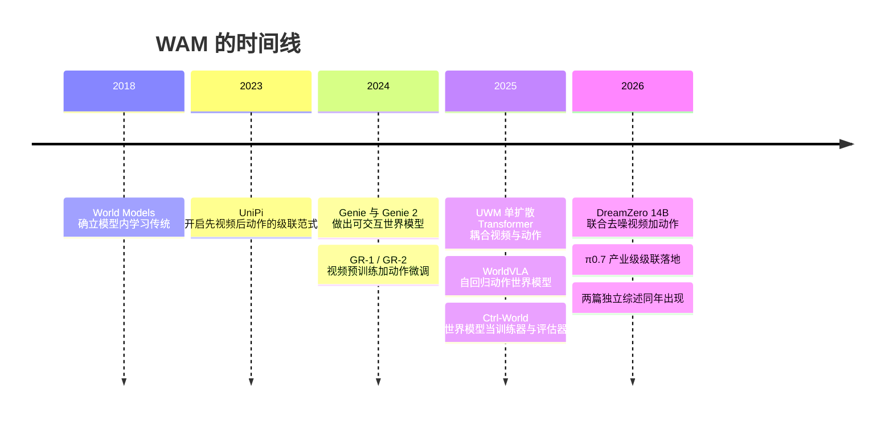

> 这是一份文献梳理，不是实测记录。文中引用的论文、编号、官方页面我都逐条核对过一手来源；论文自报的数字我会标明是自报，属于我的判断的部分会写清楚是判断。世界动作模型（World Action Model, WAM）这个名字出现得不算久，同一批工作在不同论文里还叫过 action world model、world-model policy 等，本文统一用 WAM。

## 先说结论

**WAM 要同时做两件事：预测未来，并让动作与预测出的未来对齐。** 与 VLA 的区别在于它不只学「看到什么就做什么」，而是先在心里把未来推演一遍。

这个想法不新，新的是它在这一年变成了体系化的方向：**半年内出现两篇互不隶属的综述**——复旦 OpenMOSS 团队的《World Action Models: The Next Frontier in Embodied AI》（arXiv:2605.12090，2026-05）与新加坡国立大学的《World Action Models: A Survey》（arXiv:2606.20781，2026-06）。产业侧也在同一时间用了这个词：NVIDIA 的 Cosmos 官方页面直接写着让 Cosmos 3 作为「World Action Models (WAMs) 的骨干」。

但把正反两面证据摆在一起看，我的判断是：**目前最有说服力的证据来自「把世界模型当训练器或评估器」，而不是「让联合模型直接当策略」。** 前者有可量化的提升（Ctrl-World 自报把策略成功率提升 44.7%），后者——即使是最强的联合 WAM——论文自己承认还只是 System 1 的快速反应模型。

而全领域最大的空白不是模型，是**评估**：综述白纸黑字写着，没有一个既定协议能同时评估世界建模能力和动作策略能力。

## 定义：什么样的模型算 WAM

复旦综述给了两条判据，我把它们翻成直白的话：

**一，前向预测建模。** 模型必须预测物理世界在干预下的演化，形式不限——像素级视频帧、稠密光流、或者物理接地的隐空间表征都算。

**二，耦合动作生成。** 动作必须与预测出的未来状态对齐，而不是直接从当前观察映射出来。

两条都满足才叫 WAM。这样一圈划下来，和相邻概念的边界就清楚了：

| 概念 | 学什么 | 预测未来 | 输出动作 |
| --- | --- | --- | --- |
| VLA | p(a\|o,l)，观察到动作的反应式映射 | 无 | 有 |
| 世界模型 World Model | p(o′\|o,a)，给定动作预测下一状态 | 有 | 无 |
| 视频预测 | p(o′\|o) 或文本条件生成 | 有 | 无 |
| **WAM** | **p(o′,a\|o,l)，联合建模未来观察与动作** | **有** | **有** |

复旦综述还专门做了术语消歧：与 VAM（Video Action Model，视频专用的动作模型，WAM 是模态无关的超集）、Video Policy（继承视频骨干的策略，没有预测承诺）、AWM（Action World Model，早期叫法）区分开。

有意思的是，两篇综述的定义口径并不完全一致。NUS 那篇走的是另一条切法，按「需要生成什么样的未来」分成三类：渲染未来、潜在未来、以及完全不生成视频的动作推理。**两篇顶会级综述在定义上就分岔，本身就说明这个领域还没收敛。**

NUS 综述还提炼出一个设计趋势，我认为是这一年最值得记住的一句话：**generate less of the future while preserving what control requires**——在保留控制所需信息的前提下，少生成未来。它的判断是，WAM 不是「视频生成器加一个动作头」，而是设计选择在表征丰富度与算力、内存、延迟、动作标注成本之间做权衡的方法。

## 三种工程实现

定义是抽象的，落到工程上有三条不同的路。这也是我认为读这个方向最该先分清的事：

**级联：先想象，再执行。** 世界模型先生成一张子目标图像，交给 VLA 动作专家去执行。Physical Intelligence 的 π0.7 是这条路的产业级样本：它的子目标图像由一个轻量世界模型生成，该世界模型从 BAGEL 初始化——论文原文写明「a 14B mixture-of-transformers model capable of image understanding, editing, and generation」。这里的权衡很清楚：世界模型不必端到端可微，可以用最强的图像模型；代价是两段式推理的延迟，以及子目标与动作之间的误差无人负责。

**联合：一个模型同时干两件事。** 单个模型联合去噪视频与动作，未来和动作在同一个表征空间里优化。NVIDIA GEAR Lab 的 DreamZero 用 Wan2.1-I2V-14B-480P 作为骨干，训练 14B 自回归视频扩散模型做实时闭环控制；UWM 则用单个多模态扩散 Transformer 耦合视频与动作扩散，通过给两侧独立的噪声时间步，让模型能在「策略 / 正向动力学 / 逆动力学 / 视频生成」四种模式间切换——**这个设计的意义是它能把没有动作标注的视频也吃进来。**

联合路线的关键工程技巧都是同一个问题的解：预测任务和动作任务会互相拖累。UWM 用独立噪声时间步，WorldVLA 用模态专属因果掩码（基于 Chameleon 7B），DreamZero 用异步采样加缓存。另外 DreamZero 的闭环机制值得一提——每执行完一个动作块，用真实观察替换掉 KV-cache 里的预测帧。

**训练器：世界模型不进推理回路。** Ctrl-World 走的是第三条路：世界模型既不生成子目标也不联合输出，而是当「想象空间里的沙盒」——在想象 rollout 中评估策略、筛选出成功的想象轨迹拿去做监督微调。这条路的好处是它与「视频预测不等于可执行控制」的批评正面错开：**它不要求生成的视频物理上严格正确，只要求生成的成功轨迹能教会策略做对的事。**

## 这一年发生了什么

把时间线摊开，WAM 不是突然出现的，它有一条清晰的史前史和一次密集的集中爆发。

2026 年这条线有三个节点值得单独说。

**二月，DreamZero。** 它把「WAM 是零样本策略」写进了标题，论文声称相比最先进的 VLA 在真机新任务与新环境上的泛化提升超过 2 倍，并展示了两类跨本体迁移：用其他机器人或人类视频的纯视频演示来迁移。它还做到了一件事：让 14B 自回归视频扩散模型以 7Hz 实时闭环。工程优化是异步、DiT 缓存、量化、CUDA graphs 的组合。

**四月，π0.7。** 这是产业界第一次把级联式 WAM 做进正式产品模型。它的定位是「可操控的通用机器人基础模型」，论文标题里用了 emergent capabilities（涌现能力）。它还能零样本跨本体——官方举的例子是在没见过的任务上叠衣服，以及操作咖啡机达到专门 RL 微调模型的水平。

**五月和六月，两篇综述。** 复旦那篇系统盘点了数据生态、分类法和评估现状；NUS 那篇独立构建了另一套分类维度。配套的开源清单 Awesome-WAM 也在持续更新（MIT 许可，目前约 1.4k stars）。一个方向在半年内被两拨人各自写成综述，通常意味着它已经越过了「有人在做」的阶段。

产业侧的合流也能看出方向：NVIDIA 是唯一在官方材料里直接用 WAM 这个词的公司（Cosmos 3 页面）；Google DeepMind 走的是 Genie 3（世界模型）加 SIMA 2 / Gemini Robotics（智能体与分层规划）的双件套；Wayve 在驾驶域把世界模型（GAIA-2，用于仿真与安全验证）和 VLA（LINGO-2，用于实际驾驶）分成两条线，没有公开合并。**也就是说，「单一模型联合建模」在产业界仍是少数派，主流做法是让预测和动作在推理时级联或共享骨干。**

## 正反两面证据

### 正：预测怎么变成能力

目前最能站住的证据都来自「训练器」路线。

**Ctrl-World** 在 DROID 数据集上训练（95k 轨迹、564 场景），论文摘要里写着：通过在想象中合成成功轨迹并用它们做监督微调，可以把策略成功率提升 44.7%。我在论文全文里核对了这个数字的两种表述——摘要说的是 "improve policy success by 44.7%"，图 9 的说明写的是 "improves policy instruction-following by 44.7% on average"。**这是个相对提升，不是从 0 到 44.7% 的绝对成功率，读到时候要注意口径。**

**DreamZero** 的泛化数字同样来自论文自报（2 倍以上），但它有几个更具体的观察：从异构、非重复的数据里学习技能的效果明显好于依赖重复演示；跨本体适配只需要 30 分钟的把玩数据，同时保留零样本泛化能力。

**机制上说得通的解释**是：级联式 WAM 在出错时可以重新想象子目标（π0.7 运行时刷新子目标图像），理论上具备恢复能力。世界模型当训练器时，它提供的是一种「不会损坏真机的高成本试错」。

值得说明的是，**这些数字全部来自论文自报或综述转述，我没有找到独立复现**。它们的方向可信，量级要打折看。

### 反：领域内的批评，包括自我批评

**第一条批评是根本性的：视觉真实不等于物理可操作。** 《Robots Need More than VLA and World Models》（arXiv:2606.06556，2026-06）的立场是，当前视频生成世界模型优化的是视觉合理性（visual plausibility），而视觉真实无法自动转化为控制所需的准确物理动力学。另一篇 OpenReview 工作《Interpreting Physics in Video World Models》发现，视频世界模型的内部表征并不能分离出更丰富的物理计算。

这条批评的分量在于它针对的正是 WAM 的立身之本。如果模型学到的只是「视频接下来大概长什么样」而不是「物体会怎么动」，那么联合建模带来的预测能力，在控制任务上可能是不相关的。

**第二条是误差累积。** 自回归展开的漂移是公认难题：预测错一步，下一步的输入就偏了，误差会复合。这对高精度任务尤其严重。

**第三条最有意思，来自 WAM 阵营内部。** DreamZero 论文在讨论部分自己写：当前的 DreamZero 架构主要是一个 System 1 模型，它的视觉记忆是短时程的——6 秒。论文甚至直接写出了升级路径：稳健的长时程执行「either a System 2 planner or WAMs with significantly extended context」。**也就是说，最强的联合 WAM 也没有解决长时程规划，它解决的是反应式的物理泛化。**

**第四条是数据侧的。** 互联网视频大多没有动作标注，这限制了视频预测在机器人学习上的直接收益。WAM 的应对方式是在训练时对动作侧做全加噪或缺失掩码，把无动作视频变成可训练样本——UWM 就是这么做的。这算是用工程手段硬啃，不是理论上的解决。

## 最大的空白是评估

复旦综述在评估一节里写得很直白：全面评估 WAM 需要同时衡量预测未来状态的保真度、生成动作的有效性，以及两者之间的因果对齐；但**实际上，"no established protocol jointly evaluates these interdependent components"**——没有一个既定协议能联合评估这些相互依赖的部分。

现有研究的做法是拆开测：世界建模能力用一套指标（视觉保真、物理常识），动作策略能力用另一套（LIBERO 之类的任务成功率），两边的结果之间没有桥。

这个缺口的实际后果是：「WAM 优于 VLA」这个说法**目前没有公认的标尺**，每篇论文自选基准、自证有效。加上前面说的「数字全部来自自报、没有独立复现」，读者能做的只有两件事：看方向，别信量级；以及——如果你在找切入点，这里是全领域门槛最低、收益最高的一个。

## 取舍与局限

**数据是 WAM 相对 VLA 的结构性优势，但还只是潜力。** 综述把数据生态归为四类：机器人遥操作、UMI 式便携人类采集、仿真、互联网与自我中心视频。前三类 VLA 也在用，第四类只有 WAM 能吃——前提是动作侧的处理能真的把无标注视频转化为有效监督，这一点目前的证据还不充分。

**「少生成未来」是趋势，不是结论。** NUS 综述观察到方法在从渲染完整视频转向潜在未来和免视频生成的动作推理，理由是算力与延迟。但这条趋势的另一面是：生成得越少，模型对物理的理解可能越依赖预训练先验，而先验的质量不可控。

**术语热度与实质进展不对等。** 学术侧已经体系化，产业侧只有 NVIDIA 官方跟进了 WAM 这个词，其他公司各自表述。这说明「WAM」目前更像一个研究共同体的自我命名，而不是产业共识。它会不会像「基础模型」那样成为通用词，还是像很多中间概念一样被下一波术语覆盖，现在判断为时过早。

## 最后留下的结论

WAM 这一年的真正进展，是把一个模糊的直觉——「机器人应该先想想再动手」——拆成了可检验的定义、可分类的架构和可度量的（虽然尚未统一的）指标。两篇独立综述和一次产业表态，说明这件事已经从个人灵感变成集体课题。

但对它的期待要落在正确的位置上：**目前最实的证据是「世界模型当训练器」，不是「世界模型当策略」。** 前者已经在真机上把策略成功率推高了一个可观的比例（论文自报，需独立复现）；后者最强的工作自己也承认只到 System 1，6 秒记忆，长时程还得等一个 System 2。

如果要我押一个方向，我会押在评估上。一个能同时测「预测得准不准」和「动作做得好不好」、还能测两者因果对齐的协议，比再训一个更大的联合模型更能推动这个领域——因为现在没人知道，涨的那部分性能到底来自预测，还是来自更大的参数量和更多的数据。

## 参考资料

**两篇综述**

1. [World Action Models: The Next Frontier in Embodied AI](https://arxiv.org/abs/2605.12090)（复旦 OpenMOSS 等，arXiv:2605.12090，2026-05）｜项目页与清单：[openmoss.github.io/Awesome-WAM](https://openmoss.github.io/Awesome-WAM)
2. [World Action Models: A Survey](https://arxiv.org/abs/2606.20781)（新加坡国立大学，arXiv:2606.20781，2026-06）｜项目页：[world-action-models.github.io](https://world-action-models.github.io)

**代表工作**

3. [π0.7: a Steerable Generalist Robotic Foundation Model with Emergent Capabilities](https://arxiv.org/abs/2604.15483)（Physical Intelligence，arXiv:2604.15483，2026-04）
4. [World Action Models are Zero-shot Policies（DreamZero）](https://arxiv.org/abs/2602.15922)（NVIDIA GEAR Lab，arXiv:2602.15922，2026-02）
5. [Ctrl-World: A Controllable Generative World Model for Robot Manipulation](https://arxiv.org/abs/2510.10125)（arXiv:2510.10125，2025-10）
6. [Unified World Models: Coupling Video and Action Diffusion for Pretraining on Large Robotic Datasets](https://arxiv.org/abs/2504.02792)（arXiv:2504.02792，2025-04）｜项目页：[weirdlabuw.github.io/uwm](https://weirdlabuw.github.io/uwm)
7. [WorldVLA: Towards Autoregressive Action World Model](https://arxiv.org/abs/2506.21539)（阿里达摩院，arXiv:2506.21539，2025-06）
8. [Cosmos World Foundation Model Platform for Physical AI](https://arxiv.org/abs/2501.03575)（NVIDIA，arXiv:2501.03575，2025-01）｜官方页：[nvidia.com/ai/cosmos](https://www.nvidia.com/en-us/ai/cosmos/)
9. [GAIA-2: A Controllable Multi-View Generative World Model for Autonomous Driving](https://arxiv.org/abs/2503.20523)（Wayve，arXiv:2503.20523，2025-03）
10. [Learning Universal Policies via Text-Guided Video Generation（UniPi）](https://arxiv.org/abs/2302.00111)（arXiv:2302.00111，2023-01）
11. [GR-1: Unleashing Large-Scale Video Generative Pre-training for Visual Robot Manipulation](https://arxiv.org/abs/2312.13139)（arXiv:2312.13139，2023-12）

**官方材料与产业动态**

12. [Physical Intelligence 官方博客](https://www.pi.website/blog)（π0 → π0.5 → π*0.6 的版本记录）
13. [Genie 3: a new frontier for world models](https://deepmind.google/blog/genie-3-a-new-frontier-for-world-models/)（Google DeepMind，2025-08）
14. [Gemini Robotics 1.5 brings AI agents into the physical world](https://deepmind.google/blog/gemini-robotics-15-brings-ai-agents-into-the-physical-world)（Google DeepMind，2025-09）
15. [LINGO-2: Driving with Language](https://wayve.ai/thinking/lingo-2-driving-with-language)（Wayve，2024-04）
16. [Awesome-WAM 开源清单](https://github.com/OpenMOSS/Awesome-WAM)（MIT 许可，持续更新）

**批评与评估**

17. [Robots Need More than VLA and World Models](https://arxiv.org/abs/2606.06556)（arXiv:2606.06556，2026-06）
18. [EmboAlign](https://arxiv.org/abs/2603.05757)（arXiv:2603.05757，2026）——指出视频操作管线存在复合失败模式

**工具与数据生态**

19. [LeRobot: An Open-Source Library for End-to-End Robot Learning](https://arxiv.org/abs/2602.22818)（arXiv:2602.22818，2026）｜仓库：[github.com/huggingface/lerobot](https://github.com/huggingface/lerobot)
