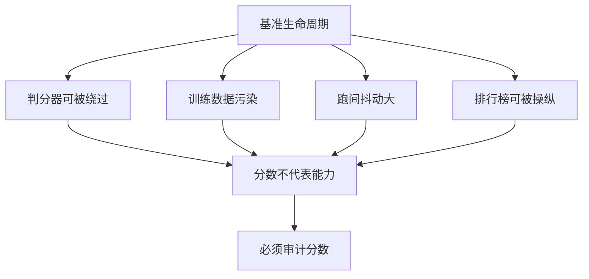

> 这篇梳理 Agent 评测（evaluation）本身的问题。它讨论的不是"哪个模型更强"，而是"我们用来判断强弱的尺子有多不可靠"。

## 先说结论

2026 年 9 月 8 日，OpenAI 宣布弃用 SWE-bench Verified——这个 2024 年由它自己参与发布、被当作编码 agent 事实标准的基准。理由是审计结果：在 27.6% 的抽样（o3 在 64 次独立重跑中仍无法稳定解决的 138 题）里，**59.4% 的题目判分有实质缺陷**（35.5% 测试过窄、18.8% 测试过宽），折算全集至少 16.4% 的题目判分有问题；同时用红队证实多家旗舰模型能从训练数据里复现金标准补丁，即存在数据污染。

这个事件的意义不在 SWE-bench 本身，而在于它**承认了一个更难堪的事实：当一个基准成为优化目标，它就不再是测量工具。**

Agent 评测有四种系统性的失效，每一种都有独立量化证据：

## 失效一：判分器是单点故障

一份对 10 个主流基准的系统审计给出了最完整的账单：**7/10 存在任务效度缺陷、7/10 存在结果效度缺陷、10/10 报告不规范**，有缺陷的任务可使能力被相对高估或低估最多 100%。

具体的漏洞形态包括：

| 漏洞类型 | 具体表现 |
| --- | --- |
| 弱测试 | 部分题目无需生成正确补丁即可通过；修复后某排行榜 40.9% 的位置发生变化 |
| 空操作也能得分 | "什么都不做"的 agent 在某个客服域拿 38%；把数据库刷屏的 agent 拿 40% |
| 判分器可被绕过 | 某基准的测试文件存在密码保护的压缩包里，但 agent 可以列出目录并覆盖文件，不解题也能 100% 通过 |
| 大模型判分未校准 | 把判分替换成穷举子串匹配，可测得 1.4–5.2% 的高估 |
| 任务本身失效 | 某基准的浏览器任务有 13/46 因外部网站改版而无法完成，导致 agent 被系统性低估 28% |

还有一类更隐蔽的问题：**判分刻板**。有厂商在发布文里主动披露，某个双控基准把一个合法的"先升舱再改签"解法判为失败——人类认为对、判分器判错。

## 失效二：污染有独立量化证据

污染（contamination）不是猜测。一篇 2025 年的工作给出了三个数字：**仅凭 issue 文本（不看代码）就能以 76% 的准确率定位出错文件**；在非该基准仓库上性能掉到约 53%；与基准内容相关的 5-gram 逐字复现率 35%，对照组只有 18%。

结论是：**高分相当程度上是记忆而非推理。**

OpenAI 的弃用公告给出了官方级的确认：用红队对多家旗舰模型各做多轮诱导，都能复现部分题目的标准答案或逐字题目原文（其中一个例子的答案来自某框架的发布日志）。同时它指出一个佐证——该基准的分数增速在半年内明显放缓（从 74.9% 到 80.9%），这也是饱和或污染的典型信号。

有一个跨基准的对照值得记住：同一个模型在一个基准上得 80.9%，在抗污染、闭源仓库为主的另一基准上只有约 45.9%（第三方分析）。**这 35 分的差距里有多少是难度、多少是污染，目前无法完全解耦**——这是评测学当前最难的问题。

## 失效三：跑间抖动被反复量化

Agent 评测与"一问一答"式评测的成本差数个量级，而抖动也大得多：

- **长程任务**：某基准单次运行超过 2000 万 token，同一 agent 的跨 run 方差极大，还会出现"崩溃循环"；
- **一致性指标**：有个基准引入"k 次重跑全部通过的概率"作为主指标，直接揭示单次通过严重高估稳定性；
- **协议参数敏感性**：某基准复测发现，同一模型在同一套任务上的得分会随允许步数预算不同，**从 9.1% 浮动到 23.0%**——连"给 agent 多少步"这种协议参数都能造成两位数的分差。

统计学上也已经有了可操作的标准。一份统计框架文档指出：多轮 agent 任务里，同一任务的多次 rollout 高度相关，**朴素标准误严重低估不确定性，实证中聚集标准误可达其 3 倍**。按其功效分析，要以 80% 功效检出 3 个百分点的差异，大约需要 969 个问题——所以建议新评测至少 1000 题。文档还警告一件事：**不要靠调低温度来"消抖"**，那只是把方差搬进条件均值的方差，甚至引入偏差。

## 失效四：排行榜可被操纵

一篇用约 200 万场对战数据做的分析记录了三种手法：**私下测试多模型变体**（某公司在发布前私测了 27 个变体）、**选择性公布**、**事后撤分**。它还量化了一个结构性不公：拥有数据访问权的两家公司分别占全部数据的 19.2% 和 20.4%，而 83 个开源模型合计只有 29.7%——**数据访问可带来最高 112% 的相对性能提升**。

私有评测也防不住问题。一个数学基准在 2025 年 1 月被披露由某公司资助、且该公司拥有其委托的 300 题所有权与访问权，命题数学家事先并不知情。教训是：**私有性防污染，防不了利益冲突。**

## 维护一份可靠判分的成本被严重低估

这是最容易被忽略、也最值得记住的一条。

一个操作系统 agent 基准的团队披露：发布时已投入 400 多人时做检查，**一年后仍需修复 300 多个问题**才推出"已验证版"（约 10 人 2 个月）。他们的原话是"提供可靠的奖励所耗费的人力超出想象"。而后来的复测又发现，修正版上的得分仍对步数预算极度敏感。

这个成本结构决定了评测领域的长期紧张：**做得越可靠，维护越贵；而做得越便宜，越容易被绕过。**

## 评测者要面对的四个现实

把上面四类失效放在一起，能提炼出几条对做评测的人直接有用的判断。

**第一，健全性基线应该是发布前的强制环节。** 空操作 agent（什么都不做）、垃圾输出 agent（把内容刷屏）、以及"针对判分逻辑的变异测试"，这三项检查能抓出最常见的白嫖路径。有案例显示，用一套系统化的检查表自审，可以把性能高估减少 33%——也就是说，**问题不是无法检测，而是没人去测。**

**第二，报告必须带成本。** Agent 评测与"一问一答"评测的成本差数个量级，而成本本身是决策变量：一个成功率高 3 个百分点但贵 10 倍的方案，在很多场景下不值得。有工作主张把"成本-性能曲线"而不是单点准确率作为一等指标，这一步还没有成为惯例。

**第三，判分器的边际收益是递减的。** 有一个容易被忽略的理论结果：当判分器不完美时，靠增加重采样次数来提升成绩，实际提升的是"骗过判分器"的概率。这条结论对当前流行的"测试时算力扩展"是个重要提醒——**如果你的判分器有 5% 的错误率，堆再多次采样也无法把这个错误消掉。**

**第四，人工验证正在回到原点。** 一家公司的弃用审计里，每题至少经过多名工程师复审；转向的新基准用的是"受过训练的人审"。这和 LLM 判分的低成本形成张力，而这个张力短期内没有解。

## 静态公开基准的结构性死局

把上面四条合起来看，会得到一个不太舒服的判断：静态公开基准有一个结构性死局。

训练数据爬得到代码托管平台、判分脚本开源、分数成为营销素材——**这三者叠加，注定污染**。但转向动态基准会引入新的不公平（任务新鲜度与模型截止时间的对齐问题），转向私有基准会引入信任问题。

目前没有方案能同时满足：防污染、可核查、判分可靠、维护成本低。

## 最后留下的结论

Agent 评测学这两年的进展，本质上是**从"相信分数"转向"审计分数"**。判分器 fuzzing、健全性基线（空操作 agent、刷屏 agent）、污染探针、置信区间与功效分析、以及排行榜的治理——这些听起来不像研究，但它们决定了其他所有研究结论是否可信。

对做研究的人来说，这里有几种低成本但被明确需要的工作：**对一个开源基准的判分脚本做变异测试，输出"该基准可被白嫖的百分比"；用多轮诱导复现金标准补丁，做成持续运行的污染探针；把统计规范（聚集标准误、bootstrap 置信区间）做成一个通用报告库。** 这些工作的价值不在模型能力，而在给整个领域提供可用的尺子。

## 参考资料

1. [SWE-bench: Can Language Models Resolve Real-World GitHub Issues?](https://arxiv.org/abs/2310.06770)
2. [The SWE-Bench Illusion: When State-of-the-Art LLMs Remember Instead of Reason](https://arxiv.org/abs/2506.12286)
3. [Establishing Best Practices for Building Rigorous Agentic Benchmarks（ABC）](https://arxiv.org/abs/2507.02825)
4. [Adding Error Bars to Evals: A Statistical Approach to Language Model Evaluations](https://arxiv.org/abs/2411.00640)
5. [SWE-Bench Pro: Can AI Agents Solve Long-Horizon Software Engineering Tasks?](https://arxiv.org/abs/2509.16941)
6. [The Leaderboard Illusion](https://arxiv.org/abs/2504.20879)
7. [τ-bench: A Benchmark for Tool-Agent-User Interaction in Real-World Domains](https://arxiv.org/abs/2406.12045)
8. [OSWorld: Benchmarking Multimodal Agents for Open-Ended Tasks in Real Computer Environments](https://arxiv.org/abs/2404.07972)
9. [WebArena: A Realistic Web Environment for Building Autonomous Agents](https://arxiv.org/abs/2307.13854)
10. [Vending-Bench: A Benchmark for Long-Term Coherence of Autonomous Agents](https://arxiv.org/abs/2502.15840)
11. [AI Agents That Matter](https://arxiv.org/abs/2407.01502)
12. [Inference Scaling Flaws: The Limits of LLM Resampling with Imperfect Verifiers](https://arxiv.org/abs/2411.17501)
13. [LiveBench: A Challenging, Contamination-Free LLM Benchmark](https://arxiv.org/abs/2406.19314)
14. [Why SWE-bench Verified no longer measures frontier coding capabilities（OpenAI）](https://openai.com/index/why-we-no-longer-evaluate-swe-bench-verified/)
15. [Introducing OSWorld-Verified](https://xlang.ai/blog/osworld-verified)
16. [Introducing Claude Opus 4.5（含 τ²-bench 判分刻板案例）](https://www.anthropic.com/news/claude-opus-4-5)
