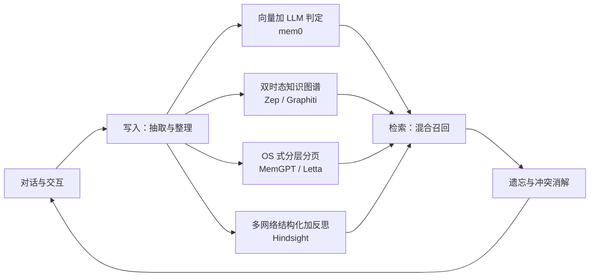

> 这篇梳理 LLM Agent 记忆系统的工程现状与争议。文中数字区分来源性质：论文与官方页面给出的一手数字、厂商自报、以及第三方转述；未核实的内容不写成结论。

## 先说结论

Agent 记忆已经不是"顺手加个向量库"的功能，而是一门独立工程学科：2025–2026 年出现了至少三篇专门综述、一个 ICLR 2026 专场 workshop、以及 mem0 / Zep / Letta / Hindsight / Cognee 这批框架生态。

但这个领域现在最值得注意的不是框架，而是**一场尚未收口的信任危机**：两家头部厂商（mem0 与 Zep）围绕同一个基准（LoCoMo）的自报分数互不兼容，双方都发了长文互相指控，至今没有双方认可的中立复现。更麻烦的是，这个基准本身被指出存在结构性缺陷——它的对话长度只有 16k 到 26k token，**把一个完整对话历史直接塞给模型，效果反而比专用记忆系统还好**。

这句话的含义很重：如果"不做任何记忆处理"就能拿到更高的分，那这个基准测的就不是记忆能力。

## 记忆有四种，不是一种

工程上最通用的分类沿用认知科学四分法（CoALA 提出）：

| 类型 | 定义 | 代表实现 |
| --- | --- | --- |
| 工作记忆 | 当前决策周期的活跃信息 | MemGPT 的主上下文与外部上下文分层 |
| 情景记忆 | 过去决策周期的经验轨迹 | Reflexion 的反思缓冲、Generative Agents 的记忆流 |
| 语义记忆 | 关于世界与自身的知识 | Zep 的实体-事实图谱、mem0 的事实库 |
| 程序性记忆 | 技能与流程 | Voyager 的技能库、ReasoningBank 的策略记忆 |

这个划分之所以有用，是因为它对应四类不同的工程问题：工作记忆要解决压缩与分页，情景记忆要解决检索与衰减，语义记忆要解决冲突消解，程序性记忆要解决"怎么把经验变成可执行的东西"——**最后一类目前工具链最不成熟，厂商自己也承认**。

## 四条实现路线

**向量加 LLM 判定（mem0）**：LLM 从对话抽取候选事实，再和相似旧记忆比对，判定 ADD / UPDATE / DELETE / NOOP 四种操作。2026 年的新算法改成"单遍抽取加三信号检索（语义、关键词、实体匹配）"，官方说法是省 token。

**双时态知识图谱（Zep / Graphiti）**：对话作为 episode 增量解析进时序图谱。它最有意思的设计是**失效不删除**——矛盾的新边进来时，不删旧边，而是把旧边的失效时间设为新边的生效时间。这样"任意时点何为真"都可查询。

**OS 式分层分页（MemGPT → Letta）**：把上下文管理类比操作系统，主上下文与外部上下文分层，agent 可以自己调用工具编辑记忆；Letta 还有"休眠时计算"路线，把记忆整理放到离线窗口。

**多网络结构化加反思（Hindsight）**：四个逻辑网络（世界事实、经历、实体摘要、信念）加 retain / recall / reflect 三个操作。

Anthropic 走了第五条路：文件式记忆加上下文编辑，把记忆做成平台能力而不是框架。

## 检索、遗忘与冲突

**检索**上，现在主流都是混合召回：Zep 用语义加 BM25 全文加图遍历三路，mem0 2026 用语义加关键词加实体匹配。生成式智能体时代开创的"三重打分"（新近度、重要性、相关性）仍是基础思路。

**遗忘**是 2026 年才专项化的方向。FadeMem 用双层差速衰减、ScrapMem 用"光学遗忘"渐进压缩旧记忆，都报告了大幅存储节省（厂商自报数字）。但这里有一条关键区分值得记住：**衰减只解决"低相关记忆"；高相关记忆的 staleness 是未解问题**——比如用户换了雇主，旧事实还"自信地错着"。

**冲突消解**的三种做法代表三个范式：LLM 判定（mem0 的四操作）、双时态失效（Zep，不改写历史）、RL 训练（Memory-R1 用 PPO/GRPO 训练同样的操作集）。整体演进是**规则式 → LLM 判定 → RL 训练**，目前主流仍是第二种。

## 写进去之后：四类操作的设计取舍

记忆系统的工程复杂度主要落在四件事上，每一件都有不同的解法与代价：

**写入。** 从"抽取再更新"两阶段，到"单遍抽取"、结构化笔记加链接演化、自主属性挖掘、增量图谱抽取、策略蒸馏——趋势是从"存事实"走向"存做事的方法"。2026 年还出现了一个新议题：**准入控制**，即"写什么比怎么存更重要"。

**检索。** 三重打分（新近度衰减加重要性评分加相关性）是经典起点，现在主流是混合召回。Zep 的双时态查询更特别：它不仅查"现在为真"，还能查"过去任一时点为真"——这直接来自"失效不删除"的设计。

**遗忘。** 从艾宾浩斯曲线，到把整理前移到离线窗口（自报等精度下省约 5 倍测试时算力），到把高频记忆升级为激活态、低频降级归档。2026 年的专项工作给出了大幅存储节省，但前面提过的那条区分更关键：**衰减解决低相关记忆，高相关记忆的陈旧化仍是未解问题。**

**冲突消解。** 三种范式分别代表三种信任模型：LLM 判定（依赖模型判断力）、双时态失效（信任历史本身，不改写）、RL 训练（把判断交给回报信号）。**"失效不删除"这个设计值得单独赞一句**——它让系统可以回答"当时的依据是什么"，这对审计和调试是决定性的。

## 一场没有裁判的争议

这是这篇里我认为最值得记下来的部分。

**Zep 的指控**（2025-05 博客）相当具体：LoCoMo 的对话平均只有 16k–26k token，"full-context 基线约 73% 反而高于 mem0 最好的约 68%——如果直接把全文给模型比专用记忆系统还好，这个基准就没在测记忆能力"；此外它不测知识更新；数据本身有质量问题（某类问题缺 ground truth、图像描述错误、说话人归属错误），并指控 mem0 对 Zep 的集成实现有误。

**mem0 的回应**（CTO 在代码仓库 issue 中）逐条辩护，并指出 Zep 博客里 84% 的数字分母计算有误（实际 58.44%），以及对方用了偏向自己的 prompt 且仅单次运行。

**现状**：两家自报分数互不兼容，没有中立复现。第三方重测的数字又与两家都不一样——有论文把 mem0 测成 64.57，与 mem0 自报的 66.88 对不上。

这件事的意义超出两家公司：**当一个基准同时是营销材料和评测工具时，它就会变成古德哈特定律的案例。**

## 更严苛的基准揭示了什么

| 基准 | 测什么 | 关键发现 |
| --- | --- | --- |
| LoCoMo（2024） | 超长对话问答 | 被指出长度不足、不测更新、数据有缺陷 |
| LongMemEval（2024） | 五能力，含知识更新 | 基线模型跨会话记忆掉约 30% |
| MemoryAgentBench（2025） | 增量交互、四能力 | 现有方法**无一全面掌握**四项能力 |
| EverMemBench（2026） | 多方多群组、超 1M token | oracle 证据下多方归属的多跳推理仍只有 26% |
| PersonaMem-v2（2025） | 隐式用户画像 | 前沿 LLM 仅 37–48%，记忆框架约 55% |

把这些放在一起看：**现有方法的高分集中在"长对话问答"这一个窄任务上。** 换成长度更大、需要更新知识、涉及多方归属的场景，数字立刻掉下来。有一份行业报告给出参考：某系统在 1M token 尺度得 64.1，扩到 10M 掉到 48.6——**约 25% 的跌幅**。

## 记忆、RAG 与长上下文的分工

三者的分工在文献里已比较一致：**RAG** 从静态外部语料检索，解决"世界知识接入"；**记忆**从交互中积累，可写可忘，解决"跨会话状态与个性化"；**长上下文**一次性全量塞入，解决"当前任务可见性"，但受窗口上限、成本、注意力退化三重约束。

实证数字值得摆在一起：LoCoMo 上 full-context 准确率 72.9% 对记忆方案 66.9%（自报），但 p95 延迟 17.12 秒对 1.44 秒，**相差约 12 倍**，token 消耗差两个数量级。

而长上下文的可靠性也有独立证据：lost in the middle 的 U 型退化；一份技术报告显示**即使任务难度固定，性能也会随输入 token 增加而一致退化**，且反直觉的是，所有被测模型在打乱的文本上表现反而更好（说明结构连贯性本身在消耗注意力）；另有测试发现，13 个宣称 128K 窗口的模型里，11 个在 32K 时跌破短文本基线的一半。

所以更准确的说法是：**三者是分工，不是替代。**

## 多代理共享记忆：刚起步

单代理记忆已经产品化，多代理共享才刚开始。进展包括：三层分层的多代理记忆（insight / query / interaction 图）、多代理协作管理六类记忆组件、以及 Letta 的共享记忆块——官方文档原话是"当一个 agent 更新记忆块，其他 agent 立即看到变化"。

2026 年出现了形式化工作，把共享记忆定义为带作用域的治理状态，并首次系统列出三类失败模式：**越权泄漏、陈旧传播、矛盾传播**。这提示了一件容易被忽略的事：共享记忆的问题不是"怎么同步"，而是"权限、并发写和来源追溯"——这三个在单代理场景下都不存在。

## 最后留下的结论

Agent 记忆现在的状态可以概括为：**路线已经分出四条，操作已经归纳为四类，但标尺还没有立起来。**

对做工程的人来说，实用的判断是：短对话场景先别急着上记忆框架，长上下文可能更省事；真需要记忆时，优先考虑"失效不删除"这类可审计的设计；程序性记忆（技能）目前工具链最薄，投入产出比可能最高。

对做研究的人来说，最大的机会不在再造一个框架，而在**中立评测**：复现那场争议、给遗忘和 staleness 补标尺、把判分器敏感性做成常规消融。头部框架和基准全部开源，笔记本级算力就能起步。

## 参考资料

1. [A Survey on the Memory Mechanism of Large Language Model based Agents](https://arxiv.org/abs/2404.13501)
2. [Memory for Autonomous LLM Agents: Mechanisms, Evaluation, and Emerging Frontiers](https://arxiv.org/abs/2603.07670)
3. [Evaluating Very Long-Term Conversational Memory of LLM Agents（LoCoMo）](https://arxiv.org/abs/2402.17753)
4. [LongMemEval: Benchmarking Chat Assistants on Long-Term Interactive Memory](https://arxiv.org/abs/2410.10813)
5. [Evaluating Memory in LLM Agents via Incremental Multi-Turn Interactions（MemoryAgentBench）](https://arxiv.org/abs/2507.05257)
6. [Evaluating Long-Horizon Memory for Multi-Party Collaborative Dialogues（EverMemBench）](https://arxiv.org/abs/2602.01313)
7. [Mem0: Building Production-Ready AI Agents with Scalable Long-Term Memory](https://arxiv.org/abs/2504.19413)
8. [Zep: A Temporal Knowledge Graph Architecture for Agent Memory](https://arxiv.org/abs/2501.13956)
9. [Hindsight is 20/20: Building Agent Memory that Retains, Recalls, and Reflects](https://arxiv.org/abs/2512.12818)
10. [Governed Shared Memory for Multi-Agent LLM Systems](https://arxiv.org/abs/2606.24535)
11. [MemGPT: Towards LLMs as Operating Systems](https://arxiv.org/abs/2310.08560)
12. [Generative Agents: Interactive Simulacra of Human Behavior](https://arxiv.org/abs/2304.03442)
13. [Reflexion: Language Agents with Verbal Reinforcement Learning](https://arxiv.org/abs/2303.11366)
14. [Voyager: An Open-Ended Embodied Agent with Large Language Models](https://arxiv.org/abs/2305.16291)
15. [Lost in the Middle: How Language Models Use Long Contexts](https://arxiv.org/abs/2307.03172)
16. [NoLiMa: Long-Context Evaluation Beyond Literal Matching](https://arxiv.org/abs/2502.05167)
17. [Context Rot（Chroma 技术报告）](https://research.trychroma.com/context-rot)
