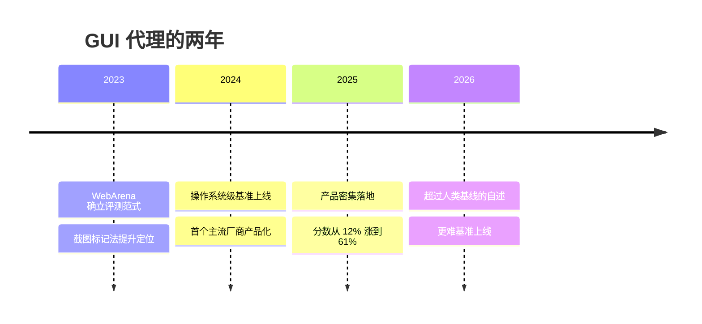

> 这篇梳理计算机使用代理（Computer Use Agent）两年的技术进展。所有论文编号已核对 arXiv 页面；厂商自报与第三方数字会明确标注；未核实内容不写成结论。

## 先说结论

GUI 代理的主流范式已经收敛为**纯视觉加坐标操作**：截图作为输入，鼠标键盘原语作为输出。早期依赖网页 DOM 或操作系统无障碍树的路线退守到浏览器与移动端等有结构化信息的场景，或以混合方式共存。

数字上看这很成功：一个操作系统级基准上，最佳成绩从 2024 年 4 月的 12.24% 涨到 2025 年 9 月的 61.4%，再到 2026 年公司自述的 90.19%（后者是公司口径，未经第三方验证），已经超过 72.36% 的人类基线——这也直接催生了更难、更长的 2.0 版基准。

但失败分析揭示了瓶颈在哪里：**550 个失败案例中 75% 以上含鼠标点击不准**。而长时程任务的性能衰减更严重：按人类完成时长分层，短任务 agent 16.78% 对长任务 4.59%——**掉到不足三分之一**。

一句话：**这条曲线的来路是模型能力加工程技巧，代价是每一步都要付 token 和延迟，而真正没解决的仍是"精确点中"和"长时间不出错"。**

## 两年曲线

**2023 年铺好地基**：一个真实网站的评测环境确立了"可交互加可验证"的范式（人类 78.24%，当时的模型智能体只有 14.41%）；同一时期提出的"截图叠加编号标记"方法，显著提升了视觉模型的元素定位能力；此后一批工作把视觉模型引入 GUI 操作。

**2024 年是范式确立年**：一项工作提出"仅截图"的视觉 GUI 智能体与定位基准，并给出了一个至今仍然成立的理由——**网页源代码"冗长且时常不可得"**，截图才是跨平台通用的观测。同年 4 月操作系统级基准上线（真实虚拟机、369 个任务），5 月真机 Android 基准上线。10 月，首个主流厂商发布"直接操作电脑"能力，同月国内厂商发布首个手机操作代理。

**2025 年是产品化年**：一月到二月，多家发布端到端原生智能体与通用视觉语言模型的内置定位能力；七月，搜索与行动能力合并为一个统一 agent；九月，某模型宣称可保持 **30 小时以上专注**，并配套发布记忆工具与上下文编辑；十月，一家云厂商发布"浏览器优先"的计算机使用模型，并明确"尚未针对桌面系统级控制优化"。十二月，国内厂商在移动端基准上达到 76.7%。

**2026 年**：更难的 2.0 版基准上线（更长任务、更多跨应用、更少捷径）；有公司自述在某基准达到 90.19% 并强调是"harness 工程"而非模型扩展的功劳；上下文管理的几项新工作密集出现。

## 三条技术路线的取舍

| 范式 | 机制 | 优势 | 代价 |
| --- | --- | --- | --- |
| 纯视觉 | 截图加像素坐标 | 泛化最好（覆盖无源码的桌面、游戏、远程桌面） | 每张截图约 1000–1800 token；受分辨率与文字识别限制；定位错误是首要失败源 |
| 结构化输入 | 解析网页源码或无碍树为文本 | 便宜、准确、快（元素引用天然规避坐标误差） | 依赖应用暴露结构；跨应用与桌面场景泛化差；长页面 token 爆炸且含噪 |
| 混合 | 源码蒸馏加视觉确认 | 兼顾两者 | 工程复杂度高 |

这里有两组方向相反的实证值得摆在一起：**在一个操作系统基准的早期对比里，用无障碍树的模型得 12.24%，而纯截图的视觉模型只有 5.26%**——在 2024 年的模型能力下结构化输入明显占优。但后来一项工作主张，网页源码与无障碍树"引入噪声、不完整、计算开销更高"，并证明**只用视觉的定位智能体反而胜过使用额外文本输入的方案**（六个基准上最高提升 20%）。

真实答案大概是**场景相关**：桌面级用纯视觉，浏览器与移动端保留元素引用，并用标记、缩放、意图字段等机制弥补视觉定位精度。

## Grounding：进步最快，也仍是瓶颈

定位（grounding）是把指令映射到屏幕上可点击元素的能力，它既是进步最快的子领域，也是当前第一瓶颈。

一个专业软件定位基准很能说明变化速度：它面向高分辨率专业软件（五个领域、23 个应用、专家标注），**2025 年 4 月原论文里最佳成绩只有 18.9%**；到 2025 年 9 月，一个开源模型的 72B 版本达到 62.5%；第三方聚合站显示前沿模型已到 85–93%（后者未核实）。**一年内从不到 20% 到可能超过 85%**，这是整个 GUI 方向进步最快的部分。

训练语料也做到了规模：有工作的视觉定位数据集达到 1000 万元素、130 万截图，并证明视觉方案可以不用文本辅助；另一份跨平台语料做到 1300 万元素，覆盖五个操作系统平台。

方法趋势很清晰：**从爬网页自动构造配对数据，到跨平台大规模预训练，再到通用视觉语言模型原生集成，最后到用强化学习与测试时推理增强。** 而且定位能力与下游 agent 成功率的正相关，在最早那篇工作里就被证实了。

## 行动空间：收敛为低层原语加少量语义

各家的动作设计正在趋同：

| 系统 | 粒度 | 动作数 | 特色 |
| --- | --- | --- | --- |
| 某厂商 computer use（2026 版） | 低层鼠标键盘原语 | 17 | 支持一回合批量动作、缩放工具、按键重复 |
| 另一家 CUA | 低层 | 9 | 首回合强制截图 |
| 某云厂商 | 低层加少量语义 | 13（旧版） | 归一化坐标；语义动作；每个动作必须带意图字段 |
| 移动端基准 | 中层 UI 语义 | 14 类 | 元素索引或坐标双重定位；设备级动作 |

几个设计要点值得注意：**绝对坐标（桌面系）与元素引用（浏览器/移动端）的分歧，正是前面路线之争在动作端的投影**；观察-行动循环正从"一步一动作"放松（批量动作、可组合的程序化动作）；有厂商把"陈述意图"固化进动作 schema——这不只是可解释性的考虑，也便于安全审查。

## 错误恢复：有效但贵

有三类做法被验证有效：

**推理期搜索**：在真实环境状态空间做最好优先搜索，某评测上相对基线提升 39.6%；把蒙特卡洛树搜索与自我批评、偏好优化结合，真实预订任务从 18.6% 提到 81.7%（加在线搜索到 95.4%）。

**显式回滚**：用批评与回滚双模块在错误状态间回退。

**产品级兜底**：确认模式（发邮件、付款前请求确认）、监视模式、随时接管；以及把安全策略固化成动作（某厂商定义了七类需要确认的策略，涵盖金融交易、敏感数据修改、通信工具、账号创建等）。

但这些都要付成本——搜索与多轨迹的收益显著，代价是数倍的调用量；反思类机制的独立贡献在同台消融中还没有被剥离出来。

## 长时程：问题从"会做"转向"记住"

这是我认为最值得关注的方向性转变。

分层数据很直白：按人类完成时长把任务分三档，agent 的成功率从 16.78% 降到 13.12% 再到 4.59%，**而人类只从 79.31% 降到 49.57%**。跨应用任务（6.57%）也明显低于单应用（13.74%）。

工程上的应对已经形成一套做法：**把 KV 缓存命中率当作生产 agent 的第一指标**（缓存与未缓存输入价差约 10 倍，某类 agent 的输入输出比约 100:1）；上下文 **append-only**，连时间戳都去掉以保持前缀稳定；**文件系统即上下文**，正文外置只留指针，且压缩必须可还原；**反复重写目标文件**以对抗长上下文的中部退化；**保留错误**而不是擦掉——抹掉失败等于抹掉证据。

平台侧则配套了记忆工具（状态外置按需读回）与上下文编辑（清理旧工具结果），并给出长会话的工程细节：每张截图约 1000–1800 token、超过 20 张图触发更严限制、客户端需裁剪旧截图并在保留集上设缓存断点。

2026 年这个子方向仍在活跃：历史折叠、显式上下文管理器等工作密集出现，但**评测口径尚不统一**。

## 安全性：对纯视觉范式是结构性威胁

有基准证明，**截图内渲染的恶意文本或图像可以劫持纯视觉的计算机使用代理**——这是纯视觉范式的结构性威胁，因为它绕过了所有基于文本输入的防御。

另有基准把"策略合规下的完成率"与"风险比"作为一等指标，把安全从"事后检测"变成"评分维度"。

各家产品的应对是内置注入检测分类器（扫描工具返回内容，包括截图）加敏感操作确认策略，但这类防御与攻击的对抗才刚刚开始。

## 最后留下的结论

计算机使用代理这两年走了一条很清晰的路：**范式收敛为纯视觉加坐标、定位能力快速提升、产品密集落地、基准分数超过人类基线。**

但把失败数据放在一起看，真正的瓶颈没变：**点不准（75% 以上的失败含点击错误）与长任务衰减（掉到不足三分之一）。** 前者靠缩放、标记、强化学习在缓解；后者靠上下文工程在缓解——两者都还没有被解决。

对做研究的人来说，这个领域的空白很具体：**基准复测与评测器审计**（已有"社区修复版"模式证明这本身就是贡献）、**垂直平台与中文生态的定位数据集**（专业软件曾是重灾区，中文桌面应用几乎没有对应基准）、以及**安全红队**（现有注入测试只覆盖了一类形态）。这些都不需要训练大模型。

## 参考资料

1. [OSWorld: Benchmarking Multimodal Agents for Open-Ended Tasks in Real Computer Environments](https://arxiv.org/abs/2404.07972)
2. [WebArena: A Realistic Web Environment for Building Autonomous Agents](https://arxiv.org/abs/2307.13854)
3. [AndroidWorld: A Dynamic Benchmarking Environment for Autonomous Agents](https://arxiv.org/abs/2405.14573)
4. [SeeClick: Harnessing GUI Grounding for Advanced Visual GUI Agents](https://arxiv.org/abs/2401.10935)
5. [Set-of-Mark Prompting Unleashes Extraordinary Visual Grounding in GPT-4V](https://arxiv.org/abs/2310.11441)
6. [UGround: Navigating the Digital World as Humans Do](https://arxiv.org/abs/2410.05243)
7. [OS-ATLAS: A Foundation Action Model for Generalist GUI Agents](https://arxiv.org/abs/2410.23218)
8. [ScreenSpot-Pro: GUI Grounding for Professional High-Resolution Computer Use](https://arxiv.org/abs/2504.07981)
9. [UI-TARS: Pioneering Automated GUI Interaction with Native Agents](https://arxiv.org/abs/2501.12326)
10. [OpenCUA: Open Foundations for Computer-Use Agents](https://arxiv.org/abs/2508.09123)
11. [MAI-UI Technical Report: Real-World Centric Foundation GUI Agents](https://arxiv.org/abs/2512.22047)
12. [OpAgent: Operator Agent for Web Navigation](https://arxiv.org/abs/2602.13559)
13. [Agent Workflow Memory](https://arxiv.org/abs/2409.07429)
14. [Tree Search for Language Model Agents](https://arxiv.org/abs/2407.01476)
15. [Agent Q: Advanced Reasoning and Learning for Autonomous AI Agents](https://arxiv.org/abs/2408.07199)
16. [Agent S2: A Compositional Generalist-Specialist Framework for Computer Use Agents](https://arxiv.org/abs/2504.00906)
17. [ST-WebAgentBench: Evaluating Safety and Trustworthiness in Web Agents](https://arxiv.org/abs/2410.06703)
18. [VPI-Bench: Visual Prompt Injection Attacks for Computer-Use Agents](https://arxiv.org/abs/2506.02456)
19. [Anthropic: Introducing computer use](https://www.anthropic.com/news/computer-use)
20. [Manus: Context Engineering for AI Agents](https://manus.im/blog/Context-Engineering-for-AI-Agents-Lessons-from-Building-Manus)
