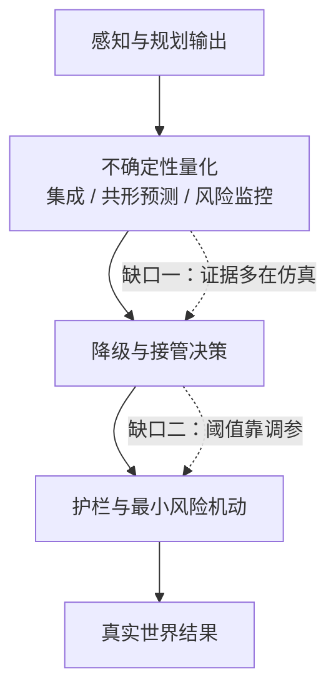

> 这篇梳理学习型智驾的安全与不确定性量化（uncertainty quantification, UQ）现状。标准与法规按官方或权威来源引用，二手来源单独标注；**未验证**的内容不写成结论。

## 先说结论

端到端和 VLA 驾驶模型面对一个结构性问题：**它们无法像传统软件那样建立"显式需求 → 逐条验证"的对应关系。** 你没法给一个神经网络写需求文档，也没法证明它满足某条规则。

行业的应对是两条腿走路：**安全案例（safety case）加运行时护栏**。标准体系正在补课（ISO/PAS 8800:2024 是首个针对车辆 AI 安全的全球规范），但真正难的是那个没有闭环的地方：**"不确定性 → 降级决策"这一环**。

具体来说：不确定性量化（UQ）的证据几乎全部来自仿真和公开数据集；共形预测（Conformal Prediction, CP）有漂亮的覆盖保证，但它的两个理论前提在驾驶里并不天然成立；形式化验证对十亿参数的视觉模型还不可用；而最新的公开事故分析甚至开始反思"停车即安全"这个兜底假设本身。

一句话：**现在的系统能算出"我不确定"，但还不能可靠地证明"因此该怎么做"。**

图中两条虚线，就是这篇文章要讲的两个缺口：**从"不确定性数值"到"降级决策"没有经过验证的桥，从"降级决策"到"兜底动作"也还没有场景化的安全论证。**

## UQ 现在能做什么

不确定性量化的主流方法分几类，各自的保证性质差别很大。

| 方法 | 给出什么保证 | 证据状态 | 主要局限 |
| --- | --- | --- | --- |
| MC Dropout | 启发式置信度 | 仿真对比中低于集成方法 | 校准差、单模型近似 |
| Deep Ensembles | 集成一致性 | 零误报下检出最多不安全行为 | 推理成本成倍 |
| 共形预测（CP） | 分布无关的有限样本覆盖 | 已用于轨迹安全界、检测框区间、OOD 兜底 | 边际覆盖、需要可交换性 |
| 风险监控模块 | 二分类碰撞风险估计 | 闭环安全测试中碰撞规避提升 66.5% | 风险定义限于碰撞 |
| 形式化验证 | 数学证明 | 中小网络可行 | 对视觉 Transformer 不可用 |

在实证对比里，Deep Ensembles 优于 MC Dropout 和自编码器基线——在零误报的前提下，它检出的不安全行为最多。《Predicting Safety Misbehaviours in Autonomous Driving Systems using Uncertainty Quantification》这篇 2024 年的工作就是这个结论。

共形预测在 2024–2026 年最活跃，因为它给的是**分布无关的有限样本覆盖保证**：只要数据可交换，你就能构造出一个区间，让真实值的落入概率不低于 1−α。它已经被用到轨迹预测的规划安全界（CP 区间包裹预测，接入 MPC）、可验证的神经控制屏障函数、OOD 检测触发兜底控制切换，以及检测框的自适应区间。

## 共形预测的两个理论缺口

CP 的保证很漂亮，但驾驶场景会正面撞上它的两个前提。

**第一，覆盖保证是边际的，不是条件的。** "整体上 95% 的情况被覆盖"不等于"在夜间、雨天、某个特定城市这种条件子集里也有 95% 覆盖"。对安全来说，重要的恰恰是那些困难子集。

**第二，可交换性假设在分布偏移下不成立。** 天气、地区、长尾场景都会改变数据分布，而 CP 的覆盖保证依赖于数据可交换。学界用自适应 CP、加权 CP 等方法缓解，但在安全论证语境下，这些缓解手段怎么写成可审计的证据，目前没有共识。

这个缺口在实践中的表现是：**不确定性数值本身校准好了，不等于决策规则也可靠。** 现在缺少的是从"不确定性指标"到"降级/接管动作"之间经过验证的桥——这正是目前几个公开研究项目要测"不确定性提取策略"而不是只测"不确定性数值"的原因。

## 形式化验证的规模墙

形式化验证听起来是安全问题的终极答案：不只是测，而是证明。

现状是：验证器工具在进步（alpha-beta-CROWN 连续拿下 VNN-COMP 2021–2025 五届冠军；2025 年的竞赛有 8 支队伍、16 个常规基准加 9 个扩展基准，网络用 ONNX、规约用 VNN-LIB 标准化），但**基准仍以中小型网络为主**。

更能说明问题的是闭环验证的标志性案例（2019 年）：验证一个神经网络控制的自动驾驶赛车，当时只能处理约 40 线的 LiDAR 输入，而系统总共有 1081 线。规模差了二十多倍。

对视觉 Transformer、扩散策略、十亿参数的 VLA，当前没有可用的非平凡验证结果。所以航空领域（EASA）的路线也是组合式的：学习保障（learning assurance）加形式化方法作为补充，加运行时保障——而不是纯验证。

## 护栏这一层现在做到了什么

把"神经输出加确定性护栏"拆开看，护栏一侧已经有几种成型的做法。

**形式化风险模型是最早的尝试。** Mobileye 的 RSS（责任敏感安全）从 2015 年起提出用形式化规则定义"谁该负责"，NVIDIA 的安全力场（SFF）则用控制论里的"力场"概念在驾驶栈之上做一层防碰撞监督。它们的问题是覆盖范围：Koopman 在 2019 年指出，RSS 的形式化保证只覆盖决策层，感知不确定性进来之后只能变得更保守；后续的实证研究也确认 RSS 的安全距离模型偏大、损失通行效率。它们是有用的规则层，但不是整车安全论证。

**学习式护栏是近几年的主流。** 2025 年的《Drive in Corridors》让系统先学一条安全走廊，再在走廊内规划，把端到端的输出约束在可验证的几何范围内；2026 年的模块化护栏工作提出"监测—评估—干预"的三段式架构（决策门与动作门）；还有面向端到端栈的优化式运行时监控。它们的共同思路是：**不碰神经网络内部，在输出端加一道可独立验证的关卡。**

**但这里有个未解的矛盾。** 护栏要不要触发、什么时候触发，依赖对"当前输出是否可信"的判断——也就是 E2E 模型的置信度或不确定性。而这恰恰是前面说的尚未解决的 UQ 问题。护栏与 UQ 两条线在"不确定性到降级决策"这个地方汇合，然后双双停在那里：一边假设有可靠的置信度输入，另一边给不出经过验证的决策规则。

## 兜底本身也会出事

法规为"系统不行了怎么办"定义了标准答案：**最小风险机动（Minimal Risk Maneuver, MRM）**，目标是进入最小风险状态（MRC）。UN R157 的要求很具体：系统故障或驾驶人未响应时，减速至本车道内静止并开启危险报警灯；减速度需求超过 5.0 m/s² 归为紧急机动。

学术与行业的主流做法是"神经端到端加确定性护栏"：学习安全走廊、模块化决策门控、优化式运行时监控，让神经网络的输出先过一道可验证的关卡。

但 2026 年出现了对这个假设本身的反思。一篇题为《When Stopping Fails》的工作用公开事故数据重新审视停车类兜底：**停在车道内或路边本身会制造追尾、阻碍救援、以及人车交互失败等次生风险。** 另一个更早的实锤是：Waymo 在 2024 年 6 月一次撞杆事故后召回了全部 672 辆车——说明兜底机动本身也需要和主系统同等强度的场景化验证，而不是被当作"最后的安全选项"免检。

这一条对我冲击挺大：我们在讨论"系统什么时候该停下来"时，默认了"停下来是安全的"，但这个默认在真实交通里并不总成立。

## 标准和法规在补什么课

| 层级 | 文件 | 状态 |
| --- | --- | --- |
| 功能安全 | ISO 26262 | 两版现行；第三版修订中，动向含 AI/ML（二手来源） |
| 预期功能安全 | ISO 21448:2022（SOTIF） | 现行；修订进行中 |
| AI 安全 | ISO/PAS 8800:2024 | 2024-12 发布，首个车辆 AI 安全全球规范 |
| 安全案例 | UL 4600 第三版（2023） | 用证据型论证显式覆盖神经网络组件 |
| 航空参照 | EASA CoDANN / AI Concept Paper | 学习保障加运行时保障的组合路线 |

法规落地的时间线也在推进：德国奔驰 Drive Pilot 于 2021 年 12 月获得全球首个 L3 型式批准，2024 年 12 月获批提速至 95 km/h；日本 2020 年 4 月起 L3 实际允许上路、2023 年 4 月修法放行 L4；中国 2025 年 12 月发出首批 L3 车型准入许可；英国 Automated Vehicles Act 2024 于 2024 年 5 月御准，但全面实施计划推迟到 2027 年。

共同趋势是**责任从驾驶人向车企和系统激活状态转移**。深圳的条例已经细化到"自动驾驶系统是否激活"来划责；中国的推荐性国标 GB/T 44721-2024 正升级为首部 L3/L4 强制性国标。

法规把责任讲清楚了，技术侧的对应问题却没有解决：**L3 的责任切换要求"系统知道自己什么时候不行"**——把感知不确定性量化为可审计的接管与降级判据。这正是标准（8800、21448 修订）和学术（UQ）双方都指向、但都没解决的地方。

## 缺的到底是什么

把上面的线索合起来，缺口有三处：

**一是校准与决策之间没有桥。** UQ 的证据（校准误差、覆盖率、检出率）几乎全部来自仿真或公开数据集；"校准良好的不确定性加正确的决策规则"这个组合，没有经过验证的完整方案。

**二是驾驶领域的 VLA 不确定性几乎空白。** 机器人操作领域在 2026 年已经出现一批方法：对动作块做共形校准并按风险排序送人工复核、在冻结 VLA 上加可拒绝的校准决策头、把不确定性作为联合预测目标之一。驾驶侧的对应工作很少，公开可查的只有个别研究项目在启动这件事。

**三是评测基准缺位。** 现有的 UQ 评测基准只覆盖异常分割和 BEV 分割；3D 占据预测、端到端闭环、VLA 驾驶模型都没有公开的 UQ 排行榜。

## 取舍与局限

**"证明神经网络安全"这条路目前走不通**，主流的替代是证据型安全案例加过程认证，但批评者指出安全案例的"证据充分性"标准模糊，可能退化为形式合规。中国选择把关键要求直接写成强制性国标条款，与欧美的安全案例路线形成对照——两条路线的实际效果还没有公开比较（**未验证**）。

**风险模型（RSS、安全力场）只覆盖决策层。** 它们把责任敏感的规则形式化，但感知不确定性进来之后只能变得更保守；实测也显示 RSS 的安全距离偏大、损失通行效率。它们不是整车安全论证。

**公司层面的兜底细节没有公开。** 各家 MRM 的具体触发阈值、降级策略和执行细节属于不公开内容，公开材料只到宣传级别。这也是为什么这篇文章只能讨论标准、论文和公开事故，而不能说"某家的兜底做得如何"。

## 最后留下的结论

智驾安全量化的现状可以概括成一句：**方法很多，保证很少，闭环没有。**

UQ 能给出不确定性数值，CP 能给出分布无关的覆盖保证，形式化验证能证明小网络的性质，法规能定义责任归属——但把这些拼成"系统在不确定时安全降级"的完整链条，每一步之间都还缺经过验证的连接。而最新的反思提醒我们：连"停下来就安全"这个最底层的假设，都需要重新做场景化验证。

如果要选一个判断：**下一步最有价值的进展，可能不是更准的不确定性数值，而是"不确定性到降级决策"这一环的可验证协议。** 它比训练更大的模型更便宜，也比写更多安全文档更有用。

## 参考资料

1. [A Survey on Uncertainty Quantification Methods for Deep Neural Networks](https://arxiv.org/abs/2302.13425)
2. [Predicting Safety Misbehaviours in Autonomous Driving Systems using Uncertainty Quantification](https://arxiv.org/abs/2404.18573)
3. [UncAD: Towards Safe End-to-end Autonomous Driving via Online Map Uncertainty](https://arxiv.org/abs/2504.12826)
4. [Safe Planning in Dynamic Environments using Conformal Prediction](https://arxiv.org/abs/2210.10254)
5. [Formal Verification and Control with Conformal Prediction](https://arxiv.org/abs/2409.00536)
6. [SafePath: Conformal Prediction for Safe LLM-Based Autonomous Navigation](https://arxiv.org/abs/2505.09427)
7. [Adaptive Bounding Box Uncertainties via Two-Step Conformal Prediction](https://arxiv.org/abs/2403.07263)
8. [CP-NCBF: Conformal Prediction-based Neural Control Barrier Functions](https://arxiv.org/abs/2503.17395)
9. [SODA-MPC: Safe, Out-of-Distribution-Adaptive MPC](https://arxiv.org/abs/2406.02436)
10. [Collision Risk Estimation via Loss Prediction in End-to-End Autonomous Driving](https://arxiv.org/abs/2503.07425)
11. [Drive in Corridors: Enhancing the Safety of End-to-end Autonomous Driving](https://arxiv.org/abs/2504.07507)
12. [Modular Safety Guardrails Are Necessary for Foundation-Model-Enabled Robots](https://arxiv.org/abs/2602.04056)
13. [When Stopping Fails: Rethinking Minimal Risk Conditions](https://arxiv.org/abs/2606.29115)
14. [VNN-COMP 2025: Summary and Results](https://arxiv.org/abs/2512.19007)
15. [alpha-beta-CROWN](https://github.com/shizhouxing/alpha-beta-CROWN)
16. [Case Study: Verifying the Safety of an Autonomous Racing Car](https://arxiv.org/abs/1910.11309)
17. [Segment Me If You Can（异常分割基准）](https://segmentmeifyoucan.github.io)
18. [Predictive Uncertainty Quantification for Bird's Eye View Segmentation](https://arxiv.org/abs/2405.20986)
19. [UN Regulation No. 157（ALKS）合并文本](https://unece.org/sites/default/files/2023-12/R157e.pdf)
20. [EASA CoDANN 与 AI Concept Paper](https://www.easa.europa.eu/en/document-library/general-publications/concepts-design-assurance-neural-networks-codann)
