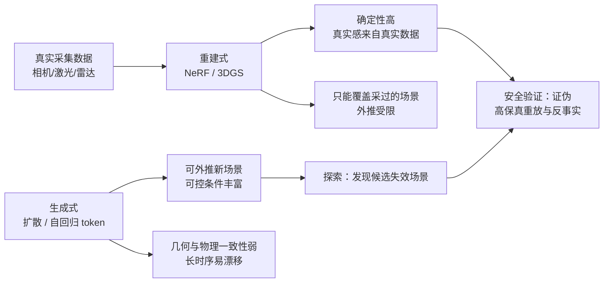

> 这篇讨论驾驶世界模型在安全验证中的角色，不涉及任何具体车型。论文数字均核对过 arXiv 页面或官方博客；公司披露会明确标注性质；**未验证**的内容不写成结论。

## 先说结论

驾驶世界模型现在有两条路线，而且它们**不是竞争关系**，是分工关系。

**重建式**（NeRF、3D Gaussian Splatting）从真实采集的数据里重建场景，保真度高、结果可复现，但只能覆盖采过的场景；**生成式**（视频扩散、自回归 token）可以外推新场景、按需生成干预后的未来，但几何一致性和物理正确性还站不住。

这个分工在证据上很清楚：重建式的闭环仿真已经能稳定暴露 SOTA 规划器的安全缺陷——NeuroNCAP 显示，在正面碰撞场景里，一流端到端规划器的碰撞率达到 98–99%，而真实到仿真的差距只有 0.001 NDS。另一方面，生成式的物理理解被两个基准直接质疑：DeepMind 的 Physics-IQ 结论是"视觉真实不蕴含物理理解"；快手 Kling 团队在 ICML 2025 的受控实验发现，视频生成模型对物理规律只有分布内泛化，**分布外完全失败**。

对安全验证来说最危险的恰恰是分布外的长尾场景——而这正好是生成式仿真被期望补足的部分。所以更务实的做法是：**让重建式承担"证伪"，让生成式承担"探索"。**

## 两条路线

**重建式**的代表是 Waymo 的 UniSim（从单条真实日志重建场景做反事实重仿真，输出相机加激光雷达）和 Lund 大学等的 NeuRAD（面向动态驾驶数据的神经渲染，建模了 rolling shutter、beam divergence 等传感器特性）。这条路线的好处是它**不需要相信模型懂物理**——真实感直接来自真实数据，场景的确定性也让它可复现。

**生成式**的代表是 Wayve 的 GAIA 系列、OpenDriveLab 等的 Vista、NVIDIA 的 Cosmos。它们的优势是外推和可控：可以生成没有采集过的场景、可以按条件改变自车行为、可以批量造数据。GAIA-1 最早用自回归离散 token 做"给定视频、文本和动作预测下一 token"；GAIA-2 转向 latent diffusion 加结构化条件（自车运动、他车配置、环境、道路语义）；Vista 用 latent replacement 支持长时序滚动，并提出把世界模型当"不需要真值动作的奖励函数"。

## 三种用途，成熟度不同

把"世界模型能干什么"拆开看，三种用途的证据强度差别很大。

**数据生成是最扎实的。** MagicDrive 明确报告生成的街景可以提升 BEV 分割与 3D 检测的训练效果。产业侧的公开口径也在往这个方向走：Wayve 把 GAIA-2/3 定位为"合成常见与罕见场景以扩展测试覆盖"。但要注意，公司披露的合成数据占比数字（比如媒体报道的理想"合成数据超 90%"）属于**口径，未经第三方验证**。

**策略预训练有研究证据、生产处于早期。** GenAD 证明视频预测预训练可以零样本泛化到未见数据集，也能改造成规划器；Drive-WM 第一次把世界模型与端到端规划闭环结合（用图像奖励在多个未来分支里选轨迹）。

**闭环仿真评估进展最快，争议也最大。** 这部分的攻防值得单独说。

## 攻防：生成的未来能不能做安全验证

**正方最硬的证据来自重建式。** NeuroNCAP 在 NeRF 重建的仿真里做 Euro NCAP 式的安全测试，结果是：UniAD 和 VAD 这类 SOTA 规划器得分只有 0.73/0.66，碰撞率 88.6%/92.5%；加上后处理最高也只到 2.75 分、碰撞率 50.7%；在正面碰撞场景里碰撞率达到 98–99%。同时它报告真实到仿真的差距只有 0.001 NDS（UniAD 从 0.490 到 0.489）。

这组数字说明：重建式闭环**能暴露真实的安全缺陷**，而且它暴露的缺陷是真实的——和真机表现几乎一致。这是目前"仿真能用于安全验证"最强的量化证据。

**反方最硬的证据来自物理理解基准。**

- Physics-IQ（DeepMind，2025）用真实世界视频做物理原理问答式评测，结论是模型能生成逼真画面，但不掌握连续性、固态、重力等原理；
- 《How Far is Video Generation from World Model》（快手 Kling，ICML 2025）做受控实验：视频生成模型对物理规律只有**分布内完美泛化**，组合泛化随规模可测提升，但**分布外完全失败**；它的泛化方式是"case-based 模仿最近训练样本"，优先级是颜色大于尺寸大于速度大于形状。单纯扩大规模不足以学出物理定律。

这两条合起来指向一个务实结论：**纯生成式路线目前不适合承担认证级验证。** 但生成式仍然有用——它可以用来发现候选失效场景，再把场景拿回重建式仿真或实车确认。

**"闭环"这个词也需要先问清楚"谁在反应"。** 交互性是一个谱系：

| 系统 | 交互性 | 其他交通参与者的行为 |
| --- | --- | --- |
| GAIA-4 的 world-on-rails 模式 | 部分 | 默认重放原始行为，可按需开放反应式 agent |
| NAVSIM | 非反应式 | 按真实数据重放 |
| CARLA / Bench2Drive | 全反应式 | 由仿真器驱动，真实感依赖渲染 |

三种模式的结论不能互相直接推出。Wayve 的 GAIA-3/4 把闭环评估、反事实重放、虚拟 NCAP 列为验证管线核心，GAIA-4 还生成了含多普勒速度的雷达数据（自称业界首个）；但它的默认模式是"只改自车轨迹，其余世界保持一致"的保守设定——这本身就是对"全交互闭环难以保证真实性"的承认。

## 数据生成：证据最扎实的用途

把"世界模型当数据引擎"单独拿出来看，它的量化证据比闭环验证强得多。

DriveDreamer-2 在这条线上是个典型：它引入 LLM 把用户的文本描述转换成他车轨迹与地图，再生成视频，因此可以合成"车辆突然切入"这类不容易采到的场景；论文报告的 FID 是 11.2、FVD 是 55.7，相对此前 SOTA 提升约 30% 和 50%。Vista 的数据更激进：声称较此前最佳驾驶世界模型 FID 改进 55%、FVD 改进 27%，并在 70% 以上的对比中胜过最强的通用视频生成器。

GenAD 走的是另一条路：用自建的 OpenDV-2K（2000 多小时网络驾驶视频）做 latent diffusion 预训练，实现零样本泛化到未见数据集，并且可以改造成动作条件预测器或规划器。

这三条合起来说明：**"生成式世界模型能造出可用于训练的数据"这件事，证据是站得住的。** 但注意它和"生成的场景能作为安全验证证据"是两个命题——前者只需要提升下游训练效果，后者需要对物理正确性负责。很多讨论把这两件事混在一起，得出"生成式仿真已经可用"的结论，这是不成立的。

## 指标缺口：FID 测不出幻觉

当前论文报告的主流指标还是 FID、FVD 这类分布级指标。它们回答的是"生成视频的分布像不像真实视频"，**不回答**"这一段里行人数量是否漂移、前车身份是否切换、运动学是否合法"。

对安全验证来说，后一类问题才是致命的。NeuroNCAP 用下游安全任务表现做间接指标，GAIA-4 提出三层保真度（结果保真、闭环保真、组件保真），Physics-IQ 用物理原理问答——但驾驶专用的"幻觉率"标准化基准，在我调研的范围内**没有找到**。这是一个明确的空白，也是个人研究者可以低成本切入的方向。

## 架构演化与开源杠杆

把生成式的架构演化压缩成一条线：自回归 token（GAIA-1）→ latent diffusion（GenAD、GAIA-2、Vista）→ 几何条件与统一框架（MagicDrive、GeoDrive、UniFuture）→ 多模态基座（Cosmos 3 全模态架构、GAIA-4 含雷达）。

这条线已经推到个人实验室无法复现预训练的位置：GAIA-3 是 15B 参数、约 10 倍数据量、覆盖 3 大洲 9 国；Cosmos 3 有 64B 版本。个人研究的关键杠杆因此是**开源权重**：Vista 是 Apache-2.0 许可、权重公开；Cosmos 用自有开放许可、提供 4B/16B/64B 三档。

## 取舍与局限

**重建式的边界**是场景外推：它只能重仿真采过的场景，大位移视角会有伪影——ReconDreamer 的动机正是用世界模型在线修复 3DGS 在大位移新轨迹下的渲染伪影。这条"重建加生成"的融合路线（StreetCrafter、ReconDreamer）是 2024–2025 年最值得关注的方向之一。

**生成式的边界**是物理可靠性与长时序漂移。它适合探索、适合造数据、适合做候选轨迹筛选，但把它的输出直接当作"通过安全测试"的证据，目前没有任何一方给出足够强的依据。

**公司的验证叙事需要区分对待。** Wayve（GAIA 线）、Waabi（Waabi World）、NVIDIA（Cosmos）有可直接核验的论文与开源物料；中国车企披露的仿真里程、合成数据占比多为公司口径经媒体转述，不能当作独立结论。Tesla 的神经世界仿真器只有 2023 年 CVPR 演讲披露，没有正式论文。

## 最后留下的结论

驾驶世界模型的意义不是"让仿真看起来更真"，而是**把安全验证拆成两件可分工的事**：重建式提供可信赖的证伪环境，生成式负责扩大探索范围。前者已经有强证据表明能暴露真实缺陷，后者还需要先解决物理一致性和评价指标两个问题。

如果只能记住一件事：**看到"闭环仿真"这四个字，先问"谁在反应、测的什么指标"。** 答案不同，结论的适用范围也不同。

## 参考资料

1. [GAIA-1: A Generative World Model for Autonomous Driving](https://arxiv.org/abs/2309.17080)
2. [GAIA-2: A Controllable Multi-View Generative World Model for Autonomous Driving](https://arxiv.org/abs/2503.20523)
3. [GAIA-3（Wayve 官方博客，2025-12）](https://wayve.ai/thinking/gaia-3)
4. [GAIA-4（Wayve 官方博客，2026-08）](https://wayve.ai/thinking/gaia-4)
5. [Vista: A Generalizable Driving World Model](https://arxiv.org/abs/2405.17398)
6. [GenAD: Generalized Predictive Model for Autonomous Driving](https://arxiv.org/abs/2403.09630)
7. [Driving into the Future（Drive-WM）](https://arxiv.org/abs/2311.17918)
8. [MagicDrive](https://arxiv.org/abs/2310.02601)
9. [Cosmos World Foundation Model Platform for Physical AI](https://arxiv.org/abs/2501.03575)
10. [UniSim: A Neural Closed-Loop Sensor Simulator](https://waabi.ai/research/unisim/)
11. [NeuRAD: Neural Rendering for Autonomous Driving](https://arxiv.org/abs/2311.15260)
12. [ReconDreamer](https://arxiv.org/abs/2411.19548)
13. [NeuroNCAP: Photorealistic Closed-loop Safety Testing for Autonomous Driving](https://arxiv.org/abs/2404.07762)
14. [Physics-IQ: Do generative video models understand physical principles?](https://arxiv.org/abs/2501.09038)
15. [How Far is Video Generation from World Model: A Physical Law Perspective](https://arxiv.org/abs/2411.02385)
16. [Bench2Drive](https://arxiv.org/abs/2406.03877)
17. [NAVSIM](https://arxiv.org/abs/2406.15349)
18. [DriveArena: A Closed-loop Generative Simulation Platform](https://arxiv.org/abs/2408.00415)
