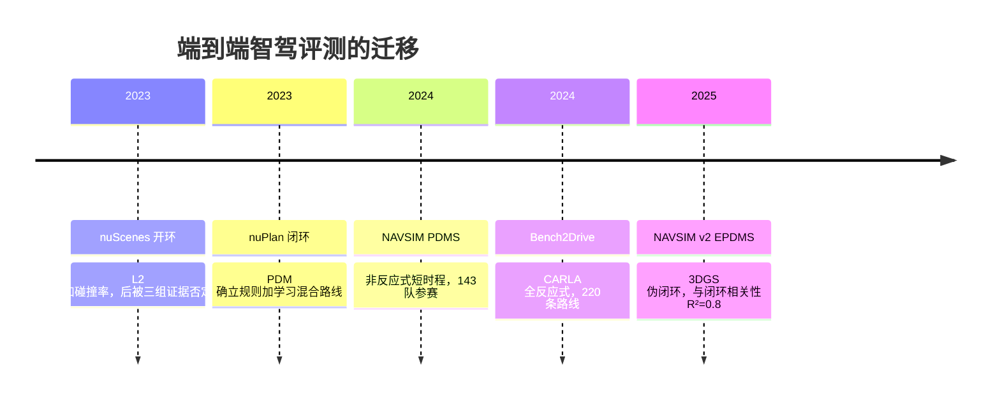

> 这篇讨论端到端智驾的评测方法，不针对任何具体车型或公司，也不构成购买建议。文中引用的论文编号我都逐条核对过 arXiv 页面；公司口径会明确标注来源性质；标注为**未验证**的内容不写成结论。

## 先说结论

端到端智驾这几年最大的进展，可能不是某个模型变强了，而是**大家终于承认原来的评测指标是坏的**。

在被广泛使用的 nuScenes 开环评测里，一个只吃自车历史轨迹、完全不看感知的 MLP，L2 误差能比正经的感知方案还低；在 nuPlan 上，开环指标与闭环表现被证明是**负相关**；在 CARLA 上，开环 SOTA 的两个模型（UniAD、VAD）闭环成绩掉到 40 出头，开环排名和闭环排名直接**反转**。

也就是说，如果你只看 2023–2024 年间大部分端到端论文汇报的那个数字，你很可能排错了名次。

评测体系的迁移方向是清楚的：从 nuScenes 开环，转向 NAVSIM 这类伪闭环，再转向 Bench2Drive、CARLA 这类全反应式闭环。同时，VLA 化之后一个常被忽略的事实是：**主流的智驾 VLA 论文里，没有一篇让语言模型直接输出转向、油门、刹车**——动作最终都由轨迹、waypoint 加上额外的控制层完成。

## 三组证据：开环指标是怎么被否定的

否定开环指标的不是一篇论文，而是三条独立的证据链。

**第一，自车状态泄漏。** 《Rethinking the Open-Loop Evaluation of End-to-End Autonomous Driving in nuScenes》发现，一个只输入自车历史轨迹和状态的 MLP，L2 误差可以比带完整感知的方案低约 20%。原因是 nuScenes 里大量场景是直行，未来轨迹几乎可以由历史轨迹线性外推——模型不需要"看见"任何东西，就能预测得很准。紧接着，NVIDIA 与南京大学合作的《Is Ego Status All You Need for Open-Loop End-to-End Autonomous Driving?》把这件事做到了极致：仅凭 ego status 的 MLP 就能打平 UniAD、VAD、ST-P3 的开环成绩。

**第二，开环与闭环负相关。** TUM 与 ETH 的 PDM 工作给出了最具体的一个数字：把 IDM 的加速度参数从 1.0 调到 0.1，nuPlan 开环 OLS 从 38 升到 48，看起来是"变好了"；但同一配置的闭环 CLS-R 从 77 掉到 54，实际驾驶质量崩了。论文的结论很直接：**在 nuPlan 指标下，开环与闭环负相关**。更精确的 8 秒预测对闭环几乎没有附加价值。

**第三，排名反转的实锤。** Bench2Drive 在 CARLA 上做闭环复测，结果是：UniAD-Base 的开环 L2（0.73）优于 VAD（0.91），但闭环 DS 反而更低（45.81 对 42.35）；nuScenes 开环 SOTA 的 UniAD/VAD 闭环只有 40 出头 DS，明显低于 TCP-traj（59.90）、ThinkTwice（62.44）、DriveAdapter（64.22）；而开环打平 SOTA 的 AD-MLP，闭环 DS 只有 18.05、成功率 0.00。

Bench2Drive 官方仓库在 2025 年 2 月发过一条声明，原话大意是：**L2 error is not a meaningful indicator at all**，作者们应该停止报告 nuScenes 开环规划结果。UniAD 官方仓库也就开环对比单独发过澄清声明。

| 证据 | 做法 | 结果 |
| --- | --- | --- |
| Rethinking（2023） | 纯轨迹 MLP，不用任何感知 | L2 比感知方案低约 20% |
| AD-MLP（CVPR 2024） | 仅 ego status 的 MLP | 开环打平 UniAD/VAD/ST-P3 |
| PDM（CoRL 2023） | 调 IDM 加速度参数 1.0→0.1 | 开环 38→48，闭环 77→54 |
| Bench2Drive（NeurIPS 2024） | CARLA 闭环复测开环 SOTA | UniAD/VAD 闭环 40+ DS，排名反转 |

## 为什么会失效

开环评测的本质是：拿一段真实驾驶日志，让模型预测未来轨迹，和人类司机的轨迹比对，算 L2 和碰撞率。它有两个结构性问题。

**一是模仿学习的因果混淆。** 模型只需要复现人类司机的路径，而不需要理解为什么这样走。日志里 75% 左右的场景是简单直行（NAVSIM 论文转述），这些场景的 L2 对任何合理模型都很低，真正区分能力的长尾场景被平均掉了。

**二是"预测未来"与"控制未来"不是一回事。** 开环里模型预测的轨迹不会改变世界；闭环里车辆的动作会改变其他交通参与者的行为。PDM 那组数字说明：一个在开环里"预测更准"的模型，可能只是更保守或更激进，而在闭环里这两者都可能是灾难。图宾根大学的《Hidden Biases of End-to-End Driving Models》进一步指出，闭环方法同样有隐藏偏差——目标点跟随的横向强偏置、路径点平均导致的纵向减速，这些问题连 infraction 类指标都会掩盖。

## 评测体系在往哪迁移

**NAVSIM** 用真实数据展开的 BEV 抽象做非反应式短时程仿真。它把"开环"里的碰撞概念换成了更细的评分：PDMS = NC × DAC × (5·EP + 5·TTC + 2·Comfort) / 12，其中 NC 是无责任碰撞、DAC 是可行驶区域合规、TTC 是碰撞时间、EP 是相对 PDM-Closed 的进度、Comfort 是平顺性。一个有意思的对照是：UniAD 的 PDMS 是 83.4，没有超过更简单的 TransFuser（84.0），而人类驾驶员是 94.8。

**NAVSIM v2（EPDMS）** 用 3D Gaussian Splatting 生成合成观测，做"伪闭环"：通过改变位置、朝向和速度来近似未来状态。论文报告它与真实闭环仿真的相关性 R²=0.8，而此前的开环方法最好只有 0.7。这是目前"开环便宜、闭环贵"之间最接近的折中。

**Bench2Drive** 是 CARLA 上的全反应式闭环基准：220 条路线、44 种交互场景、五类能力维度，还有配套的训练数据。它也是目前唯一能把"开环 SOTA"和"闭环表现"放在同一张表里对照的公开平台——排名反转就是在这里被抓出来的。

值得注意的是交互性的谱系：NAVSIM 是非反应式的（其他车辆按真实数据重放），CARLA 是全反应式的。**"闭环"这个词在两者之间不能随便互换**，"仿真里表现好"这句话，先要问清楚是哪种闭环。

## VLA 化之后：动作从哪里出来

2024 年下半年起，智驾开始 VLA 化：把视觉语言模型搬进驾驶栈。但把七篇代表工作放在一起看，动作输出只有三种形态，**没有一篇由 VLM 直接输出控制信号**。

| 论文 | 底座 | 动作输出形式 | 最终执行 |
| --- | --- | --- | --- |
| EMMA（Waymo） | Gemini 1.0 Nano-1 | 纯文本：轨迹写成浮点 waypoint 文本 | 坐标转数值，接下游规划 |
| DriveVLM（清华+理想） | Qwen-VL | 自然语言元动作（17 类）+ 轨迹文本 | 慢系统给初始解，快系统精修 |
| Senna | Vicuna-7B | 7 类元动作 + 规划解释 | 元动作嵌入注入 VADv2 系 E2E |
| LMDrive | 7B LLM | 未来 waypoints + 指令完成 flag | 两层 MLP 加两个 PID 控制器 |
| OmniDrive（NVIDIA） | LLaMA2-7B | 文本 QA 形式轨迹 | VLM 直接文本生成轨迹 |
| OpenDriveVLA | Qwen2.5 | 自回归文本轨迹，3 秒 6 个点 | 坐标直接转文本 |
| AutoVLA | 自回归 VLM | 轨迹离散化为动作 token | token 并入词表自回归生成 |

最接近控制的 LMDrive，仍然经由 waypoints 加 PID 控制器兜底。这条边界的含义是：**大模型负责"想"，数值精度和实时控制仍交给传统层。** EMMA 自己承认无法融合 LiDAR 和雷达，闭环验证需要昂贵的传感器仿真，算力开销大。

这也解释了 2025–2026 的技术收敛方向为什么都指向"解码效率"：自回归 VLA 的解码延迟（DriveVLM 慢系统 410ms/帧，需要双 OrinX）和数值精度不足，正是扩散式解码（DiffusionDrive 把去噪步数降到 2 步，NAVSIM 88.1 PDMS、4090 上 45 FPS）、MoE 稀疏化（DriveMoE 在 Bench2Drive 拿到 74.22 DS）和强化学习后训练（AutoVLA 的 GRPO）的共同动机。

## 量产侧为什么看不见这些数字

学术评测重建得再彻底，量产系统的真实数字也不会进入这套体系——这不是缺陷，而是商业现实。把公开信息摊开看，各家发布的技术叙事都很宏大，可核验的量化结果却很少。

| 厂商 | 关键节点 | 技术叙事 | 证据性质 |
| --- | --- | --- | --- |
| 华为 | 2024-04 ADS 3.0（GOD 感知大网 + PDP 网络）；2025-04 ADS 4 的 WEWA 架构（云端世界引擎 + 车端世界行为模型） | 云端生成难例、车端决策 | 发布会与媒体转述 |
| 理想 | 2024-10-23 向 AD Max 全量推送「端到端 + VLM 双系统」；2025-03 发布 MindVLA（MoE 加稀疏注意力基座、扩散模型优化轨迹） | 快系统端到端、慢系统 VLM | 发布会口径 |
| 小鹏 | 2024-04 端到端大模型量产上车；2025-11-05 发布第二代 VLA（去掉语言转译、视觉信号直接生成动作），计划 2026 Q1 向 Ultra 车型推送 | 云端基座加蒸馏车端 | 发布会口径 |
| Tesla | FSD v13（2024-11/12 推送），36Hz 全分辨率输入，纯视觉 | 端到端网络全面升级 | 官方 release notes |
| Waymo | 2025-12 披露 Foundation Model（传感器融合编码器 + Gemini 训练的 VLM + 世界解码器），蒸馏出车载 Student Driver；2026-08 官方长文明确拒绝"纯端到端捷径" | 混合架构 | 官方博客 |

两点值得注意。**第一，中国三家都保留了"快慢双系统"或分层结构**，没有走 EMMA 式"语言模型直接生成全部动作"的路，这与 Waymo"拒绝纯端到端"的判断相近。**第二，这些数字无法进入任何公开评测**：没有权重、没有评测协议、没有可复现的基线，外部只能做架构层面的分析。

所以现状是：**学术侧已经承认开环指标不可信，量产侧则干脆不公布数字。** 双方各说各话，用户能拿到的只有发布会口径。这不是一个健康的状态，但它是当下真实的状态。

## 取舍与局限

**闭环也不是完美的。** EPDMS 的乘法结构有个被社区讨论的问题：任何一个乘法项归零，整体分数就归零，不同失败类型的严重程度被压平。Bench2Drive 自己也提示长路线的 DS 方差较大。闭环评测贵、方差大，这是它至今没有完全取代开环报告的原因——2026 年的新论文仍然普遍"闭环为主加开环为辅"双报。

**协议仍然不可比。** 各家 nuScenes 开环协议不同（是否输入 ego status、用谁的划分、碰撞率怎么定义），EMMA 甚至没有报告碰撞率。跨论文的数字放在一张表里比较，本身就是一种污染。

**公司口径无法用这套方法核验。** 华为 ADS、小鹏二代 VLA、理想 MindVLA 的技术细节多为发布会口径经媒体转述；量产系统不公开权重和评测协议，只能做外部分析。这一点在做"谁更强"的判断时必须诚实。

## 最后留下的结论

端到端智驾的评测重建，是一次**方法论上的自我纠正**：模型预测轨迹准不准，和它开车开得好不好，是两个问题。前者便宜、可复现、能自动化，但它奖励的是对数据的记忆，不是对场景的理解。

现在的共识路径是：**用闭环或准闭环测能力，用开环做回归，别用开环排名。** 对做研究的人来说，这个转向也打开了一个门槛不高的方向：在同一批 checkpoint 上同时算开环与闭环指标、量化它们的相关性——现有证据只有"负相关""排名反转""单点 R²"，跨基准的大样本相关系数还没人系统做过。

## 参考资料

1. [Rethinking the Open-Loop Evaluation of End-to-End Autonomous Driving in nuScenes](https://arxiv.org/abs/2305.10430)
2. [Is Ego Status All You Need for Open-Loop End-to-End Autonomous Driving?](https://arxiv.org/abs/2312.03031)
3. [Parting with Misconceptions about Learning-based Vehicle Motion Planning（PDM）](https://arxiv.org/abs/2306.07962)
4. [Bench2Drive: Towards Multi-Ability Benchmarking of Closed-Loop End-To-End Autonomous Driving](https://arxiv.org/abs/2406.03877)
5. [NAVSIM: Data-Driven Non-Reactive Autonomous Vehicle Simulation and Benchmarking](https://arxiv.org/abs/2406.15349)
6. [Pseudo-Simulation for Autonomous Driving（NAVSIM v2）](https://arxiv.org/abs/2506.04218)
7. [Hidden Biases of End-to-End Driving Models](https://arxiv.org/abs/2306.07957)
8. [UniAD: Planning-oriented Autonomous Driving](https://arxiv.org/abs/2212.10156)
9. [VAD: Vectorized Scene Representation for Efficient Autonomous Driving](https://arxiv.org/abs/2303.12077)
10. [VADv2: End-to-End Vectorized Autonomous Driving via Probabilistic Planning](https://arxiv.org/abs/2402.13243)
11. [EMMA: End-to-End Multimodal Model for Autonomous Driving](https://arxiv.org/abs/2410.23262)
12. [DriveVLM: The Convergence of Autonomous Driving and Large Vision-Language Models](https://arxiv.org/abs/2402.12289)
13. [Senna: Bridging Large Vision-Language Models and End-to-End Autonomous Driving](https://arxiv.org/abs/2410.22313)
14. [LMDrive: Closed-Loop End-to-End Driving with Large Language Models](https://arxiv.org/abs/2312.07488)
15. [OmniDrive: A Holistic Vision-Language Dataset for Autonomous Driving](https://arxiv.org/abs/2405.01533)
16. [OpenDriveVLA](https://arxiv.org/abs/2503.23463)
17. [AutoVLA](https://arxiv.org/abs/2506.13757)
18. [DiffusionDrive: Truncated Diffusion Model for End-to-End Autonomous Driving](https://arxiv.org/abs/2411.15139)
19. [DriveMoE: Mixture-of-Experts for Vision-Language-Action Model in End-to-End Autonomous Driving](https://arxiv.org/abs/2505.16278)
20. [SparseDriveV2: Scoring is All You Need for End-to-End Autonomous Driving](https://arxiv.org/abs/2603.29163)
21. [Hydra-MDP](https://arxiv.org/abs/2406.06978)
22. [TransFuser](https://arxiv.org/abs/2205.15997)
