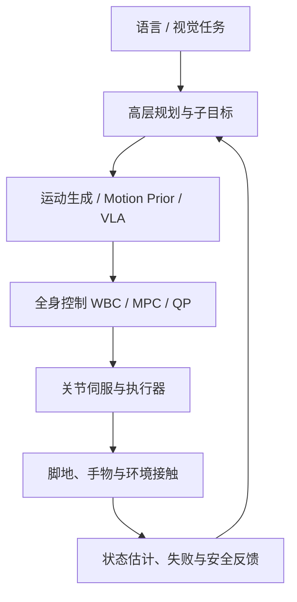

> 人形机器人最容易被误解的地方，是把“会理解任务”和“能稳定走路、接触、搬运”看成同一个问题。公开系统的真实形态更接近分层控制：高层处理语义，中层生成运动，低层处理全身约束、接触和安全。本文把这条链路拆开，不把公司演示当成论文实测。

## 先说结论

**全身控制不是给一个大模型接上电机，而是让不同时间尺度的系统共同完成一个任务。** 语言和视觉模型可以决定“去拿哪个箱子”，但它们不应该直接承担 100–200Hz 的接触控制。真正落地的系统通常仍然包含运动生成、全身控制（Whole-Body Control, WBC）、关节伺服和安全约束。

双足 locomotion 的主流也不是 RL 与 MPC 二选一。RL 擅长从高维接触和非线性里学反馈策略，MPC 与全身 QP 擅长显式处理接触、碰撞、力和关节限制。当前更可信的组合是：**学习高层运动先验或残差，优化器负责可行性与安全。**

H2O 与 HumanPlus 说明 RGB shadowing 和仿真运动模仿可以成为全身遥操作与数据采集入口；Helix 与 GR00T N1 说明 VLA 可以负责语义和动作分布。但 loco-manipulation 的核心——手端接触改变质心、脚步服务于手部可达性、失败后重新站稳——仍然需要专门的全身控制层。

## 从任务到电机，中间至少有四层

高层解决“做什么”，中层解决“动作大致长什么样”，WBC 解决“这个动作在当前接触和关节限制下能不能做”，伺服层则负责把目标变成真实力矩或位置命令。

所谓“端到端”需要仔细解释：有些系统端到端联合训练了视觉语言模块和动作生成器，但这不等于像素直接输出电机力矩。接触、急停、力矩限幅和碰撞约束通常仍在网络之外。

## Locomotion RL 学的不是走路，而是约束下的反馈

典型人形 locomotion 训练使用并行物理仿真与 PPO 类策略优化，动作可以是关节目标、速度或姿态增量。为了从“只追踪速度”走向可用步态，奖励和终止条件往往同时包含：

| 项目 | 作用 | 失败模式 |
| --- | --- | --- |
| 线速度 / 角速度 | 跟随行走指令 | 步态僵硬、滑脚 |
| 基座姿态与角速度 | 保持躯干稳定 | 负载或推扰动下失稳 |
| 足端接触与摆脚高度 | 保持接触逻辑 | 脚尖碰撞、相位错误 |
| 动作平滑、能耗与力矩 | 降低冲击和发热 | 权重过大后不敢迈步 |
| 关节、碰撞、力矩约束 | 保证安全 | 训练很少探索恢复动作 |
| 末端轨迹与物体位姿 | 连接走路和操作 | 手臂完成但质心失稳 |

约束可以通过终止、动作投影、QP 或 control barrier function 实现。CaT 的方法是把约束违反转成随机终止；它的实验平台是 Solo 四足，因此更适合作为约束 RL 的方法学参考，不能直接写成人形实测。

## RL、MPC 和 WBC 怎么分工

| 路线 | 强项 | 短板 | 更适合的位置 |
| --- | --- | --- | --- |
| 纯 RL policy | 高频反馈、非线性接触、隐式步态 | 约束不透明、奖励敏感 | locomotion 低层、残差与运动先验 |
| MPC / 轨迹优化 | 显式预测、接触和约束可解释 | 依赖模型、接触模式搜索贵 | 质心、脚步、力分配与局部规划 |
| WBC / QP | 多任务优先级、关节与碰撞约束 | 依赖模型和权重调参 | 全身执行与安全过滤 |
| 混合路线 | 学习泛化，优化器兜底 | 系统复杂、接口和时延难设计 | 当前最现实的整机方案 |

在人形上，MPC 不会因为 VLA 出现而消失；它更可能被封装成动作可行性、接触和安全层。RL 也不会完全替代规划器，它更适合学习难以手工建模的反馈与残差。

## Loco-manipulation 的难点是接触耦合

单独走路时，脚地接触是主要约束；单独抓取时，底座通常近似固定。Loco-manipulation 把两者放进同一个时空问题：手端外力会改变质心，抓住重物会改变惯量，推拉动作可能要求机器人主动借力，脚步还必须为手端可达性和恢复空间服务。

它至少有三种耦合：

1. **动力学耦合**：手端力、物体惯量通过躯干传到髋膝踝；
2. **接触耦合**：脚地、手物和物体环境的接触模式切换会改变可行控制集合；
3. **规划耦合**：脚步不只为移动，还要为视野、力矩、抓取姿态和失败恢复服务。

因此，简单拼接独立 locomotion policy 与 manipulation policy，往往会在接触切换、负载变化和恢复动作上失效。更合理的接口是让高层提供任务关键帧或末端目标，由全身优化器在当前接触状态下重新求解。

## 人形数据采集不是动作捕捉的终点

H2O 用 RGB 驱动人形全身遥操作，先把人体动作 retarget 到机器人，再用仿真运动模仿器筛选可行轨迹，最后在真实机执行。论文摘要列出了走路、后跳、踢腿、转身、挥手、推和拳击等动态动作。

HumanPlus 则用 RGB shadowing 做人体影随与示范采集，平台是 33 DoF、180cm 定制人形，报告使用 40 小时人体运动数据、每项技能最多 40 条示范，任务成功率为 60%–100%。这些结果说明视觉采集可行，但不能把“能影随”直接等同于“接触动作可执行”。

推荐的 retargeting 管线应该包含：人体估计、形态映射、接触标注、关节和自碰约束、仿真筛选、真实机安全执行，以及成功/失败/恢复标签。**如果只保存人体关键点，不保存接触与失败，得到的只是动作视频，不是可训练的全身控制数据。**

## Helix 与 GR00T 到了哪一步

Figure Helix 的官方技术发布给出 7B System 2、80M System 1、7–9Hz 与 200Hz、35 DoF 上身动作，以及约 500 小时多机器人遥操作数据。它的关键不是大模型直接控制所有电机，而是慢系统把语义写入共享 latent，快系统在高频循环中读取。

GR00T N1 的论文公开了另一种分层：Eagle-2 VLM 做视觉语言解释，DiT 动作模块做实时动作，两者端到端联合训练，并混合真实轨迹、人类视频和合成数据。论文摘要确认了开放人形基座和 Fourier GR-1 上的语言条件双臂操作，但没有在摘要里给出足够的统一真实机成功率，不能把“超过 baseline”扩写成具体百分比。

这两者都证明了“语义慢、动作快”的工程方向，却没有证明全身长时程控制已经解决。公开资料仍缺少统一的跌倒率、人工接管率、接触峰值、能耗和连续运行时长。

## Sim-to-real 的瓶颈在接触和时延

执行器齿隙、摩擦、力矩饱和、电池电压、脚底柔顺、地面材料、相机延迟和总线同步，都会改变真实步态。尤其是接触瞬间，几毫米的高度误差或几十毫秒的延迟都可能把一个可行动作变成跌倒。

所以训练时至少要显式处理：动力学参数随机化、控制与观测延迟、执行器噪声、接触摩擦、观测不完备和恢复动作。Helix 官方材料明确提到训练时使用时间偏移来贴近部署延迟；这类细节往往比“模型有多少参数”更决定整机稳定性。

## 个人研究者的现实路线

没有整机也能做可信研究：

1. 在 Isaac Lab、MuJoCo 或 Genesis 中比较纯 PPO、motion imitation、residual RL 与 MPC/QP safety filter；
2. 做 RGB/VR retargeting benchmark，测关节限位违反率、足底滑移、质心偏移和动作延迟；
3. 用桌面双臂和虚拟双足研究推拉、搬运导致的质心补偿；
4. 主动生成脚滑、掉落、接触丢失和过力轨迹，训练失败检测与恢复策略；
5. 只用 Unitree G1 做低风险动作验证，不一开始追求家庭长时自主。

## 最后留下的结论

人形全身控制的瓶颈不是单一模型容量，而是三个接口没有同时解决：**语义任务到可执行运动，运动到接触与动力学约束，仿真到长时真实运行。**

VLA 可以让机器人更懂任务，RL 可以让它学会复杂反馈，MPC/WBC 可以把接触和安全写进约束，但真正可用的整机系统必须让它们在不同频率上协同。对个人研究者来说，最有价值的不是复制一个 demo，而是把 retargeting、运动先验、接触约束和失败恢复放进一个可复现实验协议。

## 参考资料

1. [H2O: Learning Human-to-Humanoid Real-Time Whole-Body Teleoperation](https://arxiv.org/abs/2403.04436)
2. [HumanPlus: Humanoid Shadowing and Imitation from Humans](https://arxiv.org/abs/2406.10454)
3. [Figure Helix 官方技术发布](https://www.figure.ai/news/helix)
4. [GR00T N1](https://arxiv.org/abs/2503.14734)
5. [CaT: Constraints as Terminations for Legged Locomotion Reinforcement Learning](https://arxiv.org/abs/2403.18765)
6. [Unitree G1 官方规格](https://www.unitree.com/g1)
7. [Unitree H1 官方规格](https://www.unitree.com/h1)
8. [Isaac Lab](https://github.com/isaac-sim/IsaacLab)
9. [MuJoCo Playground](https://github.com/google-deepmind/mujoco_playground)
10. [HumanoidBench](https://github.com/carlosferrazza/humanoid-bench)
