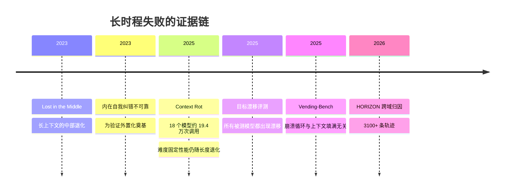

> 这篇梳理长时程（long-horizon）Agent 的工程方法。核心概念是"harness"——模型之外的那套循环、上下文管理、工具接口与验证机制。文中数字区分一手来源与转述，未核实的不写成结论。

## 先说结论

**Agent 不等于模型，而是模型加 harness。** 同一模型配不同的外置工程，表现可以相差数倍，甚至能让模型排名逆转——这一点在 2026 年已经被两篇实证论文量化。

长时程任务的失败有系统性证据：**上下文腐烂**（任务难度固定，性能仍随输入变长而退化）、**错误雪球**（单点错误沿后续决策传播放大）、**目标漂移**（所有被测模型都出现）、**崩溃循环**（与上下文是否填满无关，是行为失控而非记忆溢出）。

工程上最有价值的结论来自一份产业文档：**即使是最强模型加自动压缩，只给一个高层提示词也完不成跨几十个上下文窗口的生产级任务。** 这不是靠压缩或更大窗口能解决的，而是要靠外置的 harness——需求清单、进度文件、git 提交、端到端核对点。

## 任务分三层，最难那层最缺方案

有综述给出了一个目前最完整的形式化：Agent = π_θ ⊕ H，即模型策略与外置 harness 的组合系统。任务按跨度分三层：

- **H1**：单上下文窗口内能完成（分钟级）；
- **H2**：跨上下文窗口（小时到天级）；
- **H3**：开放式自主研究。

三者为包含关系。**H2 是当前最薄弱、最缺系统方案的环节**——它的问题是"状态如何跨越窗口边界"，而现有的所有可行方案，本质都是"把状态外化到文件系统，再用流程强制重读"。

## 四类失败模式都有实证

**上下文腐烂**的证据来自一份技术报告：18 个模型、约 19.4 万次调用，三个关键发现——即使任务难度固定，性能也随输入 token 增加一致退化；干扰信息与问题的语义相似度决定退化速度，**一个干扰项就能显著掉分**；还有一个反直觉发现，所有模型在句序打乱的文本上表现更好，说明结构连贯性本身消耗注意力。

**错误雪球**的机制根源已经被定位。一篇 2023 年的论文证明，模型难以仅凭自身可靠地完成内在自我纠错，纠正后性能甚至可能下降；更细的定位是——**这是"检测问题"而非"纠正问题"**：模型找不到推理链里的逻辑错误，但给定错误位置后能跨任务可靠纠正。这直接推出 harness 的第一原则：**验证必须外置。**

**目标漂移**在压力设置下，所有被测模型都出现；最强的配置能在长上下文中维持超过 10 万 token 的近乎完美遵循。Vending-Bench 提供了更极端的证据：模拟经营自动售货机，单次运行可超 2000 条消息；所有模型都有"陷入崩溃循环且极少恢复"的运行，**且与上下文窗口是否填满没有明确相关性**——不是记忆溢出，是行为失控。

## Harness 武器库收敛为六件套

**循环与工作流、上下文与记忆、工具与技能、编排、钩子、验证。** 其中产业界已经形成几条公认套路：

| 原则 | 具体做法 | 理由 |
| --- | --- | --- |
| KV 缓存命中率优先 | 前缀必须逐字节稳定 | 缓存与未缓存输入价差约 10 倍 |
| 上下文 append-only | 不回溯改写历史动作 | 保持前缀稳定 |
| 文件系统即上下文 | 正文外置，只留指针 | 压缩策略必须可恢复 |
| 复述目标 | 反复重写 todo 到上下文尾部 | 对抗中部退化 |
| 错误留痕 | 不擦除失败记录 | 抹掉错误等于抹掉证据 |

另外三条来自平台的工程实践：**压缩**（接近上限时总结重启，保留架构决策与未解决 bug）、**结构化笔记**（把笔记持久化在上下文之外按需拉回）、**子代理蒸馏**（子代理在干净上下文里探索，只返回蒸馏摘要）。

## 压缩不够，这是最硬的产业证据

有一份 2025 年 11 月的官方文档值得单独说，因为它用最直白的方式否定了"模型变强就够了"：

即使是最强模型加上官方的 agent SDK 与自动压缩循环，只给一个高层提示词也会失败。典型失败模式有两种：**过早收敛**（直接采用第一版方案）与**过早宣布完工**。

对策是两段式 harness：初始化 agent 负责搭脚手架——把需求拆解成两百多项带验收标准的功能清单、初始化 git、写启动脚本；执行 agent 按清单逐项实现并维护进度文件，每完成一项就提交。结论的原话是：跨上下文窗口的长任务**"不是靠压缩或更大的上下文窗口解决的，而是靠 harness"**。

这解释了一个反直觉现象：为什么用户能观察到"模型明明很强，但长任务还是做不完"——因为跨窗口的状态管理根本不是模型能力问题。

## 多代理之争其实是任务差异

产业界在这个问题上公开分歧过：

- **正方**：研究类任务上，中心编排加 3–5 个并行子代理，相对单代理提升 90.2%，并行化把耗时缩短最多 90%。代价是约 15 倍 token。
- **反方**：主张默认单线程加上下文压缩，理由是子代理读不到主代理的完整轨迹，会各自基于冲突假设行动，并且提出两条原则——共享完整轨迹，行动携带隐含决策。
- **折中共识**：多代理只用于**可并行、子任务可独立验证、结果可蒸馏**的场景（调研、广度搜索）；编码等强依赖共享上下文的任务默认单线程。

所以这不是"谁对谁错"，而是任务可并行性与可验证性的差异。真正未解决的是**跨代理上下文传递**——反方承认尚无人专门解决，并赌它会随单模型能力提升而"免费"消失，这个赌注还没有被检验。

## 内化路线：哪些能力已经被训进模型

另一条路线是训练，而不是工程。已经证明可以内化的能力包括：**工具调用**（用自合成的 agentic 数据加联合 RL 训出强工具使用）、**记忆与上下文管理策略**（用 RL 训出近常数内存的上下文管理）、**环境探索与纠错**（自演化课程把 8B 模型在浏览器任务上从 4.8% 提到 42.4%）、**自我评估**。

但长期上下文**可靠性**没有同步跟上：一项测试发现，13 个宣称 128K 窗口的模型中 11 个在 32K 就跌破短文本基线的一半；另一份报告显示，宣称 32K 以上的模型只有约一半在 32K 保持满意性能。**加长窗口训练不等于可靠的长上下文。**

## 2026 年的新争点：披露 harness

这是我认为最值得关注的变化。

两篇 2026 年的实证工作给出了同一个结论：**harness 造成的性能方差可以超过模型方差，甚至导致模型排名逆转。** 一篇提出"约束绑定论题"，把 harness 形式化为闭环控制器；另一篇用 106 个沙箱任务、5194 条轨迹遍历"模型 × harness"配对，主张 agent 能力应该**在配置层面报告**。

这意味着当前多数 agent 排行榜是误导性的：不披露 harness 的排名，就像不报随机种子的实验结果。但社区还没有形成像"随机种子"那样的披露惯例。

## 最后留下的结论

长时程 Agent 的核心矛盾是：**模型能力在涨，但跨窗口的状态管理不是模型能力能解决的。** H2 层的所有可行方案都是工程性的——外化状态、强制重读、外置验证。

对做产品的人来说，值得先做的是：把验证从模型自觉改成确定性门控（比如用钩子在工具调用前硬阻断），把目标复述和进度文件做成标准动作，把错误留在上下文里而不是擦掉。

对做研究的人来说，这个领域缺的是**受控对照**：同一模型换 harness 的增益，对比换模型或换训练的增益——截至目前的公开材料里还没有这样一份实验。而 2026 年那两篇方差分解的论文，已经把方法论准备好了。

## 参考资料

1. [METR: Measuring AI Ability to Complete Long Software Tasks](https://arxiv.org/abs/2503.14499)
2. [Context Rot（Chroma 技术报告）](https://research.trychroma.com/context-rot)
3. [Lost in the Middle: How Language Models Use Long Contexts](https://arxiv.org/abs/2307.03172)
4. [Vending-Bench: A Benchmark for Long-Term Coherence of Autonomous Agents](https://arxiv.org/abs/2502.15840)
5. [Why Do Multi-Agent LLM Systems Fail?（MAST）](https://arxiv.org/abs/2503.13657)
6. [Large Language Models Cannot Self-Correct Reasoning Yet](https://arxiv.org/abs/2310.01798)
7. [LLMs cannot find reasoning errors, but can correct them given the error location](https://arxiv.org/abs/2311.08516)
8. [Evaluating Goal Drift in Language Model Agents](https://arxiv.org/abs/2505.02709)
9. [Kimi K2: Open Agentic Intelligence](https://arxiv.org/abs/2507.20534)
10. [MEM1: Learning to Synergize Memory and Reasoning for Efficient Long-Horizon Agents](https://arxiv.org/abs/2506.15841)
11. [WebRL: Training LLM Web Agents via Self-Evolving Online Curriculum RL](https://arxiv.org/abs/2411.02337)
12. [NoLiMa: Long-Context Evaluation Beyond Literal Matching](https://arxiv.org/abs/2502.05167)
13. [TheAgentCompany: Benchmarking LLM Agents on Consequential Real World Tasks](https://arxiv.org/abs/2412.14161)
14. [Manus: Context Engineering for AI Agents](https://manus.im/blog/Context-Engineering-for-AI-Agents-Lessons-from-Building-Manus)
15. [Anthropic: Effective context engineering for AI agents](https://www.anthropic.com/engineering/effective-context-engineering-for-ai-agents)
16. [Anthropic: Effective harnesses for long-running agents](https://www.anthropic.com/engineering/effective-harnesses-for-long-running-agents)
17. [Anthropic: How we built our multi-agent research system](https://www.anthropic.com/engineering/built-multi-agent-research-system)
18. [Cognition: Don't Build Multi-Agents](https://cognition.com/blog/dont-build-multi-agents)
19. [MCP 安全与工具投毒——Invariant Labs 披露](https://invariantlabs.ai/blog/mcp-security-notification-tool-poisoning-attacks)
