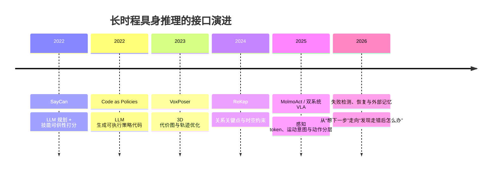

> 长时程任务的难点不是让机器人多记几帧，而是让它在中途出错后知道“错在哪里、还能不能继续、下一步该改变什么”。本文把推理接口、双系统、记忆和恢复放在同一条链路里看；Helix 的频率与参数来自官方技术发布，π/GR00T/论文数字来自一手论文或官方材料，未验证的工业宣传不写成事实。

## 先说结论

具身智能的长时程能力，正在经历一次接口变化：高层自然语言子目标，逐渐变成代码、3D 代价图、关系关键点、latent 和中间层 token。接口越接近空间与控制，信息瓶颈越小，但可解释性也越弱。

工业界最常见的工程答案是双系统：慢的语义/推理系统负责“接下来想做什么”，快的动作系统负责“现在怎么动”。Figure Helix 官方给出的配置是 7B System 2 以 7–9Hz 工作，80M System 1 以 200Hz 生成连续动作；GR00T N1 也是 VLM 慢系统加 DiT 动作系统。

但双系统不等于长时程推理已经解决。机器人在第十步出错，通常不是上下文窗口不够，而是缺少**可检测的状态、可查询的记忆、可执行的恢复动作和统一的长时程评测**。

## 接口如何从语言变成空间

SayCan 的价值是把 LLM 的语言规划接到机器人技能的可供性评分上；Inner Monologue 再加入闭环语言反馈；Code as Policies 让模型生成可执行代码，扩大了技能组合空间。

但语言作为中间接口有一个结构性问题：它描述的是“意图”，不是完整的几何和接触状态。VoxPoser 把接口变成 3D 价值图，ReKep 更进一步，让 VLM 生成关系关键点约束和过渡约束，再交给优化器实时求解。接口从“告诉低层做什么”变成“给低层一个可验证的几何目标”。

这条演进可以概括为：**语言提供语义，空间提供约束，latent 提供带宽，记忆提供时间。** 长时程系统需要四者配合，而不是选择一个万能接口。

## 双系统解决的是频率，不是认知

Helix 与 GR00T 的共同结构是“大而慢的语义模型 + 小而快的动作模型”。它们之间用连续 latent 或 VLM 中间层 token 连接，避免让 7B 级模型直接承担 100–200Hz 的控制。

这是一种合理的工程解耦，但不能把它直接等同于认知科学里的 System 1/System 2。工业双系统主要解决的是参数规模、控制频率和部署硬件问题；它未必拥有真正的慢思考、反事实推演和长期目标管理。

π 系列和 Gemini Robotics 1.5 选择了另一条路线：不把慢模型和快模型完全拆开，而是在单模型或交错推理中让动作与推理互相条件化。两条路线还没有在同一数据、同一硬件和同一长时程协议下对比。

## 记忆不是一个模块

具身记忆至少有三种形态。

**技能库记忆。** Voyager 让 LLM 把可执行代码存进技能库，再通过语义检索组合。它适合“我以前学过怎么做”，但真实机器人技能还要附带本体、环境和安全前提。

**场景记忆。** 3D-Mem 用 memory snapshots 和 frontier snapshots 记录探索过与未探索区域，让 VLM 在场景索引上推理。它适合“我在哪里见过这个物体”，是空间层记忆。

**经验检索。** Embodied-RAG、RoboMemory、MemER 试图从历史轨迹、关键帧和语义事件里检索相似经验。它们回答的是“上次遇到类似失败时怎么恢复”。

| 记忆类型 | 记住什么 | 适合解决 | 主要风险 |
| --- | --- | --- | --- |
| 技能库 | 可执行程序或动作模板 | 复用已学技能 | 技能前提过期、本体依赖 |
| 场景记忆 | 位置、物体、探索状态 | 长空间任务 | 地图漂移、视角变化 |
| 经验记忆 | 轨迹、关键帧、失败后果 | 选择恢复策略 | 检索相似但因果不同 |
| 参数化记忆 | 训练进模型的能力 | 高频、低延迟执行 | 更新成本高、不可解释 |

Knowledge Insulation 代表参数化路线：通过训练目标保护 VLM 的语义知识，同时让动作专家学习控制。外部记忆路线则更容易更新和审计。短任务里参数化记忆够快；跨会话、跨场景的长期记忆仍更适合外部检索。

## 错误恢复才是长时程的分水岭

把错误处理拆成四个环节：检测、归因、恢复、重规划。

AHA 用 FailGen 对成功演示做程序化扰动，建立失败检测数据；REFLECT 把失败经验总结成层级文本，再让 LLM 解释原因。FailSafe 构造失败—恢复动作对，AFIL 让预训练 VLA 自己生成失败 rollout，CARE 则把执行失败转换成纠正机会。

这些工作说明研究重点已经从“成功率是多少”转向“失败后能否回来”。但闭环证据仍然薄弱：很多实验在仿真或受控真机上进行，真正报告无人干预恢复率、恢复时间、人工接管次数的工作很少。

**一个长时程系统的最低恢复闭环应该是：**

1. 发现当前状态偏离预期；
2. 区分可恢复错误与不可恢复错误；
3. 从历史记忆中找到相似但不盲从的经验；
4. 生成一个低风险纠正动作；
5. 执行后重新估计状态；
6. 决定继续原计划、改写子目标或安全停止。

缺任何一环，系统都可能出现“知道失败，但只会重试同一个错误”。

## 为什么第十步容易出错

长时程误差有三个来源。

**接口误差累积。** 高层给出的子目标如果含糊，低层每次执行都会把小误差带到下一步。

**观测分布漂移。** 任务前几步通常在训练分布内，到了第十步，物体位置、遮挡、接触状态已经不同，策略面对的是从未见过的组合。

**记忆与现实不同步。** 场景记忆记住了物体在桌上，但物体已经被推走；技能库记住了“拉开抽屉”的动作，却没有记录把手被卡住后的后果。

所以更长的上下文并不自动等于更好的长时程能力。上下文如果没有状态抽象、时间戳、因果标签和失败后果，只会把更多过期信息送给规划器。

## 评测为什么跟不上

LIBERO 仍然是常用基准，但任务多为短程操作，且已经出现饱和和复现性讨论。FurnitureBench、BEHAVIOR-1K、HomeRobot OVMM 更接近真实长任务，但采用度和统一协议不足。当前没有公认的小时级基准。

我认为长时程评测至少要报告：

- 完整任务成功率；
- 每个子任务的失败位置；
- 错误检测延迟；
- 无人干预恢复率；
- 平均恢复时间和人工接管次数；
- 跨天、跨物体和跨场景方差。

只报“最终完成了”会掩盖系统是在第 2 步还是第 20 步失败，也无法区分记忆、推理和动作模型的贡献。

## 个人研究者的切入点

不需要训练一个更大的 VLA，也可以研究长时程：

1. 给开源策略加一个外部关键帧记忆，做有/无检索的受控消融；
2. 用 The Colosseum 一类扰动生成失败轨迹，训练跨策略失败检测器；
3. 把“扰动后恢复成功率”设成主指标，而不是只看任务成功率；
4. 固定低层执行器，对比语言子目标、ReKep 约束和 latent 接口的误差累积；
5. 用桌面双臂或仿真构造 1 小时 endurance 测试，统计人工接管与失败类型。

## 最后留下的结论

长时程具身智能不是一个更大的上下文窗口，而是一套更完整的闭环：**接口要能承载几何，记忆要能随时间更新，检测要能发现偏离，恢复要能改变策略，评测要能记录失败发生在哪里。**

双系统解决了快慢频率，外部记忆解决了可更新性，VLA 解决了语义泛化，但它们都不能单独保证第十步之后仍然可靠。下一阶段真正有价值的进展，可能不是再增加一个“会规划”的模型，而是让机器人在失败后真的能继续工作。

## 参考资料

1. [SayCan](https://arxiv.org/abs/2204.01691)
2. [Inner Monologue](https://arxiv.org/abs/2207.05608)
3. [Code as Policies](https://arxiv.org/abs/2209.07753)
4. [VoxPoser](https://arxiv.org/abs/2307.05973)
5. [ReKep](https://arxiv.org/abs/2409.01652)
6. [RT-H: Action Hierarchies Using Language](https://arxiv.org/abs/2403.01823)
7. [Towards Synergistic, Generalized, and Efficient Dual-System for Robotic Manipulation](https://arxiv.org/abs/2410.08001)
8. [MolmoAct](https://arxiv.org/abs/2508.07917)
9. [π0](https://arxiv.org/abs/2410.24164)
10. [π0.5](https://arxiv.org/abs/2504.16054)
11. [Knowledge Insulating VLA Models](https://arxiv.org/abs/2505.23705)
12. [π*0.6](https://arxiv.org/abs/2511.14759)
13. [GR00T N1](https://arxiv.org/abs/2503.14734)
14. [Voyager](https://arxiv.org/abs/2305.16291)
15. [3D-Mem](https://arxiv.org/abs/2411.17735)
16. [Embodied-RAG](https://arxiv.org/abs/2409.18313)
17. [RoboMemory](https://arxiv.org/abs/2508.01415)
18. [MemER](https://arxiv.org/abs/2510.20328)
19. [REFLECT](https://arxiv.org/abs/2306.15724)
20. [AHA](https://arxiv.org/abs/2410.00371)
21. [FailSafe](https://arxiv.org/abs/2510.01642)
22. [AFIL](https://arxiv.org/abs/2605.08434)
23. [Foresight](https://arxiv.org/abs/2606.23085)
24. [LIBERO](https://arxiv.org/abs/2306.03310)
25. [FurnitureBench](https://arxiv.org/abs/2305.12821)
