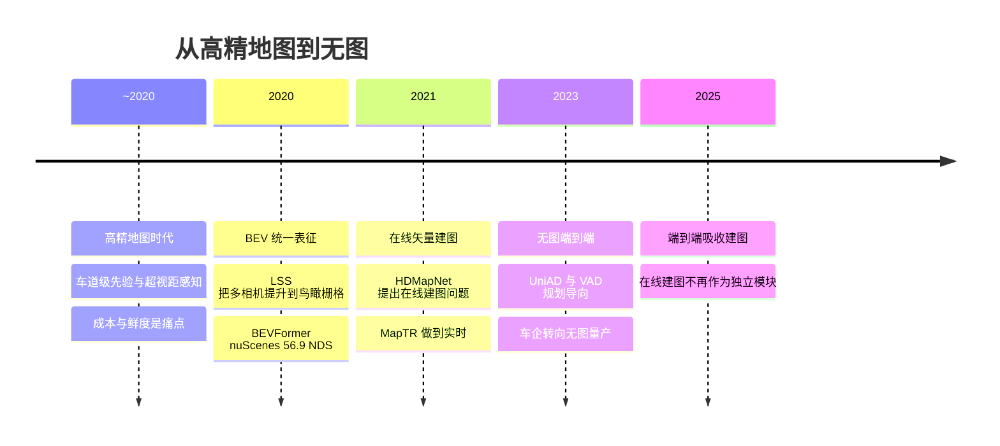

> 这篇讨论无图智驾背后的感知与建图技术，以及这个说法在技术上的准确含义。车企口径按官方表述引用，媒体转述单独标注；**未验证**的内容不写成结论。文中不涉及传感器配置的比较，那部分可以看之前写的《特斯拉纯视觉与国产智驾》。

## 先说结论

**"无图"不是一个技术事实，而是一个相对说法：去掉的是车道级高精地图（HD map），保留的是导航地图（SD map）。**

这个边界很具体。理想官方的表述是"不依赖包括高精地图在内的先验信息，可在有导航覆盖的道路上使用"；小鹏的口径是"能导航的地方，就能 AI 智驾"，其高管公开称 XNGP 为"轻地图方案"。也就是说，**功能边界等于导航覆盖范围**——没有被去掉的粗先验，恰恰定义了这套系统能开到哪里。

技术上真正发生的事是：用车端实时的 BEV 感知、在线矢量建图、导航地图先验和车端拓扑推理，替代了"高精地图的生产与订阅依赖"。这条路线的代价是把一部分此前由地图承担的工作——超视距的"虚拟感知"、车道级拓扑——转移给了车端模型的推理能力和算力。

还有一个值得记住的负面发现：**关于雨雾、夜间、无车道线等极端场景，公开可核实的量化证据非常少**。能查到的只有官方演示口径和第三方基准的负面结论（BEV 模型在雾、雪、暗光下普遍显著掉点），而不是"某家系统在雨夜城区跑得如何"的实测数据。行业宣传和公开证据之间的差距，在这个话题上尤其大。

## 三个阶段

**高精地图时代的痛点有两类。** 一类是成本与鲜度：HDMapNet 论文开篇就指出，离线高精地图的人工采集标注成本高、难以随道路变化扩展。另一类在中国更特殊——监管。2022 年 8 月自然资源部明确，智驾传感器在运行和路测中采集的空间坐标、影像、点云属于测绘行为，须由具备导航电子地图制作资质的单位承担。无资质车企自建高精地图更新体系的合规成本很高，这是"去高精地图"最直接的政策推力之一。

**BEV 统一表征解决的是"多相机怎么在一个坐标系里融合"。** LSS（Lift-Splat-Shoot）把每个相机的特征沿视锥提升到 3D 再投影到鸟瞰栅格；BEVFormer 用时空 Transformer 直接从多相机学习 BEV，在 nuScenes 测试集上把 NDS 推到 56.9%（比此前最佳高 9.0 个点）；StreamPETR 用目标中心的时序建模做到 67.6% NDS，轻量版 31.7 FPS。这些工作的意义是把"感知"从各自为战的透视视图，变成一个可供预测和规划共享的统一表征。

**在线矢量建图是"无图"在学术上的直接对应物。** HDMapNet（2021）第一次把"从传感器在线生成矢量地图"作为问题提出；MapTR（ICLR 2023 Spotlight）用置换等价点集建模加层级二分匹配，把这件事做到实时——nano 版在 RTX 3090 上 25.1 FPS，比当时 SOTA 纯视觉方法快 8 倍；MapTRv2（IJCV 2024）加速收敛并在两个数据集上达到 SOTA。最新的方向是把建图形式化为**跟踪**问题：MapTracker（ECCV 2024 Oral）用 BEV 栅格与矢量双记忆缓冲处理时序一致性，一致性指标提升 19%，直接回应了逐帧建图闪烁不稳定的问题。

## 在线建图：学术很热，量产很冷

这是这篇里我认为最值得记下来的一个判断。

在线矢量建图在 2021–2024 年论文密集，但车企转向端到端之后（理想 2024 年 10 月的端到端加 VLM 双系统、华为 ADS 4 的 WEWA、特斯拉 FSD v12 的单一网络），**显式的在线矢量建图在量产架构中不再作为独立模块存在**——端到端训练把建图的输出隐式吸收进了特征。

这不是说建图研究没用了，而是它的角色变了：从"输出一张可读的地图给下游"变成"作为一种中间监督或表征学习任务"。学术界最后的活跃点是把建图做成跟踪、以及与导航地图先验融合（Neural Map Prior 一类工作用 SD 地图增强在线建图——这本身也说明"无图"在往回摆为"轻图"）。

**BEV 内部其实有两条技术路线。** 自底向上（bottom-up）以 LSS 为代表：把每个相机的特征沿视锥"提升"到 3D 再投影到鸟瞰栅格，后续的 BEVDet、BEVDepth 都沿此改进。自顶向下（top-down）以 DETR3D、PETR 系列的 query-based 检测为代表：用预设的查询直接向图像特征取信息。BEVFormer 属于后者的时空版本。两条路线后来在工程上趋于混合，但它们的差异解释了一个现象：**深度估计的误差来源不同**——自底向上路线对深度分布敏感，自顶向下路线则更依赖查询与视图的对应关系。

**量产时间线方面**，几个可核验的节点是：

| 时间 | 事件 |
| --- | --- |
| 2023-04 | 华为发布 ADS 2.0，官方表述"有图无图都能开" |
| 2023-10 | 小鹏科技日宣布 XNGP 进入无图时代，首批 20 城 |
| 2024-02 | 小鹏开放至"全国不限城市、不限路线、不限路况" |
| 2024-07 | 理想 OTA 6.0 全量推送无图 NOA（仅 AD Max）；小鹏 XOS 5.2.0 全量 |
| 2024-10 | 理想 OTA 6.4 推送端到端加 VLM 双系统 |
| 2025-04 | 华为 ADS 4（WEWA 架构） |

这条时间线的跨度是两年多：从"宣布无图"到"端到端吸收建图"，行业把一张车道级地图的生产问题，换成了车端模型的能力问题。

## Occupancy：纯视觉开集感知的答案，和它的四个瓶颈

长尾障碍物（异形车、掉落物、施工设施）用传统闭集检测很难覆盖。车端的答案是不做闭集分类，改做**占用预测（Occupancy）**：判断体素是否被占用、是否可行驶，把"这是什么"的问题换成"这里能不能走"的问题。特斯拉在 2022 年 AI Day 提出 Occupancy Network，华为的 GOD（通用障碍物检测）也是类似的思路。

学术侧的基准和真值管线也成熟了：OccNet 把占据作为统一多任务表征、附 OpenOcc 基准；Occ3D 提供 Waymo 和 nuScenes 双基准与 visibility-aware 标签；FB-OCC 拿到 CVPR 2023 占据挑战赛冠军，nuScenes mIoU 54.19%。但这条路线有四个明确的瓶颈：

| 瓶颈 | 具体表现 |
| --- | --- |
| 真值昂贵 | OpenOccupancy 用约 4000 人工小时把标注增密约 2 倍；Occ3D 用三阶段半自动管线 |
| 几何误差传导 | 纯视觉占据依赖深度估计，深度不确定性会传到占用判断 |
| 算力与延迟 | 稠密体素预测计算量大，冠军方案靠模型扩缩才到精度，车端需要小得多的头 |
| 可见性与远距离 | 遮挡区域的标签本身就需要推断，远距离体素监督信号很弱 |

真值质量的上限决定模型的上限——这句在占据任务里尤其成立。

## 无图之后，定位靠什么

高精地图时代，定位的闭环是"GNSS-RTK 加惯导推算，再把点云和高精地图做配准"。去掉地图之后，这套机制被重构为三层：

1. **粗先验**：导航地图给出道路级先验和功能边界，定位从"地图匹配"退化为"导航引导加实时感知对齐"；
2. **高频局部里程计**：激光雷达-惯性里程计成为关键组件（FAST-LIO2 以紧耦合迭代卡尔曼滤波加工直接配准实现高精度低算力的 LIO；Point-LIO 用逐点更新应对高动态与高带宽 IMU），在隧道、城市峡谷这类 GNSS 退化场景承担全部位姿递推；
3. **重定位**：视觉位置识别与场景重定位决定"上电即定位"的能力。

这条链在正常场景是够用的，但在 GNSS 长期退化的场景（长隧道、密集高架）会更脆弱——这是一个基于组件特性的分析结论，量产的完整方案细节多不公开。

## 极端场景：证据为什么这么少

调研里我专门找了"雨雾、夜间、无车道线"的公开硬证据，能核实的只有三类：

- **官方演示口径**：理想发布会提到 VLM 负责无路灯夜间、坑洼、减速带、施工区；小鹏官方称覆盖掉头、环岛、窄路；华为 ADS 4 的公开数字是重刹率降低 30%、高速 L3 仿真验证 6 亿公里——注意这是仿真里程，不是雨雾实车数据；
- **第三方基准的负面结论**：RoboBEV 用 8 类传感器退化（明暗、雾、雪、运动模糊等）测 BEV 模型，结论是普遍显著掉点；
- **试点运营的公开事件**：特斯拉 Robotaxi 上线首日出现急刹等问题引发监管关注（媒体报道）。

至于"某家系统在雨夜城区跑得怎么样"这类流传案例，公开渠道只有自媒体线索，**没有可核实的量化数据**（成功率、接管率、事故率）。这个负面发现本身值得记住：**行业对恶劣天气的公开量化证据基本缺位**，目前只有演示级证据和基准级的负面结论。

## 取舍与局限

**无图不是免费的。** 去掉高精地图意味着把地图承担的职责转移到车端：更大的感知算力、更强的在线推理、以及一层新的合规问题——监管要求智驾测绘数据由持资质图商处理，因此"无图方案"的定位栈实际上常与图商的轻地图产品耦合。小鹏称自己是"轻地图方案"，这个措辞比"无图"更准确。

**基准与量产之间已经脱节。** nuScenes 的检测榜刷点收益递减（相机方法 NDS 三年从 56.9 涨到论文自报的约 70.9，未经官方榜单核对），而量产功能的瓶颈早就不在这个基准所测的对象上。CVPR 2025 的挑战赛风向已经转向世界模型与端到端 2.0。

**开集感知有两条平行线。** 车端的范式是"不分类、判占用"（Occupancy、GOD）；学术的开放词汇 3D 检测（用 2D VLM 先验发现新类别）刚起步，还没有看到量产上车的公开证据。两条线什么时候汇合，是个开放问题。

## 最后留下的结论

无图智驾去掉了高精地图这张"提前画好的车道级底图"，但保留了导航先验，并把车道级的理解交给了车端实时推理。真正的技术含量不在"有没有图"这个口号里，而在三件事上：在线感知的时序一致性、占用预测的真值与算力、以及定位在 GNSS 退化时的稳健性。

如果要做一个具体判断：**看到"无图"的宣传时，问一句"极端天气下的接管率和成功率有没有公开数据"。** 目前这个问题几乎没有公开答案，而这恰恰是用户最需要知道的部分。

## 参考资料

1. [HDMapNet: An Online HD Map Construction and Evaluation Framework](https://arxiv.org/abs/2107.06307)
2. [VectorMapNet: End-to-end Vectorized HD Map Learning](https://arxiv.org/abs/2206.08920)
3. [MapTR: Structured Modeling and Learning for Online Vectorized HD Map Construction](https://arxiv.org/abs/2208.14437)
4. [MapTRv2](https://arxiv.org/abs/2308.05736)
5. [MapTracker: Tracking with Strided Memory Fusion for Consistent Vector HD Mapping](https://arxiv.org/abs/2403.15951)
6. [Lift, Splat, Shoot](https://arxiv.org/abs/2008.05711)
7. [BEVFormer](https://arxiv.org/abs/2203.17270)
8. [StreamPETR: Exploring Object-Centric Temporal Modeling](https://arxiv.org/abs/2303.11926)
9. [Scene as Occupancy（OccNet）](https://arxiv.org/abs/2306.02851)
10. [Occ3D: A Large-Scale 3D Occupancy Prediction Benchmark](https://arxiv.org/abs/2304.14365)
11. [OpenOccupancy](https://arxiv.org/abs/2303.03991)
12. [FB-OCC](https://arxiv.org/abs/2307.01492)
13. [RoboBEV: Towards Robust Bird's Eye View Perception under Corruptions](https://arxiv.org/abs/2304.06719)
14. [UniAD: Planning-oriented Autonomous Driving](https://arxiv.org/abs/2212.10156)
15. [VAD](https://arxiv.org/abs/2303.12077)
16. [DiffusionDrive](https://arxiv.org/abs/2411.15139)
17. [FAST-LIO2](https://arxiv.org/abs/2107.06829)
