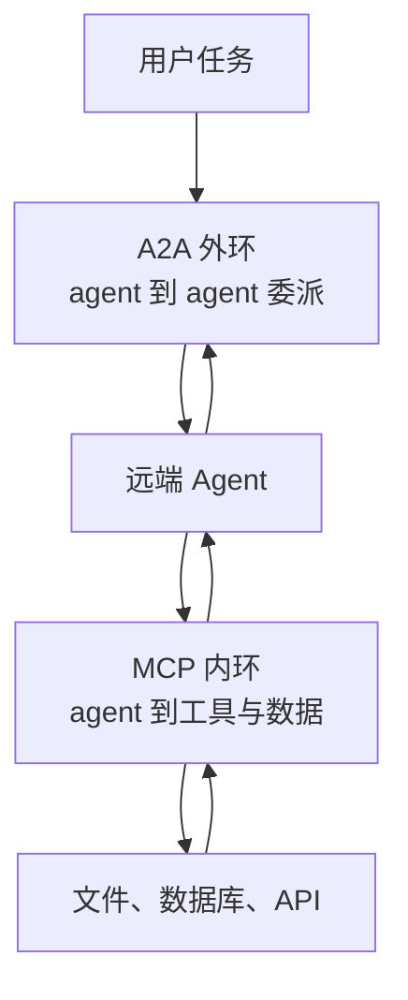

> 这篇梳理 Agent 互操作协议（MCP 与 A2A）的格局。协议细节以官方规范为准；生态数字区分官方口径与第三方统计；未核实内容不写成结论。

## 先说结论

2024 年底到 2026 年，Agent 互操作协议经历了一场从"竞争叙事"到"治理收敛"的完整过程：

- **MCP**（Model Context Protocol，Anthropic 2024-11 发起）管 **agent 与工具/数据之间**的连接；
- **A2A**（Agent2Agent Protocol，Google 2025-04 发起）管 **agent 与 agent 之间**的任务委派；
- 两者从第一天起就互相定位为互补（A2A 官宣原文即称自己是"对 MCP 的补充"）；
- 2025 年 6 月 A2A 捐入 Linux Foundation，2025 年 12 月 MCP 捐入该基金会新设的 Agentic AI Foundation，2026 年 8 月 A2A 也加入同一个基金会。

**"协议标准之战"基本结束了。** 但真正的分歧转移到了三个新地方：**工具投毒与供应链攻击**、**代码执行对逐个工具调用的替代**、以及**跨协议信任的空白地带**。

## 两个协议的分工

一句话记忆：**MCP 在"内环"（agent 怎么用工具），A2A 在"外环"（agent 怎么找另一个 agent 干活）。** A2A 规范附录里给的协作示例正是这个嵌套结构——A2A 客户端把任务委派给远端 agent，后者在自己的内部通过 MCP 调用底层工具。

两者的设计取向差异很能说明定位：

| 维度 | MCP | A2A |
| --- | --- | --- |
| 架构 | host / client / server，client 与 server 一对一 | 对等 agent，无中心 host |
| 能力发现 | 握手协商；2026 版改为无状态发现 | AgentCard 自描述文档放在固定 URI |
| 状态管理 | 曾有会话 ID，**2026-07 版核心无状态化** | 任务是一等公民，八态状态机 |
| 长任务 | Tasks（从实验特性移入扩展） | 原生目标，支持小时到天级 |
| 信任模型 | 信任 host 聚合多个 server | 不透明执行：不共享内部状态、记忆与工具 |

**A2A 的"不透明执行"原则值得单独说**：它规定 agent 之间只交换声明能力与任务产物，不共享内部状态和记忆。这个设计的好处是互操作成本低（不需要对方暴露实现），代价是调试和归因更难。

## 快速演进的规范

两个协议都在高频迭代，这件事本身就是信号。

**MCP 从 2024 年 11 月的首版迭代到 2026 年 7 月版**，中间经历了几次结构性变化：用单端点的 Streamable HTTP 取代了需要持久双通道的旧传输方案（后者难以水平扩展和适配无服务器部署）；把 server 定义为 OAuth 资源服务器，引入标准的元数据发现与资源指示符；2026 年 7 月版做了最激进的一次改动——**移除协议级会话，核心转向无状态**，理由是任何请求都应能落在任一 server 实例上，这利于弹性扩缩与沙箱化部署。

**A2A 从 0.2.x 走到 2026 年 3 月的 1.0.0**，关键变化是完成多传输改造（JSON-RPC、gRPC、REST 三种等价绑定）、AgentCard 支持签名、以及把应用协议与传输映射分离。

一个通用观察：**MCP 的版本节奏由工程约束驱动（部署形态、鉴权标准），A2A 的版本节奏由生产就绪度驱动（传输等价、签名、多租户）。** 这反映了两个协议的采用场景不同。

## 生态规模：数字本身是个问题

关于 MCP 生态规模，有一件事值得单独说：**官方从未公布 server 总数。**

第三方口径差异极大——有目录收录两万多个，有研究从一万七千多个条目中判定约八千个活跃，也有第三方爬取官方注册表得到十万量级的条目数。这些数字的差别不是统计误差，而是**"收录数、注册数、活跃数"三个完全不同的口径**。

这件事的启示是：看到一个漂亮的大数字时，第一件事是问"这是哪个口径"。

A2A 的数字则相对明确（官方口径）：从发布时的 50 多个伙伴，到捐赠时的 100 多家企业，再到一年后的 150 多个组织、5 种语言 SDK。

## 新的分歧一：安全成了最活跃的面

这是整个领域最值得关注的变化。

**工具投毒（tool poisoning）**是最具代表性的攻击：恶意 MCP server 在工具描述里藏入人类不可见、但模型可读的指令。原始披露演示了两种进阶手法——**跨服务器工具阴影**（恶意工具声明对受信任工具的副作用，从而劫持比如"发邮件"这类操作）与 **rug pull**（用户批准后更改工具定义）。

**真实供应链事件**也出现了：一个 npm 上的拼写仿冒包，让每封外发邮件被静默密送给攻击者。

**学术基准给出了规模化的测量**：一份系统性安全基准划分出 4 大攻击面 17 类攻击；另一项工具投毒评测在 45 个真实 server、353 个工具、1312 个恶意用例上测得的**投毒成功率超过 60%**，而且发现一个反直觉规律：**越强的模型越容易中招**——因为它更倾向于遵循工具描述中的指令。

**高危 CVE 也有**：某个 MCP 生态工具因 OAuth 处理缺陷导致远程代码执行（CVSS 9.6）；一个调试工具存在另一处远程代码执行（CVSS 9.4）。

**规范层的回应**包括：安全最佳实践进入规范正文，明确禁止 token 透传、警示"混淆代理"问题；打包格式支持证书签名（`sign` / `verify`）；官方注册表明确定位为"元数据目录，不构成安全审核"。

A2A 侧的情况不同：学术研究用威胁建模框架点名了 **AgentCard 伪造与发现层欺骗**（用 HTTP 提供卡片且不校验真实性时可被替换）与任务提示注入，但尚未查到公开的实际攻击事件。

## 新的分歧二：代码执行 vs 逐个工具调用

这是 2025 下半年以来对 MCP 影响最深的一场路线争论。

**正方**主张让 agent 写代码来调用工具：把 MCP server 呈现为文件系统里的类型化代码 API，agent 写编排代码而不是逐个工具调用。一家公司的官方示例给出**从 15 万 token 降到 2 千（98.7% 削减）**的数字，理由包括渐进式工具发现（按需读定义）、中间结果留在执行环境不占上下文、控制流在代码里而非模型轮次里。另一家给出类似方案，对大型 API 称输入 token 削减约 99.9%。

**独立复测的数字低一些**：第三方在某个编码 agent 中复测 17 个场景，得到 75.5% 的削减——方向一致，幅度低于厂商自报。

**反方**的声音在 2026 年形成规模：有公司高管被报道称内部弃用 MCP 转回命令行工具；也有文章认为对本地编码 agent 而言，命令行加技能加直接代码生成更优。结构性批评是：对多数场景，MCP 是"套在普通 API 调用上的过重抽象层"，工具 schema 会撑爆上下文。

**协议层的回应是 2026 年 7 月版的无状态核心与扩展机制**——这与代码执行式用法的工程需求一致（无状态利于沙箱弹性扩缩，扩展允许第三方模式不进核心）。

我的判断是：**这场争论的实质不是"MCP 是否已死"，而是"哪些工具调用应该走协议、哪些应该走代码"。** 厂商自报与独立复测的数字差距也提示，收益高度依赖具体场景。

## 跨协议信任的空白地带

这是两个规范都没定义的地方。

MCP 用 OAuth 2.1 做鉴权，A2A 用 securitySchemes 加带外凭证传递——但**在跨协议链上如何传递信任，两个规范都没有定义**。一条链路可能是：用户 → A2A 委派给远端 agent → 远端 agent 通过 MCP 调用工具。中间的身份与权限如何传播、最小权限如何保证，目前只有零散的威胁建模工作开始触及。

此外还有几个开放的问题：代码执行派的沙箱成本谁付；A2A 的"150 多个组织支持"是支持口径而非生产使用口径；治理细节（商标持有、技术委员会构成）官方新闻稿未载明。

## 最后留下的结论

Agent 互操作协议的"标准之战"已经收敛为一个务实的双协议格局：**MCP 管工具，A2A 管代理，同归中立治理。** 从这个角度看，这一战打得很快也很干净。

但收敛的代价是分歧转移了：**安全从设计问题变成生态问题**（投毒成功率超过 60%，而强模型更易中招）；**效率从协议设计问题变成用法问题**（代码执行 vs 逐个调用，厂商数字与独立复测差 20 多个百分点）；**信任从单协议内问题变成跨协议问题**（两个规范都没定义信任如何传递）。

对做研究的人来说，最明显的空白有两处：**跨协议组合的攻击面**（现有安全研究几乎都单打一个协议）与**独立第三方的效率基准**（现有 98.7% 与 99.9% 都是厂商自报）。前者需要搭测试床，后者只需要一个统一的任务集——都不贵。

## 参考资料

1. [Anthropic: Introducing the Model Context Protocol](https://www.anthropic.com/news/model-context-protocol)
2. [MCP 规范 2026-07-28 变更日志](https://modelcontextprotocol.io/specification/2026-07-28/changelog)
3. [MCP 规范：安全最佳实践](https://modelcontextprotocol.io/specification/2025-06-18/basic/security_best_practices)
4. [MCP 官方注册表](https://registry.modelcontextprotocol.io)
5. [Google: A2A — A new era of agent interoperability](https://developers.googleblog.com/en/a2a-a-new-era-of-agent-interoperability/)
6. [A2A 协议规范 v1.0](https://github.com/a2aproject/A2A/blob/main/docs/specification.md)
7. [Linux Foundation: A2A 项目捐赠公告](https://www.linuxfoundation.org/press/linux-foundation-launches-the-agent2agent-protocol-project-to-enable-secure-intelligent-communication-between-ai-agents)
8. [Linux Foundation: Agentic AI Foundation 成立公告](https://www.linuxfoundation.org/press/linux-foundation-announces-the-formation-of-the-agentic-ai-foundation)
9. [A2A 官方博客：加入 Agentic AI Foundation](https://a2a-protocol.org/latest/blog/2026/08/27/a-new-chapter-for-a2a-joining-the-agentic-ai-foundation/)
10. [Invariant Labs: MCP 工具投毒攻击披露](https://invariantlabs.ai/blog/mcp-security-notification-tool-poisoning-attacks)
11. [MCPSecBench: A Systematic Security Benchmark for Model Context Protocols](https://arxiv.org/abs/2508.13220)
12. [MCPTox: A Benchmark for Tool Poisoning Attack on Real-World MCP Servers](https://arxiv.org/abs/2508.14925)
13. [Building A Secure Agentic AI Application Leveraging A2A Protocol](https://arxiv.org/abs/2504.16902)
14. [Security Threat Modeling for Emerging AI-Agent Protocols](https://arxiv.org/abs/2602.11327)
15. [Anthropic: Code execution with MCP](https://www.anthropic.com/engineering/code-execution-with-mcp)
16. [Cloudflare: Code Mode](https://blog.cloudflare.com/code-mode/)
17. [Anthropic: Windows 11 原生 MCP 支持（Ignite 2025）](https://blogs.windows.com/windowsexperience/2025/11/18/ignite-2025-windows-at-the-frontier-of-work/)
18. [AWS Bedrock AgentCore Runtime 支持 MCP](https://docs.aws.amazon.com/bedrock-agentcore/latest/devguide/runtime-mcp.html)
