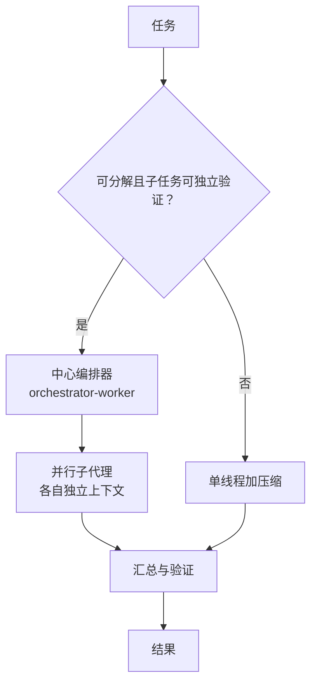

> 这篇梳理多代理系统（Multi-Agent Systems）的协作与编排争议。所有论文编号已核对 arXiv 页面；厂商自报数字明确标注；未核实内容不写成结论。

## 先说结论

"多代理是否优于单代理"这个问题，目前的实证结论是**条件增益**：

- **在数学推理、长上下文、聚合类任务上有可测增益**（5% 到 25%）；
- **但在多个对照研究里，这些增益常可被"同模型的强提示词单代理"或投票基线追平**；有系统性观察认为，在热门基准上"增益常常很小"。

更值得注意的是两个反直觉发现：**规模缩放是非单调的**——投票类方法的精度随调用数"先升后降"，简单任务受益而困难任务受损；**异构混合常为负收益**——把不同大模型混合聚合通常降低质量，单强模型自聚合反而更好。

而成本是明确的：生产系统实测多代理约消耗 **15 倍于单轮对话的 token**，token 用量解释了约 80% 的成本方差。

所以真正的问题不是"要不要多代理"，而是**"在什么任务上、用什么拓扑、花多少预算"**。

## 四种拓扑，四种代价

主流编排拓扑有四类：

| 拓扑 | 机制 | 代表 | 适用 |
| --- | --- | --- | --- |
| 中心化编排器 | 主代理拆解、下发、汇总 | 研究系统、supervisor 模式 | 研究、广度搜索 |
| 流水线/交接 | 按阶段交接控制权 | 软件开发流水线、handoff | 有明确阶段的流程 |
| 辩论讨论 | 多方辩论后收敛 | 多代理辩论 | 事实性与推理校验 |
| 群体网络 | 代理作为节点、动态组队 | 图优化类方法 | 拓扑可搜索的场景 |

**产业界的收敛方向是"默认单代理，需要时才拆分"**。一家公司给出的两条原则值得记住：共享完整轨迹（而不只是单条消息），以及"行动携带隐含决策，冲突的决策产生坏结果"——它的实际案例是，两个子代理各自基于冲突假设行动，一个做了某种风格背景，另一个的元素完全不合该风格。

另一家则给出了正面案例：中心编排器加 3–5 个并行子代理，在研究类任务上相对单代理提升 90.2%（其自建评测），并行化把耗时缩短最多 90%。**两者的分歧实质是任务可并行性与可验证性的差异，不是谁对谁错。**

## 缩放：先升后降，且不规则更好

有三个独立的缩放结论：

**第一，投票类方法存在饱和点。** 精度随调用数先升后降：简单任务受益于多次采样，困难任务反而受损——因为多数采样都错，聚合被带偏。

**第二，协作规模呈 S 形增长。** 一组用千级代理做的实验显示，性能随代理数服从 logistic 增长并饱和，而且**不规则拓扑优于规则拓扑**。

**第三，异构混合常是负收益。** 一项工作证明，把不同大模型混合聚合通常降低平均质量，单强模型自聚合在某个主流评测上反超混合方案 6.6%。它的解释是：不同模型的输出风格差异本身就是噪声。

## 失败可以被系统分类

一份基于 1600 多条轨迹的分类学把多代理失败归为三大类 14 种模式（标注一致性 κ=0.88）：

1. **系统设计问题**：任务分工与规范不清、缺乏验证与接地机制——失败在"蓝图"层就注定了；
2. **代理间失配**：信息传递错误、忽略他人请求、冲突或重复行动、死循环；
3. **任务验证缺失**：提前停止、输出不完整、未经验证就交付。

还有两类机理值得单独记：

**级联误差。** 一线工程实录的经验法则是"在 agent 系统里，微小的改动会级联放大为巨大的行为变化"。一个反直觉的具体形态是：早期版本会为简单查询生成 50 个子代理，或者无止境地搜索不存在的来源。

**通信损耗。** 有一项工作首次正式定义了"通信冗余"，**剪掉 28.1% 到 72.8% 的通信 token 而不掉精度**，还顺带提升了对抗鲁棒性——说明大量代理间的消息是冗余甚至有害的。

**归因之难**是另一个瓶颈：一份基准显示，自动判断"哪个代理出错"的准确率约 53.5%，判断"哪一步出错"只有 14.2%。这意味着调优目前仍高度依赖人工看轨迹。

## 15 倍 token 换来了什么

| 维度 | 数字 |
| --- | --- |
| 多代理 token 消耗 | 约 15 倍于单轮对话 |
| token 对成本方差的解释力 | 约 80% |
| 研究类任务相对提升 | 90.2%（厂商自建评测） |
| 公开基准上的提升 | 常被观察为"很小" |
| 并行化耗时缩减 | 最多 90%（这是延迟不是成本） |

省钱的三个方向也都有具体工作：通信剪枝（同精度下成本从 43.7 美元降到 5.6 美元）、用 RL 优化通信（在信息密集任务上以不到 10% 的 token 获得 2.8 倍效果）、以及级联（便宜模型打头、贵模型兜底）。

我建议把"**单位成本的验证精度**"作为一等指标，而不是只报准确率——目前只有少数工作同时报两者。

## 上下文该共享还是隔离：一个没被裁决的争论

这是多代理工程里最真实的分歧，而且两种立场都有来自同一批失败证据的弹药。

**隔离派的理由**：每个子代理在自己的上下文窗口里工作，可以把数万 token 的探索压缩成一千多 token 的摘要返回给主代理。这是"压缩"最有效的形态——因为压缩由子代理自己完成，而不是主代理事后总结。代价是子代理看不到主代理的完整推理过程。

**共享派的理由**：如果子代理看不到完整轨迹，它们会基于各自对任务的假设并行工作，而这些假设可能互相冲突。具体的失败形态已经有很多记录：一个子代理做了某种风格的界面背景，另一个子代理的元素完全不符合该风格。**冲突的决策产生坏结果**——这是共享派的核心论点。

我的判断是：**这不是同一层面的选择题。** 隔离派解决的是上下文成本，共享派解决的是决策一致性。真正的工程解可能是"隔离执行、共享计划"——把子代理的**计划**（而不是完整轨迹）同步给彼此，让冲突在计划层面而不是执行层面被发现。

还有一个折中的经验：**多代理只用于可并行、子任务可独立验证、结果可蒸馏的场景。** 这三个条件缺一个，收益就很可能被协调成本吃掉。这也是为什么调研与广度搜索是多代理最成功的场景——它们天然满足这三个条件。

## 一点诊断建议：先问四个问题

如果你正在考虑要不要上多代理，我建议先回答四个问题：

1. **任务能不能被切分成互相独立的子任务？** 如果子任务的正确性依赖彼此的中间结果，多代理的收益会被协调成本吃掉。
2. **每个子任务的结果能不能被独立验证？** 有可靠验证器时（投票、单测、检索接地），多代理的增益最稳定；没有验证器时，它只是在放大同一个错误。
3. **失败的代价是什么？** 长任务里一次失败的返工成本很高，而多代理会引入新的失败模式（冲突假设、通信损耗、归因困难）。步级归因只有 14.2% 准确率意味着调试成本被低估了。
4. **预算够不够？** 15 倍 token 不是小数点问题。如果任务的价值密度不支持这个成本，用单代理加长上下文更经济。

一个常被忽略的替代方案是**"单代理多角色"**：让同一个模型在一个上下文里扮演多个角色做自我协作。有工作证明这在足够强的模型上能减少幻觉并获得协同增益（但弱模型上无效）。它避开了通信损耗与冲突轨迹的问题，代价是失去了并行加速。

## 协议层已经分层

2024 年底到 2025 年，两套开放协议把"类型化接口"从论文搬进了基础设施：一套管 agent 与工具/数据之间（MCP），一套管 agent 与 agent 之间（A2A）。到 2026 年 8 月，两个协议同归一个中立基金会治理。

但有一个重要的证据缺口：**"类型化协议优于自由文本"这个工程直觉，缺少公开的受控对照实验。** 常被引用的某协作基准经查并不含此实验；间接证据（通信剪枝、RL 压缩通信）指向"消息越少越结构化越好"，但因果结论还等实验。

## 最后留下的结论

多代理系统现在的状态是：**拓扑选项已经清楚，失败模式已经被分类，但"什么时候值得"仍缺受控证据。**

给出一个可操作的判据：**只有在任务可分解、子任务可独立验证、且预算不是紧约束时，多代理才值得上。** 编码这类强依赖共享上下文的任务，默认单线程加压缩更稳妥。

对做研究的人来说，这个领域的空白相当具体：**同预算受控对照**（固定模型、工具与 token 预算，比单代理、中心编排、辩论、群体网络）、**通信格式的受控实验**（同一信息量的结构化与自由文本对比）、以及**失败归因的改进**（步级 14.2% 的准确率，任何提升都有价值）。这些都不需要大算力。

## 参考资料

1. [Improving Factuality and Reasoning in Language Models through Multiagent Debate](https://arxiv.org/abs/2305.14325)
2. [Encouraging Divergent Thinking in Large Language Models through Multi-Agent Debate](https://arxiv.org/abs/2305.19118)
3. [CAMEL: Communicative Agents for "Mind" Exploration of Large Language Model Society](https://arxiv.org/abs/2303.17760)
4. [MetaGPT: Meta Programming for a Multi-Agent Collaborative Framework](https://arxiv.org/abs/2308.00352)
5. [AutoGen: Enabling Next-Gen LLM Applications via Multi-Agent Conversation](https://arxiv.org/abs/2308.08155)
6. [Should we be going MAD? A Look at Multi-Agent Debate Strategies for LLMs](https://arxiv.org/abs/2311.17371)
7. [Rethinking the Bounds of LLM Reasoning: Are Multi-Agent Discussions the Key?](https://arxiv.org/abs/2402.18272)
8. [Are More LLM Calls All You Need? Towards Scaling Laws of Compound Inference Systems](https://arxiv.org/abs/2403.02419)
9. [More Agents Is All You Need](https://arxiv.org/abs/2402.05120)
10. [Mixture-of-Agents Enhances Large Language Model Capabilities](https://arxiv.org/abs/2406.04692)
11. [Rethinking Mixture-of-Agents: Is Mixing Different Large Language Models Beneficial?](https://arxiv.org/abs/2502.00674)
12. [Chain of Agents: Large Language Models Collaborating on Long-Context Tasks](https://arxiv.org/abs/2406.02818)
13. [Scaling Large-Language-Model-based Multi-Agent Collaboration（MacNet）](https://arxiv.org/abs/2406.07155)
14. [Multi-Agent Design: Optimizing Agents with Better Prompts and Topologies（MASS）](https://arxiv.org/abs/2502.02533)
15. [Why Do Multi-Agent LLM Systems Fail?（MAST）](https://arxiv.org/abs/2503.13657)
16. [Which Agent Causes Task Failures and When?（Who&When）](https://arxiv.org/abs/2505.00212)
17. [Cut the Crap: An Economical Communication Pipeline for LLM-based Multi-Agent Systems](https://arxiv.org/abs/2410.02506)
18. [Optima: Optimizing Effectiveness and Efficiency for LLM-Based Multi-Agent System](https://arxiv.org/abs/2410.08115)
19. [FrugalGPT: How to Use Large Language Models While Reducing Cost and Improving Performance](https://arxiv.org/abs/2305.05176)
20. [Anthropic: How we built our multi-agent research system](https://www.anthropic.com/engineering/built-multi-agent-research-system)
21. [Cognition: Don't Build Multi-Agents](https://cognition.com/blog/dont-build-multi-agents)
