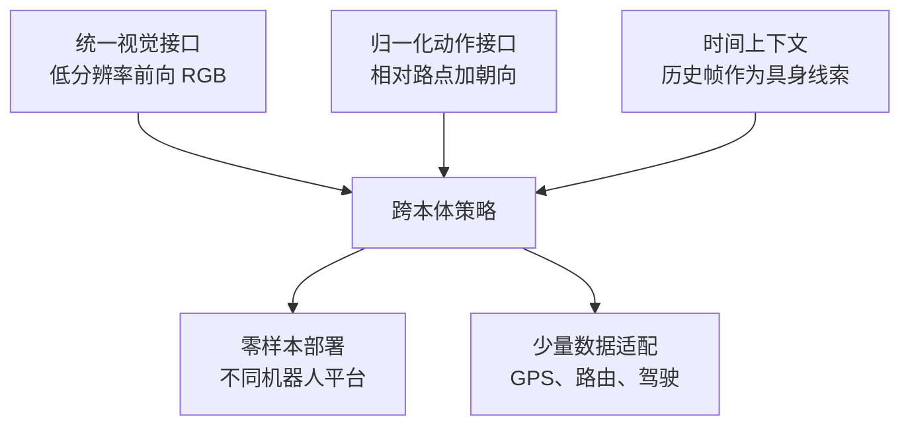

> 这篇梳理导航基础模型（navigation foundation model）的现状。论文数字以 arXiv 原文与官方项目页为准；"未验证"的部分不写成结论。关于操作（manipulation）方向的跨本体泛化，我在另一篇里写过，这篇讨论的是导航，以及两者合流的证据强度。

## 先说结论

导航领域还没有像大语言模型那样稳定的"基础模型"定义。目前最稳固的技术主线是：**把多机器人真实轨迹转成统一的视觉目标到达任务，再用归一化路点（normalized waypoints）作为跨具身的动作接口。**

这条主线上的三个代表模型，参数量都不大：

- **GNM** 用 70 小时数据、6 类平台训练，零样本部署到四种机器人上，成功率 0.93–0.99；
- **ViNT** 是 31M 参数的 Transformer，80 小时数据、8 类平台，通过替换目标编码器适配 GPS、路由命令和驾驶任务；
- **NoMaD** 是 19M 参数的扩散策略，把"有目标导航"和"无目标探索"统一成一个模型。

最能说明问题的是一组动作空间消融：**归一化路点 1.0/0.95（简单/中等条件），速度动作 0.73/0.54，未归一化路点 0.42/0.26。** 同一模型、同一数据，只换动作接口，成功率差了两倍以上。

所以我的判断是：**"基础模型"的判定标准不该只看参数量**，而要看数据是否跨平台、输出接口是否可迁移、是否有未见机器人上的部署、能否用少量数据适配新任务，以及有没有统一基准。按这五条，19M 到 31M 的小模型反而比一些大模型更像基础模型。

## 三个模型与三个抽象

GNM 的做法可以用三个抽象概括，它后来被 ViNT 和 NoMaD 继承：

**统一视觉接口**：只用前向 RGB 图像（训练输入 85×64），不依赖激光雷达、深度或里程计。不同机器人的相机高度、视场和安装角差异很大，低分辨率加时间上下文是一种"主动降级"——把差异吸收进历史帧，让模型自己推断当前的运动能力和视角。

**归一化动作接口**：不同机器人的速度和动力学不同，所以不预测绝对速度或绝对位移，而是预测相对路点 `p(x,y)` 和朝向 `ψ`，再用与机器人最高速度相关的缩放因子 `α` 归一化。执行时由机器人专属的低层控制器（PD 控制器一类）跟踪这些路点。

**时间上下文**：用过去 5 帧帮助模型推断"我是在什么平台上、相机在哪、我能怎么动"。消融显示这项设计在困难条件下把成功率从 0.36 提到 0.70——**历史帧在这里不是用来记路的，是用来识别自己的。**

ViNT 把模型换成 31M 参数的 Transformer（两个 EfficientNet-B0 编码器加 4 层 4 头的解码器），输入当前与过去 5 帧加目标图像，输出到目标的距离和未来 5 个路点。它真正的贡献是**把"目标"做成了可替换的接口**：图像目标、GPS 路点、二维位置、卫星图像、路由命令都能映射到同一个目标 token 空间。官方项目页给出过一个 1.5 公里的导航示例，以及一条适配证据：用不到 1 小时的数据微调，零样本成功率 40% 提升到 80%，并且优于用 5 倍数据训练的专用模型。

NoMaD 的重点在统一两个任务。它用一个二值目标掩码（训练时以 0.5 的概率遮蔽目标）加一个一维扩散动作头（10 步去噪），把"去某个地方"和"四处看看"变成同一个策略的两种模式。在真实室内外环境中，它的探索成功率 98%、导航成功率 90%、平均碰撞数 0.2——对比另一个 335M 参数的子目标扩散方法（探索成功率 77%、碰撞 1.7），更小且更安全。

但这里必须说清楚一条边界：**NoMaD 的公开结果主要是单一平台上的部署，没有像 GNM 和 ViNT 那样按机器人平台拆分的零样本迁移表。** 所以它是"目标导航与探索统一"的强证据，不是"跨本体泛化"的最强证据。

补一个数据侧的细节：GNM 的训练表合计 70 小时（摘要口径约 60 小时），覆盖 TurtleBot2、Jackal、遥控车、Spot、Warthog、ATV 等六类平台，环境从办公室、走廊到郊区人行道和越野。它的零样本部署名单里有 DJI Tello（欠驱动四旋翼）和 LoCoBot——**这两种都不在训练平台里，成功率分别是 0.99 和 0.96。** 相反，只用单一数据集训练的对照策略在同一批平台上明显更差。ViNT 把数据扩到 160 小时（实际使用 80 小时）、平台扩到 8 类，输出也从单纯的路点扩成"到目标的距离"加"未来 5 个路点"——距离输出让下游可以直接构建拓扑图做路径规划，而不是只会跟着目标图走。

## 动作接口决定了迁移能力

GNM 的消融是这篇里我认为最值得记住的一组数字：

| 动作接口 | 简单条件成功率 | 中等条件成功率 |
| --- | --- | --- |
| 速度动作 | 0.73 | 0.54 |
| 未归一化路点 | 0.42 | 0.26 |
| **归一化路点** | **1.00** | **0.95** |

含义是：**跨本体的核心障碍不是"图像能不能看懂"，而是动作空间能不能统一。** 把机器人的速度、尺度和控制接口吸收进缩放因子和低层控制器之后，同一个策略才能同时驱动轮式底盘、四足和无人机。

代价同样明显：**归一化路点把复杂动力学交给了低层控制器**。ViNT 论文明确指出它不能直接控制四旋翼的高度，也不能自然处理激光雷达等新传感器或显著不同的动作表示。腿足和人形的姿态控制、灵巧手的精细操作，都不是"相对路点"能表达的。

GNM 还报告了一组鲁棒性数据：在转向退化、视角扰动和物理损伤三种情况下，GNM 的成功率是 0.89/0.81/1.0，而单域策略是 0.30/0.17/0.81。**时间上下文带来的"知道自己是什么"的能力，同时也是对退化鲁棒性的来源之一。**

## 语言路线：接口更自然，但更贵

目标条件之外的另一条路是用语言和视觉语言模型（VLM）做导航。

**NaVid** 用单目 RGB 视频和自然语言指令直接输出低层动作（前进、左转、右转、停止加距离与角度参数），不需要地图、里程计或深度。在连续环境基准上成功率 37.4；真实部署在 200 条指令上整体约 66%，其中简单指令约 84%、复杂指令约 48%——**复杂度带来的性能落差接近一半**。代价是每一步都需要远程推理，单步约 1.2 到 1.5 秒。

**NaVILA** 面向腿足机器人，做了两级拆分：高层 VLA 输出"右转 30 度""前进 75 厘米"这样的**中层语言动作**，低层用强化学习训练的运动策略执行（输入本体感知、速度命令和激光雷达生成的 2.5D 高度图）。这个设计牺牲了端到端的统一性，但换来了物理可执行性：在它自建的物理基准上，视觉低层策略的成功率 50.2，明显高于盲策略的 36.2；真实部署覆盖 25 条指令、每条重复 3 次，报告整体 88% 成功率、复杂指令 75%。

两条路线可以这样对比：

| 维度 | 目标条件 | 语言条件 |
| --- | --- | --- |
| 监督信号 | 从轨迹里采样未来帧天然可得 | 需要标注或模型生成 |
| 动作输出 | 连续路点，易用真实轨迹监督 | 需要离散化或正则解析 |
| 接口自然度 | 目标图像或坐标不太符合人的表达习惯 | 接近人类指令 |
| 语义与约束 | 难处理"不要靠近人群"这类条件 | 可利用常识与场景语义 |
| 成本 | 小模型可实时 | 大模型推理，单步以秒计 |

合流的方向不是二选一，而是**让语言和 VLM 负责语义与长程子目标，导航基础策略负责局部连续控制，中间用像素目标（pixel goal）、目标图像或中层语言动作连接**。2026 年的新工作基本都在这条线上，但它们的真实部署量化结果（成功率、延迟、里程）在公开页面上大多还没有给全，我按"未验证"处理。

## 导航和操作能用同一个骨干吗

这是我认为最有意思的问题，目前只有早期证据。

**正面证据**来自一项把导航、驾驶和操作都写成"视觉目标到达"的工作：输入当前与历史观测加目标图像，输出未来动作序列，用 18 个数据集（导航与操作大致各一半）联合训练。结果是**双向受益**——操作任务平均成功率 71%，比只训操作提升约 20%；导航相比只训导航提升约 5 到 7 个百分点（不同平台 1 到 12 个百分点不等）；在训练中没见过的移动操作平台上，零样本成功率 50%。

但作者自己列了局限：目标图像接口不自然、高自由度系统（灵巧手）难以用同一套动作抽象、移动操作对底盘位置非常敏感。这些限制指向同一个原因：**统一动作空间保证了迁移，但会限制能力上限。**

**反面参照**是模块化系统：把视觉语言模型的物体检测、导航原语和抓取原语串起来，在 10 个真实家庭里做开放词汇的取放，总体成功率 58.5%，环境干净时 82%。它说明即使每个模块都很强，**真实家庭移动操作仍然受模块接口、环境杂乱和失败恢复拖累**——但它是系统集成，不是同一个骨干，不应该和前一项混为一谈。

至于操作方向的 VLA 模型（RT-2、Open X-Embodiment、Octo、OpenVLA），它们的摘要都聚焦抓取、放置这类操作任务，**没有导航证据**。正确的表述是：它们为导航提供了数据标准化、语言动作 token 化和大模型微调的经验，但导航能不能纳入同一套体系，还需要像上面那样的直接实验来证明。

## 基准还是碎片化的

现有基准各覆盖一块：连续环境语言导航（去掉导航图和完美定位）、仿真到真实的对应场景、固定机器人配置的物体与图像导航、家庭重排与移动操作、多人形机器人的物理语言导航（933 个回合）、动态行人环境下的社交合规导航（33093 个回合）、以及评估 VLM 场景理解能力的问答集。

结论很清楚：**现在是"任务族加若干垂直基准"的阶段，还没有出现 ImageNet 或 GLUE 式的统一排行榜。** 各家报告的成功率、路径加权成功率、碰撞数、最大无干预距离、推理延迟互不相同，横向比较的误差可能比方法差异还大。

## 三个还没有答案的问题

**统一动作空间会不会限制能力上限？** 归一化路点让跨平台迁移成立，代价是把复杂动力学交给低层控制器——四旋翼高度、腿足姿态、机械臂接触力和灵巧手控制都表达不了。争议点在于：未来应该追求"统一的低层动作 token"，还是接受"高层统一、低层平台专用"。目前的证据更支持后者，NaVILA 的两级设计就是这种折中，它牺牲了端到端统一性，换来了物理可执行性。

**语言大模型能否替代导航策略？** 大模型确实能做下一步动作或中层动作规划，但真实系统仍然依赖低层控制、地图记忆或探索策略。单步 1.2 到 1.5 秒的推理延迟和 66% 的实机成功率说明，大模型直接闭环导航在实时性和长时稳定性上都还没准备好。

**数据规模和数据质量哪个更重要？** 这个方向的数据很小——几十到一百小时的真实轨迹就能得到强迁移，而操作方向的 VLA 用的是近百万级演示。差异可能来自任务本身：导航的监督信号（从轨迹里采样未来帧）天然密集，动作空间也低维得多。但"相机几何、动作归一化、时间上下文和低层控制器设计比堆数据更关键"这个判断，目前还只有小规模证据，没有跨平台的定量对照。

## 最后留下的结论

导航基础模型这件事的有趣之处在于：**它把"基础"两个字从参数量拉回了接口设计。** 70 小时的数据、31M 的参数，通过统一视觉输入、归一化动作和可替换的目标编码器，换来了真正的跨平台零样本部署；而更大的模型在语言理解上更强，跨本体的证据反而更弱。

如果要我押一个方向，我会押在**接口与评测**上，而不是更大模型。三件具体的事：把小模型（19M 到 31M）的开源代码复现起来，做跨数据集和跨平台的迁移曲线；研究"语言到像素目标"的中间层（用开源 VLM 选目标，用导航策略执行，失败后重新选）；以及给真实部署补一份统一报告模板——把平台、相机、控制频率、干预次数、失败类型都写清楚。前两件单卡可做，第三件只要你有一台机器人就能开始。

## 参考资料

1. [GNM: A General Navigation Model to Drive Any Robot](https://arxiv.org/abs/2210.03370)
2. [ViNT: A Foundation Model for Visual Navigation](https://arxiv.org/abs/2306.14846)
3. [NoMaD: Goal Masked Diffusion Policies for Navigation and Exploration](https://arxiv.org/abs/2310.07896)
4. [NaVid: Video-based VLM Plans the Next Step for Vision-and-Language Navigation](https://arxiv.org/abs/2402.15852)
5. [NaVILA: Legged Robot Vision-Language-Action Model for Navigation](https://arxiv.org/abs/2412.04453)
6. [Pushing the Limits of Cross-Embodiment Learning for Manipulation and Navigation](https://arxiv.org/abs/2402.19432)
7. [OK-Robot: What Really Matters in Integrating Open-Knowledge Models for Robotics](https://arxiv.org/abs/2401.12202)
8. [OpenVLA: An Open-Source Vision-Language-Action Model](https://arxiv.org/abs/2406.09246)
9. [Octo: An Open-Source Generalist Robot Policy](https://arxiv.org/abs/2405.12213)
10. [RT-2: Vision-Language-Action Models Transfer Web Knowledge to Robotic Control](https://arxiv.org/abs/2307.15818)
11. [Open X-Embodiment: Robotic Learning Datasets and RT-X Models](https://arxiv.org/abs/2310.08864)
12. [Beyond the Nav-Graph: Vision-and-Language Navigation in Continuous Environments](https://arxiv.org/abs/2004.02857)
13. [HumanoidVLN: A Physics-Grounded Simulator and Benchmark for VLN Across Humanoid Embodiments](https://arxiv.org/abs/2608.12860)
14. [DPed-VLN: Socially Compliant VLN in Dynamic Pedestrian Environments](https://arxiv.org/abs/2609.21504)
15. [Embodied Navigation Foundation Model（NavFoM）](https://arxiv.org/abs/2509.12129)
16. [ABot-N1: Toward a General Visual Language Navigation Foundation Model](https://arxiv.org/abs/2607.10383)
17. [Uni-LaViRA: Language-Vision-Robot Actions Translation for Unified Embodied Navigation](https://arxiv.org/abs/2605.27582)
