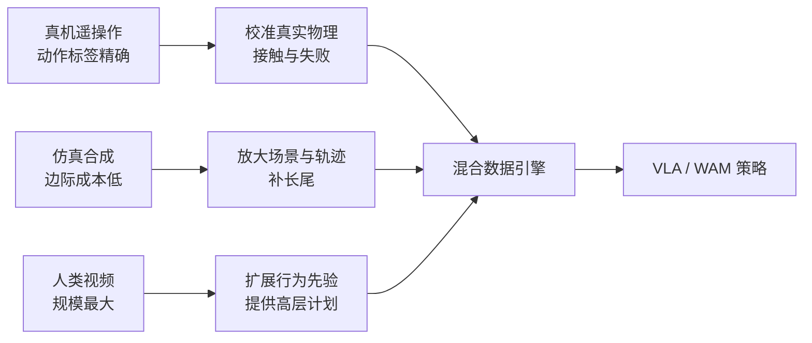

> 机器人缺的不是“数据”两个字，而是**带动作标签、覆盖足够多样性、还能在真实硬件上执行的数据**。这三件事同时满足，才是有用的数据。本文梳理真机遥操作、仿真合成、人类视频三条路线，以及它们之间并不总是正向的 scaling 关系。文中数字优先引用论文或官方页面；二手口径和未验证内容不写进结论。

## 先说结论

机器人没有互联网级的动作数据。网络视频可以无限增长，但大多数视频没有机器人动作标签；真机遥操作标签最干净，却要按人力和场地线性付费；仿真可以把几百条演示放大成数万条轨迹，但 sim-to-real 差距会把一部分“免费数据”折价。

所以机器人数据引擎不是某一条路线，而是三条路线的组合：**真机负责校准与质量，仿真负责放大，视频负责扩展行为和场景的上限**。

最值得记住的 scaling law 也不是“数据越多越好”。《Data Scaling Laws in Imitation Learning for Robotic Manipulation》（arXiv:2410.18647）在有限任务范围内观察到，环境与物体的多样性比同一环境里继续堆演示更重要；而 2026 年的《Rethinking VLA Model Scaling》（arXiv:2602.09722）进一步显示，动作表示没有对齐时，继续加入异构数据可能产生负迁移。

**机器人 scaling 的第一变量是数据覆盖的世界，第二变量才是数据条数。**

## 三条数据路线，解决三个不同问题

**真机遥操作回答“动作到底是什么”。** Open X-Embodiment 把 21 个机构的数据合在一起，形成 100 万条以上轨迹、22 种机器人本体的联合数据集。DROID 则把采集做成分布式流水线：多地点、多场景、多人操作，收集真实世界的长尾。它们的共同点是动作标签天然来自机器人本身，缺点是每增加一小时数据，都要增加设备、操作员和质检成本。

**仿真合成回答“怎么把少量经验扩成大量变化”。** MimicGen 的基本思路是：把少量人工演示拆成可重放的子动作，再在不同初始状态和场景里组合。RoboCasa 把这种思路扩展到厨房与家庭任务。合成轨迹的动作标签干净、数量可扩展，但它们只在仿真器定义的世界里正确。

**人类视频回答“机器人还没见过哪些行为”。** VPT 先用少量动作标注训练逆动力学模型，再给大规模无标签视频伪标注；MimicPlay 让人类视频只负责高层 latent plan，低层动作仍由机器人数据学习；EgoMimic 和 GR-2 则尝试把人类视频纳入视觉预训练或跨本体共训练。它们不是把“看人做事”直接变成“机器人会做”，而是把视频当作行为先验。

## Scaling law 的关键不是数量

《Data Scaling Laws in Imitation Learning for Robotic Manipulation》给出了一个很反直觉的结果：当任务覆盖的环境和物体种类增加时，成功率可以呈现近似幂律增长；但在多样性已经足够之后，继续在同一个环境里增加演示，边际收益会迅速降低。

这很好理解。机器人如果只见过同一张桌子上的同一个杯子，采集一万条演示，主要学到的是这个桌面和这个杯子的固定关系；换一批物体、换一个摆放位置，策略依然可能失败。少量覆盖不同环境的演示，往往比大量重复演示更有信息量。

| 数据变化 | 可能学到什么 | 常见结果 |
| --- | --- | --- |
| 同一物体、同一环境，重复更多演示 | 动作平均化、固定视觉线索 | 训练集提升快，换场景收益小 |
| 增加物体外观与初始状态 | 视觉变化与抓取策略 | 泛化更明显 |
| 增加环境与布局 | 任务结构与空间关系 | 长期收益更大 |
| 增加本体但不对齐动作空间 | 多域梯度混合 | 可能负迁移 |
| 加入失败与恢复片段 | 异常状态与重规划 | 真实部署更稳，但标注更贵 |

2602.09722 把“动作对齐”单独拿出来做消融。它在 LIBERO 上观察到，EEF-relative 表征产生正向迁移，而世界坐标系表征可能出现轻微负迁移；在数据配方上，OXE-only 的冻结 VLM 配置达到 77.3%，加入真实 EEF 数据后降到 73.8%，再加入仿真 EEF 数据后降到 72.1%。这不是“仿真没用”，而是**未对齐的数据不能靠数量自动变成互补信息**。

## 产业数据引擎长什么样

公开资料里，Physical Intelligence、NVIDIA 和 AgiBot 的路线很不一样，但都遵循“真机起步、混合放大、部署回流”的结构。

Physical Intelligence 在 π0 中使用了 1 万小时以上的机器人数据和多种机器人配置，核心是自建操作员团队与公开数据混合。NVIDIA GR00T N1 把真机轨迹、人类视频和合成 neural trajectories 放在同一套训练配方里，试图让人形模型既有动作标签，也有更广的视觉先验。AgiBot World 则把遥操作做成数据工厂，公开了百万级真机轨迹和多本体数据。

这几种做法都说明：所谓 data flywheel 不是部署后神奇地产生数据，而是一个具体的生产流程：

1. 建立可重复的采集设备与任务清单；
2. 采集真实动作，记录失败、接管和接触事件；
3. 用仿真和世界模型补少见场景；
4. 用部署日志找出长尾失败；
5. 定向补采或合成，再训练和评估。

**飞轮的核心不是“回流”两个字，而是能否把失败变成下一轮训练中可定位、可复现的数据。**

## 人类视频为什么不能直接变成动作

人类视频和机器人演示之间隔着具身差距：手的自由度不同，视角不同，接触力不可见，动作坐标也不同。一个人把杯子拿起来，视频只告诉我们结果和视觉过程，并没有告诉机器人每个关节在什么时候施加了多少力。

当前比较可靠的利用方式有三种：

- **伪标注**：用少量动作标注训练逆动力学模型，再给视频补动作标签；
- **分层利用**：人类视频只提供高层计划或视觉先验，低层动作仍由机器人数据学习；
- **预训练利用**：把人类视频用于视觉或视频模型预训练，机器人数据负责最后的动作对齐。

这三种方式的共同点是承认缺口，而不是假设视频天然等价于机器人示范。DreamGen 进一步尝试用视频世界模型生成 neural trajectories，目标是把视频先验转成更接近机器人动作的数据，但它仍然需要真实动作空间的校准。

## 质量、多样性、数量，谁排第一

我会把优先级排成：**物理语义对齐 > 场景多样性 > 失败覆盖 > 原始数量**。

质量不是“视频看起来清晰”，而是动作是否覆盖有效策略、是否包含接触变化、是否能被目标本体执行。Data Quality in Imitation Learning 提出了 action divergence 与 coverage 两个方向：演示之间要有足够差异，也要覆盖任务需要的状态空间。

多样性不是随机换背景，而是改变真正决定任务的变量：物体尺寸、摩擦、摆放位置、环境布局、光照、本体和控制频率。失败数据也要有结构——滑落、卡住、过压、抓取偏移、目标不可达，这些比一段普通成功轨迹更能告诉策略边界在哪里。

## 个人研究者能做什么

个人没有数据工厂，也不需要复制产业规模。最现实的题目有三个：

1. **多样性曲线复现**：在 LIBERO 或 RoboCasa 子集上固定模型和训练预算，分别改变环境数、物体数和重复演示数，画出成功率曲线；
2. **质量评分工具**：把 action divergence、覆盖度和失败标签结合起来，预测一个数据子集是否值得加入训练；
3. **小型数据飞轮**：用低成本机械臂做一个任务，自动记录失败，针对失败类型补采，再比较“全量重训”和“定向补采”。

这些题目的价值不是超过大模型，而是回答一个大模型论文经常回避的问题：**到底是哪一类数据带来了提升？**

## 最后留下的结论

机器人没有互联网数据，只有三条彼此补位、也彼此冲突的数据路线。真机遥操作提供可信动作，仿真合成提供数量，人类视频提供行为先验。把它们简单拼在一起，不会自动得到 scaling 红利。

机器人数据的真正缩放变量不是文件数量，而是**世界覆盖、动作语义、失败边界和本体对齐**。当这些变量被单独测量，数据引擎才不只是一个更大的数据仓库，而会变成能够解释模型为什么变好的实验系统。

## 参考资料

1. [Open X-Embodiment: Robotic Learning Datasets and RT-X Models](https://arxiv.org/abs/2310.08864)
2. [DROID: A Large-Scale In-The-Wild Robot Manipulation Dataset](https://arxiv.org/abs/2403.12945)
3. [MimicGen](https://arxiv.org/abs/2310.17596)
4. [RoboCasa](https://arxiv.org/abs/2406.02523)
5. [DreamGen](https://arxiv.org/abs/2505.12705)
6. [Video PreTraining](https://arxiv.org/abs/2206.11795)
7. [EgoMimic](https://arxiv.org/abs/2410.24221)
8. [GR-2](https://arxiv.org/abs/2410.06158)
9. [Data Scaling Laws in Imitation Learning for Robotic Manipulation](https://arxiv.org/abs/2410.18647)
10. [Data Quality in Imitation Learning](https://arxiv.org/abs/2306.02437)
11. [Rethinking Visual-Language-Action Model Scaling](https://arxiv.org/abs/2602.09722)
12. [GR00T N1](https://arxiv.org/abs/2503.14734)
13. [π0](https://arxiv.org/abs/2410.24164)
14. [π0.5](https://arxiv.org/abs/2504.16054)
