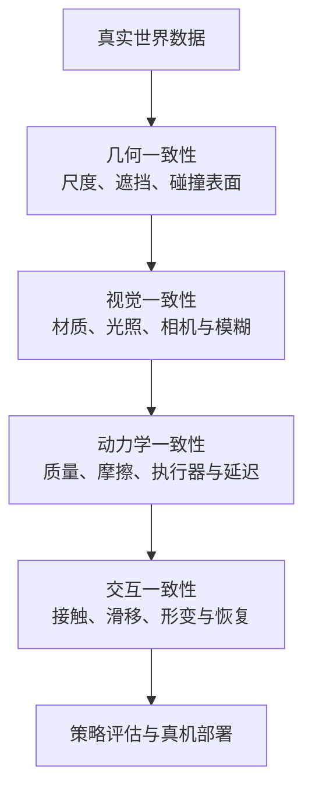

> 仿真最容易制造一种错觉：分数足够高，现实就会跟着变好。实际上，仿真训练、Real2Sim、物理保真和真机评估解决的是四个不同问题。本文的主线不是“哪个仿真器最好”，而是更难也更实用的问题：**仿真里的相对结论，什么时候能预测真机里的相对结论？**

## 先说结论

Domain randomization 仍然是最稳妥的 Sim2Real 基线，但它不是终局。它能把外观、动力学、传感器和延迟的不确定性纳入训练分布，却不能自动修复错误的接触模型、执行器约束和结构性时延。

3D Gaussian Splatting（3DGS）和 NeRF 解决了 Real2Sim 的外观与视角重建，不能单独解决碰撞几何、质量、惯量、摩擦和接触事件。Isaac Lab 解决高吞吐训练，Genesis 解决多物理表达，二者都不能仅凭 README 证明在某个任务上更接近真实世界。

SIMPLER 的问题是“仿真能不能评估真实策略”，GAUGE 的问题是“仿真器和视频世界模型在哪些物理过程上失真”。两条线共同指向一个缺口：**我们缺的不是又一个仿真排行榜，而是一套仿真—真机配对评测协议。**

## 四层 Reality Gap

**几何一致性**决定机器人碰到的东西在哪里；**视觉一致性**决定策略看到的东西像不像；**动力学一致性**决定同一个动作产生什么运动；**交互一致性**决定接触、滑移和变形会不会按真实方式发生。

3DGS/NeRF 主要直接帮助视觉层，对几何层需要分割和碰撞 mesh，对动力学与交互层还必须做系统辨识。把一张真实场景渲染得很像，并不等于它已经是可控制的数字孪生。

## Domain Randomization 能解决什么

域随机化把真实世界的不确定性变成训练分布：纹理、光照、相机曝光、物体尺寸、质量、摩擦、控制噪声和动作延迟都可以采样。它适合在真实参数难以精确测量时，让策略不要依赖某一个仿真配置。

但它有四个边界：

1. **分布支持边界**：真实参数不在随机分布里，策略没有外推能力；
2. **耦合误差**：真实摩擦、遮挡和延迟并非独立采样，独立随机可能生成不真实组合；
3. **观测等价不代表动力学等价**：相同 RGB 画面可能对应不同摩擦和接触状态；
4. **训练目标错位**：只优化仿真成功率，策略可能学会穿模、无噪声状态等仿真漏洞。

所以论文里只写“使用了 domain randomization”是不够的。至少应该公开随机化参数、范围、相关性、真机覆盖率和消融结果。

## Isaac Lab、Genesis 与“保真度”不是一回事

Isaac Lab 更像成熟的 GPU 并行学习工作台，适合 RL、模仿学习、规划、多机器人和多传感器实验。它的价值是把训练与评估管线标准化、高吞吐化。

Genesis 则强调统一多物理，覆盖刚体、FEM、MPM、粒子、流体、软体和自动微分，也提供触觉与接触传感器接口。它对软体、流体和接触丰富任务有吸引力，但多后端、多平台和依赖会增加复现成本。

二者都不自动等于更真实。GAUGE 的设计恰好说明了这一点：不同仿真器可能在刚体冲击、布料、绳索和体积变形上各有强弱，不存在一个引擎在所有物理域都最忠实。

## Real2Sim：从“看起来像”到“接触后也像”

RoboGSim、DISCOVERSE 和 Scalable Real2Sim 代表了近期的 Real2Sim 路线：从真实视频、相机和机器人轨迹出发，重建外观、场景、碰撞几何，甚至估计物理属性。

这条路线最容易被误读成“一次扫描得到完整数字孪生”。更准确的拆解是：

| 层次 | 需要估计什么 | 常见工具 | 仍缺什么 |
| --- | --- | --- | --- |
| 外观 | 颜色、材质、光照、视角 | 3DGS、NeRF | 接触和动力学 |
| 几何 | 尺度、位姿、碰撞表面 | 深度、分割、mesh | 隐藏面与软体形变 |
| 动力学 | 质量、惯量、摩擦、阻尼 | 真机轨迹、力矩、系统辨识 | 状态依赖与接触切换 |
| 交互 | 接触时序、滑移、形变、恢复 | 力觉、触觉、视频、物理模型 | 长时闭环与反事实 |

Scalable Real2Sim 的价值就在于把机器人力矩与外部相机纳入资产生成，而不是把 photometric reconstruction 当完整仿真。柔性物体 Real-to-Sim 工作则把 3DGS 与物理交互结合，但公开摘要通常只说“强相关”，没有给出跨任务、跨策略的完整相关系数。

## SIMPLER 问的不是“真不真”，而是“能不能排序”

SIMPLER 研究的是在仿真中评估真实世界机器人操作策略。这个问题比追求逐像素真实更实际：如果仿真能正确预测多个策略在真机上的相对优劣，即使它不是完整物理复制品，也有评估价值。

但“仿真表现与真机表现存在 strong relationship”还不等于一个可复现的统计定律。公开摘要没有给出完整的 Pearson/Spearman 系数、置信区间、排名翻转率和跨天复测协议。

因此，评估报告至少应该同时给出：仿真分数、真机分数、策略排序一致性、排名翻转、置信区间，以及失败类型的对应关系。只给仿真 leaderboard，无法回答它是否对真实部署有预测力。

## GAUGE 把问题推进到物理过程

GAUGE 的贡献不是再做一个机器人成功率排行榜，而是建立 measurement-grounded benchmark，用真实轨迹和物理元数据去比较仿真引擎与视频世界模型。

它覆盖刚体、绳索、纺织物和体积可变形物体，关注碰撞、摩擦、动量、振荡、自接触与变形。摘要指出，不同系统的最大差异集中在冲击接触、快速纺织物运动和体积变形；视频模型有时能遵循方程形式，却在加速度、动量传递和振荡时间上出错。

这意味着视频世界模型短期更适合作为视觉/动力学先验、候选轨迹生成器或残差模型，不适合作为物理引擎的全面替代。控制需要反事实：如果机器人在 80ms 后施加不同的力，物体会怎样？“看起来合理”不能保证这个问题回答正确。

## 一个最小可复现的 Sim2Real 协议

个人研究者可以把复杂问题缩小成 3–5 个接触敏感任务，例如抓取、插入、推物、绳索绕行。固定同一策略族，分别在仿真与真机上运行：

1. 使用同一任务 ID、对象语义和动作空间；
2. 记录相机、控制频率、观测和动作延迟；
3. 固定训练预算与随机种子；
4. 让至少 3 个策略在仿真和真机上重复运行；
5. 报告成功率、完成时间、接触峰值、滑移、人工干预和失败类型；
6. 计算 Spearman/Pearson、排名翻转率和跨日方差。

这类研究的创新点不是“我的仿真器分数最高”，而是回答：**在什么任务、什么策略族和什么硬件条件下，仿真分数才有预测效度。**

## 视频模型能替代物理仿真吗

短期答案是不能全面替代，但可以部分协作。

视频模型擅长真实外观、遮挡和长尾变化，可用于生成候选未来、学习视觉动力学先验和筛选轨迹。物理引擎擅长状态转移、接触、安全边界和守恒关系。更现实的 hybrid simulator 是：物理引擎负责可验证状态与接触，视频模型负责外观、不可建模扰动和残差，再用真实传感器做校准。

## 最后留下的结论

Sim2Real 的核心矛盾已经从“怎么把策略迁到真机”变成“怎么证明仿真里的相对结论在真机仍然成立”。Domain randomization 处理未知分布，Real2Sim 处理场景资产，Isaac Lab/Genesis 处理规模与物理表达，视频模型处理难建模视觉动态；它们都不能单独提供真机预测有效性。

下一阶段最稀缺的工作不是再做一个仿真排行榜，而是把仿真器、策略、接触事件和真机统计放进同一份可复现实验协议里，并公开失败，而不只是最高分。

## 参考资料

1. [GAUGE](https://arxiv.org/abs/2608.05948)
2. [SIMPLER](https://arxiv.org/abs/2405.05941)
3. [LIBERO](https://arxiv.org/abs/2306.03310)
4. [RoboCasa](https://arxiv.org/abs/2406.02523)
5. [DISCOVERSE](https://arxiv.org/abs/2507.21981)
6. [Scalable Real2Sim](https://arxiv.org/abs/2503.00370)
7. [RoboGSim](https://arxiv.org/abs/2411.11839)
8. [Real-to-Sim Robot Policy Evaluation with Gaussian Splatting](https://arxiv.org/abs/2511.04665)
9. [FOTS](https://arxiv.org/abs/2404.19217)
10. [DIFFTACTILE](https://arxiv.org/abs/2403.08716)
11. [Isaac Lab](https://github.com/isaac-sim/IsaacLab)
12. [Genesis](https://github.com/Genesis-Embodied-AI/Genesis)
