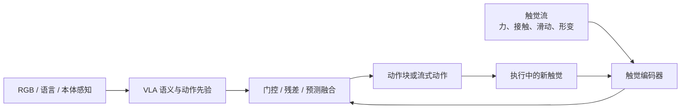
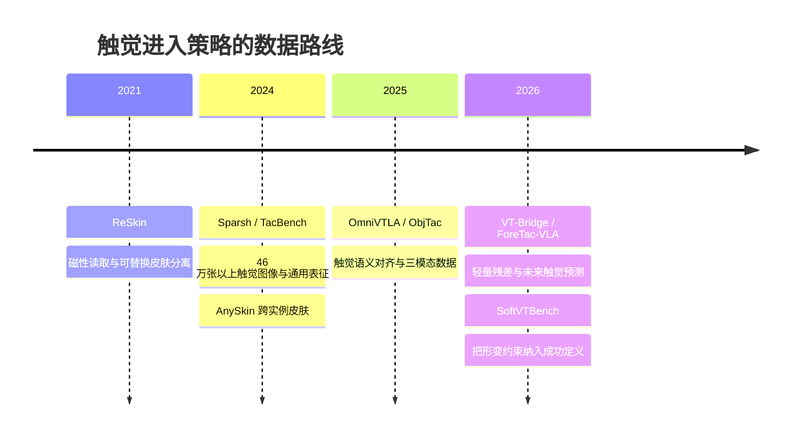

> 机器人把杯子拿起来时，视觉能看到杯子和手，但不一定知道是否已经接触、是否在滑、夹得是否太紧、材料是否正在变形。触觉补上的不是“另一张图片”，而是视觉不可观测的接触状态。本文从传感器、数据、VLA 接口和评测四层梳理这条路线，数字优先采用论文摘要或项目页明确给出的口径。

## 先说结论

触觉进入机器人策略，不应该从“把一张触觉图拼到 RGB 后面”开始。更合理的顺序是：**先定义接触状态，再选择传感器；先做阶段和风险估计，再让触觉修正动作。**

硬件大致分为四类：视觉触觉、压阻/电容阵列、磁性可替换皮肤、力/力矩与事件触觉。它们没有谁全面胜出：视觉触觉信息密度高，F/T 低维但闭环成熟，磁性皮肤适合低成本复制，事件与声学通道适合高速滑动和冲击。

2024–2026 年最值得关注的变化，是研究重点从“造一个更好的传感器”转向“让策略正确使用触觉”：冻结 VLA 加触觉残差、门控融合、执行时触觉流、未来触觉预测和形变感知评测都在回答同一个问题——**触觉应该什么时候、以什么带宽、改变哪一部分动作。**

## 触觉观测的四种形态

| 路线 | 能观察什么 | 优点 | 主要短板 |
| --- | --- | --- | --- |
| 视觉触觉 | 接触几何、纹理、接触面积、滑动线索 | 信息密度高，可复用视觉编码器 | 体积、光学标定、弹性体老化 |
| 压阻/电容阵列 | 压力分布、接触区域 | 薄、易铺大面积、读取直观 | 串扰、迟滞、剪切解耦 |
| 磁性皮肤 | 形变引起的磁场变化 | 电子与皮肤分离，可替换、低成本 | 需要磁场标定，分辨率通常较低 |
| 力/力矩与关节力矩 | 低维合力、力矩、接触趋势 | 延迟低、控制成熟 | 空间信息少，受动力学和偏置影响 |
| 事件/声学 | 滑动、冲击、摩擦变化 | 稀疏、低带宽、高速 | 阈值、同步、环境噪声和漂移 |

GelSight Mini 的官方页面强调了弹性体视觉触觉、机器人安装和 mm 级三维表面信息；AnySkin 则用磁性颗粒皮肤与五个三轴磁力计分离电子和易磨损外皮。两者代表两种不同工程哲学：一个追求局部信息密度，一个追求可替换性和复制成本。

## 触觉怎样进入 VLA

目前大致有五种接口。

**直接拼接。** 最简单，把触觉图像或力向量拼进视觉特征。但触觉只在接触阶段有信息，若时间对齐不好，模型容易把传感器噪声或执行延迟当成捷径。

**触觉 token。** 把每个手指、taxel 区域或触觉序列编码成 token，再与视觉和语言 token 一起进 Transformer。OmniVTLA、ReTouch 走的是这条路线。

**门控融合。** 只有在接触、滑动或传感器证据足够时，才让触觉改变动作。这样可以避免非接触阶段的噪声污染视觉策略。

**有界残差。** 冻结 VLA 的语义和动作先验，只让触觉输出局部位姿、速度或力残差。ViTaR 和 VT-Bridge 说明，这是一条低数据、低算力、较安全的工程路线。

**执行时预测。** 触觉不是只描述“现在发生了什么”，还预测接下来会不会滑、会不会顶住、会不会超过形变阈值。ForeTac-VLA、TacForcing 和 ReTouch 都在解决动作块与快速接触变化之间的时序错位。

## 关键证据：小适配器也能改变策略

VT-Bridge 的思路很直接：不重训大 VLA，只训练一个约百万参数量级的残差适配器，使用每任务最多几十条视触觉示范；论文报告平均任务完成率从 11.7% 提升到 62.9%。这个数字是作者报告，不代表所有任务都能复现，但它说明触觉不一定需要改变整套视觉语言模型。

ForeTac-VLA 把重点放到未来触觉状态预测，在四个真实接触任务上报告平均 95% 成功率，较微调 VLA 高 36.25 个百分点。TacForcing 则用 streaming action expert 让新触觉更接近实际动作执行时刻。

OmniVTLA 的 ObjTac 数据集包含 56 个物体、10 类和 13.5 万三模态样本，作者报告夹爪抓取成功率 96.9%、灵巧手 100%。这里真正值得关注的不是两个百分比，而是它把触觉编码器设计成语义对齐模块：触觉不只告诉模型“碰到了”，还试图表达物体与任务相关的属性。

## 触觉数据从哪里来

数据大致有四种：

- **被动滑动采集**：不同物体、速度、法向力和方向，适合滑动检测与材料属性；
- **遥操作示范**：同步 RGB、触觉、动作、本体感知、语言与任务结果；
- **失败与恢复数据**：滑落、卡死、过压、插入失败和重试；
- **人类触觉与跨本体数据**：人手触觉手套或触觉夹爪，再与机器人指尖传感器对齐。

Sparsh 使用 46 万张以上触觉图像做自监督预训练，在 TacBench 六类任务上报告相对任务/传感器专用训练的平均提升 95.1%。这个数字是相对改进汇总，不是 95.1 个百分点成功率，也不能消除跨传感器差异。

## 柔性物体需要新的“成功率”

对硬物抓取来说，二元成功率还算有用；对软管、纸张、食品和海绵来说，“拿起来了”可能同时意味着压坏、拉过度或留下不可逆形变。

CableVLA 在线缆路由中把全局拓扑和局部触觉接触分开，再用触觉残差修正未来动作。TacSushi 使用未来视觉、任务进度、接触风险和触觉摘要作为后果监督；失败轨迹不直接当作模仿动作，却能告诉模型“这样做会造成什么”。

SoftVTBench 定义了 deformation-aware success rate：任务完成且峰值形变不超过阈值才算成功。它显示，一些配置中有 0.7%–24% 的轨迹虽然完成任务，却超过了形变容差。

**触觉评测的重点不应该只有“成功了吗”，还要问“成功得是否温柔”。**

## 个人实验室的低成本路线

不建议一开始买整套高端触觉灵巧手。更可行的顺序是：

1. 用腕部 F/T、load cell 或压力阵列做接触检测基线；
2. 复制 AnySkin/ReSkin 思路，先做单指或夹爪指腹的可替换皮肤；
3. 选一个接触密集任务：插销、USB 插入、抽屉卡扣、薄片抓取或软管插接；
4. 冻结视觉策略，只训练触觉 encoder + residual action head；
5. 记录成功率之外的接触建立时间、峰值力、滑动次数、重试次数和延迟；
6. 加入跨物体、跨皮肤、跨光照和不同速度的泛化测试。

这一条路线的价值是能回答一个明确问题：**触觉到底在什么时候改变了动作，而且代价是多少。**

## 最后留下的结论

触觉不是视觉的低清补丁，而是接触状态的另一种观测。它的价值不在于把更多像素塞进 VLA，而在于告诉策略：已经接触了吗、正在滑吗、力是不是太大、物体是否正在变形、下一小段动作会造成什么后果。

当前最有希望的工程接口不是简单拼接，而是**门控、有限残差和未来触觉预测**。对个人研究者来说，最好的起点也不是训练更大的多模态模型，而是做一个可复现的单指触觉、一个接触密集任务、一个冻结 VLA 和一套包含峰值力与恢复代价的评测协议。

## 参考资料

1. [GelSight Mini 官方页面](https://www.gelsight.com/products/gelsightmini/)
2. [Improved GelSight Tactile Sensor](https://arxiv.org/abs/1708.00922)
3. [ReSkin](https://arxiv.org/abs/2111.00071)
4. [AnySkin](https://arxiv.org/abs/2409.08276)
5. [Sparsh](https://arxiv.org/abs/2410.24090)
6. [FOTS](https://arxiv.org/abs/2404.19217)
7. [DIFFTACTILE](https://arxiv.org/abs/2403.08716)
8. [OmniVTLA](https://arxiv.org/abs/2508.08706)
9. [VT-Bridge](https://arxiv.org/abs/2609.22606)
10. [ForeTac-VLA](https://arxiv.org/abs/2609.20980)
11. [TacForcing](https://arxiv.org/abs/2608.25798)
12. [ViTaR](https://arxiv.org/abs/2608.15816)
13. [ReTouch](https://arxiv.org/abs/2608.01824v2)
14. [DeCAL](https://arxiv.org/abs/2609.09119)
15. [CableVLA](https://arxiv.org/abs/2609.25606)
16. [PolyUMI](https://arxiv.org/abs/2609.29760)
17. [Tactile Sim2Real without Tactile Simulation](https://arxiv.org/abs/2608.15897)
18. [SoftVTBench](https://arxiv.org/abs/2608.18701)
