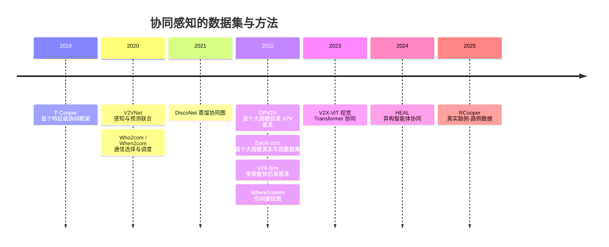

> 这篇梳理车路云一体化的政策、技术与商业现状。政策文件与论文按一手来源引用，券商研报和媒体口径单独标注，未能核实的内容不写成结论。文中的 arXiv 编号我都核对过页面，其中几个编号在整理时被纠正过，下面用的是核实后的版本。

## 先说结论

车路云一体化在中国是一条**官方明确的路线**：2024 年 1 月五部门印发试点通知，7 月公布 20 个试点城市（联合体），政策甚至给出了量化指标——路侧设施与路口联网率不低于 90%，试点车辆 100% 搭载 C-V2X 车载终端。

学术侧的协同感知也已经体系化。从 2018 年第一个特征级融合框架，到 2022 年三个数据集集中出现，再到 2024 年的异构协同与 2025 年的路侧-路侧数据集，方法链条是完整的：**"多车协同能提升感知"这件事，学术界已经证明过很多遍了。**

但产业侧出现了一个反直觉的数字：**2025 年项目数量同比增加约 20%，市场规模却下降超过 30%**（赛文研究院报告摘要）。项目变多、单个项目变小、总投资收缩。

我的判断是这样：**技术不是当前的瓶颈，缺的是商业闭环和公平评测。** 路侧设备装起来之后，谁付费、按什么标准验收、收益归谁，这三个问题都还没有公认答案。

## 政策把要求写成了数字

268 号文（《关于开展智能网联汽车"车路云一体化"应用试点工作的通知》）把系统拆成三层：

- **车端**：单车智能为基础，加装 C-V2X 车载终端负责本车感知决策；
- **路侧**：相机、激光雷达、毫米波雷达加路侧计算与通信单元，官方表述是"能感知、会思考、可进化、有温度"；
- **云端**：城市级服务管理平台，采用**边缘云—区域云—中心云**三级架构，负责全量数据接入、融合与监管。

试点文件里的量化要求值得单独看，因为它们决定了工程量级：

| 要求 | 数值 |
| --- | --- |
| 路侧设施与路口联网率 | ≥ 90% |
| 试点车辆终端搭载 | 100% 搭载 C-V2X |
| 智慧停车场 | 试点 ≥10 个，每个 ≥30 车位 |
| 场景示范 | 智慧乘用车、城市物流配送车、低速无人车等规模化 |

截至 2024 年 7 月的官方存量口径是：17 个国家级测试示范区、7 个车联网先导区、16 个"双智"试点城市，开放测试道路超 3.2 万公里，发放测试牌照 7700 多张，路侧单元部署超过 8700 套。

20 个试点城市名单也在那时公布：北京、上海、重庆、鄂尔多斯、沈阳、长春、南京、苏州、无锡、杭州—桐乡—德清、合肥、福州、济南、武汉、十堰、长沙、广州、深圳、海口、成都。

## 学术侧：协同感知在解决什么问题

单车主视距内的感知受遮挡和视距限制——一辆大车挡住前方，本车就看不见。协同感知的思路是通过 V2X 通信聚合多个智能体的信息，把"谁能看见"扩展成"车队和路侧都能看见"。

融合范式分三档：**早期融合**传原始数据，带宽最贵；**中间（特征）融合**传 BEV 或特征图，是当前主流；**晚期融合**传检测结果，最省带宽但精度最低。

数据集这条线能看出问题的演进方向：

| 数据集 | 年份 | 协同类型 | 意义 |
| --- | --- | --- | --- |
| OPV2V | 2022（ICRA） | 仿真 V2V | 首个大规模车车协同基准与融合管线 |
| DAIR-V2X | 2022 | 真实车路（V2I） | 首个大规模真实车路协同 3D 检测数据集 |
| V2X-Sim | 2022（RA-L） | 仿真多智能体 | 覆盖检测、跟踪、分割的多智能体基准 |
| V2X-ViT | 2023（ICCV） | 含噪声与时延设置 | 提供位姿噪声、时延下的鲁棒性评测 |
| HEAL | 2024（CVPR） | 异构协同 | 处理"新的异构智能体不断出现"的开放问题 |
| RCooper | 2025 | 真实路侧-路侧 | 把协同从"车与车、车与路"扩展到路侧之间 |

方法侧最核心的约束是**带宽**：中间融合的特征量随智能体数量线性增长，不可能无限传。Where2comm 的做法是用一张空间置信图决定"发什么、发给谁"——只在对方可能感兴趣的区域传特征。这类"选择性通信"是过去几年最活跃的方向之一。

HEAL 解决的是另一个问题：现实里协作方的传感器和模型都不一样，不能假设大家都是同一款车。它把异构对齐当成开放问题，目标是新类型的智能体接入时成本尽量低。

## 两种账本

技术账和商业账必须分开看，因为它们的结论相反。

**技术账**：数据集从仿真走到真实，从车-车走到车-路、路-路；方法从"传数据"走到"选择性传特征"；鲁棒性（位姿噪声、时延）有专门基准。这条线是往上走的。

**商业账**：单体项目确实做起来了——北京的车路云一体化新型基础设施建设项目总投资约 99.39 亿元、覆盖 13 个区约 6050 个路口（券商研报拆解口径，非官方）；武汉规划了约 2324 平方公里的部署范围，并设立全市统一运营主体。但 2025 年行业整体是"项目数量 +20%、市场规模 −30%"。

这个组合的含义是：**单子变碎、变小，总投资在收缩。** 路侧感知的钱主要来自政府专项债、地方国企和高速运营方，投资回报机制没有闭环——设备装完之后，靠什么收费、向谁收费，目前没有跑通的公开样本。

这可能是整个方向当前最大的争议点，而且它不完全是技术问题。

## 路侧的价值主张，和它的三个前提

把路侧的作用拆开会更容易看清争论。路侧感知主要提供三类价值：

- **超视距**：看到本车视野之外的情况，比如被大车遮挡的横穿行人、路口另一侧的排队；
- **盲区覆盖**：在遮挡密集的路口提供"上帝视角"，这类场景单车无论算法多强都解决不了；
- **全局信息**：路口级的信号相位、排队长度和调度意图，用于做更优的通行决策。

这三类价值在论文里都有对应证据——协同感知的核心指标，本来就是"遮挡场景下的检测提升"。但它们成立有三个前提：

1. **联网率要够高。** 路侧看到的东西如果传不出去或传得不够快，价值就会衰减。这也是试点把"联网率不低于 90%"写进量化指标的原因；
2. **时延要进预算。** V2X-ViT 专门构造了位姿噪声与时延下的鲁棒性评测，说明这两项误差会直接吃掉协同收益；而真实 4G/5G 网络抖动下的性能损失，目前缺少公开的系统性评测；
3. **口径要统一。** 不同厂商车端和路侧的特征空间互不相通，异构协同（HEAL 这类工作）是学术回应，产业侧依赖标准与数字身份的推进。

三个前提里，第一个是钱的问题，第二个是工程问题，第三个是标准问题。**这正是"技术已经成熟"和"能规模落地"之间的差距不会自动消失的原因。**

## 学术侧真正在卷的是什么

把协同感知的方法拉平看，竞争的维度只有三个：

**精度**——遮挡场景下能把检测率提升多少，这是所有数据集论文的主指标。

**带宽**——传多少信息才能换到这个精度。中间融合的特征量随智能体数量线性增长，所以"选择性传"是过去三年最活跃的方向：有的工作决定跟谁握手，有的决定什么时候通信，Where2comm 用空间置信图决定传哪些区域。这三条线的共同假设是：**大部分特征对协作者没有用，通信应该花在对方真正关心的区域。**

**鲁棒性**——位姿误差、时延、丢包下还能不能协同。V2X-ViT 把这三项做成了标准评测设置，我认为这是最容易被忽视、也最有实际价值的一环：真实部署里传感器标定误差和网络抖动是常态，不是异常。

换句话说，这个方向已经从"证明协同有用"进入"证明协同在什么条件下还有用"的阶段。而后一类证据，恰好是量产决策最需要、目前又最缺的。

## 海外在走三条不同的路

| 维度 | 中国 | 美国 | 欧盟 | 日本 |
| --- | --- | --- | --- | --- |
| 通信制式 | C-V2X（向 5G/5G-A 演进） | C-V2X（DSRC 退场） | ITS-G5 与 C-V2X 并行 | ITS Connect（760 MHz）向 5.9 GHz 演进 |
| 主导方 | 政府主导基建与试点 | 联邦定频谱与计划，州和地方部署 | 成员国加欧盟法规 | 车企与政府联合 |
| 核心目标 | 产业化"中国方案"，三级云控 | 交通安全优先 | 数据共享与隐私合规 | 安全驾驶辅助与协调型自动驾驶 |
| 部署现状 | 20 个试点城市、RSU 超 8700 套 | 分散部署，2028 覆盖目标 | 跨国走廊（C-Roads） | 2015 年起量产商用 |

美国的进展值得单独说：FCC 在 2024 年 11 月通过最终规则，把 5.9 GHz 上部 30 MHz（5.895–5.925 GHz）正式保留给 C-V2X，规则 2025 年 2 月 11 日生效，并要求 DSRC 向 C-V2X 迁移。频谱不确定性结束之后，USDOT 的全国 V2X 部署计划给出 2028 年的覆盖目标（约 7.5 万英里州际公路与 25% 信号交叉口，媒体口径）。

欧盟走的是"数据法规加跨国走廊"的路线：在 ITS 指令框架下发布授权条例（包含实时交通信息一条，要求成员国通过国家接入点以统一标准供数），修订版 ITS 指令已在 2024 年发布，C-Roads 平台负责组织成员国做跨国走廊的协同服务部署。这条路线的重心不在路侧硬件，而在**数据共享的合规与互操作**。

日本是商用最早的一个：760 MHz 的 ITS Connect 从 2015 年就上车，丰田、本田的多款车型搭载；随后在国家级项目里做协调型自动驾驶的大规模实证，并开始向 5.9 GHz 与 C-V2X 演进。

三条路线的选择其实对应三种"谁承担成本"的答案：美国联邦层面负责频谱与规划、部署交给州；欧盟把成本放在数据合规与互操作上；日本由车企主导商用。中国则是政府主导基建与试点。**路线差异的背后是投资主体差异，不是技术差异。**

## 路线之争的新格局

"单车智能还是车路协同"这个争论在 2021 年前后是"二选一"的架势，端到端大模型出现后重新洗牌。

一边的观点是端到端让 L2 直接跨越到 L4 成为可能（2026 年 4 月的公开讨论中，何小鹏与卓驭沈劭劼都表达了类似判断）。另一边是官方与学界的定调：**单车智能是基础，车路云一体化是升级**（李克强院士），路侧的价值转向安全兜底、监管与数据底座。

特斯拉 FSD 在 2025 年 2 月 25 日起向中国部分车主分批推送城市道路辅助驾驶（L2 级、6.4 万元选装），被不少讨论当作"纯视觉单车路线天花板"的检验。

我的理解是：**争论的焦点已经从"要不要路侧"变成了"路侧的钱从哪来、谁买单"。** 因为路侧的价值主张（超视距、盲区、全局调度）在技术上是成立的，但它的收益是**社会化的**——事故率下降、通行效率提升的好处分散给所有用路人，而成本集中在一个主体身上。这是典型的需要公共投入的结构，商业模式自然难闭环。

（网上流传"何小鹏 2021 年明确表态不做车路协同"的报道，我没有检索到原文，不作为事实引用。）

## 取舍与局限

**带宽与性能的权衡还没有真实信道下的系统评测。** 选择性通信（Where2comm）、时机调度（When2com）、特征压缩都在论文里有效，但真实 4G/5G 网络的丢包、抖动下性能损失多少，缺少公开的系统性评测。

**标准化还在路上。** 不同厂商的车端和路侧特征空间互不相通，268 号文把数字身份、信息交互标准和场景数据库列为试点任务，产业侧的实际进展没有统一口径。

**数据集有 sim2real 缺口。** 早期三大数据集里两个是仿真；真实数据集在 2022 年之后补位，但"车、路、云全链路且带时延标签"的公开数据仍然稀缺。这既是缺口，也是个人研究者最容易切入的位置。

## 最后留下的结论

车路云一体化现在的状态是：**技术账很清楚，商业账不清楚。**

学术界已经用一长串数据集和方法证明"协同能提升感知"，政策也把要求写成了可验收的数字。但设备装好之后的价值如何变现，没有跑通的样本——2025 年的"项目 +20%、市场 −30%"就是这个状态最直接的读数。

如果你想做研究而不是判断商业，公开数据集（OPV2V、DAIR-V2X、RCooper）加上统一的"精度—带宽—时延"三元评测，是门槛最低、也最缺人的位置：现有论文各报各的口径，缺一份公平对比。

## 参考资料

1. [OPV2V: An Open Benchmark Dataset and Fusion Pipeline for Perception with Vehicle-to-Vehicle Communication](https://arxiv.org/abs/2109.07644)
2. [DAIR-V2X: A Large-Scale Dataset for Vehicle-Infrastructure Cooperative 3D Object Detection](https://arxiv.org/abs/2204.05575)
3. [V2X-Sim: Multi-Agent Collaborative Perception Dataset and Benchmark for Autonomous Driving](https://arxiv.org/abs/2202.08449)
4. [V2VNet: Vehicle-to-Vehicle Communication for Joint Perception and Prediction](https://arxiv.org/abs/2008.07519)
5. [CoBEVT: Cooperative Bird's Eye View Semantic Segmentation with Sparse Transformers](https://arxiv.org/abs/2207.02202)
6. [Where2comm: Communication-Efficient Collaborative Perception via Spatial Confidence Maps](https://arxiv.org/abs/2209.12836)
7. [V2X-ViT: Vehicle-to-Everything Cooperative Perception with Vision Transformer](https://arxiv.org/abs/2203.10638)
8. [An Extensible Framework for Open Heterogeneous Collaborative Perception（HEAL）](https://arxiv.org/abs/2401.13964)
9. [RCooper: A Real-world Large-scale Dataset for Roadside Cooperative Perception](https://arxiv.org/abs/2403.10145)

**政策与市场**

10. [《关于开展智能网联汽车"车路云一体化"应用试点工作的通知》（工信部联通装〔2023〕268 号）转载版](https://www.waizi.org.cn/law/218324.html)
11. [五部门确定 20 个试点城市（联合体）及政策问答（央视财经，2024-07）](https://jingji.cctv.com/2024/07/03/ARTI24eZYhw1aPFkR1hmAhHT240703.shtml)
12. [赛文研究院《2026 年中国车路云一体化市场研究报告》摘要页](https://www.vzkoo.com)
