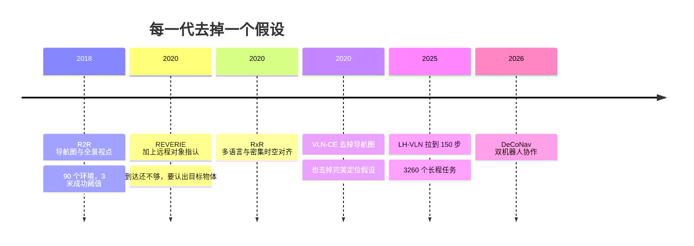

> 这篇梳理视觉语言导航（Vision-and-Language Navigation, VLN）在 2024–2026 年的进展，重点在长程与真实化两个方向。论文数字以 arXiv 原文为准；我搜不到以某个词命名的原始论文时会明确说"没找到"，不把它写成术语。关于经典导航栈（SLAM、Nav2）我在之前一篇里写过，这里讨论的是学习型方法。

## 先说结论

VLN 的主线正在从"短指令加离散导航图"转向**长程任务、连续控制、开放目标和真实传感器**。但长程化远没有解决：在专门为长程设计的 LH-VLN 上，目前表现领先的方法整体成功率只有 **2.44**。

真实化的第一道坎是**定位与几何**，而不只是语义。VLN-CE 当年的论文证明了这一点：去掉导航图、短程 oracle 移动和完美定位这三个假设之后，同一批任务平均需要 55.88 个低层动作才能完成，早期最好成绩的成功率只有 0.32。

失败模式非常稳定，而且不是"语义理解不够"能解释的：

- **停止错误**：走到了该停的地方却没有停，或者在不该停的地方停了；
- **过度旋转**：某份零样本评测里，总步数的 54.0% 是旋转动作；
- **长程错误累积**：显式思维链会因为推理错误越积越多反而变差；
- **算力与延迟**：单步推理以秒计，长程任务的总延迟是小时级。

我的判断是：**VLN 现在的瓶颈已经不是"能不能看懂指令"，而是"长程里能不能保持正确的位置感和停止判断"。** 大模型解决的是前者，后者还没有被系统性解决。

## 每一代去掉一个假设

把数据集和任务定义排成时间线，"长程化与真实化"的路径就很清楚：每一代都在去掉上一代的某个简化假设。

**R2R（2018）** 建立了经典范式：在 Matterport3D 的真实室内扫描环境中，根据自然语言指令从起点导航到目标，成功标准是最终位置误差小于 3 米。它含 90 个建筑级环境、7189 条路径、21567 条指令，平均指令长度 29 个词。它的关键简化是环境以导航图给出，智能体在离散的全景视点之间移动——这相当于给了一个"已知地图加完美定位"的起点。

**REVERIE（2020）** 把任务推进一步：不只是走到目标附近，还要**识别出指定的物体**。数据集含 21702 条指令、4140 个目标对象和 489 个类别。这一步引入了 VLN 与物体指认（object grounding）的合流——到达和选对东西是两件事。

**RxR（2020）** 扩展了语言多样性和时序对齐：126069 条英语、印地语和泰卢固语指令，约 980 万词，并带词级时间戳和相机位姿轨迹。它的价值不只是更大，而是让"路径形状"和"语言时序"成为评估的一部分——只走到终点不够，中间路线要符合描述。

**VLN-CE（2020）** 是真实化的关键转折。它明确移除了三类假设：已知环境拓扑、短程 oracle 导航、以及智能体的完美定位。R2R 转成连续环境后，只有 4475 条轨迹能成功转移（覆盖原训练验证集的 77%）；智能体改用"前进 0.25 米、左右转 15 度、停止"这样的低层动作，单条任务平均需要 55.88 个动作——而原来的 R2R 只需要 4 到 6 次图节点跳转。这个数量级的变化解释了后面几年为什么大量工作转向三维记忆、拓扑规划和定位感知的表示。

**LH-VLN（CVPR 2025）** 把任务拉长到多阶段连续子任务：3260 个任务、平均 150 个任务步，并提出 ISR、CSR、CGT 等细粒度指标。它的动机很直接——**单段指令的评测已经不能反映真实部署**，因为真实任务往往是"先去厨房看看有没有牛奶，没有的话去客厅问一下，然后把冰箱里的拿出来"这种多阶段结构。

**DeCoNav（2026）** 进一步推向多机器人：1213 个任务、176 个 HM3D 场景，平均每个机器人要走 139.9 步、20.6 米，强调双机器人的同步执行、交接与会合。同一测试划分上，成功率从 0.28 提到 0.39。

## 150 步有多难

LH-VLN 的数字值得单独看。目前领先的方法之一用 Qwen2.5-VL 加视觉链式推理（latent visual CoT）和跨模态对齐训练，在 LH-VLN 上的结果是：**整体成功率 2.44**，而 ISR（独立子任务成功率）11.01、CSR（条件成功率）9.64、CGT 8.99。

这组数字的含义是：**端到端成功率极低，但子任务层面已经有一定的完成能力。** 一个子任务能做完，不代表下一步开始时状态还是对的——前一段的失败会污染后一段。这也是为什么长程任务不能只看最终成功率：2.44 和 11.01 之间的差距，恰恰是"条件依赖"吃掉的部分。

另一个值得注意的对比是：这项工作用了 64 张 H20 训练。也就是说，把大模型和显式推理堆上去，并没有换来长程能力的质变。论文自己的观察是：**显式思维链在长程中可能因为推理错误累积而变差，反而是隐式的多模态推理给出了更好的子任务指标。** 推理链越长，出错的机会越多——这个反直觉的结论，对"更长的上下文等于更强的长程能力"的直觉是一个提醒。

## 稳定的失败模式

有一份值得细读的零样本评测：用某个大模型（工作流封装）在 50 个 R2R-CE 验证集片段上跑连续导航，得到成功率 52.00、SPL 48.90。但把失败拆开看，信息量更大：

| 观察 | 数字 | 含义 |
| --- | --- | --- |
| 进入成功区域的轨迹 | 31/50 | 位置感基本可用 |
| 最终成功的轨迹 | 26/50 | 停不下来或停错地方 |
| 接受 STOP 的成功 | 18/50 | 停止决策是明显短板 |
| 类别识别成功 | 33/50 | 语义识别最容易 |
| 关系指认成功 | 23/50 | 关系推理其次 |
| 目标实例对应成功 | 18/50 | 实例级对应最难 |
| 旋转占总步数 | 2182/4040（54.0%） | 犹豫与原地打转 |
| 累计生成延迟 | 22.55 小时 / 50 episodes | 算力成本真实存在 |

这组数字里最能说明问题的是**31 比 26**：五条轨迹走到了正确的位置却没有成功——问题不在"找不到"，在"停不下来"。而类别识别（33）远好于实例对应（18），也说明大模型的语义能力并没有自动转化为导航需要的实例级定位。

（需要说明的是：这份评测依赖外部工作流封装，模型名与复现细节需要谨慎对待，数字应看作该设置下的观测，而不是某个模型的通用能力。）

旋转占 54% 是另一个侧面：大量动作花在调整朝向上，说明智能体的行动效率很低。在长程任务里，这种低效会直接吃掉预算——150 步的任务，一半花在转身上，剩下的步数不可能走完。

## 关于"定位悖论"

有一个流传的说法是：在连续环境 VLN 中，语义推理能力随模型规模提升，但定位能力并不提升。**我做了几轮检索，没有找到以"定位悖论"命名的原始论文**，所以不把它当作既有术语使用。能核实的邻近证据有三层：

1. **VLN-CE 的任务定义本身就说明了定位为什么关键**：它明确把"完美定位"从假设里去掉，而这一步直接导致任务难度跳升；
2. **大模型零样本评测显示了分层差异**：类别识别（33/50）明显好于目标实例对应（18/50）和正确停止（18/50），说明语义与定位确实是两条不同的能力线；
3. **一批方法把定位拆成了别的东西**：无坐标方法用视觉锚点图替代度量定位，三维实例记忆把定位变成"带位姿的实例检索"，还有一些工作用语义加深度的表示来缓解重复地标带来的歧义。

我会把这件事形式化成一个可测的问题：**在连续环境里，语义识别、关系判断、目标实例对应、拓扑定位、度量定位和停止决策，是否随模型规模同步提升？如果不同步，瓶颈在哪一层？**

这个问题值得做成一套诊断基准——现在的 SR 和 SPL 把这些能力混在一起，失败的时候根本不知道是哪一层的问题。这是我在这份材料里看到的最有价值的空白之一，因为它不需要训练大模型，做标注和审计就够了。

## 测试时适应：刚起步

真实部署会遇到训练时没见过的环境，所以"测试时适应"（Test-Time Adaptation）开始被引入 VLN。

- **FSTTA（ICML 2024）** 用快慢两个更新通道平衡稳定性与适应性，在 R2R 上把验证集成功率从 72 提到 75；
- **ATENA（NeurIPS 2025）** 用回合反馈、混合熵优化和自主动学习，在 REVERIE 上把成功率从 46.98 提到 68.11，在 GOAT 上从 57.72 提到 62.03；但在 R2R-CE 上提升温和得多（例如某个基线的成功率 59 到 60）。

难点在于：**VLN 测试时通常拿不到真实成功标签。** 所以可用的反馈只能是自己造的：停止置信度、重访与绕圈检测、物体检测的置信度、地图一致性……这些伪反馈很容易带来确认偏误——错误反馈会让模型"更自信地错"，尤其是在陌生环境、重复地标和视觉遮挡的情况下。ATENA 在 REVERIE 上提升大、在连续环境上提升小，这个差异本身就说明**连续环境下的适应更难，因为错误是复合的**。

## 真实化：sim2real 还没闭合

真实机器人上的 VLN 尝试越来越多，但边界很清楚：

- 有工作在真实 Stretch 机器人上做家居导航，静态场景成功率 70，**动态场景掉到 45**——动态变化仍是主要难点；
- 空中 VLN 的真实部署发生在受控场地（约 10×15×3 米的室内动捕场地和相对封闭的户外），高层推理依赖地面服务器，论文自己列出未解决的问题：强光、恶劣天气、移动障碍、拥挤、GPS 拒止和全机载部署；
- 一部分无人机工作摘要报告了相对基线的提升，但没有给出数据规模和绝对性能表。

结论是：**sim2real 不是一个单点技术问题，而是传感器、控制、延迟、安全、地图、天气和评估协议的组合问题。** 这也是为什么"在仿真里成功率很高"和"能在家用环境里跑"之间的距离，比很多人预期的要大。

## 合流与评测缺口

VLN 正在和两个方向合流：**物体导航**（开放词汇目标、三维场景图）和**具身问答**（场景记忆、检索式推理）。已经发生的合流包括导航加远程物体指认、导航加检索问答、以及用三维场景图统一目标定位与场景语义。

但我没有找到一个在 2024–2026 年被广泛承认、同时统一 VLN、物体导航和具身问答的标准基准。现阶段更像**方法在合流、基准仍分裂**。

还有一个容易被忽略的方法论提醒：有工作通过给视觉输入加扰动（甚至"给噪声"并简单扩展分支）也能提升导航成绩，这说明**基准上的提升不一定来自更强的视觉理解**，也可能来自结构容量或数据偏置。评估长程和真实场景时，扰动、消融和反事实测试应该成为常规动作。

## 多机器人协作：从概念到基准

长程的另一个方向是协作。DeCoNav 把双机器人长程导航做成了基准：1213 个任务、176 个 HM3D 场景，平均每个机器人要走约 139.9 步、20.6 米，并首次把三个此前没被系统评测的动作写进任务定义——**同步执行、交接（handoff）和会合（rendezvous）**，要求两个机器人共享时钟。方法侧用语义视觉总线传状态、事件触发对话做重规划、同步并行执行。

同一测试划分上，成功率从 0.28 提到 0.39，而"两边都完成"的双边成功率从 0.13 提到 0.22。这个数字很说明问题：**协作任务的成功定义是复合的，单机成功率的提升会打折到双边指标上。** 论文也指出通信延迟会直接降低协作质量。

这个方向值得关注的原因是它把"长程"从"一个智能体走很久"扩展成"多个智能体协调"，而协调引入了新的失败模式：交接时的信息丢失、会合的时间窗、以及两个机器人对同一空间的相互干扰。

## 最后留下的结论

VLN 从"听懂指令走到终点"走到"在 150 步的多阶段任务里保持正确"，中间隔着的不是语言能力，而是**位置感、停止判断、错误恢复和成本控制**。

如果要选一个切入点，我会选把失败分层做出来：在连续环境的子集上构造分层标注（类别识别、关系判断、实例对应、拓扑定位、度量定位、停止决策、越界后的恢复），跑几个开源智能体的日志做审计，回答"语义的进步有没有传导到定位和停止"。这件事不需要大算力，也不需要新模型，但它能把一个含糊的说法变成一条可以看的曲线。

## 参考资料

1. [Vision-and-Language Navigation: Interpreting visually-grounded navigation instructions in real environments（R2R）](https://arxiv.org/abs/1711.07280)
2. [REVERIE: Remote Embodied Visual Referring Expression in Real Indoor Environments](https://arxiv.org/abs/1904.10151)
3. [Room-Across-Room: Multilingual VLN with Dense Spatiotemporal Grounding（RxR）](https://arxiv.org/abs/2010.07954)
4. [Beyond the Nav-Graph: Vision-and-Language Navigation in Continuous Environments（VLN-CE）](https://arxiv.org/abs/2004.02857)
5. [Towards Long-Horizon Vision-Language Navigation: Platform, Benchmark and Method（LH-VLN）](https://arxiv.org/abs/2412.09082)
6. [FantasyVLN: Unified Multimodal Chain-of-Thought Reasoning for Vision-Language Navigation](https://arxiv.org/abs/2601.13976)
7. [DeCoNav: Dialog enhanced Long-Horizon Collaborative Vision-and-Language Navigation](https://arxiv.org/abs/2604.12486)
8. [Dynam3D: Dynamic Layered 3D Tokens Empower VLM for VLN](https://arxiv.org/abs/2505.11383)
9. [Seeing is Believing? Enhancing VLN using Visual Perturbations](https://arxiv.org/abs/2409.05552)
10. [Agent Journey Beyond RGB: Hierarchical Semantic-Spatial Representation Enrichment for VLN](https://arxiv.org/abs/2412.06465)
11. [How Far Can GPT-6-Astra Go? Evaluating Capabilities in Zero-Shot VLN](https://arxiv.org/abs/2609.20116)
12. [Navi-Agent: Unlocalized Monocular Navigation Agent](https://arxiv.org/abs/2609.20388)
13. [WorldVLN: Autoregressive World Action Model for Aerial VLN](https://arxiv.org/abs/2605.15964)
14. [AutoFly: Vision-Language-Action Model for UAV Autonomous Navigation](https://arxiv.org/abs/2602.09657)
15. [StreamVLN: Streaming VLN via SlowFast Context Modeling](https://arxiv.org/abs/2507.05240)
16. [GraphPad: Inference-Time 3D Scene Graph Updates for Embodied Question Answering](https://arxiv.org/abs/2506.01174)
17. [When Robots Should Say "I Don't Know": Benchmarking Abstention in Embodied QA](https://arxiv.org/abs/2512.04597)
18. [Vision-and-Language Navigation Today and Tomorrow: A Survey in the Era of Foundation Models](https://arxiv.org/abs/2407.07035)
