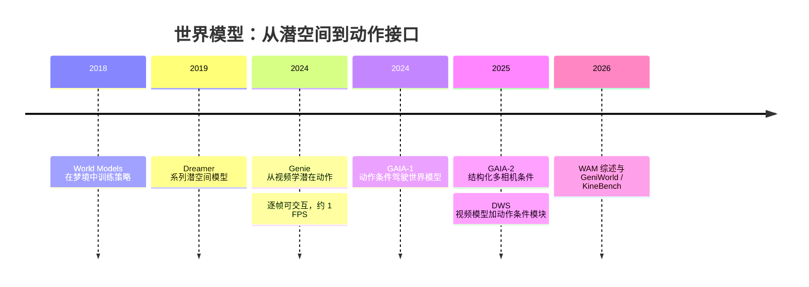

> 这篇讨论一个具体问题：**视频生成模型能不能成为可交互的物理模拟器**。证据分两级使用——原论文或官方页面明确报告的结论，以及"有下游实验、但尚未证明是可靠模拟器"的部分；官方演示不足以支撑的强结论会标出来。关于世界动作模型（WAM）的产业合流和驾驶域里重建与生成的分工，我在之前两篇里写过，这篇只补跨领域的部分。

## 先说结论

游戏、驾驶、机器人这三个领域对世界模型的要求差别很大：游戏要低延迟和状态可控，驾驶要多相机几何和交通交互，机器人要接触动力学和可执行性。但它们有一条**共同的主线**：不是"视频越来越逼真"，而是**"预测未来的模型逐渐接上了动作接口"**。

所以能被统一的东西不是像素，是**动作接口**。目前有三大类：显式动作条件、潜在动作、视觉动作（action flow）。

同时要记住一条分界线：**"可控"和"物理正确"是两回事。** Genie 的 latent action、GAIA 的结构化条件都证明了"动作能改变生成结果"；这不等于碰撞、接触、摩擦和长时状态守恒是对的。PhyGenBench 与 Physics-IQ 这两个物理基准给出的都是反面结论，而 Physics-IQ Verified 更进一步证明：连基准本身修订一下，模型排序都会变。

我的判断是：**当前最可信的统一抽象是"可行动的未来预测器"（actionable future predictor），而不是"通用物理引擎"。** 它可以服务策略预训练、候选动作排序、闭环评估和数据扩增；但在安全关键部署之前，仍然需要解析模拟器、传感器模型或真实系统做校验。

## 从"在梦里训练"到"可以被操控"

这条路线的起点不是视频生成，是控制。Ha 与 Schmidhuber 的 World Models（2018）把世界建模拆成视觉压缩器、时序动力学模型和控制器，明确提出在模型自己"幻觉"出的环境里训练智能体，再把策略迁回真实环境。它关心的不是画面好看，而是**内部状态是否足以支持控制**。

Dreamer 系列进一步证明了一个反直觉的事：**世界模型不必渲染高保真 RGB，也能对控制有用。** 只要潜状态保留任务相关的动力学，就可以在潜空间里学行为。这一点对今天很重要——它意味着"生成视频"只是世界模型的一种输出形态，不是唯一形态。

真正的转折发生在 2024 年。Genie 把"视频里发生了什么"压缩成一个可采样的动作接口：11B 参数、约 3 万小时互联网游戏视频（680 万个 16 秒片段、10 FPS、160×90）、**不依赖真实动作标签**，而是自己学出一套潜在动作（latent action），从而支持逐帧交互。论文报告推理速度约 1 FPS，并指出长时一致性和高效交互仍是问题。

同一时期，Sora 类模型把视频预测能力重新解释为"世界模拟器"的候选。但从可行动性角度看，它和 Genie 有一条关键差异：**公开接口主要是文本、图像或视频条件，没有一个通用的逐帧动作通道**。也就是说，"给定候选动作序列，生成视频里的状态转移能不能被下游策略可靠利用"这件事，在公开材料里没有被证明。它更像通用视觉未来预测器的规模化基础，而不是已经完成的闭环模拟器。

驾驶域的 GAIA 走了另一条路：把车辆动作、交通参与者配置、道路语义和多相机几何**显式**注入生成模型。GAIA-1 用约 4700 小时、25 Hz 的驾驶数据训练，论文口径的世界模型约 6.5B 参数，展示了分钟级的稳定驾驶视频生成——但这是长时生成展示，不等于安全闭环控制的证明。

到 2026 年，这套东西有了统一的名字：世界动作模型（WAM）。综述把它定义为"预测性状态建模与动作生成的联合建模"，并提醒评价标准应该变：**看候选动作是否产生可预测、可执行、符合目标的未来，而不是只看视频质量。**

## 三种动作接口

这是这篇的核心。想让一个视频模型"可被操控"，现在有三类做法，代价和风险各不同。

| 接口 | 做法 | 代表 | 优点 | 风险 |
| --- | --- | --- | --- | --- |
| 显式动作条件 | 把动作或结构化状态作为条件注入生成 | GAIA-1/2、DWS | 语义清楚、易与规划器连接 | 需要动作标签、动作空间对齐、干预数据覆盖 |
| 潜在动作 | 从无标签视频里学出离散动作码 | Genie | 不需要动作标签，可跨数据源对齐 | 可能混合相机运动、自身运动与环境随机性 |
| 视觉动作 / action flow | 把数值动作渲染成视觉变化 | GeniWorld、Hydra-0 | 统一不同具身，控制与生成同空间 | 丢失力、接触与本体感知等不可见状态 |

**潜在动作值得单独说。** 它的吸引力在于：互联网视频、机器人示范和游戏录像没有统一动作空间，但如果不同动作造成相近的视觉后果，就有机会在潜在动作层对齐。风险同样明显——一个潜在动作码里可能同时混着相机抖动、物体被推动、环境随机噪声和观察者意图。所以它需要专门的因果探针去验证，而不能因为"生成结果可控"就默认等价于真实动作。

**视觉动作是更工程化的折中。** GeniWorld 用 URDF 渲染把机器人的数值动作转成视觉动作，让不同控制器和动作空间都能接进同一个视频模型；Hydra-0 把动作表示为像素运动（action flow），给跨具身提供共享接口。代价是物理量丢失：力、扭矩、接触状态和本体感知在视觉空间里不可见，需要额外补充。

## 正面证据：动作后果可以被学习，也可以被下游使用

按证据强度排，公开材料里有四类：

**其一，动作与视觉变化确实能被对齐。** Genie 在无标签视频里学到潜在动作并支持逐帧控制；GAIA 证明结构化动作条件能影响生成的未来；DWS 用一个轻量的通用动作条件模块改造预训练视频模型，并加入运动强化损失来强调动态变化，在游戏和机器人域都提升了动作可控性。

**其二，世界模型可以当策略训练或评估的场所。** DWS 明确把"优先想象"（prioritized imagination）用于基于模型的强化学习；GeniWorld 报告它可作为策略评估器，并在有限真实示范下生成多样的机器人操作轨迹来改善下游策略。

**其三，动作后果与成功率存在相关性。** Hydra-0 报告机器人运动误差降低 90.4%、物体运动误差降低 60.2%，并给出 RoboLab 中成功率相关的皮尔逊系数 0.96。这是单篇预印本的结果，需要跨数据集复核，但方向值得关注。

**其四，也是最容易被忽略的一类：评测框架本身。** KineBench 把生成视频提取成 6D 末端位姿，再送进物理模拟器执行，覆盖 ManiSkill3 的 20 个操作任务。它不做"像不像"的打分，而是直接检验**视频能不能变成可执行动作**，并且刻意绕开逆动力学模型（IDM-free），避免把动作抽取器的误差算到生成模型头上。

WorldSimBench 的思路类似：用"视频—动作一致性"评估开放环境、驾驶和机器人三类场景。这两个工作说明，领域里已经有人意识到——**光看视频质量是不够的，必须把评价推进到"能不能被执行"。**

## 反面证据：逼真、连贯、物理正确是三件事

**第一，物理常识基准的结论是负面的。** PhyGenBench 设计了 160 个提示、27 类物理规律、四个基本领域，结论是当前文生视频模型仍经常违反物理常识，单纯扩大模型或优化提示词不足以解决动态物理现象。Physics-IQ 用 396 个真实世界物理实验视频做"预测后续"评测，覆盖流体、光学、固体力学、磁学、热力学。

更能说明问题的是 Physics-IQ Verified 的审计：原基准有 **57.6% 的样本被修订、34.8% 的提示被改进**；修订前后，六个图像到视频模型的排序 Kendall's τ 只有 0.46。这意味着两件事——物理评测是能做的，但**基准设计本身会显著影响模型名次**，单一分数不能当作"物理理解"的绝对真值。

**第二，长时展开会累积状态错误。** 生成模型可以在短片里保持外观连贯，但长时 rollout 会出现物体身份漂移、相机漂移、遮挡后物体消失、接触关系断裂、速度与加速度不守恒。GAIA-1 的分钟级视频证明了"能长时间生成看起来像驾驶的序列"，但没证明每个交通参与者的轨迹和碰撞风险都正确。

**第三，动作接口可能只是在"操控外观"。** 一个模型在动作输入变化时生成了相应的像素变化，可能只学到了相关性，而没有学到：动作改变了哪个物体的状态、这个变化是否满足力与惯性、同一状态在不同动作下是否遵守一致的转移规律、以及生成的视频能不能反推出同一动作并在另一个环境里执行。

这正是 KineBench 和 WorldSimBench 的价值所在：**把评价从"像不像真实视频"推进到"能不能被控制和执行"。**

## 三个领域要的东西不一样

| 维度 | 游戏 | 自动驾驶 | 机器人操作 |
| --- | --- | --- | --- |
| 主要状态 | 游戏状态、可见场景、任务目标 | 车辆、道路、交通参与者、多相机几何 | 物体状态、接触、末端位姿、本体感知 |
| 最重要的正确性 | 动作响应、任务逻辑、状态可复现 | 3D 几何、交通交互、碰撞、多视角一致 | 接触动力学、可执行性、运动学可行 |
| 时间尺度 | 高频低延迟，可暂停回放 | 中高频，长时 rollout，稀有安全事件 | 高频局部接触加长时任务序列 |
| 可接受的生成误差 | 外观瑕疵可容忍，逻辑错误不可容忍 | 外观可降级，几何与因果错误不可容忍 | 外观可降级，接触与位姿错误不可容忍 |
| 适合的模型形态 | 潜空间动力学、快速自回归 | 结构化多视角生成加几何状态 | 潜空间或几何加动作流，配物理闭环 |

这个表解释了为什么"用一个视频质量指标横评三个领域"是行不通的：**它们对错误的容忍方向不同。** 游戏可以容忍画面粗糙但不能容忍奖励算错；驾驶可以容忍画面有瑕疵但不能容忍碰撞判断错；机器人可以容忍画面一般但不能容忍接触力错。

## 能迁移什么，不能迁移什么

**可以迁移的是接口与表示**：动作条件的预测目标、潜在动作与视觉动作的设计、分层评测的思想、以及"生成未来再交给规划器挑选"的用法。还有数据混合的思路——仿真、机器人示范、驾驶录像和互联网视频各自承担不同的先验。

**不能直接迁移的是动作语义和物理**：游戏里的"跳跃/左移"不是车辆的转向，也不是机器人的末端位姿；驾驶的多相机几何不等于接触动力学；机器人的力与遮挡后的状态无法只从单张 RGB 唯一确定；游戏允许重置和重复采样，而真实驾驶与机器人的失败代价很高。

所以更合理的跨域路线是：**共享视频或几何表征，加上领域专属的动作适配器和领域专属的闭环验证器**，而不是把一个大模型直接当成三个领域的同一个物理引擎。

## 还没被证实的五件事

截至整理这份材料时，下面这些命题都还不能从公开证据推出来：

1. 一个单一视频生成模型在游戏、驾驶、机器人三域都能以统一动作接口实时运行；
2. 生成视频的视觉质量与真实策略性能之间存在稳定、跨域、单调的相关性；
3. 在生成模型中训练的策略可以不经安全校准直接迁移到真实车辆或机器人；
4. 长时视频连贯意味着隐藏状态、因果关系和接触动力学正确；
5. 生成模型可以替代解析物理引擎、传感器模拟器和真实闭环测试。

## 最后留下的结论

把三个领域放在一起看，统一它们的不是"用同一个渲染器"，而是一条闭环：**观测与任务进，候选动作出，未来被生成或预测，物理与任务层面被验证，然后才决定训练、评估还是执行。**

评价一个世界模型的标准应该是三句话：**能不能被行动（actionable）、有没有物理根据（physically grounded）、对闭环有没有用（closed-loop useful）**——而不是它的视频有多好看。

如果要找一件事做，我会选"动作可执行性"的评测：把同一个视频模型在三个领域的小任务上跑一遍，同时报告视觉指标、物理指标和闭环指标，看它们之间到底有没有相关性。Physics-IQ Verified 已经证明基准修订会改变排序，这说明这一类相关性研究本身就有论文价值，而且不需要训练大模型。

## 参考资料

1. [World Models（Ha & Schmidhuber, 2018）](https://arxiv.org/abs/1803.10122)
2. [Genie: Generative Interactive Environments](https://arxiv.org/abs/2402.15391)
3. [GAIA-1: A Generative World Model for Autonomous Driving](https://arxiv.org/abs/2309.17080)
4. [GAIA-2: A Controllable Multi-View Generative World Model for Autonomous Driving](https://arxiv.org/abs/2503.20523)
5. [WorldSimBench: Towards Video Generation Models as World Simulators](https://arxiv.org/abs/2410.18072)
6. [Pre-Trained Video Generative Models as World Simulators（DWS）](https://arxiv.org/abs/2502.07825)
7. [World Action Models: The Next Frontier in Embodied AI（综述）](https://arxiv.org/abs/2605.12090)
8. [Do generative video models understand physical principles?（Physics-IQ）](https://arxiv.org/abs/2501.09038)
9. [Towards World Simulator: Physical Commonsense Benchmark for Video Generation（PhyGenBench）](https://arxiv.org/abs/2410.05363)
10. [Physics-IQ Verified](https://arxiv.org/abs/2606.18943)
11. [Cosmos World Foundation Model Platform for Physical AI](https://arxiv.org/abs/2501.03575)
12. [KineBench: Benchmarking Embodied World Models via IDM-Free Kinematic Grounding](https://arxiv.org/abs/2607.19876)
13. [GeniWorld: A Generalizable Interactive World Model for Robotic Manipulation via Visual Actions](https://arxiv.org/abs/2608.06332)
14. [Hydra-0: Action Flow for Generalist World Modeling and Control](https://arxiv.org/abs/2608.18077)
