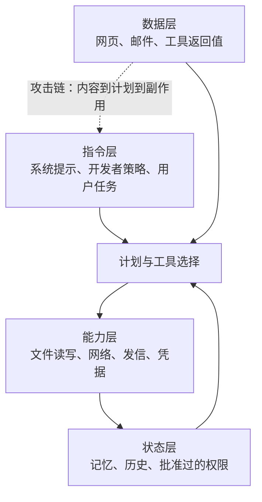

> 这篇梳理 Agent 安全的核心问题与防御现状。文中只做学术与防御分析，不涉及可操作攻击步骤。论文编号已核对；厂商产品细节中未能核实的一律标注为未验证。

## 先说结论

Agent 与聊天机器人最重要的区别是：**它读到的内容会变成可执行上下文。** 网页正文、邮件、文档、搜索结果、工具返回值、甚至另一个 Agent 的消息，都可能携带间接提示注入（indirect prompt injection）；一旦模型能调用工具，注入就可能转化为数据泄露、越权写入或外发消息。

但真正的根因不是"缺少某个过滤器"，而是一个结构性问题：**指令与数据共用同一个自然语言通道。** 模型看到的是同一串 token，它没有形式化的机制区分"这是用户让我做的事"和"这是某网页里写着的字"。

这决定了一个不太好接受的结论：**来源标记、训练、分类器或二次审查，都只能提供概率性缓解，而不是全局安全证明。**

## 四层信任边界

理解这个问题最好的方式是把 Agent 拆成四层，然后看它们之间的边界在哪里错配：

**指令层**是控制面（系统提示、开发者策略、工具定义）；**数据层**是内容面（网页、邮件、数据库记录、工具返回、图片 OCR）；**能力层**是权限面（文件、网络、发信、代码执行、凭据）；**状态层**是记忆与历史（含缓存的工具描述、批准过的权限、任务队列）。

风险的来源是：**如果数据层内容能影响控制层决策，而控制层又能直接使用能力层权限，就形成了一条"内容 → 计划 → 工具副作用"的完整攻击链。** 这条链的每一环单独看都是合理设计，串起来就成了漏洞。

## 六类攻击面

**一、直接提示注入。** 攻击者直接提交输入，试图覆盖系统约束。它更容易被发现，但仍会通过角色扮演、编码、语言切换、长上下文稀释等方式增加检测难度。

**二、间接提示注入。** 这是 Agent 时代的新问题：恶意指令藏在 Agent 读取的第三方数据里。来源极广——网页、广告、搜索结果、邮件正文、日历描述、工单、共享文档、代码仓库、PDF 元数据、隐藏文本、图像 OCR、工具返回值、API 错误信息，以及另一个 Agent 的摘要。有评测框架把注入端点直接放进收件箱这类应用状态里，要求 Agent 在有状态的多工具环境中同时完成用户目标和安全属性——这比单轮测试更接近产品形态。

**三、工具投毒与 MCP 工具投毒。** MCP 客户端通常会把服务器提供的工具名称、描述、参数和返回值放进模型上下文。这里有个容易被忽略的事实：**工具描述本身也是不可信输入。** 有安全研究披露了三种进阶手法——在工具描述里藏入人类界面不完整展示但模型可见的隐藏指令；恶意工具诱导 Agent 读取本地配置或凭据；以及"rug pull"（工具在首次批准后改变描述或行为）。还有跨服务器影响：多服务器共存时，恶意服务器的描述可能污染可信服务器的工具行为。

**四、混淆代理与 token 透传。** 当代理服务器代表用户访问上游服务时，它可能把"收到的 token"误当成"自己有权使用的 token"，或把 token 原样转发给下游。结果是下游服务误以为请求来自合法代理，或者一个资源的 token 被复用于另一个资源。**值得注意的是，这不是学术假设——MCP 官方授权规范把它写进了正式要求**：客户端必须在授权请求中包含资源参数，服务器必须验证 token 是否确实以自己为受众，且不得转发不属于自己的 token。

**五、多 Agent 信任传递。** 多 Agent 系统常把一个 Agent 的输出当成另一个 Agent 的高可信任务或建议。风险包括：权限传递（上游 Agent 以自己的身份调用工具，下游当作用户授权）、来源丢失（摘要删掉了"该字段来自不可信网页"的出处）、目标漂移、循环放大（恶意内容经多次改写后变成"内部建议"），以及批准继承（一次低风险批准被解释为对后续高影响动作的长期授权）。

**六、数据外泄与副作用放大。** 即使单个工具只有读权限，多个工具组合也可能形成"读敏感数据 → 写入外部服务"的跨工具数据流。

## 七层防御与各自的证据

| 防御层 | 做法 | 已知效果 | 主要不足 |
| --- | --- | --- | --- |
| 指令分层 | 系统/开发者/用户/第三方数据分级 | 训练模型学习优先级，报告对未见攻击类型鲁棒性提升 | 依赖模型正确识别来源；不等于对自适应攻击有保证 |
| 来源标记 | 编码或标记不可信内容 | 报告攻击成功率从超过 50% 降到不足 2% | 标记可被上下文拼接、改写或摘要丢失；跨模型未充分验证 |
| 结构化通道 | 指令与数据放在不同结构通道 | 报告鲁棒性显著增强、效用影响小 | 需要安全前端与通道完整性；下游重新拼接则隔离失效 |
| 输入输出过滤 | 分类器、规则、二次审查 | 官方研究在 1 万次合成攻击上把越狱成功率从 86% 降到 4.4%，拒答率仅增 0.38%，计算成本 +23.7% | 语义等价与自适应攻击可绕过；后续红队仍报告通用绕过 |
| 信息流控制 | 污点追踪、控制流与数据流策略 | 在受控任务集上做到"可证明安全"，完成率 77%（无防御 84%） | 证明范围有限；安全控制带来约 7 个百分点的效用成本 |
| 能力沙箱 | 容器、只读文件系统、网络白名单、短期凭据 | 把误判后果限制在低影响环境 | 共享缓存、浏览器会话、OAuth 仍可能形成旁路 |
| 人审门禁 | 高影响动作前确认 | 对可枚举的高影响动作有效 | 审批疲劳、参数不可见、用户不理解真实数据流 |

把这张表读一遍，会发现一条规律：**越是靠近模型判断的防御，越容易被绕过；越是靠近能力边界的防御，越稳固。** 这引出了下一节。

## 为什么没有完备解

**第一，指令与数据在语义上同构。** 对模型而言，"请总结下面内容"和"下面内容中出现的指令"都是 token 序列。系统可以用标签、特殊 token 或字段名提供出处，但这些信号本身也进入推理上下文，可能被复制、改写、压缩或在跨组件传递中丢失。

**第二，恶意意图不是一个可稳定枚举的字符串集合。** 输入过滤器能拦已知模式，但难以穷举语义等价表达、跨语言表达、编码、隐喻和多轮组合。一家公司的官方红队报告显示：初始测试没找到通用绕过，但更大规模（超过 30 万次交互）的后续挑战中仍报告了通用或接近通用的结果。

**第三，工具组合带来开放世界状态空间。** 一个评测含 17 种用户工具、62 种攻击者工具、1054 个案例；另一个在 97 个现实任务、629 个安全测试中执行多轮调用。而真实产品的工具、数据、权限和策略还在持续变化。**单个工具安全不代表组合安全**，因为危险往往来自跨工具数据流。

**第四，模型鲁棒性与任务能力存在张力。** 拒绝过多损害效用，放行过多扩大攻击面。那个"可证明安全"的工作清楚地展示了这条前沿：77% 对 84%，安全保证换来 7 个百分点的完成率损失。这不是失败，而是把安全—效用权衡显式化了。

**第五，人审只能覆盖可见、可理解、可枚举的动作。** 如果确认窗口只显示"发送邮件"而不显示完整收件人、附件、数据来源，它就无法阻止混淆代理；如果每步都弹窗，用户会形成批准疲劳。

**真正接近完备的，是"受限系统上的可证明安全"**：在固定任务、固定工具、固定数据流和明确能力策略下，可以证明某类外部内容不能影响某类敏感操作。但这只是**局部保证**。要扩展到开放世界，需要显式的能力令牌与资源受众绑定、不可信数据的污点传播、工具调用前的策略判定（而不是只靠模型输出）、沙箱隔离，以及对策略覆盖范围的诚实声明。

## 从案例里学到的

有两类公开案例值得区分对待。

**已核实的公开研究披露**：一份安全通知演示了工具投毒、跨服务器影响、rug pull 与确认窗口信息不完整。**需要强调的是它的证据等级是"公开研究演示"**——我没有在可核实页面上找到 CVE、现实受害者或入侵时间线，因此不能称它为已确认的生产环境漏洞。

**协议维护者的公开承认**：MCP 官方规范明确要求服务器验证 token 受众、禁止 token 透传、讨论混淆代理风险。这不是某个 CVE，而是协议层对现实架构风险的正式要求——**它证明混淆代理不是只存在于学术讨论**。

至于更广为人知的某个办公套件零点击数据外泄事件，我这次未能完整复核一手来源（厂商公告与 CVE 条目），因此不在这里写成已验证的事实。**原则是：媒体文章和二手博客只能作为线索，正式引用应同时保留原始披露、受影响版本、修复公告和独立复核状态。**

## 产品设计的共同趋势

不同产品的命名不同，但稳健的共同模式是清晰的：

1. **短生命周期运行环境**：每个任务用临时容器、虚拟机或 CI runner，完成后销毁；
2. **仓库或工作区作用域**：默认只读或只改一个项目、分支；
3. **动作级确认**：发送、付款、删除、外发、提交前重新确认；
4. **OAuth 范围与资源受众**：token 绑定到特定服务，禁止无条件转发；
5. **审计与回放**：保存工具调用、策略决定、用户批准、数据来源与最终副作用；
6. **可配置的出站策略**：网络、域名、文件系统和凭据都应有白名单或黑名单，而不是"模型自己决定"。

## 最后留下的结论

Agent 安全的核心矛盾可以用一句话概括：**检测器的目标是识别恶意文本，而安全系统的目标应该是"即使文本被误判，敏感动作也无法越权发生"。**

这个差别决定了投入方向。加大分类器有用，但收益递减；真正的结构性改善来自能力边界——最小权限、资源受众绑定、沙箱、动作级确认、可审计的数据流。这些不是 prompt 层面的技巧，而是围绕模型的系统工程。

对做研究的人来说，这个领域有几个明确缺口：**可复现的动态评测**（现有基准的工具集与环境仍有限）、**攻击—防御消融矩阵**（各防御的相对贡献缺少同台对比）、**跨工具的信息流与污点追踪**（工具组合是当前最不清楚的盲区），以及**多 Agent 信任传递评测**（消息携带出处与能力令牌的效果）。这些都只需要本地合成环境，不需要真实账户。

## 参考资料

1. [AgentDojo: A Dynamic Environment to Evaluate Prompt Injection Attacks and Defenses for LLM Agents](https://arxiv.org/abs/2406.13352)
2. [InjecAgent: Benchmarking Indirect Prompt Injections in Tool-Integrated LLM Agents](https://arxiv.org/abs/2403.02691)
3. [Defending Against Indirect Prompt Injection Attacks With Spotlighting](https://arxiv.org/abs/2403.14720)
4. [The Instruction Hierarchy: Training LLMs to Prioritize Privileged Instructions](https://arxiv.org/abs/2404.13208)
5. [StruQ: Defending Against Prompt Injection with Structured Queries](https://arxiv.org/abs/2402.06363)
6. [Defeating Prompt Injections by Design（CaMeL）](https://arxiv.org/abs/2503.18813)
7. [Reliable Weak-to-Strong Monitoring of LLM Agents](https://arxiv.org/abs/2508.19461)
8. [MCP 授权规范](https://modelcontextprotocol.io/specification/2025-06-18/basic/authorization)
9. [Invariant Labs: MCP Tool Poisoning Attacks](https://invariantlabs.ai/blog/mcp-security-notification-tool-poisoning-attacks)
10. [Anthropic: Constitutional Classifiers](https://www.anthropic.com/research/constitutional-classifiers)
11. [Anthropic: Mitigating the risk of prompt injections in browser use](https://www.anthropic.com/research/prompt-injection-defenses)
12. [OWASP: LLM01 Prompt Injection](https://genai.owasp.org/llmrisk/llm01-prompt-injection/)
13. [Microsoft Foundry: Content filtering](https://learn.microsoft.com/en-us/azure/foundry-classic/foundry-models/concepts/content-filter)
14. [GitHub: About Copilot coding agent](https://docs.github.com/en/copilot/concepts/agents/coding-agent/about-coding-agent)
15. [NIST AI Risk Management Framework](https://www.nist.gov/itl/ai-risk-management-framework)
