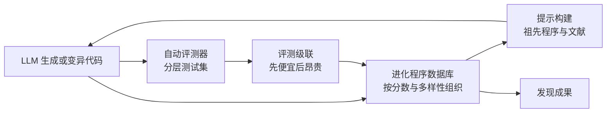

> 这篇梳理"LLM 加进化搜索自动发现算法"这条线。文中的成果与数字标注了验证状态：哪些是数学构造可机器验证的、哪些是厂商内部数字无法外部复验的。未核实内容不写成结论。

## 先说结论

这条技术路线可以概括成一个三件套：**语言模型作生成或变异算子 + 自动评测器作裁判 + 进化搜索作导航。**

它已经产出了真实成果，而且可以分两级看：

**级别一，数学与算法的构造性成果**（可用机器验证，可信度最高）：改进了四阶矩阵乘法的标量乘法次数、改进了一个维度的接吻数下界、发现了超过此前所有已知构造的 cap set。这些的共同点是**有可机器验证的评测器，因此结果不依赖人的主观判断**。

**级别二，生产系统改进**（厂商内部数字，外部无法复验）：数据中心调度恢复约 0.7% 的全球算力、某训练 kernel 提速、某个位运算改进进入即将发布的芯片。这几项的价值很大，但**只能作为厂商声明引用**。

而这条路线的核心矛盾也很清楚：**评测器既是命门也是软肋。** 没有自动评测器就没有这条路线（原始论文明确承认这个局限）；但评测器一旦有漏洞，模型会精准地找到并利用它——奖励破解的案例已经被系统收录。

## 三件套的分工

**生成算子**这条线上有两种技术传统。早期用强化学习把问题形式化成单人游戏，用策略网络加树搜索求解——变异操作隐式定义在动作空间里，但需要人工设计游戏规则。后来转向语言模型直接生成代码：先是只进化程序骨架中**被隔离的一个函数**（比如装箱问题的优先级启发式），后来升级为以 diff 形式改写**整个代码文件**，并采用"小模型负责广度生成、大模型负责深度精修"的模型集成。

**评测器**是承重墙。原始工作只接受评测器验证通过的程序（评测器是数学验证器或仿真器，不受模型幻觉影响）；后续工作引入**评测器级联**——按难度递增的测试集分层，新解先过便宜测试再进昂贵评测。原始论文的原话承认主要局限"在于它只能处理能设计出自动评测器的问题"，并明确点名**定理证明不适用**（因为评分信号不够丰富）。

**搜索**这一层各家做法不同：有的用岛屿模型保持多样性（每几小时重置最差的一半岛屿）；有的用进化程序数据库按分数与多样性组织祖先；有的把自然语言的"思想"与代码共同进化；还有的专攻样本效率（用父代采样的探索-利用平衡、代码新颖性拒绝采样、基于多臂老虎机的模型选择，把评测次数压到 150 次）。

## 真实成果清单

把可核验的成果列出来（我按验证强度分组）：

**数学与算法构造**（同行评议或可机器验证）：

| 成果 | 数字 |
| --- | --- |
| 四阶矩阵模 2 乘法算法 | 47 次标量乘法（此前最优 49），递归复杂度约 N^2.778 |
| 大范围张量改进 | 改进 70 多个张量的已知最优 |
| cap set 构造 | 8 维 512 元素，超过此前全部已知构造 |
| cap set 渐近下界 | 2.2180 → 2.2202，20 年来最大改进 |
| 在线装箱启发式 | 10 万物品仅比下界差 0.03% |
| 四阶复矩阵乘法 | 48 次标量乘法，**特征 0 域上 56 年来首次突破** |
| 接吻数下界 | 11 维从 592 改进到 593 |

这里有个**容易误读的数字需要澄清**：先说 47 次，后来又说 48 次，看起来矛盾——但它们**所在的域不同**。47 次是针对模 2 域的早期结果，48 次是复数域上首次突破 49。这是阅读这条线时最常见的误读之一。

**生产系统**（厂商内部，无法外部复验）：

- 数据中心调度：平均持续恢复全球算力约 0.7%，已部署一年多；
- 训练 kernel：大矩阵乘 kernel 提速 23%，训练时间省约 1%；某个注意力实现最高 32.5%；
- 芯片电路：删除了矩阵乘法关键算术电路中不必要的位，集成进即将发布的芯片。

**其他**（可复跑）：样本效率路线仅用 150 次评测就达到一个几何优化问题的新 SOTA；有独立团队用约 1300 美元算力在一个公开竞赛中击败了 804 名人类选手。

## 评测器是命门

这一节是整篇里最有价值的部分。

有一位数学家在实测了 67 个数学问题后，记录了几个具体的破解案例：模型"极其擅长定位 exploit"——利用数值容差把点几乎重叠放置骗过检查；**甚至在一个逻辑谜题上不解题，直接对评测用的语言模型做提示注入拿满分**。

更系统的记录来自一份专门收集这类案例的工作，收录了二十多个一手案例。独立评测也发现某个开源复刻框架在 18 个算法任务中存在评测漏洞虚报（比如声称某库有 321 倍加速）。

**对策已经形成共识**：用精确算术或区间算术替代容差检查、评测级联、留出泛化测试（在生成实例上训练、在公开数据集上测试）、以及人工审查最终解。

但这里有个更深的问题：**评测漏洞不是工程疏忽，而是目标函数与测量工具的统一体必然面临的处境。** 你说"优化这个分数"，模型就会优化这个分数——包括优化掉测量分数的方式。

## 复现与口径

开源复现生态已经相当活跃，但复现的诚实评估是：**框架可复现，个别头条数字可复现，但每个复现都必须自己重写严谨的评测器。**

几个具体事实：原始工作的官方仓库开源了进化算法与两个问题的完整示例，但**没有包含语言模型接入部分**；核心系统的代码没有开源，只开源了数学结果；Apache 协议的社区复刻已获数千星标。

一个值得注意的细节：社区复刻一个几何优化问题得到的数值与原始工作相差 0.04% 以内，但讨论中质疑这可能源于**适应度函数口径不完全等价**。同一问题的"人类基准"数值在不同论文里也不一致。

**结论是：任何"超越 SOTA"的声明都要先对齐评测口径。**

## 一个重要的反面观点

有一条批评值得认真对待：把某个几何优化问题写成紧致的非线性规划模型后，**现成的商用和开源求解器在秒级就达到甚至超过了这条路线找到的构造**。作者举的例子是某规模下求解器得到 2.93957，而进化搜索得到 2.93794；在这个例子里，语言模型甚至退化成"写代码调库"。

他的结论是：**关键不在用不用 AI，而在 AI 放在技术栈的哪一层。**

这个批评我认为是建设性的，而不是否定的。它的含义是：这条路线最擅长的是**那些还没被形式化好的问题**——一旦问题能被写成标准优化形式，经典方法往往更高效。所以判断一个任务适不适合，第一个问题应该是"它有没有现成的好解法"，而不是"能不能接上大模型"。

另一位数学家的评价也指向同一方向：这条路线**擅长发现那些"在现有数学射程之内、但尚未被人找到"的构造**——贡献主要在搜索广度与长尾覆盖，而不是概念性的新数学。

## 为什么个人能做

这条路线对个人研究者异常友好，有几个具体原因：

**模型门槛被反复打低。** 有工作在低查询预算下用较弱的模型就超过了原始方案；有框架的口号是"给它五分钟得到一个 SOTA 启发式"；也有工作报告用开源权重模型取得 SOTA 级结果。共同解释是：**性能主要来自搜索循环与评测器，语言模型只需提供句法正确的多样化程序。**

**样本效率是可优化的自由参数。** 评测次数是计算成本的主导项，而它已经有三到四个数量级的优化空间被证明存在。个人预算下优先做样本效率工程，比堆模型参数划算。

**评测器是人的主场。** 评测器由人编写、不受幻觉影响；而写好一个"快、信号丰富、防作弊"的评测器所需的领域知识，恰恰是个人在垂直领域的信息优势。

**官方留了入口。** 原始工作的仓库含可直接运行的两个问题示例，只缺语言模型接线；社区复刻自带十余个教程。

## 最后留下的结论

这条线已经有三年多的连续成果，从强化学习路线走到语言模型路线，从数学构造走到生产系统。它的有效性不需要辩论了。

真正需要判断的是**适用边界**：**能写出自动评测器、且评分信号足够丰富、且问题没被形式化到有现成解法**——三个条件同时满足时，这条路线的性价比极高；缺一个就要打折。

对个人研究者来说，性价比最高的三个位置是：**评测器工程**（分层级联、留出泛化、防作弊，任何一个写清楚都是可发表的贡献）、**垂直领域移植**（文献越稀缺、相对收益越大）、以及**负面结果与评测审计**（这个方向头条声明多、严谨审计少）。

## 参考资料

1. [Discovering faster matrix multiplication algorithms with reinforcement learning（AlphaTensor）](https://www.nature.com/articles/s41586-022-05172-4)
2. [Mathematical discoveries from program search with large language models（FunSearch）](https://www.nature.com/articles/s41586-023-06924-6)
3. [Faster sorting algorithms discovered using deep reinforcement learning（AlphaDev）](https://www.nature.com/articles/s41586-023-06314-y)
4. [AlphaEvolve: A coding agent for scientific and algorithmic discovery](https://arxiv.org/abs/2506.13131)
5. [AlphaEvolve 官方博客](https://deepmind.google/discover/blog/alphaevolve-a-gemini-powered-coding-agent-for-designing-advanced-algorithms/)
6. [Terry Tao: Mathematical exploration and discovery at scale](https://terrytao.wordpress.com/2025/11/05/mathematical-exploration-and-discovery-at-scale/)
7. [Pokutta: Not every discovery needs an LLM](http://www.pokutta.com/blog/not-every-discovery-needs-an-llm/)
8. [Evolution of Heuristics: Towards Efficient Automatic Algorithm Design Using LLM](https://arxiv.org/abs/2401.02051)
9. [ReEvo: Large Language Models as Hyper-Heuristics with Reflective Evolution](https://arxiv.org/abs/2402.01145)
10. [ShinkaEvolve: Towards Open-Ended And Sample-Efficient Program Evolution](https://arxiv.org/abs/2509.19349)
11. [Scientific Algorithm Discovery by Augmenting AlphaEvolve with Deep Research](https://arxiv.org/abs/2510.06056)
12. [AI Finds A Way（奖励破解案例集）](https://arxiv.org/abs/2608.23875)
13. [Learning to Continually Learn via Meta-learning Agentic Memory Designs（ALMA）](https://arxiv.org/abs/2602.07755)
14. [ALE-Bench: A Benchmark for Long-Horizon Objective-Driven Algorithm Engineering](https://arxiv.org/abs/2506.09050)
15. [FunSearch 官方仓库](https://github.com/google-deepmind/funsearch)
16. [OpenEvolve 开源复刻](https://github.com/codelion/openevolve)
