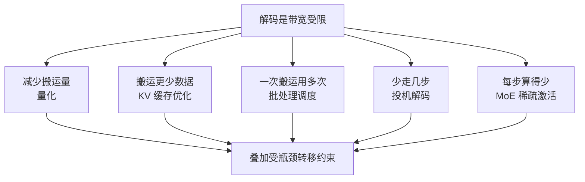

> 这篇从显存带宽这个物理约束出发，梳理大模型推理加速的五个技术族。文中数字都标注了来源性质；本环境未能核实的条目明确标注为未验证。

## 先说结论

所有推理加速技术都从一个物理事实出发：**自回归解码是显存带宽受限（memory-bound）的问题。** 一次前向只产出一个 token，但每个生成步都要把全部权重和 KV 缓存从显存读一遍。算力大量闲置，瓶颈在搬运。

这解释了很多反直觉的现象：为什么量化在解码时几乎线性加速（减少搬运量）；为什么批处理能带来数量级收益（同一次搬运服务更多请求）；为什么投机解码在高并发下失效（GPU 被正常解码填满后，"免费验证"的前提消失了）。

**最实用的结论是：技术能叠加，但收益不是乘法。** 每一层技术消除一个瓶颈，然后瓶颈转移到下一处。有一份很直接的实测：投机解码在 batch size 等于 1 时加速 2.73 倍，**到 batch size 等于 32 时只剩 1.31 倍**。所以那种"2.7 倍乘 3.5 倍乘 4 倍等于 38 倍"的推算没有工程意义。

## 五个技术族

### 投机解码

**原理**：用廉价草稿模型猜多个 token，目标模型一次并行验证，逐位置接受或拒绝。修改版拒绝采样保证输出分布与直接采样**完全一致**——这是它最优雅的地方，加速不损失质量。

期望产出有个简洁公式：**E = (1 − α^(γ+1)) / (1 − α)**，其中 α 是接受率，γ 是草稿长度。三个杠杆是：接受率越高越好、草稿与目标耗时比越小越好、γ 取约 (1−α)⁻¹ 附近最优。

**实测加速比**（均从论文摘要核实）：经典方案 2–3 倍；某特征级草稿方案 2.7–3.5 倍；动态草稿树 3.05–4.26 倍；新一代多层特征融合方案最高 6.5 倍。

**但失效条件最重要**：batch size 增大时，GPU 被正常解码填满，验证不再"免费"。实测从 bs=1 的 2.73 倍降到 bs=32 的 1.31 倍，且最优投机长度随 batch 减小。推理框架的官方文档也明确提示：**投机解码适合中低并发、访存受限场景，高并发下可能损害吞吐。**

### KV 缓存

**先算个量级**：以某 7B 模型为例（32 层、32 头、头维度 128、FP16），KV 缓存为每 token 512 KiB，4K 序列约 2 GiB，约为 FP16 权重的 15%；但 **batch 等于 32 时 KV 缓存达 64 GiB，是权重的 4.7 倍**。这解释了为什么高并发下 KV 缓存才是显存的主要消费者。

结构路线是 **MHA → MQA → GQA → MLA**，本质是减少 KV 头数或压缩其表示：

| 路线 | 做法 | 关键结论 |
| --- | --- | --- |
| MQA | 所有查询头共享一组 KV | 快但质量明显下降 |
| GQA | 分组共享 | 仅需 5% 预训练计算量即可接近 MHA 质量 |
| MLA | 低秩压缩 + 解耦位置编码 | 缓存量约为同配置 MHA 的 1.77%，对前代缩减 93.3% |

**显存管理**上，把 KV 缓存按固定块分页、按需分配、写时复制共享前缀，消除了按最大长度预留的浪费（这是 vLLM 的起点，摘要口径比当时最优系统吞吐高 2–4 倍）。这条路与压缩正交：压缩降每 token 成本，分页消除浪费，前缀复用降低总 token 数。

**稀疏化或驱逐**这条线争议最大：观察基础是注意力集中在少数位置（开头 token、局部窗口、检索锚点）。有方案保留不超过 20% 的重要 token 就大幅加速；有方案在长输入下做到 3.6 倍生成加速。**但可靠性有系统性争议**：多数方法在检索类基准上报"几乎无损"，而在 KV 跨请求复用的场景下失败；高压缩比下精度急剧下降；还有一个工程障碍——**驱逐需要注意力分数，而主流的高效注意力内核默认不返回它**。

### 量化

量化的核心难题是激活值中的离群通道（少量通道的幅度可达中位数的数十倍）。三条解法：误差补偿、分布改造（保护约 1% 的显著通道）、以及旋转（用正交变换消除离群）。

**实测数字**（这里有个常见的误传需要澄清）：某量化方案论文摘要原文说的是"**对同行的量化内核 1.45 倍**"，而不是"对 FP16 1.45 倍"——对 FP16 的基线的数字是 1.85 倍。这类口径混淆在这个领域很常见。

另一个实测：某量化内核方案专门解决"低比特在大 batch 下失去加速"的问题，使 batch 16–32 下仍保持约 4 倍内核加速、框架端到端最高 2.8 倍。消费级侧，把 7B 模型从 13.0 GB 压到 3.80 GB，困惑度仅增加 0.9%，在消费级显卡上从 60 毫秒每 token 降到 16 毫秒。

**FP8 是新一代硬件默认**：有大规模训练验证了细粒度 FP8 的可行性，主要矩阵乘理论速度约为 BF16 的 2 倍。

**局限**：8B 级小模型在 1–2 比特下困惑度可爆炸到数千，70B 明显更耐量化——**大模型的结论不能外推到小模型**。此外困惑度与下游质量不一致是反复观察到的现象。

### MoE 稀疏激活

MoE 把 FFN 换成 N 个专家、每 token 只激活其中几个，实现"参数量巨大、每 token 计算量恒定"。旗舰配置是总参数几百亿到几千亿、每 token 激活几十亿。

**关键认识：MoE 推理是显存容量与带宽问题，不是算力问题。** 每 token 计算量只有激活部分那么大，但全部权重必须驻留或可寻址。显存不足走 CPU 卸载时，**传输专家权重的耗时是计算本身的 2 到 5 倍**。

负载均衡的演进值得一提：从辅助损失（系数敏感、牺牲主任务），到"专家反选 token"（结构性均衡），再到动态偏置调节（只用偏置做路由、门控仍用原始亲和度）。推理侧即使训练时均衡，部署仍需冗余专家。

### 批处理调度

这是**工程侧最大的单项收益**。把静态批处理改成迭代级调度（每个解码迭代都可加入或退出请求），同延迟下吞吐提升 36.9 倍——这个数字大得不像是优化，但它反映的是"原来浪费了多少"。

后续的两条路线：一是**预填充与解码分离**（两者特性不同：前者算力密集、后者带宽密集），有工作报告多服务场景下 7.4 倍请求量或更严格的延迟约束；二是**切块混批**（不分离，把长预填充切成块与解码混在一起，消除队头阻塞），报告服务容量提升 2.6 到 5.6 倍。

**但分离并非普适**：有反方证据显示分离改善了每 token 延迟却恶化了首 token 延迟；社区也有分离部署反而更慢的报告。较稳的工程共识是：**小规模下聚合更简单通常更优；分离收益随规模、并发、延迟约束和 KV 传输成本变化。**

## 全栈叠加的样本

有一个系统值得单独看，因为它是**唯一一份"全栈叠加"的公开生产数据**：把低秩注意力、MoE、细粒度 FP8、多 token 预测四项技术放在同一个模型里，部署侧再叠加预填充解码分离、大规模专家并行与冗余专家，官方披露的成本利润率为 545%。

但要注意这是**成本口径而非加速倍数口径**，且无法拆分各技术贡献。它证明的是"能叠加"，不是"能乘起来"。

## 价格为什么降

token 价格在快速下降，两条独立口径：一条给出"同能力价格年降约 10 倍"；另一条更细，给出"某级别任务价格年降 40 倍，任务间差异 9 到 900 倍"。

**但驱动因素的严格定量拆解在公开文献里不存在。** 一条来源明确表示无法从公开信息完成归因；另一条只做定性枚举（硬件性价比、量化、软件优化、模型小型化、后训练、开源竞争）。

我的判断是：**算法与模型侧的贡献最实**（用十倍小的模型达到同能力，直接压低单位能力价格，这也解释了"任务间不均衡"现象——热门任务的小型化进展快得多）；硬件侧有年降约 30% 的估计；工程侧的收益量级是个位数倍。三者的相对贡献**没有任何公开研究给出可信数字**，这本身就是个可以做研究的空白。

## 最后留下的结论

推理加速这个领域的知识结构其实很清晰：

**一个物理约束**（解码是带宽受限）、**五个技术族**（量化、KV 缓存、批处理、投机解码、MoE）、**一条叠加原则**（收益不是乘法，取决于瓶颈转移到哪里）。

对工程决策来说，最有用的判断是：**先看当前瓶颈在哪。** 单请求延迟高、并发低，投机解码与量化收益最大；高并发吞吐不足，批处理调度与 KV 管理的收益最大；显存不够，量化和 KV 压缩优先；模型太大装不下，MoE 加卸载是选择。而在高并发下把投机解码开起来，很可能净亏。

对做研究的人来说，这个领域的空白也很具体：**量化与投机解码的接受率消融**（文献明确缺位）、**温度与任务类型对接受率的定量曲线**、**KV 稀疏化在高压缩比与复用场景的复核**，以及**诚实基线的框架横评**（现有官方数字都是自报最优，测试条件不对称已被当事方自己披露过）。这些大多数只需要单卡和现成框架。

## 参考资料

1. [Fast Inference from Transformers via Speculative Decoding](https://arxiv.org/abs/2211.17192)
2. [Accelerating LLM Decoding with Speculative Sampling](https://arxiv.org/abs/2302.01318)
3. [EAGLE: Speculative Sampling Requires Rethinking Feature Uncertainty](https://arxiv.org/abs/2401.15077)
4. [EAGLE-3: Scaling up Inference Acceleration via Training-Time Test](https://arxiv.org/abs/2503.01840)
5. [The Synergy of Speculative Decoding and Batching in Serving LLMs](https://arxiv.org/abs/2310.18813)
6. [Efficient Memory Management for LLM Serving with PagedAttention](https://arxiv.org/abs/2309.06180)
7. [GQA: Training Generalized Multi-Query Attention from Multi-Head Checkpoints](https://arxiv.org/abs/2305.13245)
8. [DeepSeek-V2: A Strong, Economical, and Efficient MoE Language Model](https://arxiv.org/abs/2405.04434)
9. [DeepSeek-V3 Technical Report](https://arxiv.org/abs/2412.19437)
10. [H2O: Heavy-Hitter Oracle for Efficient Generative Inference](https://arxiv.org/abs/2306.14048)
11. [SnapKV: LLM Knows What You are Looking for Before Generation](https://arxiv.org/abs/2404.14469)
12. [KIVI: A Tuning-Free Asymmetric 2-bit Quantization for KV Cache](https://arxiv.org/abs/2402.02750)
13. [GPTQ: Accurate Post-Training Quantization for Generative Pre-trained Transformers](https://arxiv.org/abs/2210.17323)
14. [AWQ: Activation-aware Weight Quantization](https://arxiv.org/abs/2306.00978)
15. [SmoothQuant: Accurate and Efficient PTQ for LLMs](https://arxiv.org/abs/2211.10438)
16. [MARLIN: Mixed-Precision Auto-Regressive Parallel Inference on LLMs](https://arxiv.org/abs/2408.11743)
17. [How Good Are Low-bit Quantized LLaMA3 Models?](https://arxiv.org/abs/2404.14047)
18. [Switch Transformers: Scaling to Trillion Parameter Models](https://arxiv.org/abs/2101.03961)
19. [Mixtral of Experts](https://arxiv.org/abs/2401.04088)
20. [Fiddler: CPU-GPU Orchestration for Fast Inference of MoE Models](https://arxiv.org/abs/2402.07033)
21. [Orca: A Distributed Serving System for Transformer-Based Generative Models](https://arxiv.org/abs/2206.01831)
22. [DistServe: Disaggregating Prefill and Decoding for Goodput-optimized Serving](https://arxiv.org/abs/2401.09670)
23. [Taming Throughput-Latency Tradeoff in LLM Inference with Sarathi-Serve](https://arxiv.org/abs/2403.02310)
24. [Mooncake: A KVCache-centric Disaggregated Architecture](https://arxiv.org/abs/2407.00079)
25. [LLM inference prices have fallen rapidly but unequally across tasks（Epoch AI）](https://epoch.ai/data-insights/llm-inference-price-trends)
26. [Welcome to LLMflation（a16z）](https://a16z.com/llmflation-llm-inference-cost/)
27. [vLLM Speculative Decoding 文档](https://github.com/vllm-project/vllm/blob/main/docs/features/speculative_decoding/README.md)
