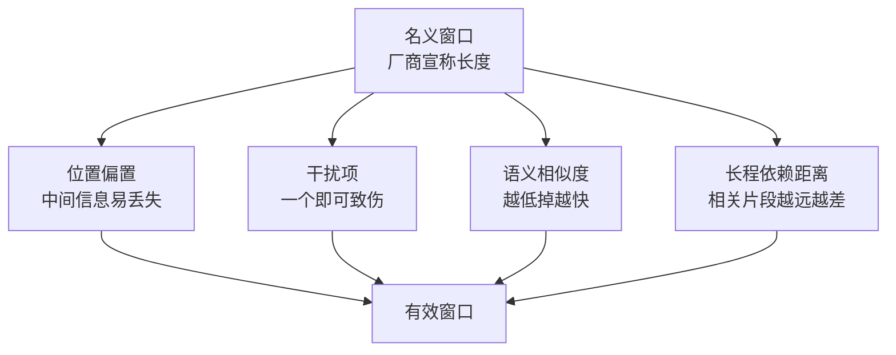

> 这篇梳理长上下文技术与上下文工程。文中数字均标注来源；未能核实的说法明确标为未验证。这个话题与之前写的《Agent 记忆》有交集，但重点不同：那篇讲记忆系统本身，这篇讲窗口能力与上下文的管理方法。

## 先说结论

**名义窗口是"能塞进去"，有效窗口是"用得出来"，两者的差距比宣传大得多。**

一组数据说明了问题的规模：一项评测测了 17 个模型后得出结论——**不足半数的模型能在自己宣称的长度上保持良好表现**。宣称 128K 的某模型与某开源模型，有效长度只有 64K；而多款宣称 128K 的模型只有 32K 有效。

另一组更严苛：去掉词汇匹配线索（需要真正的联想推理而非字符串匹配）后，**13 个宣称 ≥32K 的模型里有 11 个在 32K 时跌破短文本基线的一半**，某模型从 99.3% 掉到 69.7%。

还有一组反直觉的发现：**即使任务完全不变，性能也会随输入变长而非均匀衰减**——而且打乱上下文的语序反而全面提升。这说明"信息在窗口里"和"信息可用"是两件事。

## 有效窗口为什么小于名义窗口

四个机制已经被分别刻画：

**位置偏置。** 早期工作发现的 U 形曲线（开头与结尾信息更易被利用）后来被归因于位置注意力偏置，而且**可以校准**。更细的发现是：信息损失更多取决于**相关片段之间的距离**，而不是绝对位置——多跳任务因此更差。

**干扰项。** 一项实验发现**一个干扰项就足以造成损伤，多个叠加**；而且干扰信息与问题的语义相似度越低，衰减越快。

**结构一致性。** 前面提到的反直觉现象——打乱语序的上下文表现更好，说明结构连贯性本身会消耗注意力。

**任务性质。** 有一份评测发现，合成任务（大海捞针类）与真实下游任务的表现**不相关**。这意味着"刷穿了合成任务"完全不代表长文理解能力。这份评测还发现：全上下文推理与复杂指令任务上，开源模型显著落后且随长度扩大。

值得注意的是**一个正面的数字**：有一份真实场景评测（503 道题、长度 8K 到 200 万词）显示，训练有素的人类专家限时 15 分钟得分 53.7%，而某推理模型达到 57.7%——**首次超过人类**。所以"长上下文很难"与"已经很能用"是可以同时成立的，关键是任务类型。

## 算法层的三条路线

**线性注意力与状态空间模型**。用固定大小的状态替代随长度增长的 KV 缓存，计算复杂度从二次降到线性，吞吐提升约 5 倍。但有一条被理论与实验同时证明的缺陷：**固定大小状态必然丢失精确的上下文拷贝信息**。有关联召回基准专门揭示了这一点。工程侧的答案是**混合**——实证发现只需少量注意力层就能恢复召回能力（8B 规模下混合 6 个注意力层即接近纯 Transformer）。

**稀疏注意力已经进入旗舰产品**。一种原生可训练的三分支设计（压缩加选择加滑动窗口）在 64K 时解码提速 11.6 倍、基准几乎不掉点；另一种块路由设计在百万级预填充下最高提速 6.5 倍。**2025 年 9 月，一家公司的旗舰模型正式采用稀疏注意力，官方称输出效果几乎不变、API 降价 50% 以上**——这是稀疏注意力从论文到量产的标志性事件。

**混合架构是 2025 年的产业主流**。多家新模型采用"线性层与注意力层按比例混合"的设计，比例从 3:1 到 9:1 不等，报告的收益包括推理吞吐提升、KV 缓存减少 75%、内存占用大幅降低。**逻辑就是用线性层省资源、用保留的少量注意力层保住召回。**

一个清晰的判断：**纯 SSM 或线性模型没有旗舰商用**，头部玩家全部转向混合或稀疏化的全注意力。机制原因就是前面那条：固定状态必然丢失精确拷贝信息。

## 工程层的三大件

**缓存。** 这是成本结构里最关键的一项。某 API 的缓存读取价格是标准价的 0.1 倍（省 90%）；另一家的自动缓存官方称延迟最高降约 80%、折扣最高约 90%。**有一份工程复盘给出了最直接的数字：缓存输入与未缓存输入差价约 10 倍。** 由于 agent 任务的输入输出比可达 100:1，它的作者把"KV 缓存命中率"称为**生产级 agent 最重要的单一指标**。

具体做法是：前缀稳定（连时间戳都去掉）、上下文只追加不改写、确定性序列化、**用掩码而不是删除工具**（删工具会破坏前缀）。这里有个很实用的细节：系统提示里放一个时间戳，就会让整个前缀缓存失效。

**压缩。** 三个层次：token 级（用小模型删 token，最高 20 倍压缩）；摘要级（接近窗口阈值时自动总结较早历史，可指定保留内容）；KV 级（在预填充阶段用观察窗选择重要 KV）。

**隔离。** 子代理在主对话之外拥有独立上下文窗口，把数万 token 的探索压缩成一千到两千 token 的摘要返回。官方评测显示，上下文编辑让内部评测提升 29%，叠加记忆工具达到 39%。

## 长上下文、检索还是记忆

这个问题现在有相当多对照实验，结论是"没有银弹"。

**一个关键实验**（1930 条查询、9 个数据集、3 个模型）：资源充分时长上下文一致优于检索增强（平均提升 3.6% 到 13.1%），**但检索只需长上下文 17% 的输入 token**。更实用的是混合路由——先检索、模型自判不足再升级到长上下文——实现了省 39% 到 65% 成本、性能只降 0.2% 到 2.2%。

**反方向的证据**：按原文顺序保留检索块的方案，用 48K token 就在一个问答集上得到 47.25 分，反超全量 117K 输入的 34.26 分——**长上下文并非自动更好，检索质量才是关键。**

**还有一项工作纠正了方法论问题**：控制住标准答案位置偏差与数据污染后，检索增强的表现仍强于此前文献承认的水平，并指出早期"长上下文全面胜出"的结论存在评测方法问题。

**第三方路线的记忆系统**：有方案报告相比全上下文省 90% 以上 token、p95 延迟降低 91%；另一方案报告某记忆基准提升 18.5%、延迟降 90%。但一份 500 题的评测显示：**商业助手的记忆表现比离线版本低 30% 以上，而"把完整历史塞进长上下文"比 oracle 检索差 30% 到 60%**。记忆的工程化远未解决。

综合出来的经验法则是：

| 场景 | 选择 |
| --- | --- |
| 一次性的语料级汇总、聚合类任务 | 长上下文 |
| 精确事实检索、语料远超窗口 | 检索增强（强检索器优先） |
| 跨会话、个性化、持续学习 | 外置记忆层 |
| 成本敏感 | 混合路由，或强模型配检索 |

## 上下文工程作为学科

有一个学术化的信号值得记录：**"上下文工程"这个术语在 2025 年 6 月的一周内成型**——先是一位工程师在会议上使用，然后多家公司的人跟进，最后由一位知名研究者的推文使其病毒式传播。随后 LangChain 提出 write/select/compress/isolate 四操作，一家模型公司发布官方方法论，一篇 166 页的综述挂出。

**官方方法论的核心表述值得引用**：上下文工程是"在推理期间策划并维护最优 token 集合的策略集合"，目标是"**找到使期望结果可能性最大化的最小高信号 token 集**"。它把注意力视为有限预算，并给出三大长程技术：压缩、结构化笔记（把笔记持久化在上下文之外按需拉回）、子代理架构。

**公认的设计模式**包括：系统提示只写高层指导加精选示例；用即时检索取代预取；工具设计 token 高效且防堆砌；**把环境反馈（比如 lint 与测试错误）留在上下文里**——有一份工程复盘的原话是"擦除失败就是抹除证据"。

**公认的反模式**也被系统整理过，四类失败值得记住：

- **投毒**：幻觉进入上下文后被反复引用；
- **分心**：上下文淹没模型原本的能力（有技术报告自证推理任务在长度小于 32K 时就开始劣化）；
- **混乱**：冗余内容劣化输出；
- **冲突**：新旧信息互相矛盾。

## 最后留下的结论

长上下文这条线的核心事实是：**窗口在变大，但有效利用能力没有同步跟上。**

三件值得记住的事：

**第一，有效窗口需要按任务维度定义。** 不同的评测用不同的阈值（85% 保持、50% 基线、下游任务），同一模型在不同定义下有效长度可差一个数量级。**更准确的表述是一个"任务难度乘长度"的曲面，而不是单一数字。**

**第二，工程层的三件套（缓存、压缩、隔离）决定成本与长任务生存能力**，而且它们与模型能力无关——纯粹是围绕模型的系统工程。缓存决定成本结构，压缩决定长任务能否活下去，隔离决定多代理能不能扩展。

**第三，选型要看任务类型。** 聚合类用长上下文，精确检索用检索增强，跨会话用记忆；成本敏感就上混合路由。三者是分工而非替代。

对个人研究者来说，这条线有几个明确缺口：**稀疏与混合架构模型的有效窗口第三方复测**（这类模型的论文对照基线都是自家的）、**有效窗口的任务维度建模**（把干扰项数量、词汇重叠度、片段距离合并成系统消融）、**压缩策略的受控对比**（现有实践都只给了经验法则，没有消融），以及**中文长上下文评测**（现有主流评测以英文为主，去词汇线索类设计几乎没有中文版）。这几件事的共同点是：测试集开源、成本可控、结论有直接用处。

## 参考资料

1. [Lost in the Middle: How Language Models Use Long Contexts](https://arxiv.org/abs/2307.03172)
2. [RULER: What's the Real Context Size of Your Long-Context Language Models?](https://arxiv.org/abs/2404.06654)
3. [NoLiMa: Long-Context Evaluation Beyond Literal Matching](https://arxiv.org/abs/2502.05167)
4. [HELMET: How to Evaluate Long-Context Language Models Correctly](https://arxiv.org/abs/2410.02694)
5. [LongBench v2](https://arxiv.org/abs/2412.15204)
6. [Context Rot（Chroma）](https://research.trychroma.com/context-rot)
7. [Mamba: Linear-Time Sequence Modeling with Selective State Spaces](https://arxiv.org/abs/2312.00752)
8. [Zoology: Measuring and Improving Recall in Attention-Free Models](https://arxiv.org/abs/2312.04927)
9. [Repeat After Me: Transformers are Better than State Space Models at Copying](https://arxiv.org/abs/2402.01032)
10. [An Empirical Study of Mamba-based Language Models](https://arxiv.org/abs/2406.07887)
11. [Native Sparse Attention: Hardware-Aligned and Natively Trainable Sparse Attention](https://arxiv.org/abs/2502.11089)
12. [MoBA: Mixture of Block Attention for Long-Context LLMs](https://arxiv.org/abs/2502.13189)
13. [Retrieval Augmented Generation or Long-Context LLMs?（Self-Route）](https://arxiv.org/abs/2407.16833)
14. [In Defense of RAG in the Era of Long-Context Language Models（OP-RAG）](https://arxiv.org/abs/2409.01666)
15. [LaRA: Benchmarking RAG and Long-Context LLMs](https://arxiv.org/abs/2502.09977)
16. [Long Context vs. RAG for LLMs: Revisits](https://arxiv.org/abs/2501.01880)
17. [MemGPT: Towards LLMs as Operating Systems](https://arxiv.org/abs/2310.08560)
18. [Mem0: Building Production-Ready AI Agents with Scalable Long-Term Memory](https://arxiv.org/abs/2504.19413)
19. [LongMemEval: Benchmarking Chat Assistants on Long-Term Interactive Memory](https://arxiv.org/abs/2410.10813)
20. [A Survey of Context Engineering for Large Language Models](https://arxiv.org/abs/2507.13334)
21. [Anthropic: Effective context engineering for AI agents](https://www.anthropic.com/engineering/effective-context-engineering-for-ai-agents)
22. [Manus: Context Engineering for AI Agents](https://manus.im/blog/Context-Engineering-for-AI-Agents-Lessons-from-Building-Manus)
23. [How Long Contexts Fail（Drew Breunig）](https://www.dbreunig.com/2025/06/22/how-contexts-fail-and-how-to-fix-them.html)
24. [LangChain: Context Engineering](https://www.langchain.com/blog/context-engineering-for-agents)
