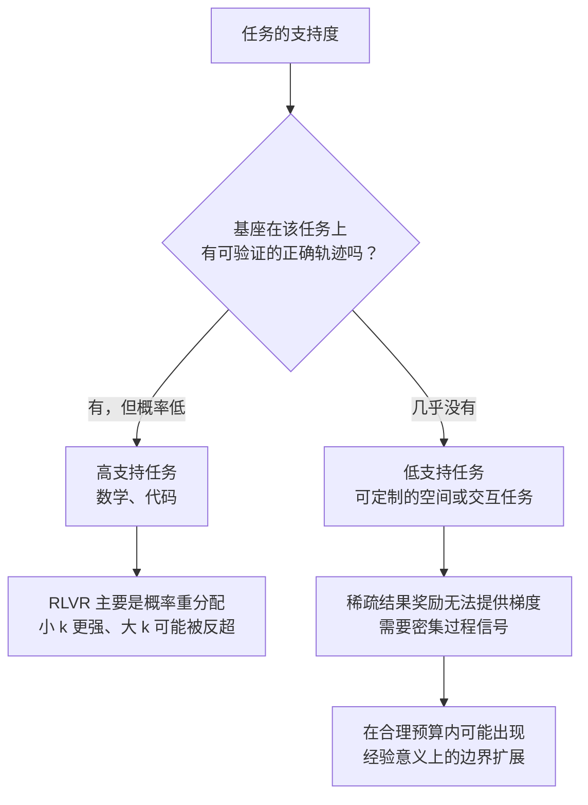

> 这篇梳理 RLVR（可验证奖励强化学习）是否扩展模型推理能力的争论。文中的关键数字都标注了核验层级：哪些来自原文全文、哪些只来自摘要；**未核实的内容不写成结论**。

## 先说结论

这场争论的关键不是"RL 有没有提升分数"——它是有的。关键问题是：**RL 产生的正确轨迹，是否本来就在基座模型的采样分布里？**

两篇立场相反的代表工作各自给出了硬数字：

**反方（激发论）**：在数学、代码和视觉任务上，RLVR 模型在小 k 时更强，但 k 增大后**基座反超**。具体例子是某 32B 模型在一个数学基准上，k=128 时基座比 RLVR 高约 9 个百分点。结论：RL 主要是在基座已有分布上重新分配概率质量。

**正方（扩展论）**：把任务换成可控的视觉迷宫后，基座在路径长度 ≥5 的难度上，即使采样到 pass@1024 也仍是 0；而 RLVR 变体在长度 5、6、7 上分别达到 pass@1024 的 100%、41%、14%——**把有效空间推理跨度从约 2 步推到约 6 步**。

**两者并不必然矛盾。** 数学和代码通常是"高支持"任务（预训练数据里已有大量类似推理），而合成空间任务可以被设计成"低支持"任务（基座的有效解轨迹几乎不存在）。所以更准确的表述是：**RLVR 能否扩展能力，取决于基座、任务、奖励密度与课程设计，不是一个非黑即白的问题。**

## pass@k 曲线怎么读

要理解争论，先得理解这个指标。

对一道题，如果单次采样正确的概率是 p（假设独立同分布），那么 k 次采样至少一次正确的概率是 pass@k = 1 − (1−p)^k。数据集上的 pass@k 是逐题平均。

曲线形态本身携带信息：

| 曲线形态 | 含义 |
| --- | --- |
| 小 k 高、大 k 被基座反超 | 典型"激发"形态：RL 抬高了已有正确轨迹的概率 |
| RL 在大 k 仍高于基座，且基座在大预算内为零 | 更接近"扩展"，但需跨任务复现 |
| 曲线陡峭上升 | 正确解存在但概率低，增加采样能快速补回 |
| 高 k 仍平坦为零 | 在当前提示、温度和预算下没有观察到有效轨迹——这是更强的"低支持"信号 |

**但 pass@k 本身有两个陷阱。** 其一，在离散答案空间里，k 越大偶然猜中的机会越高——一个模型可能 pass@256 很高，但只有极少数 rollout 真的在推理。有工作提出用"至少 τ 比例的采样正确"来替代"至少一次正确"，重构了"边界"的定义。

其二，高 k 的 pass@k 曲线在统计上噪声很大，需要置信区间与多种子重复。

## 反方：重加权而非创造

反方工作的实验设计覆盖了多个模型族、六种 RL 算法和三类任务（数学、代码、视觉）。几个关键数字（均来自原文全文核实）：

- **训练动态**：某 7B 模型在训练集上，第 150、300、450 步的 pass@1 约为 9.9、26.1、42.5——单次正确率大幅上升。但同一批检查点的 pass@256 约为 67.2、66.3、64.3——**覆盖问题数在下降**。
- **算法差异有限**：六种 RL 算法的 pass@1 差异很大（从 34.5 到 75.4），但 pass@256 都挤在 96.2 到 97.4 的窄带里。作者据此认为算法选择没有改变"高 k 覆盖受限"的基本现象。
- **新增可解很少**：在某个数学集上，RL 在有限 k 下成功而基座未成功的题目约 1%（约 5 题）；但把基座采样扩展到 k=1024 后，这些题基座也能解出。
- **蒸馏对照**：一个蒸馏模型的 pass@k 曲线显著高于基座和 RLVR 版本——作者以此区分"RL 的重采样效率"与"蒸馏引入新模式"。

作者给出的机制解释是：RL 把本来已有但概率很低的正确轨迹概率质量抬高（采样效率），同时压低其他正确或潜在正确的路径（支持收缩），净效果是分布被"锐化"。

**这项工作的局限也需要说明**：大 k 的 pass@k 可能把偶然猜中当成推理能力；基座与 RL 的提示格式、训练数据重叠、温度设置都可能影响交叉点；而且"概率极小"与"能力边界之外"在有限采样下无法严格区分——pass@1024 为 0 是经验零，不是理论零。

## 正方：低支持任务里的边界扩展

正方工作的环境设计很有讲究：一个可控的合成网格迷宫，输入迷宫图像，输出上下左右动作序列；**路径长度和转弯数可以独立调节**；训练只用短路径（长度 ≤5、转弯 ≤2），测试包含更长、分布外的复杂度。

奖励设计是关键差异：除最终成功奖励外，还使用**逐步前缀匹配的密集奖励**，让模型即使没走到终点也能因为走对前缀获得学习信号。

结果（原文全文核实）值得完整看一眼：

| 路径长度 | 基座 pass@1 | RLVR pass@1 | 基座 pass@1024 | RLVR pass@1024 |
| --- | --- | --- | --- | --- |
| 1 | 26.3% | 74.8% | 100% | 100% |
| 2 | 1.1% | 61.1% | 69.0% | 100% |
| 3 | 0.4% | 27.9% | 32.0% | 100% |
| 4 | 0.2% | 29.9% | 17.0% | 100% |
| 5 | 0.0% | 7.6% | **0.0%** | **100%** |
| 6 | 0.0% | 0.5% | **0.0%** | **41.0%** |
| 7 | 0.0% | 0.2% | **0.0%** | **14.0%** |
| 8–10 | 0.0% | 0.0% | 0.0% | 0.0% |

粗体的三行是这项工作的核心证据：**在长度 5 到 7 的区间，基座采样到 1024 次仍为 0，而 RLVR 有非零覆盖。** 这比"让稀有正确轨迹更容易采到"更接近经验意义上的边界扩展。

这项工作还报告了零样本迁移：在训练中未接触的两个真实世界导航基准上有改善（不同模型规模上一致）。但作者自己也限制了解释——这是**特定奖励设计和课程设计下的 RLVR 变体**，不是标准稀疏奖励的普遍证明；合成迷宫的 2→6 步不能直接解释成通用视觉推理能力增长。

## 两边合起来看

把两项工作放在一起，可以得到一个更稳的判断框架：

**区分任务的支持度。** 高支持任务（数学、代码）里，基座已有稀疏但真实的正确轨迹，RL 的主要作用是重加权与提纯。低支持任务（可定制的空间、交互任务）里，基座在合理预算内没有任何有效轨迹，稀疏的结果奖励无法提供梯度——**这时需要密集过程信号才能让学习发生**。

**区分奖励密度。** 上面的迷宫实验用的不是纯结果奖励，而是逐步前缀匹配的密集奖励。这意味着它的"扩展"部分可能来自奖励设计，而非 RLVR 本身。**这是一个必须做的消融**：同一任务上对比稀疏结果奖励与密集过程奖励，才能量化奖励密度本身的贡献。

**区分"新推理模式"的定义。** 只要输出字符串没在基座采样里出现过算不算新？还是必须有可抽象、可迁移的算法结构才算？这个定义分歧直接决定了争论的答案。

**base model 的选择是决定性变量。** RL 对基座太弱（欠拟合）或已经过度收敛的情况收益都有限；有一项复现研究覆盖了 10 个基座，发现非主流基座上的 RLVR 收益大幅缩水，而主流基座本身指令遵循能力就强，不能代表普遍情况。

## 对实践的三条建议

**第一，跑之前先测基座的高 k 曲线。** 如果基座在 k=64 就能解出绝大多数题，RL 的收益上限就是"把这些解变得更容易采到"——这仍然有商业价值（降低延迟与成本），但不要期待能力突破。

**第二，目标决定配方。** 目标是低延迟单次正确率，标准 RLVR 通常划算；目标是高可靠、高 k 覆盖或越过基座边界，需要加入难度感知课程、教师或离线轨迹、探索正则，并**同时报告 pass@1、pass@k 与覆盖集合**。

**第三，训练后必须检查遗忘。** RL 可能让一批题更容易，同时让另一批原本可解的题在大 k 下消失。对部署而言，这种覆盖损失可能比 pass@1 的增益更昂贵——它意味着模型在长尾上变得更脆。

## 最后留下的结论

这场争论最有价值的地方，不是"扩展还是激发"的结论，而是它把一个模糊的问题变成了可测量的问题。

**目前最符合证据的表述是**：标准 RLVR 在高支持任务上主要表现为对基座已有正确轨迹的概率重分配，它经常提高 pass@1 却可能缩窄大 k 覆盖；但当任务处于低支持区域，或训练明确引入边界课程、密集过程奖励、教师轨迹或更强探索机制时，RLVR 系统能够产生超出基座经验支持的新行为。

所以问题应该改成：**什么样的基座、什么样的评测器、什么样的探索与课程，在什么任务几何与可靠性指标下，RLVR 才能从激发转变为真正的扩展？** 这个问题对个人研究者是友好的——小模型、同一评测器、同一提示，画出完整的 pass@k 曲线并区分"基座可解但稀有""RL 新增可解""基座丢失"三类题，单卡或小集群就能做，而公开文献里这样的系统复现还很少。

## 参考资料

1. [Does Reinforcement Learning Really Incentivize Reasoning Capacity in LLMs Beyond the Base Model?](https://arxiv.org/abs/2504.13837)
2. [Does RLVR Extend Reasoning Boundaries? Investigating Capability Expansion in Vision-Language Models](https://arxiv.org/abs/2511.00710)
3. [Beyond Pass@k: Breadth-Depth Metrics for Reasoning Boundaries](https://arxiv.org/abs/2510.08325)
4. [The Invisible Leash: Why RLVR May or May Not Escape Its Origin](https://arxiv.org/abs/2507.14843)
5. [The Reasoning Boundary Paradox: How Reinforcement Learning Constrains Language Models](https://arxiv.org/abs/2510.02230)
6. [The Debate on RLVR Reasoning Capability Boundary: Shrinkage, Expansion, or Both?](https://arxiv.org/abs/2510.04028)
7. [Can GRPO Help LLMs Transcend Their Pretraining Origin?](https://arxiv.org/abs/2510.15990)
8. [RL-PLUS: Countering Capability Boundary Collapse of LLMs in RL with Hybrid-policy Optimization](https://arxiv.org/abs/2508.00222)
9. [Mitigating Distribution Sharpening in Math RLVR via Distribution-Aligned Hint Synthesis](https://arxiv.org/abs/2604.07747)
10. [Uniform-Correct Policy Optimization: Breaking RLVR's Indifference to Diversity](https://arxiv.org/abs/2605.00365)
11. [Learning to Explore with Parameter-Space Noise](https://arxiv.org/abs/2602.02555)
12. [SFT Memorizes, RL Generalizes: A Comparative Study of Foundation Model Post-training](https://arxiv.org/abs/2501.17161)
13. [Spurious Rewards: Rethinking Training Signals in RLVR](https://arxiv.org/abs/2506.10947)
14. [SimpleRL-Zoo: Investigating and Taming Zero RL](https://arxiv.org/abs/2503.18892)
15. [The Illusion of Thinking: Understanding the Strengths and Limitations of Reasoning Models](https://arxiv.org/abs/2506.06941)
16. [DeepSeek-R1: Incentivizing Reasoning Capability in LLMs via Reinforcement Learning](https://arxiv.org/abs/2501.12948)
