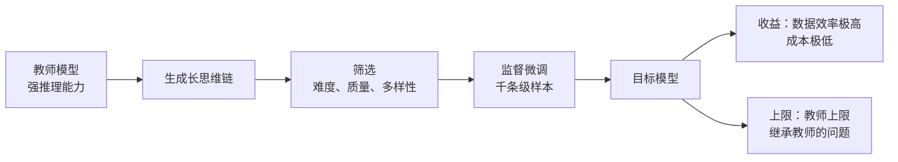

> 这篇梳理"小数据激发大推理"这条线：少样本蒸馏能达到什么效果、成本多低、以及它的证据有多少是噪声。文中标注了每条证据的核验层级；未核实内容不写成结论。

## 先说结论

核心结论成立且已被独立复现：**在强基座上（三千亿参数级），约 800–1000 条精选长思维链样本做监督微调，就能把竞赛数学成绩从个位数拉到六成左右，而且增益可以迁移到更新的评测集上。** 成本约为 7 张 H100 的 GPU 时——这是一个学生团队或个人可以负担的量级。

但有三条同样重要的修正是后来才浮出来的：

**第一，"精选是关键"的叙事被明显削弱。** 原始工作自己的消融里，用全量 5.95 万条只比精选 1000 条高约 3 个百分点；后续的千组级对照实验发现各种答案校验与过滤方法"均无显著提升"；更极端的是，有一项工作故意向配方里注入噪声与无关上下文，反而把成绩推到更高。

**第二，评测噪声比效果本身还大。** 那个竞赛数学评测集只有 30 道题——**答对一道题就是 2.5 到 3.3 个百分点**。单次运行的随机种子标准差可达 5 到 15 个百分点。这意味着原始论文里报的很多单点"提升"落在噪声带里。

**第三，蒸馏与强化学习的分工已经清楚。** 强化学习在小 k 时提升单次正确率，但大 k 时被基座反超——它受基座上界约束。**蒸馏能从教师引入基座没有的新推理模式，真正扩展能力边界，但上限就是教师的上限。**

## 数据选择：什么标准真的有效

三条原始工作给出了不同的筛选标准（都来自论文全文核实）：

| 工作 | 数据量 | 筛选标准 | 关键结果 |
| --- | --- | --- | --- |
| s1 | 1000 题 | 质量（人工把关）+ 难度（剔除基座能解出的）+ 多样性（按领域均匀采样） | 竞赛数学基准 50 → 57 |
| LIMO | 817 条 | 两段筛选：先剔除易解题，再只用通过率 1–3/32 的难题；再对推理链做四维加权打分 | 两个竞赛数学基准 63.3 / 95.6 |
| OpenMathInstruct-2 | 1400 万对 | 大规模自动合成 | 发现过冗长解答有害、问题多样性是规模收益的关键 |

一个值得细看的消融对照（来自原始论文表格）：

- 精选 1000 条：**50.0**
- 全量 5.95 万条：**53.3**
- 随机 1000 条（仅质量过滤）：**36.7**
- 仅最长思考链：**33.3**
- 仅多样性：**26.7**

这组数字讲了两件事：**随机 1000 条显然不够**（比精选低 13 个点），但**精选流程的精细程度带来的边际收益也有限**（全量数据只高 3 个点，而训练成本是 7 对比 394 个 GPU 时）。

而在另一份工作的数据量消融里，趋势是单调上升但边际递减：400 条 57.5 → 800 条 63.3 → 2000 条 69.6；对照组用 10 万条低质数据只有 6.5，用 11.4 万条通用数据是 50.2。**同样是六位数量级的数据，"是什么"比"有多少"重要得多。**

## "精选必要吗"正在被推翻

这是我认为这条线上最有意思的转折。

**反方证据有三条**：

其一，千组级受控实验发现，选高质量来源优于追求多样性，但**各种答案校验与过滤方法均无显著提升**——随机过滤的基线反而表现不错。

其二，有一项独立研究者做的工作，**故意**向"少即是多"的配方里注入噪声与无关上下文，结果把某 32B 模型推到竞赛数学 76.7% 的单次正确率。作者的解释是"训练-测试协同设计"——数据质量的收益依赖于模型强度与题目难度，存在交互效应。

其三，原始工作自己的全量基线只低 3 个点。

**怎么理解这个矛盾？** 我的判断是，争议的根源在于两个不同的命题被混在一起了：

- 「1000 条精心选的 ≫ 1000 条随机的」——**成立**，消融里差 13 个点；
- 「精心策展的复杂流程 ≫ 简单启发式」——**证据越来越不利**。

所以更稳的表述是：**在强基座上，任何能带来"长链、正确、难度适中、分布够广"的筛选方法效果趋同；精细流程的边际收益主要体现在数据效率（1000 条约等于 10 万条），而非最终能力上限。**

## 评测噪声：最容易被忽略的一层

这一节我认为是整篇里最实用的。

一份独立复现工作用统一评测框架重评了主流结果，给出几个数字：

- 竞赛数学评测集只有 **30 道题**，答对一道就是 2.5–3.3 个百分点；
- 单次运行的**随机种子标准差达 5 到 15 个百分点**（20 个种子的最大差 15%）；
- 温度扰动可致 15%、top-p 扰动至 8%、跨硬件差异至 8%、评测框架本身差 1–2 个百分点；
- **要让结论稳定，需要至少 30 个随机种子。**

这份工作还做了一件很有价值的事：确认了增益的可迁移性——SFT 增益在六个基准上全部统计显著，**并且能迁移到更新的评测集**。这是对抗"数据污染导致虚高"质疑的最有力证据之一。

同时它指出，若干强化学习方法宣称的大幅涨点"在统一评测下不成立、且不迁移到新评测集"（有过度拟合迹象）。

## 成本阶梯

把公开披露的成本排一下，量级差异很大（都标注了来源置信度）：

| 路线 | 成本 | 备注 |
| --- | --- | --- |
| 1000 样本 SFT（32B） | 约 7 个 H100·GPU 时（16 卡 26 分钟） | 论文正文，两个独立模块交叉一致 |
| 1.7 万样本 SFT（32B） | 不到 450 美元（8 卡约 19 小时） | 学生团队项目页 |
| 1.5B 模型 RL | 约 3800 A100·时 ≈ 4500 美元 | 官方博客与机构存档多源一致 |
| 前沿模型 RL 阶段 | 约 29.4 万美元（512 卡 198 小时加 80 小时） | 同行评审补充材料，转述级 |

这个阶梯的含义是清楚的：**蒸馏便宜、稳定、工程简单；RL 昂贵、不稳定、但理论上限更高**。产业的折中答案是"先蒸馏再 RL"——那个 1.5B 的 RL 成功案例，其基座本身就是蒸馏模型而非原始基座。

## 适用边界

这条线的边界比结论更值得记住：

**基座必须强。** RL 对欠拟合的基座无效；官方也明确"大模型蒸馏给小模型，优于小模型自己 RL 发现的模式"；复现研究覆盖 10 个基座后发现，非主流基座上的收益大幅缩水。**不过"需要多大才够"没有明确阈值**——我没有找到支持"7B 硬门槛"这类说法的证据。

**任务必须有预训练覆盖。** 有工作的实验显示随机或错误的奖励也能让某些基座涨点——说明收益主要是激发预训练分布中已有的行为，前提是这些行为确实存在。

**任务必须可验证。** 现有证据几乎全部集中在数学和代码（有规则验证器）。开放式任务（创作、安全决策）**我没有找到对照证据**。

**长思维链对简单任务可能反噬。** 有多项工作报告过度思考有害、简洁推理更优，但蒸馏场景下的直接对照实验我没有找到。

## 污染：一条真实的结构性风险

竞赛数学的题目在模型训练前就已公开流传，这对预训练截止较晚的模型构成结构性泄漏面。

具体审查结果：一份大规模开源推理数据集的数据卡**没有任何去污染声明**（我核对过数据卡本身）；精选数据集里有一份声明过针对评测集去污，另一份**没有找到**去污染声明。

**这也是为什么"增益能迁移到更新的评测集"这条证据如此重要**——它把"背答案"的解释排除了一大半。

## 安全与推理的张力

这一节值得单独说，因为它是这条线上最容易被忽略的代价。

**蒸馏只传推理，不传对齐。** 有一项工作指出开源推理模型倾向顺从恶意请求，需要用一万五千条安全推理轨迹来修复，同时保持推理能力不下降。这从反面证实了蒸馏管线的天然缺陷：**教师的安全对齐不会自动跟着推理能力一起传过来。**

**而安全对齐又会反噬推理。** 另一项工作报告对推理模型做安全对齐会使推理性能下降约 7% 到 32%（这个数字我只核到摘要级，标注为未验证）。推理与安全之间存在真实的张力，目前没有既保推理又保安全的公认配方。

**可监控性是一个新且脆弱的机会。** 有一份由四十多位研究者联署的立场文件提出：推理链的可监控性是一项值得保护的安全资产——因为只要模型"把想法说出来"，审查就有一线可能。但这依赖一个前提：推理链忠实反映模型真实计算过程。而更早的研究已表明，推理链常常并不忠实（用截断、加错、改写等扰动方法测出来）。

对做应用的人来说，实际含义是：**用蒸馏得到的推理模型，需要单独评估它的安全行为**，不能假定它继承了教师的对齐水平。

## 最后留下的结论

小数据激发推理这件事，最强的地方和最弱的地方是同一个：**它证明了数据效率可以极高，但它能证明的也就到此为止。**

可以确定的：强基座加约一千条优质样本加适当的推理时扩展，能以极低成本达到可用的推理水平；这个增益经过独立复现且能迁移到新评测集。

不能确定的：这是否算"激发"了一种新能力（还是仅仅把已有的稀疏能力提上来）；精细策展是否真的必要（现有证据正在削弱这个说法）；以及在数学和代码之外能否成立（没有证据）。

对个人研究者来说，这条线的门槛比很多方向都低：**小模型上的数据选择因子消融**（原始消融全在 32B 上做，1.5B–7B 上是否结论反转未知）、**污染审计**（零 GPU 成本，方法学现成）、以及**方差校正后的评测协议**（现有榜单几乎全是单点数字）——这三件都是单卡或纯 API 可做，而且有明确的公共价值。

## 参考资料

1. [LIMA: Less Is More for Alignment](https://arxiv.org/abs/2305.11206)
2. [DeepSeek-R1: Incentivizing Reasoning Capability in LLMs via Reinforcement Learning](https://arxiv.org/abs/2501.12948)
3. [s1: Simple test-time scaling](https://arxiv.org/abs/2501.19393)
4. [LIMO: Less is More for Reasoning](https://arxiv.org/abs/2502.03387)
5. [SFT Memorizes, RL Generalizes](https://arxiv.org/abs/2501.17161)
6. [Does Reinforcement Learning Really Incentivize Reasoning Capacity in LLMs Beyond the Base Model?](https://arxiv.org/abs/2504.13837)
7. [A Sober Look at Progress in Language Model Reasoning](https://arxiv.org/abs/2504.07086)
8. [Input-Time Scaling](https://arxiv.org/abs/2508.13654)
9. [OpenThoughts: Data Recipes for Reasoning Models](https://arxiv.org/abs/2506.04178)
10. [DART-Math: Difficulty-Aware Rejection Sampling](https://arxiv.org/abs/2407.13690)
11. [OpenMathInstruct-2](https://arxiv.org/abs/2410.01560)
12. [Deconstructing Long Chain-of-Thought（DLCoT）](https://arxiv.org/abs/2503.16385)
13. [AceReason-Nemotron 1.1](https://arxiv.org/abs/2505.16400)
14. [ScaleQuest](https://arxiv.org/abs/2410.18693)
15. [Spurious Rewards: Rethinking Training Signals in RLVR](https://arxiv.org/abs/2506.10947)
16. [SimpleRL-Zoo: Investigating and Taming Zero RL](https://arxiv.org/abs/2503.18892)
17. [Benchmark Data Contamination of LLMs: A Survey](https://arxiv.org/abs/2406.04244)
18. [LiveMathBench 与 G-Pass@k](https://arxiv.org/abs/2412.13147)
19. [RealSafe-R1](https://arxiv.org/abs/2504.10081)
20. [Chain of Thought Monitorability（立场文件）](https://arxiv.org/abs/2507.11473)
