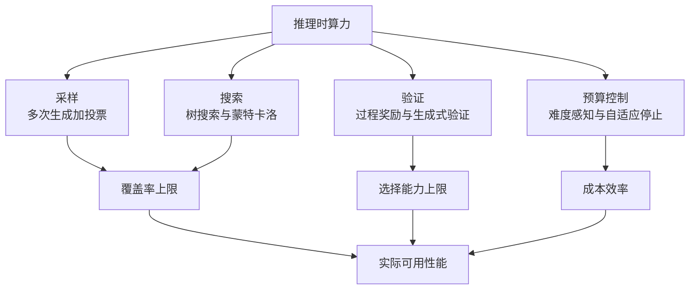

> 这篇梳理推理时扩展（test-time compute / inference-time scaling）的方法与边界。文中数字均来自论文或官方来源；本环境无法访问一手来源的条目会明确标注为未验证。

## 先说结论

推理时扩展的核心可以拆成四层：**采样、搜索、验证、预算控制**。四层里最容易被低估的是"验证"——因为**生成容易，选择难**。

一组教科书级的对照数据：某 8B 模型的覆盖率从 100 个样本时的 82.9% 升到 10000 个样本时的 98.44%，跨越两个数量级；但用多数投票或奖励模型来选答案，同样跨度上只从 40.50% 升到 41.41%，**而且常见验证方法在约 100 个样本后就饱和了**。

也就是说，**生成端的 scaling 曲线和选择端的 scaling 曲线是两条不同的曲线**，你实际能拿到的性能由后者决定。这解释了为什么"采样更多"在纸面上很美、在实践中很快遇到天花板。

但另一条结论同样重要，而且方向相反：**一旦把推理成本计入总预算，最优的预训练配置会大幅移向"过度训练"**——即"用小模型多训 + 推理时多花算力"，比传统的参数-数据配比更划算。

## 四层方法谱系

**采样层**：起点是自洽性（多路径采样加答案边际化投票），在多个推理数据集上带来了明显的单次提升。后来"重复采样"被提升为一条独立的 scaling 轴——覆盖率随样本数呈指数化幂律增长，可跨越四个数量级。

**搜索层**：把推理链泛化为可搜索的树，支持前瞻与回溯——一个标志性例子是在某个 24 点游戏任务上把成功率从 4% 提到 74%。后续工作用蒙特卡洛树搜索加同级模型互证，把 7B 级模型在 GSM8K 上从 12.51% 提到 63.91%。

**验证层**：这是当前最关键的瓶颈（下一节展开）。

**预算控制层**：这是 2025–2026 年的主线——从按难度分配算力、用强化学习学长度控制、多臂老虎机式的在线难度估计，到语义冗余触发的早期退出。产品侧的体现就是"思考预算"参数。

四层里有一个分工关系值得先说清楚：**采样和搜索解决"能不能找到正确解"，验证解决"能不能把它挑出来"，预算控制解决"值不值得继续找"。** 前两者是生成侧，后两者是决策侧——而实测证据显示，瓶颈在决策侧。

## 验证器才是瓶颈

关于验证器的证据有几个方向，值得放在一起看。

**支持方**：过程监督（对每一步打分）显著优于结果监督，一篇代表作报告过程监督模型解出某数学基准代表性子集的 78%，并发布了 80 万条人工步骤级标注。完全自动化的过程标注也能带来大幅提升——用分治式蒙特卡洛定位推理链中第一个错误步骤，采集超过 150 万条标注，让某模型在数学基准上从 51% 提到 69.4%。

**质疑方**：有工作明确指出"用自动标注数据训练过程奖励模型至今只带来有限收益"，并把原因归结为奖励设计错误——**应该奖励"进步"（这一步之后产出正确答案的概率变化），而不是"步骤看起来正确"**。另一份细粒度基准在 15 个模型上发现现有过程奖励模型的错误检测能力显著不足。更直接的是预算对比：**在多数实用推理预算下，自洽性比生成式验证器更省算力——后者需要最多 8 倍算力才能追平。**

**新的折中方向**：把验证本身也变成可扩展的推理过程（生成式验证器、长思维链验证器）。有一项工作只用 1% 的过程标签就超过了判别式验证器——暗示**验证端也可以吃推理时算力**。

我的判断是：现有证据支持"过程奖励模型有效但被高估"这一中间立场。在不改变奖励定义与验证粒度的情况下，它带来的边际收益小于训练成本。

## 成本结构正在反转

这是我认为最容易被忽略的一条。

**把算力从测试时前移**：有工作提出"休眠时计算"——在查询到来之前预计算，同等精度所需测试时算力约降低 5 倍，多查询摊薄后单次成本降 2.5 倍，精度最高还能提升十几个百分点。

**把训练和推理放在同一预算里优化**：有工作给出联合优化模型大小、训练数据量与推理样本数的 scaling law，结论是**一旦计入推理成本，最优预训练点会大幅移向"过度训练"区**。这与"参数越多越好"的直觉相反，也和经典的参数-数据配比结论不同。

这两条合起来，指向一个对工程决策很实际的判断：**在小模型上多训、在推理时多花算力，可能比训练一个更大的模型更划算。**

## 边界条件：什么时候算力会失效

推理时扩展不是万能的，有四个已被实证的失效条件。

**一、知识密集型任务失效。** 在 14 个推理模型上，增加测试时计算**不能稳定提升准确率，且常导致更多幻觉**。作者给了一个信息论解释：纯算力扩展是固定模型的后处理，无法引入关于正确答案的新信息。他们还观察到确认偏误模式——延长的推理会用虚构细节强化早期的错误信念。

**二、复杂度超过某点后整体崩溃。** 用可控复杂度的谜题做实验发现，模型存在"推理努力先增后减"的现象：复杂度超过某点后，即使还有剩余 token 预算，模型也不再投入更多思考。任务可以分成三个区间——低复杂度时标准模型更优、中复杂度推理模型占优、高复杂度时双方都崩溃。

**三、更长的推理链不必然更准。** 对 o1 类模型的复查发现，正确答案常常比错误答案更短；进一步分析认为这与自修正有关——更长的推理包含更多自修正，而自修正往往导致性能下降。这与"强制延长思考能提升准确率"的叙事形成张力，两者的差异可能来自模型与任务设置，值得作为复现实验的课题。

**四、评测本身会污染结论。** 覆盖率曲线在高 k 区间噪声很大；pass@1 与多数投票的指标混用；数据污染问题让部分增益存疑。还有一项工作专门用"不稳定测试"和"假阴性"两节说明：**验证器本身不可靠时，覆盖率的提升无法转化为真实性能。**

## 和另一场争论的交汇

推理时扩展的讨论与"RL 是否扩展能力边界"的争论有交集，因为两者都在问"更多算力换来了什么"。

有一项以大 k 的 pass@k 为指标的检验发现：强化学习训练后的模型在小 k 上优于基座，但大 k 时基座模型的 pass@k 更高——说明当前方法未必引出了根本性的新推理模式，能力仍受基座上界约束。这与"知识密集型任务失效"的结论方向一致：**如果能力不在模型里，堆采样也采样不出来。**

## 一个被忽略的对照：有验证器与没验证器

推理时扩展有一组理论结果值得单独说，因为它给"该往哪投"提供了判据。

有一项工作用反集中条件证明：**给定固定的算力与数据预算，基于验证器的方法（无论是强化学习还是搜索）优于"蒸馏搜索轨迹但不用验证器"的方法**，而且差距随预算扩大。换句话说：**没有验证器、也没有强化学习的推理时扩展是次优的。**

这条结论与实际观测是一致的：为什么覆盖率能涨但实际性能不涨？因为如果只增加采样而不提升选择能力，增加的部分大多是"看起来合理的错误答案"。有实验显示，某些场景下"什么都不做"的基线反而更稳（因为模型不会在错误方向上越走越远）。

所以判断一个任务值不值得投推理时算力，第一个问题应该是：**我有没有一个可靠的验证器？** 如果有（数学、代码、可执行的规划），算力投入有明确回报；如果没有，先解决验证问题再谈扩展。

## 一个被低估的方向：并行扩展优于串行

有一条常被忽略的实证：**并行扩展（多采样）在覆盖率与可扩展性上优于顺序扩展（更长的推理链）。**

这与"让模型想得更久"的直觉相反，也对产品设计有直接影响：如果并行采样更可靠，那么把同样的算力花在"多生成几条然后选"上，可能比"让单条推理链更长"更划算——前提还是有验证器。

这也解释了为什么"强制延长思考"（抑制结束符、追加提示让它继续）在实践中收益有限：它增加的是单条链的长度，而瓶颈在选择端。

## 最后留下的结论

推理时扩展这两年的进展可以概括为三条：

**生成端便宜、选择端昂贵。** 覆盖率能跨四个数量级增长，但选择能力的饱和点来得早得多。这决定了投入顺序：先解决验证器，再增加采样。

**成本结构反转了。** 把训练和推理放在同一预算里看，最优配置会移向"小模型多训加推理时扩展"。这是对资源分配方式的实质性改变。

**有效边界是任务相关的。** 在可验证的推理任务上算力有明确回报；在知识密集型任务、超高复杂度任务和"看起来需要更正但其实缺信息"的场景里，算力会被浪费甚至反噬。

对个人研究者来说，门槛最低也最有价值的一类工作是**复现并校正 scaling 曲线**：在 1.5B–7B 开源模型上重画"覆盖率 vs 样本数"和"选择器精度 vs 样本数"两条曲线，补上统计误差棒（现有文献普遍只画点估计），并给出一张"什么条件下两条曲线会相交"的条件表。这件事单张消费级显卡就能起步，而公开文献里的条件性证据仍然分散。

## 参考资料

1. [Self-Consistency Improves Chain of Thought Reasoning in Language Models](https://arxiv.org/abs/2203.11171)
2. [Tree of Thoughts: Deliberate Problem Solving with Large Language Models](https://arxiv.org/abs/2305.10601)
3. [Let's Verify Step by Step](https://arxiv.org/abs/2305.20050)
4. [Math-Shepherd: Verify and Reinforce LLMs Step-by-step without Human Annotations](https://arxiv.org/abs/2312.08935)
5. [Improve Mathematical Reasoning by Automated Process Supervision（OmegaPRM）](https://arxiv.org/abs/2406.06592)
6. [Generative Verifiers: Reward Modeling as Next-Token Prediction](https://arxiv.org/abs/2408.15240)
7. [Rewarding Progress: Scaling Automated Process Verifiers for LLM Reasoning（PAV）](https://arxiv.org/abs/2410.08146)
8. [Process Reward Models That Think（ThinkPRM）](https://arxiv.org/abs/2504.16828)
9. [PRMBench: A Fine-grained Benchmark for Process-Level Reward Models](https://arxiv.org/abs/2501.03124)
10. [When To Solve, When To Verify: Compute-Optimal Problem Solving and Generative Verification](https://arxiv.org/abs/2504.01005)
11. [Large Language Monkeys: Scaling Inference Compute with Repeated Sampling](https://arxiv.org/abs/2407.21787)
12. [Scaling LLM Test-Time Compute Optimally can be More Effective than Scaling Model Parameters](https://arxiv.org/abs/2408.03314)
13. [Inference Scaling Laws: An Empirical Analysis of Compute-Optimal Inference](https://arxiv.org/abs/2408.00724)
14. [s1: Simple test-time scaling](https://arxiv.org/abs/2501.19393)
15. [L1: Controlling How Long A Reasoning Model Thinks With RL](https://arxiv.org/abs/2503.04697)
16. [Sleep-time Compute: Beyond Inference Scaling at Test-time](https://arxiv.org/abs/2504.13171)
17. [Every Rollout Counts: Optimal Resource Allocation for Efficient Test-Time Scaling](https://arxiv.org/abs/2506.15707)
18. [Test-Time Scaling Makes Overtraining Compute-Optimal](https://arxiv.org/abs/2604.01411)
19. [Stop When Reasoning Converges: Semantic-Preserving Early Exit for Reasoning Models](https://arxiv.org/abs/2605.17672)
20. [Test-Time Scaling in Reasoning Models Is Not Effective for Knowledge-Intensive Tasks Yet](https://arxiv.org/abs/2509.06861)
21. [The Illusion of Thinking](https://arxiv.org/abs/2506.06941)
22. [Revisiting the Test-Time Scaling of o1-like Models](https://arxiv.org/abs/2502.12215)
23. [The Art of Scaling Test-Time Compute for Large Language Models](https://arxiv.org/abs/2512.02008)
24. [Does Reinforcement Learning Really Incentivize Reasoning Capacity in LLMs Beyond the Base Model?](https://arxiv.org/abs/2504.13837)
25. [Scaling Test-Time Compute Without Verification or RL is Suboptimal](https://arxiv.org/abs/2502.12118)
